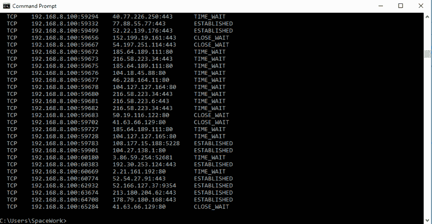
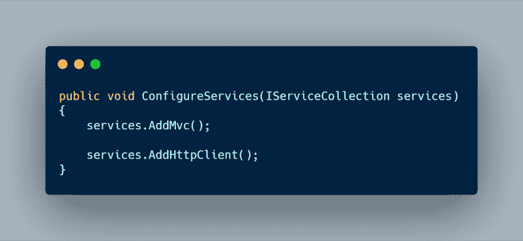
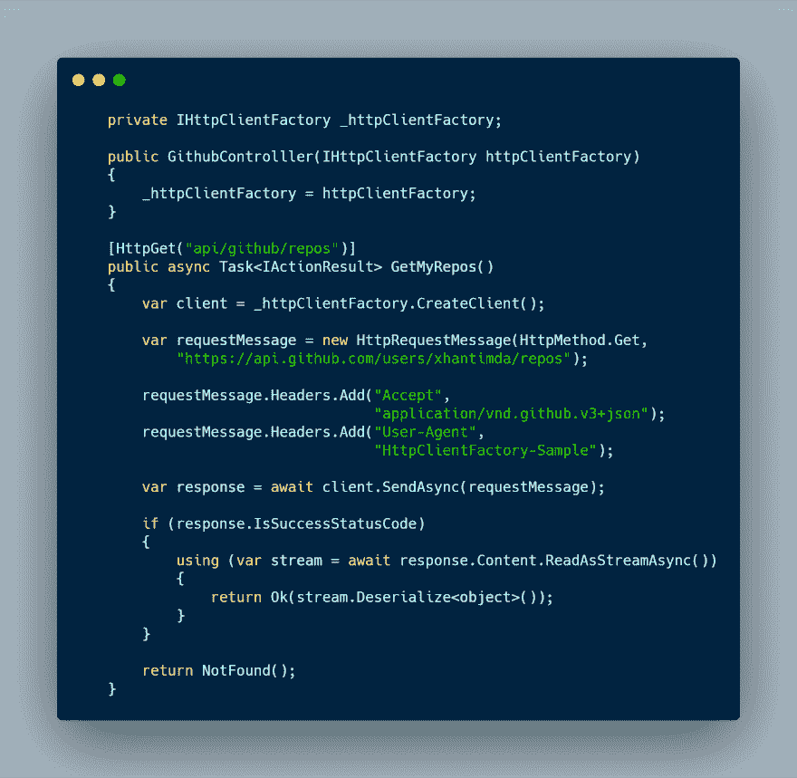
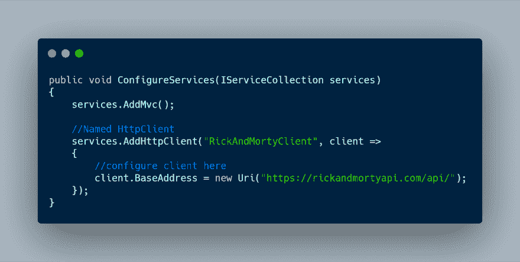
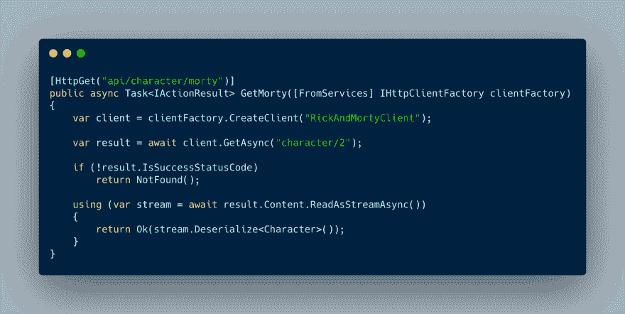
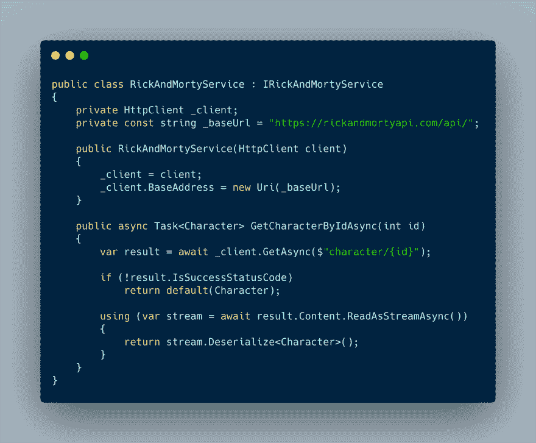
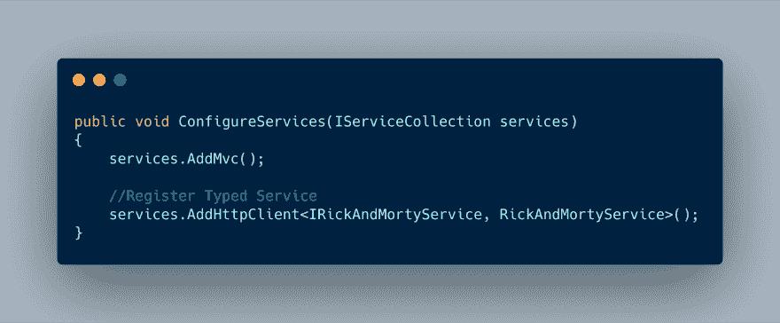
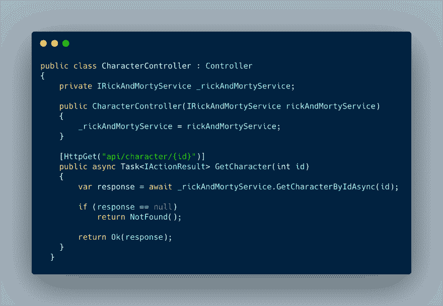
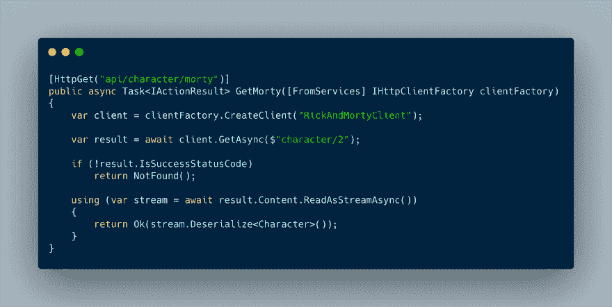

# HttpClientFactory 简介

> 原文：<https://dev.to/xhantimda/introducing-the-httpclientfactory-3ege>

几年前，我偶然看到 ASP.NET 怪兽的一篇博客文章，标题是:[你在错误地使用 HTTPCLIENT，它正在破坏你的软件的稳定性](https://aspnetmonsters.com/2016/08/2016-08-27-httpclientwrong/)。这篇文章分享了一个我多次使用的技巧，通过不处理 HttpClient 来避免套接字耗尽。

## 处置，还是不处置，这是个问题。

创建 HttpClient 实例时，会在内部创建一个 HttpMessageHandler 链。负责建立连接的是处理程序链。因此，当我们处置 HttpClient 时，我们实际上是处置了最终将关闭连接的 HttpMessageHandler。
这样做的风险是连接不会在客户端被释放后立即关闭。
当我们主动关闭一个连接时，端口不会立即释放，它会进入 TIME_WAIT 状态。
如果继续这样下去，会导致套接字耗尽。

<figcaption>An example of connections in the TIME_WAIT state.</figcaption>

上述问题的一个解决方案是让 HttpClient 的一个实例在整个应用程序中共享。上述解决方案的问题是连接将永远保持开放和重用，并且对远程服务所做的任何 DNS 更改都不会被接受。
这将导致应用程序指向离线服务器实例或不正确的环境。

## 介绍 HttpClientFactory

*   HttpClientFactory 是通过。NETCore 2.1。
*   HttpClientFactory 为我们提供了一个配置和创建 HttpClients 的中心位置。
*   它管理底层 HttpMessageHandler 链的生存期。它通过管理这些 MessageHandlers 的池并保持它们打开直到它们过期来实现这一点。
*   MessageHandlers 最多保持活动 2 分钟(默认情况下)。
*   这给了我们两者的优点，保持足够长时间的连接，同时仍然尊重 DNS 的变化。

## 消费 HttpClientFactory 的模式

### 直接用法

*   HttpClientFactory 的简单用法只需要在应用程序中进行最少的代码更改。
*   安装 Microsoft。如果您的应用程序没有引用 Microsoft。App 元包。
*   只需在 IServiceCollection 上调用 AddHttpClient 扩展方法，就可以实现现成的实例管理。
*   它允许您在应用程序中的任何位置注入 HttpClientFactory，您可以使用它来创建 HttpClient 实例。

<figcaption>An example of the direct usage of the HttpClientFactory.</figcaption>

<figcaption>An example of injecting HttpClientFactory.</figcaption>

### 命名客户端

*   命名客户端使我们能够为应用程序与之通信的不同服务创建逻辑配置。
*   配置一个命名客户机非常简单，只需调用 AddHttpClient 方法，传入客户机的名称和一个接受 HttpClient 的委托。

<figcaption>An example of configuring a named HttpClient.</figcaption>

*   要访问已命名的 HttpClient，只需将已配置客户机的名称传递给 IHttpClientFactory 上的 CreateClient 方法。

<figcaption>An example of consuming a named HttpClient.</figcaption>

### 键入客户端

*   类型化客户端是(微软)推荐的使用 HttpClient 的方式。
*   类型化客户端只是一个接受 HttpClient 作为构造函数参数的类。
*   类型化客户端给了我们将特定于服务的代码封装到单个类中的好处。

<figcaption>An example of creating a typed HttpClient.</figcaption>

<figcaption>An example of configuring a typed HttpClient.</figcaption>

<figcaption>An example of consuming a typed HttpClient.</figcaption>

### 奖金

您可能已经注意到了 GetMorty 操作中使用的 FromServices 属性，并自问 WTF！

*   FromServices 属性从容器中获取操作参数。
*   这发生在 MVC 请求生命周期的 ModelBinding 阶段，在 ControllerActionInvoker 根据请求在控制器中找到匹配的动作之后。
*   该类型的实例在被调用之前绑定到操作的参数。

<figcaption>An example of consuming the FromServices attribute.</figcaption>

### 最后的话

*   使用 HttpClientFactory 进行更有弹性的 HTTP 调用。
*   在配置 HttpClient 时，可以通过将 SetLifeTime 方法链接到 AddClient 方法来覆盖默认的 HttpMessageHandler 生存期。
*   正如推荐的那样，使用类型化客户端是可能的。
*   在此访问示例源代码