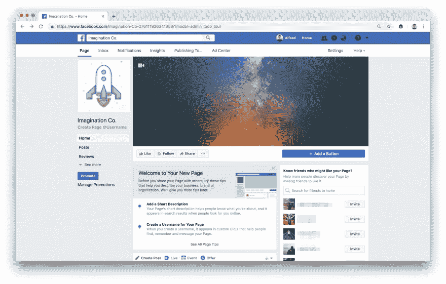
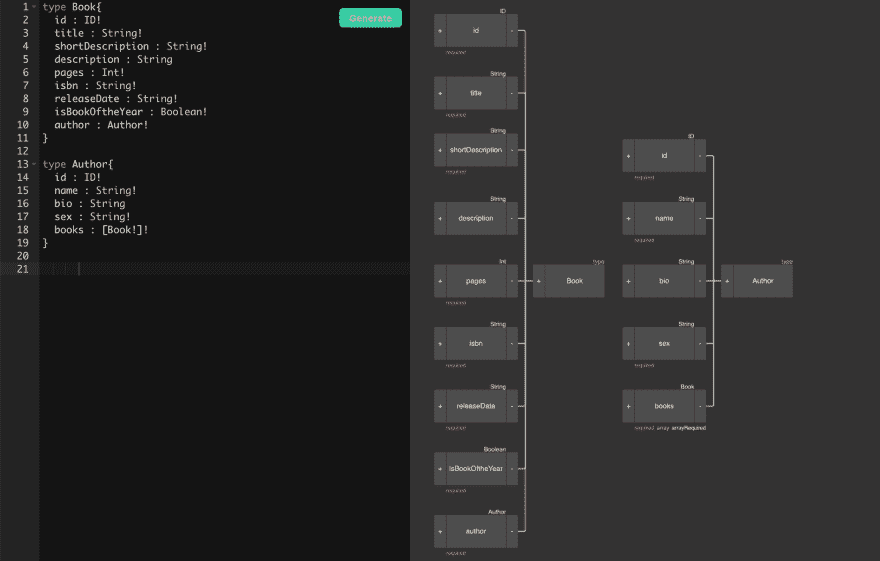
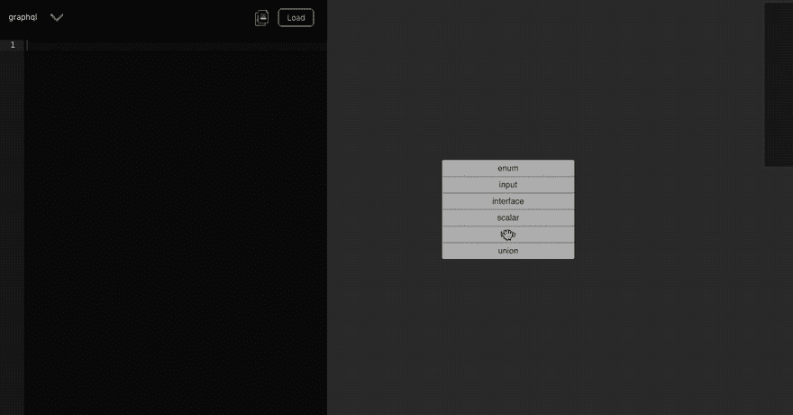

# 新手后端开发入门！

> 原文：<https://dev.to/robmatyszewski/introduction-to-backend-development-for-your-mother-k8k>

# 简介

在本文中，我将介绍后端开发的一般知识，而不会深入研究代码。我将提供一些语言和框架，供您进一步探索。如果你正在寻找更多的技术教程，请关注我并查看我的其他帖子:)

如果你不是软件开发人员，后端或前端开发这样的术语会让她头疼。除此之外，还有一长串不同的工具、语言和框架，这会让人不知从何下手。然而，有一个好消息——你不需要学习编码来理解基础知识。不管你身边有没有开发人员，了解典型技术的基础知识都是很有帮助的。

我把这篇文章分成了几个部分。

# 让我们从议程开始:

1.  什么是后端？
2.  API 的
3.  服务器
4.  数据库
5.  后端开发人员
6.  后端语言

# 1。什么是后端？

想象一个典型的 web 应用程序，比如您的在线银行服务，您会想到什么？你有视觉部分，它是为人类互动而创造的，还有后面的东西。这是我们描述 web 应用程序样本界面下的前端(可见部分——颜色、动画、布局和所有你能体验到的东西)的最简单的方法。

后端是应用程序的内部引擎，包括服务器、API 和数据库等。后端通常被描述为“服务器端”,与“客户端”或“浏览器端”相对，在“客户端”或“浏览器端”中，客户端通过点击特定按钮向后端发送请求。后端是在幕后默默工作的机器。

一个常见的后端是服务器、API、数据库和操作系统的混合体，为应用程序的前端提供动力。每个应用程序都可以使用非常不同的工具，无论是基于云的服务器和数据仓库的使用，与 Docker 等服务的容器化，取代更复杂处理的 API，还是后端即服务提供商。下面是用 GraphQL 编辑器可视化的示例库应用程序模式。

首先，我们将服务器端分成四个主要组件:服务器、API、数据库、操作系统和软件。在接下来的章节中，我们将更多地解释后端的每一个组件。

# 2。API 的

从技术上讲，API 代表应用程序编程接口。总的来说，它是应用程序之间通信的一组明确定义的方法、规则和定义。就后端开发而言，提到后端和前端通过 API 进行通信是至关重要的。设计良好的 API 通过提供所有的模块，使开发 web 应用程序的各个部分变得更加简单，然后由开发人员将这些模块组合在一起。为了给本文提供上下文，API 是一组关于前端如何向后端请求数据的规则。

今天为 web 创建 API 最流行的标准是 REST API GraphQL。进一步探索 GraphQL，我们可以说它是一种用于 API 的查询语言。GraphQL 最重要的特性是它的语言不可知，有自己的规则和定义。它不是为与任何特定技术一起工作而创建的。下面你可以看到一个 GraphQL 编辑器的例子。

# 3。服务器

当你在网络浏览器中输入任何域名时，就意味着你输入了服务器地址。如果您更深入地了解该网站的特定部分，您会看到带有更多详细信息的扩展 URL。这包括文件夹路径、子目录位置和特定文件名。我们来看看谷歌的 logo。这个特定的地址包含关于服务器文件确切位置的精确信息。

作为其他组件的一部分，服务器是系统的心脏。它可以位于您的本地计算机上，或者以一种现代的方式位于云中。您可以将云想象为一组连接的计算机。该计算机网络可以运行各种任务，包括文件存储、安全和加密、数据库、电子邮件和网络服务。云服务器最便宜的选择是共享虚拟机，一台同时运行许多服务器的计算机。更贵的是专用机器，你可以根据自己的需要租用。虚拟化创造了共享服务器。

虚拟化的主要目标是通过转变传统计算使其更具可扩展性来管理工作负载。在操作系统级虚拟化中，可以在一块硬件上运行多个操作系统。虚拟化技术包括通过模拟使用软件的设备来分离物理硬件和软件。

虚拟化的一个流行的轻量级替代方案是容器化。想象一下，将应用程序捕获到一个包含其环境的虚拟容器中。它提供了将应用程序加载到虚拟机上的好处，因为应用程序可以在任何合适的物理计算机上运行，而没有任何顾虑。容器化最近因被称为 Docker 的开源技术而出名。使用容器，您可以轻松地在服务器之间迁移应用程序。

既然您已经了解了现场服务器的基本知识，那么就来扩展一下您的知识，看看虚拟化、服务器如何配置以容纳多个应用程序，以及容器化，这是服务器配置其操作系统以容纳分区应用程序的另一种方式。

# 4。数据库

数据库是数据集合的存储。这听起来可能过于天真，但它很好地概括了任何数据库是什么。一个数据库可以像一个包含名字列表的文本文件一样重要。或者，它可以像一个大型的关系数据库管理系统一样复杂，带有内置的工具来帮助您维护数据。

每当你从一个网站上请求某样东西或者在 Airbnb 上搜索一个住处时，你的前端都会向数据库发送一个请求并创建一个响应。数据被传输回网站，你可以看到你行动的结果。您还可以从可视化界面更新或编辑数据库中的数据。想象一下上传图片到脸书或在 CMS 中添加产品描述。

数据库管理系统(DBMS)是一种能够管理和创建数据库的工具。今天，大多数数据库系统被称为关系型 DBMS，因为它们能够跨多个表存储相关数据。当两个以上的表包含相关数据时，它们有关系。您以定义哪些表必须相关的方式来设计数据库。最流行的关系数据库管理系统包括微软访问，SQL 服务器，MySQL。

或者，对于相关数据库，我们有 NoSQL。这是一个综合性的术语，并不描述任何特定的数据库类型。这是一组不适合关系模型的数据库。让我们探索一些例子:

*   列存储数据库，
*   使用图形模型的图形数据库，
*   使用面向文档模型的文档存储数据库，

# 5。后端开发人员

后端开发人员通过提供服务器端逻辑的面向外的 web 应用程序元素来与前端开发人员合作。换句话说，后端开发人员创建业务逻辑以使 web 应用程序正确工作，他们通过使用后端脚本语言来实现这一点。一些常规职责包括:

*   编写服务器端代码
*   与数据库交互
*   编写与数据库通信的代码
*   在线部署系统，以便应用程序可用
*   维护代码的安全性
*   保持代码优化以处理大流量
*   将服务器端逻辑与前端集成
*   数据存储解决方案的设计和实施
*   构建可重用的代码和库以供将来使用
*   为新开发人员编写易于使用的文档
*   后端开发人员通常以小组或团队的形式工作。在更大的组织中，可以有后端和前端工程师，其中可以包括工程师——具体角色如 REST API 开发人员或质量保证或架构师。

# 6。后端语言

后端开发人员可以学习各种语言和框架，这取决于他们正在开发的应用程序的类型、特定的处理规范以及后端已经存在的其他组件。

各种语言在文件大小、速度、适应性、所需的代码行数以及编码风格方面都有所不同。一些后端脚本语言是面向对象的，这是一种将属性和功能捆绑在对象中的编程方法。不同的语言可能是编译的而不是解释的，这影响了运行应用程序所需的加载速度、可读性和处理能力。

大多数网站都是基于 PHP 构建的，这使得 PHP 成为最常见的后端语言之一。然而，还有很多其他的选择。对于数据驱动的站点，您可能希望使用 Python 的处理能力，或者利用 Ruby 等轻量级语言的速度进行快速原型开发。这取决于您和您的开发人员，每种语言都有其优点和典型应用。

看看后端编程中的其他几个大人物，比如:

*   Java 语言(一种计算机语言，尤用于创建网站)
*   C#和 C++
*   。网
*   Perl 语言
*   斯卡拉
*   Node.js(和 JavaScript)