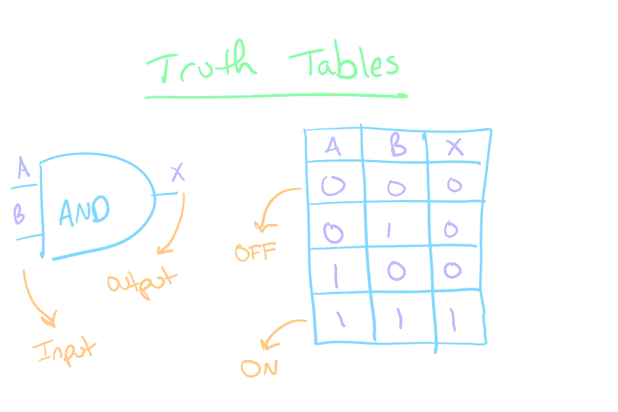
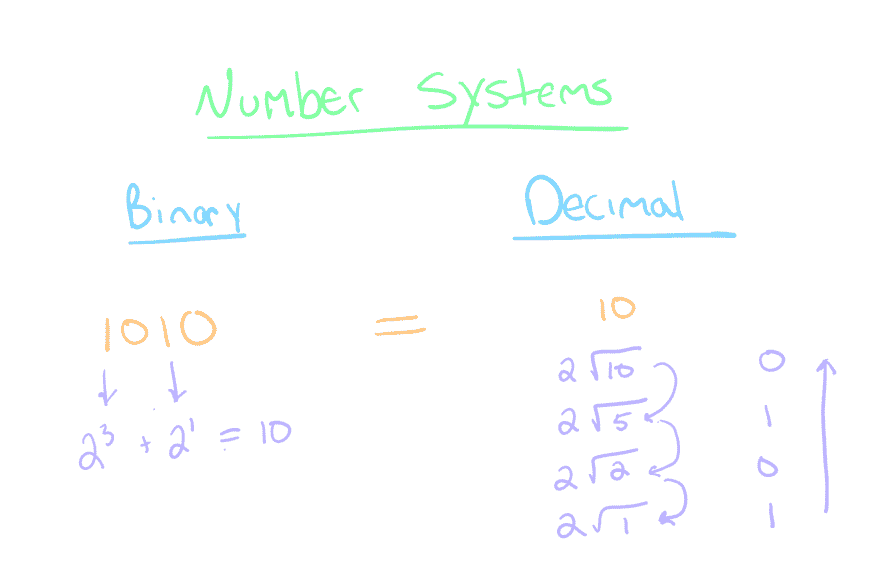
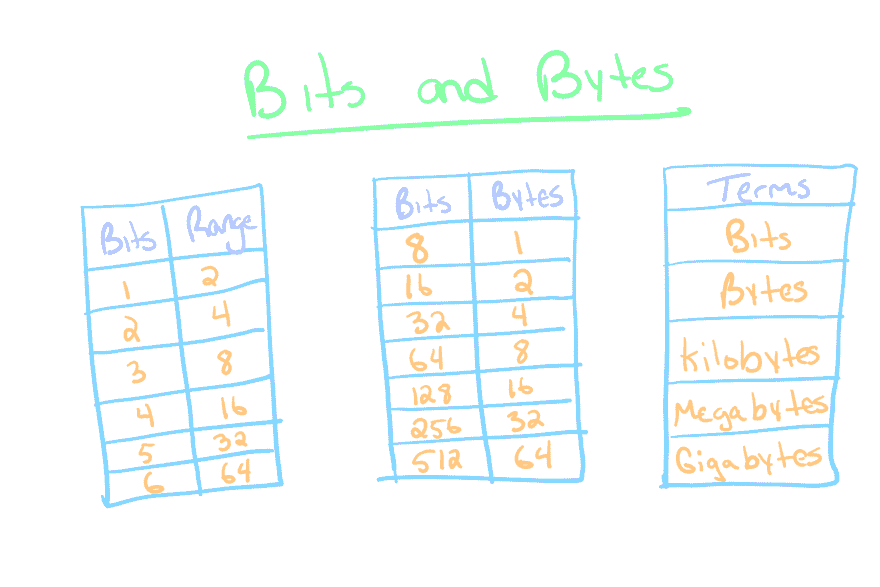

# Java 编码简介

> 原文：<https://dev.to/renegadecoder94/introduction-to-coding-in-java-271n>

欢迎阅读 Java 编码入门系列的第一篇文章。如果这是你第一次编码，你来对地方了。我们开始吧！

## Java 后台

Java 是一种编程语言，1995 年出现在一家名为 Sun Microsystems 的公司，也就是现在的甲骨文公司。就功能而言，Java 是一种高级编程语言，它既是面向对象的，又是强类型的——我们将在后面讨论这两个概念。

如果 Java 有名气的话，那可能是它的可移植性。所有代码都被编译成字节码，并在 Java 虚拟机或 JVM 上执行。这使得开发人员可以在几乎任何平台上编写代码，并在平台之间转移代码。

但是，让我们后退！您来这里可能是因为您想了解 Java 的基础知识。你可能更喜欢接触一些例子，而不是被大量的理论所束缚。在这些教程中，我将通过访问一些我认为你需要知道的概念来开始每一节。

抛开理论不谈，我们来看几个例子。如果这个系列对您来说还不够，这里有一些额外的资源:

*   [Java 的 Hello World](https://therenegadecoder.com/code/hello-world-in-java/)
*   [反转 Java 中的字符串](https://therenegadecoder.com/code/reverse-a-string-in-java/)
*   [Java 中公有和私有的区别](https://therenegadecoder.com/code/the-difference-between-private-and-public-in-java/)
*   [Java 中`i=i++`的行为](https://therenegadecoder.com/code/the-behavior-of-i-equals-i-plus-plus-in-java/)

当然，如果我们不开始，我们什么也做不了，所以让我们开始工作吧。

## 逻辑基础

在我们开始编程之前，我们需要了解一下计算机在底层是如何工作的。为此，我们需要涵盖以下概念:计算机处理器和逻辑门。

### 电脑处理器

每台计算机的中心是一个处理器，它处理系统的所有思维。然而，处理器不像你或我那样思考。它们通过接受命令和计算结果来工作。

在高层次上，命令是以数学计算的形式出现的，但实际上比这更有趣。当我们向处理器发出命令时，它实际上改变了电流通过其电路的方式。

我们可以把处理器想象成一系列导线和开关，它们引导电流在电路中流动。在每个结点处，可以打开一个开关，使电流从结点的输入端流向输出端。同样，当开关翻转闭合时，可以阻止电流流动。

在逻辑中，我们使用一种叫做晶体管的特殊开关。出于范围的考虑，我们不会深入讨论它们是如何工作的，但是在结束本文之前，欢迎您对这个主题进行更多的探索。

### 逻辑门

为了使这些晶体管有用，我们通常将它们组合起来形成一个逻辑门。逻辑门是以真值表为特征的晶体管配置。换句话说，我们可以通过逻辑门对所有可能输入的响应来描述它。然后我们在真值表中总结我们的发现。

[](https://res.cloudinary.com/practicaldev/image/fetch/s--4-GwI6SF--/c_limit%2Cf_auto%2Cfl_progressive%2Cq_auto%2Cw_880/https://thepracticaldev.s3.amazonaws.com/i/bnde0mhwowvqm2aj52it.png)

为简单起见，当输入端有电流时，我们通常称其为开或 1。否则，我们称该输入为关或 0。

然后，我们可以用这些知识给一些基本逻辑门赋予一些意义:与、或、与非、或非。这些门通过在特殊条件下在输出端产生电流来控制电路中的电流。例如，一个与门只有在其所有输入端都有电流时才打开。换句话说，所有的输入都是开或 1。

[](https://res.cloudinary.com/practicaldev/image/fetch/s--f-A67Svw--/c_limit%2Cf_auto%2Cfl_progressive%2Cq_auto%2Cw_880/https://thepracticaldev.s3.amazonaws.com/i/dj1sdbebyppp8xmvgckw.png)

与门相对的是与非门，与非门只有在输入端没有电流的情况下才会在输出端产生电流。换句话说，所有输入必须关闭或为 0。在下一节中，我们将看看这对开发人员意味着什么。

## 二进制简介

有了一些基本的逻辑，我们现在可以上升一个抽象层次。特别是，我们将涵盖数系和位。

### 数字系统

用来描述逻辑门相互作用的 0 和 1 与计算机在编程中使用的单位相同。这些单位用一种叫做二进制的数字系统来描述。二进制是以 2 为基数的数字系统，其中两个可能的值是 0 和 1。

[](https://res.cloudinary.com/practicaldev/image/fetch/s--j3H89dc9--/c_limit%2Cf_auto%2Cfl_progressive%2Cq_auto%2Cw_880/https://thepracticaldev.s3.amazonaws.com/i/fp55voazuj4u2uvlpgia.png)

相比之下，人类决定使用以 10 为基数的数字系统(可能的值是 0-9)。二进制的美妙之处在于，我们可以开始根据电路中的电子流动来表示数字。不幸的是，上面的逻辑门只有一个输出。想象一下，如果我们有更多的产出，我们能做些什么。

例如，假设我们有一个四路输出的电路。如果每个输出可以有 0 或 1 的值，那么可以有多少种可能的输出组合？

每个输出可以有两个值中的一个，所以我们将每个输出的组合数相乘(2 x 2 x 2 x 2 x 2)。总的来说，我们可以有 16 种组合，可以给出 0-15 的十进制范围。所以不管这个电路做什么，我们可以开始记录十进制数的结果。

### 位和字节

在上面的例子中，我们的电路有四个二进制输出，它告诉我们电路的位数。换句话说，我们的电路是 4 位的。

如果我们知道一个系统有多少位，计算值的总范围实际上是相当容易的:提高 2 的位数。例如，一个 16 位系统将有 2 <sup>16</sup> 或 65，536 个可能值的总范围。

如果处理二进制还不够混乱的话，我们实际上可以把比特分成八个一组，我们称之为字节。换句话说，16 位系统也可以称为 2 字节系统。由此，1024 字节是一千字节，1024 千字节是一兆字节，以此类推。

[](https://res.cloudinary.com/practicaldev/image/fetch/s--yE-WWMsl--/c_limit%2Cf_auto%2Cfl_progressive%2Cq_auto%2Cw_880/https://thepracticaldev.s3.amazonaws.com/i/jj0tfkciajpbg4c8y8n3.png)

当你开始摆弄 Java 数字时，请记住这些概念。

## Java 编码简介

也许开始学习的最好方法是开始在 Java 中摆弄数字。不幸的是，大多数 Java 工具都没有为此提供便利，因为 Java 是编译的，而不是解释的。换句话说，在我们开始测试之前，Java 有一个特定的布局需要遵循。这对新手来说可能很麻烦，所以我们计划一步一步地复习每一部分。

目前，我推荐下载 [DrJava](http://www.drjava.org/) ，因为它提供了一个方便的解决方法。这个解决方法被称为交互面板，它让我们开始使用代码片段。

下载完 DrJava 后，让我们使用交互面板开始做基本的数学运算。以下是我们可以尝试的一些组合示例:

```
5 + 7
5 + 7.0
3 - 4
3 - 4.0
1 / 2
1 / 2.0
6 * 6
6 * 6.0
4 % 5
4 % 5.0 
```

Enter fullscreen mode Exit fullscreen mode

恭喜你！我们刚刚完成了我们的第一个 Java 教程。请继续关注，我们将讨论结果到底发生了什么。与此同时，继续尝试。对于一个额外的挑战，尝试玩真，假，=，和==。