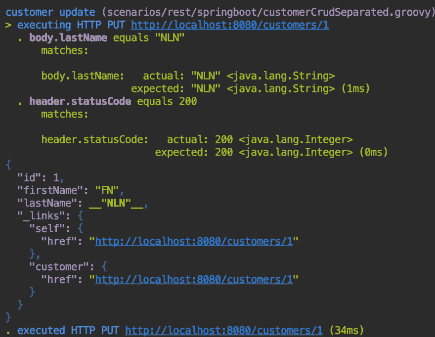
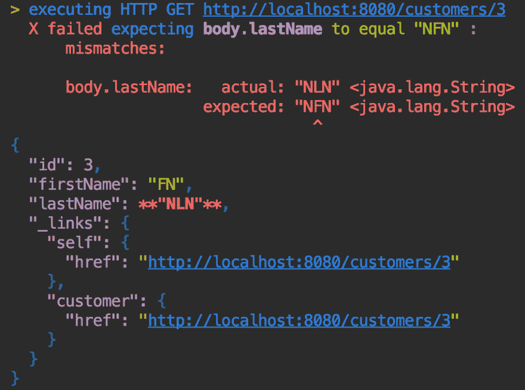
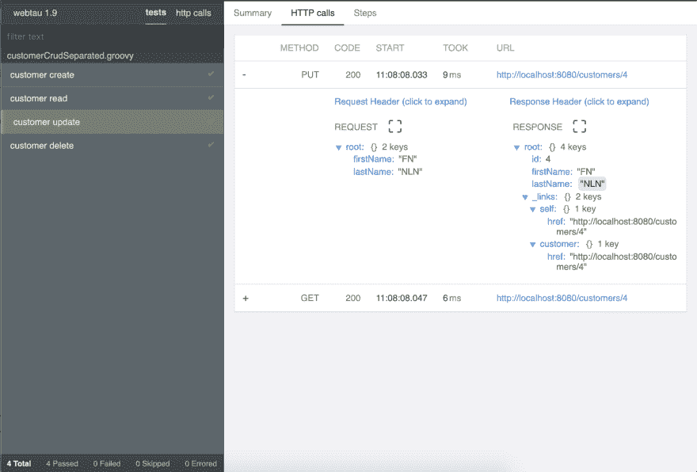

# 简洁而富有表现力的 REST API 测试框架介绍— WebTau

> 原文：<https://dev.to/mykolagolubyev/introduction-to-concise-and-expressive-rest-api-testing-framework-webtau-56m1>

# 简介

[Webtau](https://github.com/twosigma/webtau) (简称**web****t**est**au**to mation)是一个工具和 API，用来编写富有表现力和简洁的 REST API 测试。

让我们从一个简单的天气例子开始。您有一个服务器，每当您到达`/weather`终点时，它都会返回当前温度。

```
{  "temperature":  88  } 
```

我想写一个简单的测试来验证我收到的温度低于 100 华氏度。这是一个 webtau 测试脚本。

```
scenario("simple get") {
    http.get("/weather") {
        temperature.shouldBe < 100
    }
} 
```

`temperature.should`表达式自动映射到服务器响应，并根据`temperature`值触发验证。

要运行测试，执行`webtau webtau-simple-get.groovy`命令行。

如果命令行和独立脚本不适合您，您可以使用 JUnit 和类似的 runners。

```
package com.example.tests.junit4

import com.twosigma.webtau.junit4.WebTauRunner
import org.junit.Test
import org.junit.runner.RunWith

import static com.twosigma.webtau.WebTauGroovyDsl.*

@RunWith(WebTauRunner.class) // required for html report generation only
class WeatherGroovyTest {
    @Test
    void checkWeather() {
        http.get("/weather") {
            temperature.shouldBe < 100
        }
    }
} 
```

在过去的十年里，我一直使用 Groovy 进行测试，我认为它非常适合这项工作。但是如果你不是 Groovy 迷，可以用 Java 或者其他 JVM 语言。

```
package com.example.tests.junit4;

import com.twosigma.webtau.junit4.WebTauRunner;
import org.junit.Test;
import org.junit.runner.RunWith;

import static com.twosigma.webtau.WebTauGroovyDsl.*;

@RunWith(WebTauRunner.class)
public class WeatherJavaTest {
    @Test
    public void checkWeather() {
        http.get("/weather", (header, body) -> {
            body.get("temperature").shouldBe(lessThan(100));
        });
    }
} 
```

# CRUD 示例

让我们把这个例子复杂化，测试完整的创建、读取、更新、删除周期。

```
scenario("CRUD operations for customer") {
    def customerPayload = [firstName: "FN", lastName: "LN"]

    def id = http.post("/customers", customerPayload) {
        return id // return id value from response body
    }

    http.get("/customers/${id}") {
        body.should == customerPayload // only specified properties will be asserted against
    }

    def changedLastName = "NLN"
    http.put("/customers/${id}", [*:customerPayload, lastName: changedLastName]) {
        lastName.should == changedLastName // specifying body is optional
    }

    http.get("/customers/${id}") {
        lastName.should == changedLastName
    }

    http.delete("/customers/${id}") {
        statusCode.should == 204
    }

    http.get("/customers/${id}") {
        statusCode.should == 404
    }
} 
```

请注意测试是如何非常关注数据的，并试图通过重用初始有效负载作为响应预期来最小化数据管理样板。

在测试中，所有的积垢操作都是同一个测试的一部分。下面是将 CRUD 操作分离到它们自己的测试中的例子。

```
def customerPayload = [firstName: "FN", lastName: "LN"]

def customer = createLazyResource("customer") { // lazy resource to be created on the first access
    def id = http.post("/customers", customerPayload) {
        return id
    }

    return new Customer(id: id, url: "/customers/${id}") // definition is below
}

scenario("customer create") {
    customer.id.should != null // accessing resource for the first time will trigger POST (in this example)
}

scenario("customer read") {
    http.get(customer.url) { // convenient re-use of url defined above
        body.should == customerPayload
    }
}

scenario("customer update") {
    def changedLastName = "NLN"
    http.put(customer.url, [*:customerPayload, lastName: changedLastName]) {
        lastName.should == changedLastName
    }

    http.get(customer.url) {
        lastName.should == changedLastName
    }
}

scenario("customer delete") {
    http.delete(customer.url) {
        statusCode.should == 204
    }

    http.get(customer.url) {
        statusCode.should == 404
    }
} 
```

```
class Customer {
    Number id
    String url // store url of the created entity
} 
```

上面的例子使用了一个`lazyResource`概念来使每个测试都是独立的。也就是说，如果我只想运行`delete`测试，仍然会创建一个资源。另一方面，如果我运行所有的 CRUD 测试，将只有一个`post`。

# 举报

维护测试的一个耗时任务是当测试失败时，找出什么时候错了。Webtau 提供全面的控制台输出以及丰富的自包含 html 报告。

[](https://res.cloudinary.com/practicaldev/image/fetch/s--vwMesUDl--/c_limit%2Cf_auto%2Cfl_progressive%2Cq_auto%2Cw_880/https://thepracticaldev.s3.amazonaws.com/i/upde7rinfewv4n6pv9dt.png)

请注意，断言的值在控制台输出中突出显示。失败以类似的方式突出显示

[](https://res.cloudinary.com/practicaldev/image/fetch/s--NK1bT8Sw--/c_limit%2Cf_auto%2Cfl_progressive%2Cq_auto%2Cw_880/https://thepracticaldev.s3.amazonaws.com/i/1s9jy0861nomzzum2adh.png)

在测试运行结束时，您将得到一个 html 报告的位置

[](https://res.cloudinary.com/practicaldev/image/fetch/s--K608a0wi--/c_limit%2Cf_auto%2Cfl_progressive%2Cq_auto%2Cw_880/https://thepracticaldev.s3.amazonaws.com/i/wadca4ijbdelbg9ydf1j.png)

# 开放 API、UI 测试、匹配器等

我还想介绍更多的功能。有用于跟踪覆盖率的开放 API 集成，有 webtau 的 web UI 测试部分，允许您创建应用程序的全面测试。有强大的匹配器和数据管理技术。与 JUnit5 集成。

虽然我现在很想报道它们，但我认为专门的帖子可能有助于一次专注于一个功能。

如果您有任何问题或建议，请在这里发表评论或在 [github](https://github.com/twosigma/webtau) 上创建问题。

# 入门

遵循官方文件开始。