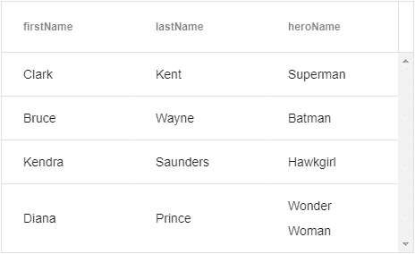

# KendoReact 网格简介

> 原文：<https://dev.to/progresstelerik/introduction-to-the-kendoreact-grid-2b3h>

使用 KendoReact 网格可以做很多事情。请继续阅读，了解常用功能的介绍，并了解如何将其添加到您的项目中。

[KendoReact](https://www.telerik.com/kendo-react-ui) [数据网格](https://www.telerik.com/kendo-react-ui/components/grid/)(或者数据表，取决于你习惯什么)是我们 React UI 组件库中最受欢迎的组件之一。这很有意义，为什么会这样，许多开发人员的任务是在他们的应用程序中显示数据，还有什么比用表格的方式更好的方式来显示这些数据呢？

然而，不仅仅是在行和列中显示数据。这个原生 UI 组件是我们为 React 从头构建的原生 UI 组件库的一部分(这意味着**零**依赖)，它内置了大量功能来帮助用户组织、修改和导出他们的数据。一些亮点包括:

*   分页
*   整理
*   过滤
*   CRUD 操作
*   导出到 PDF 和 Excel
*   列的重新排序和调整大小
*   虚拟化

这还不是完整的列表！在这篇博文中，我想看看一些更流行的特性，以及如何实现它们，坚持分页、排序、过滤和分组。总的来说，这将为您如何将 KendoReact 网格添加到应用程序中打下良好的基础！

## 安装 KendoReact 网格

在我继续之前，我应该介绍一下如何准备您的项目来开始使用 KendoReact 网格。

首先，我们应该`npm install`我们可能需要的所有包:

```
npm install --save @progress/kendo-react-grid @progress/kendo-data-query @progress/kendo-react-inputs @progress/kendo-react-intl @progress/kendo-react-dropdowns @progress/kendo-react-dateinputs 
```

我们在这里安装了一些包，但主要是在网格中添加了所有的 KendoReact 输入(如下拉菜单和日期选择器)以及使用我们的国际化和全球化包的能力。

接下来，在我们的组件中，我们可以导入我们的包模块:

```
// ES2015 module syntax
import { Grid } from '@progress/kendo-react-grid'; 
```

或者使用 CommonJS 格式:

```
// CommonJS format
const { Grid } = require('@progress/kendo-react-grid'); 
```

最后，我们应该确保组件以某种方式进行了样式化。我们有三种设计(或主题)供您使用:默认的(我们自己开发的主题)、[引导](https://www.telerik.com/kendo-react-ui/components/styling/theme-bootstrap/) (v4)和[材质](https://www.telerik.com/kendo-react-ui/components/styling/theme-material/)主题。对于这个特殊的样品，我们将使用材料，因为这是基于来自[材料设计](https://material.io/design/)的指导方针和当今最流行的设计语言之一。

要添加我们的一个主题，你所要做的就是另外一个`npm install`，就像这个:

```
npm install --save @progress/kendo-theme-material 
```

然后，要在我们的应用程序中实际使用这个主题(如在中，我们需要引用我们的 CSS ),我们有几个选项。关于你能做什么的更多细节，请查看我们的“[样式&主题](https://www.telerik.com/kendo-react-ui/components/styling/)”文档文章，但是在这种情况下，我在我的`index.html` :
标题中包含了一个非常简单的主题

```
<link rel="stylesheet" href="https://unpkg.com/@progress/kendo-theme-default@latest/dist/all.css" /> 
```

不一定是推荐用于生产的东西——在我上面链接的文章中，我们涵盖了更多的真实场景——但肯定是适用于本文的东西！

## 一切从数据开始

既然已经在我们的项目中安装并导入了一些东西，让我们从最简单的场景开始:绑定到一个数组。

假设在我的状态中有下面的数组，我们希望在我们的 KendoReact 网格中显示:

```
state = {
  gridData: [
    { "firstName" : "Clark", "lastName" : "Kent", "heroName" : "Superman" },
    { "firstName" : "Bruce", "lastName" : "Wayne", "heroName" : "Batman" },
    { "firstName" : "Kendra", "lastName" : "Saunders", "heroName" : "Hawkgirl" },
    { "firstName" : "Diana", "lastName" : "Prince", "heroName" : "Wonder Woman" }
  ]
}; 
```

我们真正需要做的是下面这些:

```
<Grid data={this.state.gridData} /> 
```

就是这样！我们最终得到了这样一个网格:

[](https://res.cloudinary.com/practicaldev/image/fetch/s--t-cLIArs--/c_limit%2Cf_auto%2Cfl_progressive%2Cq_auto%2Cw_880/https://d585tldpucybw.cloudfront.net/sfimages/default-source/default-album/001-grid-array-binding.png%3Fsfvrsn%3D527aafbf_1)

正如我们所看到的，网格获取了我们所有的字段，自动为它们创建了列，并将它们全部显示在一个页面上。然而，有一些突出的东西，如标题不一定看起来很棒(只取字段名)，也许我们想先显示超级英雄的名字，而不是最后。我们解决这个问题的方法是在网格中定义一组列来表示我们的数据。这些专栏让我们也可以接手我们可能希望在一个接一个专栏的基础上进行的具体工作(考虑根据我们的数据提供定制模板)。

那看起来好多了！请注意，现在列的顺序已经发生了变化，标题看起来更好了。

## 在混音中添加交互性

### 分页

对于分页，我们有几种途径可以选择。由于我们将使用本地数据，这意味着我们负责将数据分割成我们所处理的页面所需的适当大小。

我们现在所做的是完全接管基于我们上面提到的超级英雄数据的分页。我们采用这种方法只是为了帮助逐步了解分页在 KendoReact 网格中的基本工作方式。还有很多其他的方法，包括让网格本身更有状态，或者使用像我们的`Data Query`框架甚至 Redux 这样的库来改变事情。如需更多样本，您可以参考我们的[分页文档部分](https://www.telerik.com/kendo-react-ui/components/grid/paging/)。

我想指出一些我们在网格和分页配置中使用的术语:`skip, take`和`total`。这些名字似乎透露了一些信息，但是让我们直接进入每一个。

`skip`与我们应该在数据阵列中走多远保持一致。对于我们的初始页面，这将是 0，但是如果我们有一个 10 的页面大小并且想要跳到第二页，我们现在将有一个 10 的`skip`来开始下一个“页面”的数据。

相当于我们的页面大小。如果我们将它设置为 10，这意味着每个页面将加载 10 个项目。

只是让寻呼机知道我们绑定到的项目总数。这有助于在计算中显示“Z 项的 X - Y ”,其中我们的总数是“Z”

记住这一点，我们在 KendoReact 网格中启用分页的方法是通过将`pageable`属性设置为 true，然后定义`take`和`skip`选项。

在我们的例子中，我们只有四个数据项，所以要制作一个样本，我们可以制作两个页面大小，这样我们总共有两个页面。没什么特别令人兴奋的，但是这也是为了让您了解分页在网格中是如何工作的。因为`take`和`skip`正在处理我们的数据并保持网格的当前状态，所以让我们马上把它们添加到组件的状态中，就像这样:

```
class App extends React.Component { 
  constructor(props) {
    super(props);
    this.state = {
        gridData: [
          { "firstName" : "Clark", "lastName": "Kent", "heroName" : "Superman" },
          { "firstName": "Bruce", "lastName": "Wayne", "heroName" : "Batman"},
          { "firstName": "Kendra", "lastName": "Saunders", "heroName" : "Hawkgirl"},
          { "firstName": "Diana", "lastName": "Prince", "heroName" : "Wonder Woman"}
        ],
        skip: 0,
        take: 2
    } 
```

所以，我们`skip` 0，从我的第一个项目开始，我们只设置`take`为 2(从我们的数组中抓取超人和蝙蝠侠)。

为了实现分页，我们必须做的另一件事是订阅 [`onPageChange`](https://www.telerik.com/kendo-react-ui/components/grid/api/GridProps/#toc-onpagechange) 事件。该事件负责让我们知道页面何时改变以及向哪个方向改变(如果我们向前或向后翻页)。这实际上只是通过更新`skip`和`take`来实现的，但这也给了我们一个机会来将绑定到网格的数据修改到适当的页面。在我们的例子中，这可以通过一个简单的`array.slice()`来处理，但是在更高级的例子中，我们会对数据做更多的处理。

我们的例子非常简单，我们所要做的就是将状态的`skip`和`take`变量更新为事件给我们的值，这意味着我们最终得到了这个:

```
this.pageChange = (event) => {
  this.setState({
    skip: event.page.skip,
    take: event.page.take
  })
} 
```

现在，我们只需要配置网格来使用我们在组件中设置的所有内容。

```
<Grid
  data={this.state.gridData.slice(this.state.skip, this.state.take + this.state.skip)}
  pageable={true}
  skip={this.state.skip}
  take={this.state.take}
  total={this.state.gridData.length}
  onPageChange={this.pageChange} >
    <Column field="heroName" title="Super Hero" />
    <Column field="firstName" title="First Name" />
    <Column field="lastName" title="Last Name" />
</Grid> 
```

注意我们在`data`属性中所做的，以及我们在`total`中所做的。后者很简单，我们简单的说我们拥有的项目总数就是我们数据数组的长度。我们用`data`做的只是一个变通办法，因为我们这里没有“真正的”数据连接，而只是一个本地数组。因此，我们使用`array.slice()`，并根据状态中的`skip`和`take`变量来划分数组。

这是生成的网格，包括分页和所有功能！

### 排序

添加了分页之后，让我们看看如何处理排序。

排序很容易设置。首先，我们想在状态中添加一个“sort”变量，以便跟踪网格中的排序。虽然我们只对单个列进行排序，但这应该是一个数组，因为我们可能希望对多个列进行排序。所以，只要把`sort: []`加入到我们的状态中。

在实际的网格上，我们希望在网格上设置 [`sortable`](https://www.telerik.com/kendo-react-ui/components/grid/api/GridProps/#toc-sortable) 属性，这需要一个 [`GridSortSettings`](https://www.telerik.com/kendo-react-ui/components/grid/api/GridSortSettings/) 对象，该对象可以定义我们是否希望对单个或多个列进行排序，以及我们是否希望给用户取消排序(取消排序)的能力。这里我们将保持事情的简单，但是如果你想更深入地了解这个[，这里有一个高级示例](https://www.telerik.com/kendo-react-ui/components/grid/sorting/#toc-customize-sorting)。我们现在将把这个设置为 true，最终将`sortable={true}`添加到我们的声明网格中。

就像分页一样，我们必须确保在我们的一个列中设置了一个`field`选项，这样我们就可以将网格绑定到数据中的某个字段。

我们还应该定义`sort`属性，它将突出显示当前排序的列，以及显示在标题文本旁边的箭头(用于升序或降序排序)。这是我们之前已经在状态中定义的字段，`state.sort`。

最后，我们需要订阅 [`onSortChange`](https://www.telerik.com/kendo-react-ui/components/grid/api/GridProps/#toc-onsortchange) 事件。这就像分页事件一样，它让我们有机会获取用户在排序方面试图更新的内容，并将其应用于我们的数据。因为我们是在本地进行的，所以我们可以只更新排序顺序，但是如果我们有另一个数据存储方法，我们可以只对数据进行手动排序。

```
this.shortChange = (event) => {
  this.setState({
    sort: event.sort
  })
} 
```

为了给这个`sort`变量一个大概的概念，一个典型的排序对象可以是这样的:

```
sort: [
  { field: "heroName", dir: "asc" }
] 
```

上面说我们正在对`heroName`字段进行排序，并且我们是以一种升序的方式进行排序的。从技术上来说，我们可以从一开始就设置它，并从一开始就定义一个排序顺序，但现在我们只是让事情保持空白。

为了获得排序的基本原理，这就是我们需要做的。然而，由于组织数据分类可能很麻烦，我们可以依靠[KendoReact 数据查询框架](https://www.telerik.com/kendo-react-ui/components/dataquery/)来帮助我们。这对我们来说有很多有用的工具，其中一个是 [`orderBy`](https://www.telerik.com/kendo-react-ui/components/dataquery/#toc-sorting) ，我们将在这里使用它按照排序顺序对数组进行排序。

请注意，这是用来帮助处理作为数据存储的本地数组。对于更高级的场景(使用状态管理等。)我们并不真的需要数据查询框架。

当我们第一次做`npm install`时，我们已经将它添加到我们的项目中，但是让我们将它导入到我们的组件中。

```
import { orderBy } from '@progress/kendo-data-query'; 
```

我们现在可以使用`orderBy()`做这样的事情:

```
const data = [
  { name: "Pork", category: "Food", subcategory: "Meat" },
  { name: "Pepper", category: "Food", subcategory: "Vegetables" },
  { name: "Beef", category: "Food", subcategory: "Meat" }
];

const result = orderBy(data, [{ field: "name", dir: "asc" }]);

console.log(result);

/* output
[
  { "name": "Beef", "category": "Food", "subcategory": "Meat" },
  { "name": "Pepper", "category": "Food", "subcategory": "Vegetables" },
  { "name": "Pork", "category": "Food", "subcategory": "Meat" }
]
*/ 
```

正如我们所看到的，所需要的就是传递一个数组，然后将排序对象传递给这个函数。在我们的例子中，这意味着我们需要对原始数据集调用`orderBy`，然后也传入 sort 对象。

```
data={orderBy(this.state.gridData, this.state.sort)} 
```

然而，如果我们还想要分页，我们需要再次使用`array.slice`。这应该在`orderBy`的结果上完成，所以我们可以把它链接到我们的`orderBy`调用的末尾。

```
data={orderBy(this.state.gridData, this.state.sort).slice(this.state.skip, this.state.take + this.state.skip)} 
```

完成所有配置后，我们的网格设置应该如下所示:

如果我们运行这段代码，我们会看到只需单击标题就可以对列进行排序，我们会得到一个漂亮的指示器来显示我们的排序方向。我们要去参加比赛了！

### 过滤

接下来是过滤。这和我们上面的排序差不多。我们需要设置一个属性，定义我们可以提供过滤，我们提供绑定到我们的状态，让我们指示什么是当前被过滤的(就像上面的排序指示符)，最后当过滤器改变时处理一个事件。我们的过滤器也是用一个定义过滤器和过滤属性的对象来设置的，比如我们要应用哪种过滤器(“contains”或“starts with”等)。).

我们不一定需要在状态中添加一个过滤变量，所以我们现在跳过这一步。如果我们想提前过滤一些东西，我们可以很容易地通过定义这个对象来过滤我们想要应用的东西。

在实际的网格上，我们首先设置了`filterable={true}`,这将立即使我们的过滤器图标和过滤器行出现在每一列的顶部。然后，我们设置`filter`属性等于我们之前定义的状态变量，所以`filter={this.state.filter}`。

然后我们订阅我们的事件， [`onFilterChange`](https://www.telerik.com/kendo-react-ui/components/grid/api/GridProps/#toc-onfilterchange) ，并在用户过滤时使用它来更新我们的状态。

```
this.filterChange = (event) => {
  this.setState({
    filter: event.filter
  })
} 
```

作为一个快速的参考，`filter`变量期望一个 [`CompositeFilterDescriptor`](https://www.telerik.com/kendo-react-ui/components/dataquery/api/CompositeFilterDescriptor/) ，它实际上只是一个 [`FilterDescriptors`](https://www.telerik.com/kendo-react-ui/components/dataquery/api/FilterDescriptor/) 的数组以及一个逻辑变量，该变量定义了我们是使用“与”还是“或”过滤器。实际的`FilterDescriptor`有点长，所以我建议浏览一下我刚才链接的文档文章，看看这是如何手动构建的。

我们要做的最后一部分实际上是修改我们的数据。我们正处于需要对网格应用过滤、排序和分页的阶段，这很快就会变得难以跟踪。我们如何在数组中应用排序顺序、过滤顺序，甚至分组？嗯，有手动的方法，也有简单的方法: [KendoReact 数据查询`process`函数](https://www.telerik.com/kendo-react-ui/components/dataquery/api/process/)。

#### 快速旁白:数据查询和 Process()函数

这值得在这里有自己的小部分，因为这将节省我们的时间和精力，当谈到按摩我们的数据为这个样本。如前所述，这不是网格使用的要求。事实上，你们中的许多人已经建立了自己的州管理。这对于处理本地数组中的数据或者在没有现有状态管理的情况下非常有用。非常适合这个样本。此外，根据您在 React 旅程中所处的位置，这可能是您在使用 KendoReact 网格或其他一些数据绑定组件时的第一个或两个项目所依赖的东西。

`process()`函数只是将我们的初始数据作为第一个参数，作为第二个参数，它接受一个包含来自网格(或预定义的)的`skip`、`take`、`sort`、`filter`和`group`(稍后将详细介绍分组)变量的对象，并将所有这些选项应用于我们的数据集，将所有内容输出到一个[、`DataResult`、](https://www.telerik.com/kendo-react-ui/components/dataquery/api/DataResult/)对象，KendoReact 网格使用该对象来了解当前页面、过滤器、排序和分组选项。

因为我们在这里没有使用 Redux 或类似的东西，所以在示例的其余部分我们将依赖于这个方法。这最终会节省大量绑定到数据绑定组件的时间，比如带有本地数组的网格，就像我们现在做的一样。

#### 回过滤

现在我们知道了`process`函数，我们可以导入它来代替我们的`orderBy`(尽管来自同一个包)。

```
import { process } from '@progress/kendo-data-query'; 
```

然后，在我们的`data`道具中，我们只需要做以下事情:

```
data = { process(this.state.gridData, this.state) } 
```

这有多简单？因为我们已经定义了组件状态中需要的所有变量，所以我们可以直接传入`this.state`而不用创建新的对象！结果如下，现在我们对所有数据进行过滤、排序和分页！

### 稍微收拾一下东西

在我们继续之前，您可能已经注意到我们的组件现在非常繁忙。我们已经在网格上配置了所有这些设置，状态上的所有字段，以及所有正在触发的事件。就像我们使用`process()`来简化我们的数据绑定一样，我们能在设置网格时做同样的事情吗？

也许我把这个设置得太简单了，但是简单的回答是，是的，当然有可能让事情变得更简单！我们来聊聊 [`onDataStateChange`](https://www.telerik.com/kendo-react-ui/components/grid/api/GridProps/#toc-ondatastatechange) 。

每当网格状态改变时，`onDataStateChange`事件就会触发。这意味着我们打给`onPageChange`、`onSortChange`、`onFilterChange`(很快`onGroupChange`，当我们分组时)的所有电话都可以被一个单独的`onDataStateChange`套餐取代。

我们想要使用这个事件，但是我们可能想先看看我们代码的其余部分。现在，我们在状态对象的根上做了很多正确的设置。如果我们定义一个变量来专门保存与网格相关的所有信息，那就更有条理了，所以我们称之为`gridStateData`并将我们的`skip`和`take`变量放在那里。

```
this.state = {
  gridStateData: {
    skip: 0,
    take: 2
  }
} 
```

这样，我们就可以用下面的代码实现`onDataStateChange`:

```
this.dataStateChange = (event) => {
  this.setState({
    gridStateData: event.data
  });
} 
```

接下来，让我们把组件的状态简化一点，把我们的数据移到状态之外，而不是*把它传入我们的 React 组件*，即使在更简单的应用程序中，你也可能会看到这样做。这超出了我们组件的范围，正好在`ReactDOM.render`函数之上。别忘了加个道具，传入数据！

```
const appData = [
  { "firstName" : "Clark", "lastName": "Kent", "heroName" : "Superman" },
  { "firstName": "Bruce", "lastName": "Wayne", "heroName" : "Batman"},
  { "firstName": "Kendra", "lastName": "Saunders", "heroName" : "Hawkgirl"},
  { "firstName": "Diana", "lastName": "Prince", "heroName" : "Wonder Woman"}
];

ReactDOM.render(
    <App gridData={appData} />,
    document.querySelector('my-app')
); 
```

这意味着我们必须将网格上的`data`道具更新如下:

```
data={process(this.props.gridData, this.state.gridStateData)} 
```

注意我们在这里是如何调用`this.props.gridData`的，因为我们现在通过一个 prop 将它传递给组件。

我们可以研究的另一个领域是，由于我们使用了`process()`和`onDataStateChange`来更新和设置每个排序、过滤、页面和分组动作的状态，因此也消除了许多冗余的属性。

而技术上我们不得不使用`sort`、`skip`、`take`等。在网格内——当它们在我们的`state.gridStateData`内随时可用时，为什么要写在网格上呢？我们可以使用 [JSX 传播属性](https://reactjs.org/docs/jsx-in-depth.html#spread-attributes)来帮助我们。我们只需要将`{...this.state.gridStateData}`添加到我们的网格声明中。我们最终以这个结束。

```
<Grid
  data={process(this.props.gridData, this.state.gridStateData)}
  {...this.state.gridStateData}
  filterable={true}
  sortable={true}
  pageable={true}
  onDataStateChange={this.dataStateChange} >
    <Column field="heroName" title="Super Hero" />
    <Column field="firstName" title="First Name" />
    <Column field="lastName" title="Last Name" />
</Grid> 
```

相比之下，你看那有多干净！作为参考，这里是我们目前在组件中的内容。

### 分组

我们应该讨论的最后一部分是分组。在设置一个组的时候，还有一些事情需要记住，但是从初始配置开始，到目前为止我们已经完成了类似的工作。很像排序和过滤，我们需要设置我们的`groupable`、`group`和`onGroupChange`配置选项。配置这些将使我们能够拖放一个标题来开始分组，或者最初在一个字段上分组。

分组还有一个部分，我们可能一开始没有想到，这是任何组的组头。这使我们能够提供关于我们的组的信息，最初只是我们分组的字段的值，但是在这里添加像聚合这样的附加信息怎么样？此外，它还包含展开和折叠图标，这些图标应该在我们的状态中的某个地方被跟踪，并由网格使用。

这就是为什么我们需要设置另外两个配置选项:`onExpandChange`，它在我们每次折叠或展开一个组时触发，还有`expandField`，它让我们根据这个字段的值定义一个项目是展开还是折叠。

有了这些新鲜的信息，让我们开始建立一些分组吧！首先，让我们在网格上添加`groupable={true}`。我们不需要定义`onGroupChange`，因为我们使用了`onDataStateChange`。此外，`group`将在我们分组后定义，这要归功于我们与`{..this.state.gridStateData}`的合作。

这就剩下两个额外的配置选项需要设置了。我们来设定`expandField="expanded"`。`expandField` prop 将检查一个数据项是否被扩展(只会被添加到我们的组标题项中),即使我们没有在其他地方定义它也没关系，甚至在我们的原始文件中。当我们展开或折叠时，如果它不可用，网格将简单地添加它。我们可以避免这种情况，因为我们使用的是本地数组，但是其他场景可能需要跟踪独立于原始数据的扩展项。

在这之后，我们需要设置`onExpandChange`来确保当一个项目被展开时我们能够捕捉到，并相应地更新状态。因此，我们将`onExpandChange={this.expandChange}`添加到网格中，然后像这样设置我们的`this.expandChange`函数:

```
this.expandChange = (event) => {
  event.dataItem[event.target.props.expandField] = event.value;
  event.target.setState({});
} 
```

这里需要注意的是，`event.target.setState({});`纯粹是为了这个演示，因为我们处理的是本地数据。KendoReact 网格(即`event.target` ) **没有内部状态**，这就是为什么我们在`state.gridStateData`中设置所有这些变量。用一个空对象调用`setState({})`将会根据一个项目是否展开的更新信息刷新网格。在更真实的场景中，这不是我们的设置，因为我们可能不会像这样处理本地数组。

看看这个函数的第一行，我们正在以一种安全的方式访问我们数据项上的`expandField`变量，因为它可能以`undefined`的形式出现。此外，它还为我们提供了灵活性，以防我们更新我们想要在以后跟踪展开和折叠状态的`expandField`。我们将此设置为`event.value`，根据我们是扩展还是折叠组，该值将为真或假。

这应该就是我们在分组中需要添加的全部内容了！剩下的就是通过运行我们的示例，将一个列标题拖动到一旦我们在网格上设置了`groupable`就会出现的区域，来进行实际的尝试。

这是最终产品的源代码，这是一个可以处理分页、排序、过滤和分组的网格！为了好玩，你可以交换你加载数据的方式(也许通过某处的 JSON 文件),看看这是否还能工作，因为我们已经用它创建了一个相当通用的设置。

## 但是等等，还有！

到目前为止，这篇博文已经涵盖了很多内容，但是我们只是介绍了一些基本的特性。我们通过绑定到一个本地数组而不是像 Redux ( [，顺便说一下，我们当然可以绑定到这个数组)。所以，我们只是触及了表面，KendoReact 网格还可以做更多的事情！](https://www.telerik.com/kendo-react-ui/components/integration/redux-store/)

仅作为一个小的预告示例，有[编辑](https://www.telerik.com/kendo-react-ui/components/grid/editing/)、[层次结构](https://www.telerik.com/kendo-react-ui/components/grid/advanced-features/hierarchy/)、 [PDF 导出](https://www.telerik.com/kendo-react-ui/components/grid/pdf-export/)、 [Excel 导出](https://www.telerik.com/kendo-react-ui/components/grid/excel-export/)、[单元格模板](https://www.telerik.com/kendo-react-ui/components/grid/cells/#toc-cell-customization)、[列大小调整](https://www.telerik.com/kendo-react-ui/components/grid/columns/resizing/)、[列重新排序](https://www.telerik.com/kendo-react-ui/components/grid/columns/reordering/)等等！除此之外，还可以对我们显示过滤器的方式进行定制，更多的是围绕分组——这个列表还在继续。

总的来说，不可能在一篇博文中涵盖 KendoReact 网格能做的所有事情，因为这个组件能做的事情太多了。这就是为什么[KendoReact 网格文档](https://www.telerik.com/kendo-react-ui/components/grid/)存在的真正原因，并且有更多的例子来检验网格能做什么！我们在这里试图完成的是对一些最常用的功能进行 101 级的介绍，并给出如何将 KendoReact 网格添加到您的项目中的想法！

如果你是 KendoReact 的新手，你可以在这里了解更多信息，或者直接进入 T2 的 30 天免费试用。