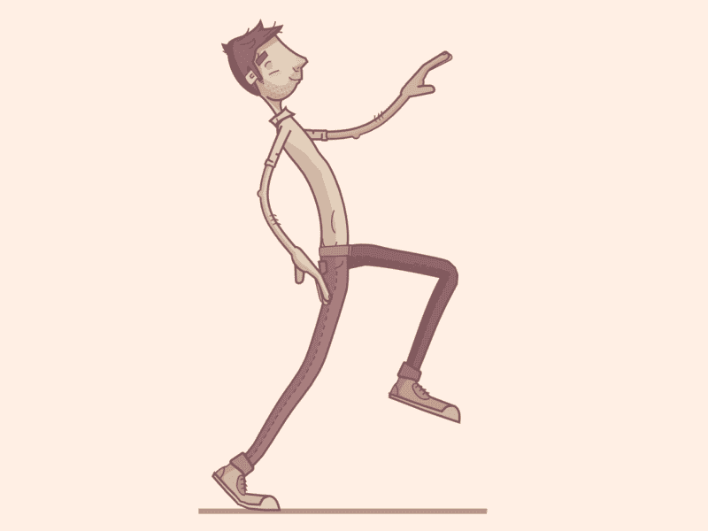
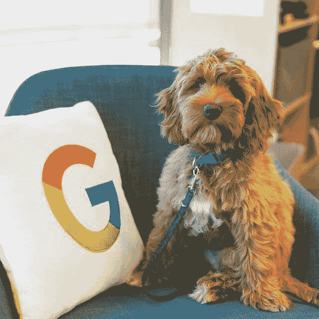
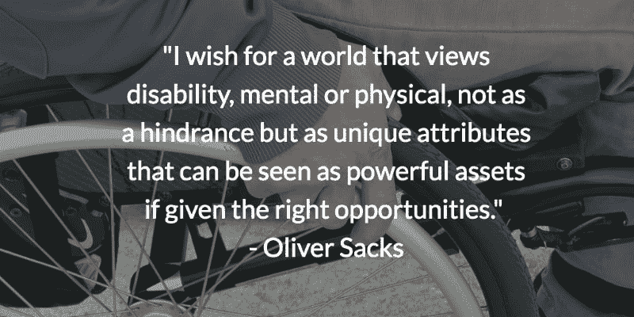

# 网页可及性介绍

> 原文：<https://dev.to/bolajiayodeji/introduction-to-web-accessibility-5a7o>

作为开发人员，很容易假设所有用户都能看到并使用键盘、鼠标或屏幕，你觉得每个人都能像你一样与你的网页互动。这可能会导致用户体验对某些人来说很好，但对其他人来说会产生问题:(

许多开发人员对
可访问性的含义只有很少或模糊的理解，当然，可访问性可能是一个复杂和困难的
主题，但是理解它，它的范围和它的影响可以使你成为一个更好的和
包容的 web 开发人员。

在这篇文章中，我将向你介绍可访问性，它的含义，为什么你应该关心，一些提示，工具和资源让你开始。

[](https://res.cloudinary.com/practicaldev/image/fetch/s--_BP_TTwc--/c_limit%2Cf_auto%2Cfl_progressive%2Cq_auto%2Cw_880/https://cdn-images-1.medium.com/max/800/0%2AWXgUQC2V92dkcYgZ)

*Gif by[乔纳丁格斯](https://dribbble.com/jonadinges)*

* * *

### 什么是无障碍？

让我们从定义可访问性和包容性开始。

> 根据[词库
> 字典](https://www.dictionary.com/browse/accessibility)，易访问性
> 简单的意思就是:容易接近，够得着，进入，说话，或者使用。

* * *

> **包容**是一种关于残疾人和
> 特殊教育的社会意识形态。I* *结论* *描述了一个特别欢迎
> 各种人的群体，不管他们有什么不同。

* * *

> 在人机交互中，可访问性简单地意味着使网络
> 可访问，并具有几乎每个人都可以操作的功能
> ，包括那些有各种形式的残疾、限制和条件的人...

* * *

#### 残疾人

根据世卫组织的统计，今天世界上大约有 2.85 亿人。根据[世界
卫生组织](http://www.who.int/mediacentre/factsheets/fs282/en/)(2012 年 6 月
)的数据，盲人
和视障者构成了 2.85 亿人，其中 3900 万人被归类为法定盲人，其余 2.46 亿人
为视障者。在中度至重度听力障碍类别中，聋人和听力受损者占 275，000，000 人(2004 年)。

一些形式的残疾包括:

*   身体残疾(影响一个人的灵活性或灵巧性)
*   **智力或学习障碍**(智力、学习或认知障碍患者阅读、学习任务或处理信息的能力降低。)
*   **视觉障碍**(有视觉障碍的人、视障人士和盲人。)
*   **听力损伤**(耳聋和听力损失)
*   **神经残疾**(与导致某些身体或精神功能丧失的神经系统损伤相关的残疾。)

#### 有限制/条件的人

残疾也可能是有条件的。

*   骨折的手臂
*   喧闹的餐馆
*   不会说当地语言

所有这些都是人们可以从无障碍实践中受益的例子。

> 当用鼠标吃饭时，每个人都是键盘使用者。
> 
> ——阿德里安·罗塞利

#### 我们怎样才能帮助这些人？

网页可访问性来拯救。这是一种实践，通过这种实践，web 应用程序
被设计和开发，以便其功能可以由残障人士
操作。

* * *

### 网页无障碍指南

> 在整篇文章中，我将参考[网页内容可访问性指南
> (WCAG) 2.0](https://www.w3.org/TR/WCAG20/) ，这是由网页可访问性专家整理的一套指南和最佳
> 实践，以系统的方式阐述了
> “可访问性”的含义。

WCAG 是围绕四个原则组织起来的，这四个原则通常被称为倒酒原则:

*   **可感知**用户能感知内容吗？这确保了我们的应用可以通过浏览器或辅助技术(如屏幕阅读器)用*视觉、触觉或听觉*感知
*   **可操作**用户能否轻松使用 UI 组件并导航内容？例如，需要悬停交互的东西不能由不会使用鼠标或触摸屏的人来操作。这意味着用户应该能够使用鼠标、键盘或辅助设备来控制您的 web 应用程序元素。
*   **可理解**用户能理解内容吗？用户能理解界面吗，是否清晰简洁？这确保了容易理解和流畅的用户体验。
*   **健壮**内容能被多种用户在几种浏览器上消费吗？这可以确保您的应用程序在多种设备、浏览器或操作系统之间的兼容性。

* * *

### 网页无障碍提示

既然你已经理解了网页可访问性的含义以及为什么你应该关注它，
让我向你介绍一些可以帮助你建立可访问的
网站的技巧:)

*   **总是给图像添加替代文本**

这是大多数开发人员都忽略的一件事，当我开始使用
时，我也曾忽略这一点，因为我并没有真正理解*替代文本的本质。*

> 可选文本(也称为`alt`)是一个单词，可以作为属性插入到 HTML 文档中，以告诉您的网站、用户图像的内容。替代文本出现在通常包含图像的空白框中。当图像由于链接断开、URL 更改或其他原因而不可用时，替代文本非常有用。

顾名思义，替代文本是屏幕阅读器的一种选择。
通过屏幕阅读器和其他屏幕
辅助技术向盲人用户大声朗读。

您可以使用 *`alt`* 属性
为图像添加替代文本

```
 
```

Enter fullscreen mode Exit fullscreen mode

属性的另一个重要方面是，在添加这些文本时，您应该具体说明。例如，检查下面的图像:

[](https://res.cloudinary.com/practicaldev/image/fetch/s--Tl0tjU1r--/c_limit%2Cf_auto%2Cfl_progressive%2Cq_auto%2Cw_880/https://cdn-images-1.medium.com/max/600/0%2Al82N_5g3MF01TecN.jpg) 
美丽的[阿尼卡·因扬](https://medium.com/u/61b12cb51464)

```
 
```

Enter fullscreen mode Exit fullscreen mode

-

```
 
```

Enter fullscreen mode Exit fullscreen mode

上面哪个代码更支持可访问性，1 还是 2？

[](https://res.cloudinary.com/practicaldev/image/fetch/s--0k07ORwg--/c_limit%2Cf_auto%2Cfl_progressive%2Cq_auto%2Cw_880/https://cdn-images-1.medium.com/max/800/1%2AVwaIywCKRAu6d8M74gkQVg.jpeg)

```
 
```

Enter fullscreen mode Exit fullscreen mode

-

```
 
```

Enter fullscreen mode Exit fullscreen mode

上面哪个代码更支持可访问性，1 还是 2？

现在，你应该明白使用替代文本时的具体语境。你可能看不到这个需求，你可能不需要它，但是很多残疾用户需要它。

*   **设计便于访问的表单**

确保将`<label>`添加到表单元素中，尽管它们可能不可见。
你可以为屏幕阅读器添加标签，但仍然对其他用户隐藏这些标签
。

```
<form action="./contact.php" method="POST">
  <label for="fullname">Full name</label>
  <input type="text" name="fullname" id="fullname">
  <label for="email">Email address</label>
  <input type="email" name="email" id="email">
  <label for="phone">Telephone</label>
  <input type="number" name="phone" id="phone">
</form> 
```

Enter fullscreen mode Exit fullscreen mode

确保您的`for`属性与`id`匹配

*   **始终指定您的网络应用语言**

```
<html lang="en-US"> // American english

 <html lang="en-UK"> // British english

 <html lang="fr"> // French 
```

Enter fullscreen mode Exit fullscreen mode

如果你的应用程序支持多种语言或翻译，确保也指定
。

*   **除了表格数据，不要使用表格**
*   **不要自动播放视频、音乐或其他媒体文件**(请避免这种情况)
*   确保链接是可识别的。带下划线或不同颜色
*   **始终提供跳到主要内容选项**

跳转到主要内容链接对于只使用键盘导航
的用户来说很有用

```
<body>
...
  <a href="#main">Get Started</a>
...
  <p>
   Our story is a story which explains another story. Cut the crap this is too long and I don't want to read it.
  </p>
...
  <main id="main">
    <!-- page specific content -->
   <p> Here's the main stuff bro </p>
  </main>
</body> 
```

Enter fullscreen mode Exit fullscreen mode

*   **减少 div 并利用语义元素**

HTML5 提供了额外的元素，比如`<nav>`、`section`和`<aside>`、
来更好地组织你的内容。

* * *

我会在这里停下来，因为我们有大量的可访问性指南，但是不要担心，我已经
在下面包含了进一步阅读的链接:)

### A11y 项目

这是一个社区驱动的努力，通过大量的
资源、事件、模式、清单和更多的东西来帮助你构建更多的
可访问的应用程序，使网页可访问性更容易。https://a11yproject.com/

> 可及性可能是一个复杂而困难的话题。无障碍项目
> 理解这一点，并希望帮助它在网络上更容易实现。

### 网页无障碍工具

*   **ally.css**

这个 CSS 文件旨在警告开发者 HTML 代码中可能存在的风险和错误。通过简单地把它作为一个外部样式表包含进来，它也可以用来粗略地评估一个站点的质量。

在此获取由[gal Poupard](https://github.com/ffoodd)
[构建的 Ally.css 或者在此](https://ffoodd.github.io/a11y.css/)下载由[Ire
Aderinokun](https://medium.com/u/f7f8398c3660)
[构建的等效 web
扩展(chrome、firefox 和 opera) Alix](https://github.com/ireade/alix)

*   **铬灯塔**

Lighthouse 是一款[开源](https://github.com/GoogleChrome/lighthouse)、
的自动化工具，用于提高网页质量。你可以在任何公开的或者需要认证的网页上运行它。它有对性能、
可访问性、渐进式网络应用等的审计。阅读我之前的文章:
[chrome 简介
灯塔](https://bolajiayodeji.com/introduction-to-chrome-lighthouse/)入手
。

*   **对比度检查器**

根据网页内容
可访问性指南(WCAG ),检查您的色彩设计的可访问性对比。查看这里的。

*   **NoCoffee**

一个 chrome 扩展，有助于理解有轻微到极度视力问题的人所面临的问题。在这里下载

#### 可以找到网页辅助工具的完整列表

[这里](https://www.w3.org/WAI/ER/tools/)

* * *

### 资源

*   [网页内容无障碍指南(WCAG 2.0)](https://www.w3.org/TR/WCAG20/)
*   [HTML 语言代码](https://www.w3docs.com/learn-html/html-language-codes.html)
*   [在图像上使用替代文本的指南](https://www.giftegwuenu.com/guide-to-using-alternative-text-on-images)作者 [Egwuenu Gift](https://medium.com/u/46bccfc2f42c)
*   [创建有效且可访问的链接](https://a11yproject.com/posts/creating-valid-and-accessible-links/)
*   [ARIA 地标角色和 HTML5 隐式映射](https://a11yproject.com/posts/aria-landmark-roles/)
*   [NDVA 简介](https://a11yproject.com/posts/getting-started-with-nvda/)
*   如何隐藏内容，但仍能被屏幕阅读器访问。
*   [操作方法:在 HTML5 视频中使用字幕服务](https://a11yproject.com/posts/using-caption-services-with-html5-video/)
*   [辅助功能测试的基本屏幕阅读器命令](https://developer.paciellogroup.com/blog/2015/01/basic-screen-reader-commands-for-accessibility-testing/)

#### 可以找到网页可访问性资源的完整列表

[这里](https://a11yproject.com/resources)

* * *

### 结论

每个人都应该能够访问和享受网络，不管他们有什么样的挑战或限制。作为开发者，我们为每个
用户而不仅仅是**的一些用户**构建解决方案。正如我们关注 UI/UX 一样，我们也应该额外关注可访问性。感谢阅读！

[](https://res.cloudinary.com/practicaldev/image/fetch/s--G-96t0Gj--/c_limit%2Cf_auto%2Cfl_progressive%2Cq_auto%2Cw_880/https://cdn-images-1.medium.com/max/800/0%2ABQcPB-Ak2H8VA0AT.png)

喜欢这篇文章？请在推特上关注我
[@iambolajiayo](https://twitter.com/iambolajiayo)