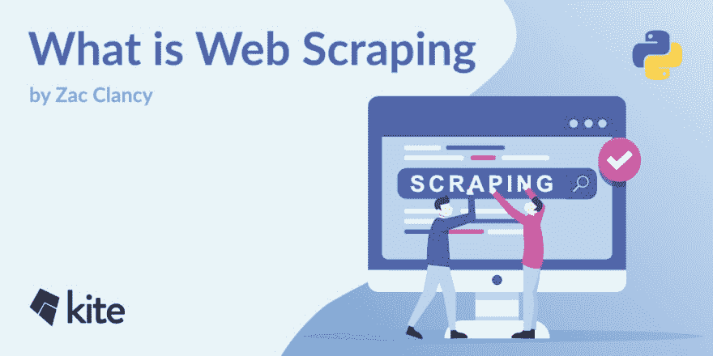

# 网页抓取简介

> 原文：<https://dev.to/kite/introduction-to-web-scraping-5em2>

## 介绍网页抓取

简单地说，web 抓取是开发人员用来从互联网上收集和分析信息的工具之一。一些网站和平台提供了应用编程接口(API ),我们可以用它来以结构化的方式访问信息，但其他的可能没有。虽然 API 肯定会成为与当今流行平台交互的标准方式，但当我们与互联网上的大多数网站交互时，我们并不总是拥有这种奢侈。我们不需要从标准的 API 响应中读取数据，而是需要通过阅读网站的页面和提要自己找到数据。

## 有些用处

万维网诞生于 1989 年，1993 年，网络抓取和爬行进入了人们的对话。在抓取之前，搜索引擎是由网站管理员收集的链接列表，并在他们网站的某个地方排列成一个长长的链接列表。第一个网络抓取器和爬行器，万维网漫游者，被创建来跟踪所有这些索引和链接，试图确定互联网有多大。此后不久，开发人员开始使用爬虫和抓取器来创建不需要人工协助的基于爬虫的搜索引擎。这些爬虫会简单地跟随每个页面上的链接，并保存关于页面的信息。由于网络是一个协作的努力，爬虫可以容易地和无限地跟随网站上嵌入的链接到其他平台，并且这个过程将永远继续下去。

如今，网络抓取几乎在每个行业都有一席之地。在新闻编辑室，网络抓取器被用来从成千上万个不同的互联网平台实时获取信息和趋势。这个月在亚马逊上花了太多钱？有些网站会让你知道，而且在大多数情况下，会通过使用网络抓取来代表你访问特定的信息。机器学习和人工智能公司正在收集数十亿条社交媒体帖子，以更好地了解我们如何在线交流。

## 那么它是如何工作的呢？

开发人员构建 web 抓取的过程看起来很像用户使用浏览器的过程:

在这里阅读更多！