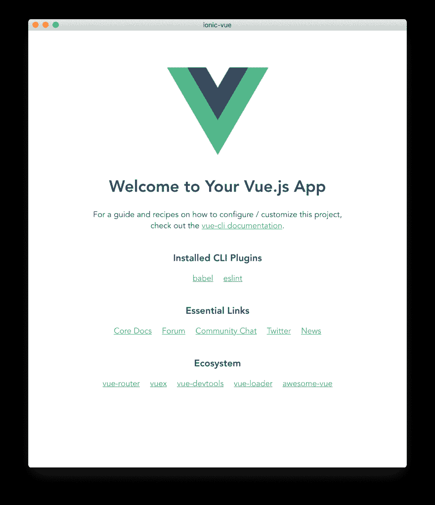

# Ionic 4: Angular，Vue.js 和 React

> 原文：<https://dev.to/paulhalliday/ionic-4-angular-vue-js-and-react-1o14>

[这也发表在 Ionic Workshop 上。](https://ionicworkshop.com/posts/introduction-to-ionic-framework-angular-vue-react/)

如果你想开发跨平台的 web 应用程序，你肯定听说过 Ionic Framework。随着离子(版本 4)的最新迭代，我们不再局限于只使用角！

就我个人而言，从 Angular.js 早期开始，我就是 Angular 生态系统的粉丝，但是 Ionic 已经(正确地)认识到现代 web 开发人员使用各种不同的前端框架。

我们将创建一个基本的 Ionic 应用程序三次，允许我们在 Angular、Vue 和 React 中研究创建一个 Ionic 项目。阅读完本文后，您将能够在任何您想要的框架中利用 Ionic！

> 在学习本教程之前，请确保您的机器上安装了 [Node.js](https://nodejs.org) 。

## 安装离子 CLI

我们可以安装 Ionic CLI 来帮助我们开发 Ionic 应用程序。Ionic CLI 允许我们与 Ionic 提供的各种服务进行交互，并启动新项目。

在您的终端中运行以下命令:

```
$ npm install -g ionic 
```

记住这一点，让我们使用 Angular 创建我们的第一个 Ionic 应用程序！

# 棱角分明

使用 Ionic CLI 创建项目目前仅限于 Angular，但在未来，我可以想象会为 Vue、React 等创建其他模板。

在您的终端中运行以下命令来创建一个新项目:

```
# Start a new Ionic and Angular project based on the blank template
$ ionic start ionic-angular blank

> don't install AppFlow at this stage

# Change directory
$ cd ionic-angular

# Run the project
$ ionic serve 
```

Ionic CLI 已经为我们搭建了一个基本的主页。如果我们查看`src/app/home.page.html`的内部，我们会看到下面的标记:

```
<ion-header>
  <ion-toolbar>
    <ion-title>
      Ionic Blank
    </ion-title>
  </ion-toolbar>
</ion-header>

<ion-content padding>
  The world is your oyster.
  <p>If you get lost, the <a target="_blank" rel="noopener" href="https://ionicframework.com/docs/">docs</a> will be your guide.</p>
</ion-content> 
```

然后我们可以使用任何我们想要的离子成分。让我们通过添加一个`ion-card`来对此稍作修改，并为`ion-toolbar` :
添加一个`color`属性

```
<ion-header>
  <ion-toolbar color="primary">
    <ion-title>Hello, Ionic!</ion-title>
  </ion-toolbar>
</ion-header>
<ion-content>
  <ion-card>
    
    <ion-card-header>
      <ion-card-subtitle>Isn't it great?</ion-card-subtitle>
      <ion-card-title>Look at this view!</ion-card-title>
    </ion-card-header>
    <ion-card-content>
      Although, it does look fairly cold.
    </ion-card-content>
  </ion-card>
</ion-content> 
```

下面是这样做的结果:

[](https://res.cloudinary.com/practicaldev/image/fetch/s--O2LCXyDj--/c_limit%2Cf_auto%2Cfl_progressive%2Cq_auto%2Cw_880/https://ionicworkshop.com/media/01-intro-ionic/02-ionic-vue.png)

相当甜蜜！让我们继续看看如何用 Vue.js 做同样的事情。

# vista . js

将 Ionic 添加到 Vue.js 项目很简单。我们首先用 Vue CLI 生成一个新的 Vue 项目:

```
# Ensure you have the Vue.js CLI installed
$ npm install @vue/cli

# Create a new Vue project
$ vue create ionic-vue 

> select default options

# Change directory into ionic-vue
$ cd ionic-vue

# Run the project
$ npm run serve 
```

这为我们创建了一个新的 Vue.js 应用程序，并在我们的浏览器中打开它。我们将使用该应用程序作为我们 Ionic 应用程序的基础:

[](https://res.cloudinary.com/practicaldev/image/fetch/s--PBQaClkb--/c_limit%2Cf_auto%2Cfl_progressive%2Cq_auto%2Cw_880/https://ionicworkshop.com/media/01-intro-ionic/01-ionic-vue.png)

## 安装离子 Vue

接下来，我们需要将 Ionic 安装到我们的项目中。回到命令行(在新的终端窗口):

```
$ npm install @ionic/core @ionic/vue vue-router 
```

我们现在已经在项目中安装了 Ionic。由于`@ionic/vue`是作为 Vue.js 插件公开的，我们需要导入它并告诉 Vue 我们想和`Vue.use`一起使用它。前往`main.js`并完全照做:

```
import Vue from 'vue';
import App from './App.vue';

import IonicVue from '@ionic/vue';
import '@ionic/core/css/core.css';
import '@ionic/core/css/ionic.bundle.css';

Vue.config.productionTip = false;

Vue.use(IonicVue);

new Vue({
  render: h => h(App)
}).$mount('#app'); 
```

> 这里发生了什么事？

1.  我们首先从`@ionic/vue`导入`IonicVue`。
2.  接下来，我们将从`@ionic/core`导入核心离子风格。
3.  最后，我们使用`Vue.use(IonicVue)`注册 IonicVue 插件。

## 使用离子

现在我们已经在 Vue.js 应用程序中安装并初始化了 Ionic，我们可以使用 Ionic 组件了。让我们前往`App.vue`并创建以下内容:

```
<template>
  <ion-app>
    <ion-header>
      <ion-toolbar color="primary">
        <ion-title>Hello, Ionic!</ion-title>
      </ion-toolbar>
    </ion-header>
    <ion-content>
      <ion-card>
        
        <ion-card-header>
          <ion-card-subtitle>Isn't it great?</ion-card-subtitle>
          <ion-card-title>Look at this view!</ion-card-title>
        </ion-card-header>
        <ion-card-content>
          Although, it does look fairly cold.
        </ion-card-content>
      </ion-card>
    </ion-content>
  </ion-app>
</template>

<script>

export default {
  name: 'app',
}
</script>

<style>
</style> 
```

这给了我们以下的离子应用:

[](https://res.cloudinary.com/practicaldev/image/fetch/s--O2LCXyDj--/c_limit%2Cf_auto%2Cfl_progressive%2Cq_auto%2Cw_880/https://ionicworkshop.com/media/01-intro-ionic/02-ionic-vue.png)

> 看看这个 *vue* ！

请注意，我们如何能够在*零*变化的情况下，从角度应用中获得相同的离子含量。这就是爱奥尼亚的力量！

## 做出反应

React 为我们提供了同样的能力来创建令人敬畏的 Ionic 项目，但是在如何使用组件方面有一些小的不同。

与 Vue 类似，我们将从一个空白的 React 应用程序开始，并使用`@ionic/core`和`@ionic/react`在其上添加 Ionic。我们将使用`create-react-app`来开始我们的 React 项目。在您的终端中运行以下命令:

```
# Install create-react-app globally
$ npm install create-react-app -g

# Create a new React project
$ create-react-app ionic-react --typescript

# Change directory
$ cd ionic-react

# Run the project
$ npm start 
```

## 安装离子

我们现在需要将`@ionic/react`、`@ionic/core`和`react-router`安装到 React 项目中。Ionic 目前依赖于`react-router`，所以我们需要添加它，即使我们在这个阶段没有使用路由器。

在您的终端中运行以下命令:

```
$ npm install @ionic/react react-router react-router-dom @types/react-router @types/react-router-dom 
```

## 使用离子

与前面的例子类似，我们将从导入相关的 CSS 文件开始。

转到`index.tsx`并导入以下内容:

```
import '@ionic/core/css/core.css';
import '@ionic/core/css/ionic.bundle.css'; 
```

然后，我们可以导入单个组件，如`IonApp`、`IonHeader`、`IonContent`等，如下所示:

```
import {
  IonApp,
  IonHeader,
  IonContent
} from '@ionic/react'; 
```

我们现在可以重新创建我们的工具栏和卡片的前一个例子。转到`App.tsx`并添加以下内容:

```
import React, { Component } from 'react';

import {
  IonApp,
  IonHeader,
  IonToolbar,
  IonContent,
  IonTitle,
  IonCard,
  IonCardHeader,
  IonCardTitle,
  IonCardSubtitle,
  IonCardContent
} from '@ionic/react';

class App extends Component {
  render() {
    return (
      <IonApp>
        <IonHeader>
          <IonToolbar color="primary">
            <IonTitle>Hello, Ionic!</IonTitle>
          </IonToolbar>
        </IonHeader>
        <IonContent>
          <IonCard>
            
            <IonCardHeader>
              <IonCardSubtitle>Isn't it great?</IonCardSubtitle>
              <IonCardTitle>Look at this view!</IonCardTitle>
            </IonCardHeader>
            <IonCardContent>Although, it does look fairly cold.</IonCardContent>
          </IonCard>
        </IonContent>
      </IonApp>
    );
  }
}

export default App; 
```

Tada！这为我们提供了以下信息:

[](https://res.cloudinary.com/practicaldev/image/fetch/s--O2LCXyDj--/c_limit%2Cf_auto%2Cfl_progressive%2Cq_auto%2Cw_880/https://ionicworkshop.com/media/01-intro-ionic/02-ionic-vue.png)

React 实现的主要区别是需要单独导入每个组件。除此之外，该应用程序的外观和感觉与我们的其他实现完全相同！

# 结论

本文使用 Angular、Vue 和 React 研究了 Ionic 4 应用程序的实现。现在，您应该可以在各种不同的环境中轻松使用 Ionic 了！🙌

你喜欢这篇文章吗？请在 [Twitter](https://twitter.com/IonicWorkshop) 或 [Ionic Workshop 上告诉我！](https://ionicworkshop.com)