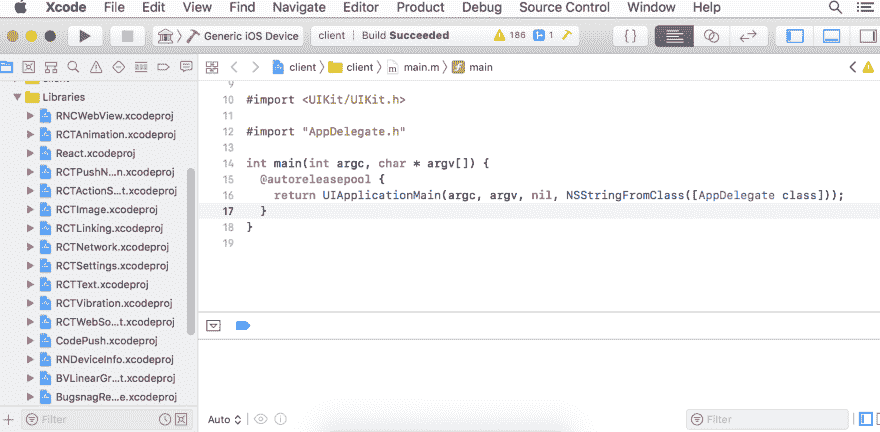

# iOS 应用程序拒绝:Info.plist 文件应包含 NSLocationAlwaysUsageDescription

> 原文：<https://dev.to/kapilgorve/ios-app-rejection-info-plist-file-should-contain-a-nslocationalwaysusagedescription-lh9>

我们收到了 iOS App 团队关于在`Info.plist`文件中添加`NSLocationAlwaysUsageDescription`键的消息。我们的上一个构建因为这个特殊的原因被拒绝。

对这里的问题一无所知。我谷歌了一下，发现了一些有趣的东西。

如果您的应用程序使用用户的位置数据，则需要将`NSLocationAlwaysUsageDescription`密钥添加到您的`Info.plist`文件中。您需要添加一条自定义消息，说明为什么您也需要用户的位置数据。令人惊讶的是，我们没有使用地理定位服务或跟踪用户的位置。我们的应用不需要这种特定的功能。那么，为什么我们需要告诉用户我们正在跟踪用户的位置，而我们没有呢？

原来 React Native 有一个`GeoLocation`服务，默认包含在您的构建中。即使您不在代码库中使用`GeoLocation API`,它仍然存在于您的应用程序构建中。这触发了关于地理定位可能用途的代码机器人。

## 这个怎么解决？

提到这个 github 问题-[https://github.com/facebook/react-native/issues/20879](https://github.com/facebook/react-native/issues/20879)。有三种可能的方法。我尝试了第一个简单的方法，对我来说效果很好。我把 XCode 里的`libraries`文件夹里的`RCTGeolocation.xcodeproj`删除了，重新建了 app。你可以在下面的截图中看到当前应用程序的左侧库。这就解决了`NSLocationAlwaysUsageDescription`问题。

更新-我被告知这个问题将在 React 原生版本 60 左右被修复。

本帖最初发布于[https://www . jskap . com/blog/info . plist-file-should-contain-a-NSLocationAlwaysUsageDescription/](https://www.jskap.com/blog/Info.plist-file-should-contain-a-NSLocationAlwaysUsageDescription/)

👋嗨！我是卡皮尔。我总是喋喋不休地谈论建造东西，分享我的知识，自由职业。来 https://twitter.com/kapilgorve 和我打招呼吧