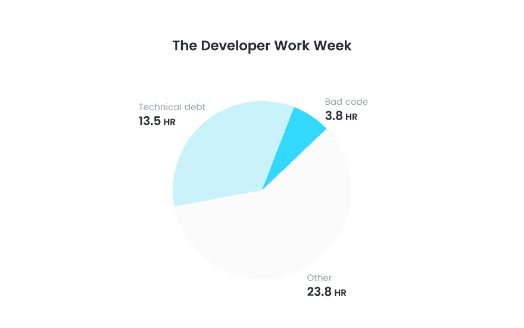

# 开发人员的生产力是不是比资本更大的创新障碍？

> 原文：<https://dev.to/thegeoffstevens/is-developer-productivity-a-bigger-constraint-to-innovation-than-capital-14d>

我最近读了 Stripe 发布的一份名为[开发者系数](https://stripe.com/reports/developer-coefficient-2018)的报告，该报告要求高管和开发者找出创新的最大制约因素。我遇到的一个主要问题是，高管们更担心找到有技能的开发人员，而不是资本，53%的人认为获得软件人才是一个主要制约因素，52%的人认为是资本。

如果你挖掘得更深入一点，文章中还有一些其他有趣的要点。

获得软件人才并不是唯一的问题。管理人员和开发人员都看到了生产率的巨大提高:

*   **96%** :认为提高开发人员生产力是高优先级或中优先级的高管人数。
*   68.4% :开发人员认为他们作为一个整体的平均工作效率，100%是非常高效的。

根据这份报告，“开发者是力量倍增器:不在于有多少开发公司；这就是它们被利用的方式。”

我认为许多公司错误地将他们的技术困境归咎于缺乏开发人才。

<figure>

开发人员平均每周花 17.3 个小时处理技术债务、坏代码和维护工作，比如调试和重构。这相当于 31.6%的效率影响，相当于估计全球年度 GDP 损失近 3000 亿美元，相当于巴基斯坦的全部 GDP。
[T3】](https://res.cloudinary.com/practicaldev/image/fetch/s--YdfGE4A9--/c_limit%2Cf_auto%2Cfl_progressive%2Cq_auto%2Cw_880/https://thepracticaldev.s3.amazonaws.com/i/hip8p432wx5v8hjv2ziq.png)

<figcaption>Reproduced from Stripe's The Developer Coefficient</figcaption>

</figure>

尽管效率受到影响，但大约 83%的 C 级高管和 77%的开发人员非常或有点相信他们有足够的资源来跟上新的技术趋势，如人工智能/人工智能、物联网和区块链。

然而，多达 44%的开发者认为他们的公司对技术趋势反应太慢。

有些事情不太对劲。也许公司需要创新，对新的技术趋势做出更快的反应。

你怎么想呢?软件人才是创新的最大制约因素吗？