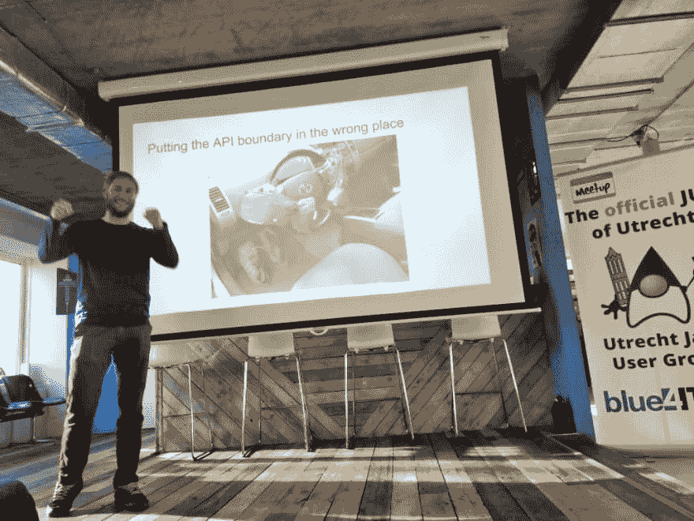

# 网络迫使我们以错误的方式拆分应用程序吗？

> 原文：<https://dev.to/_bigblind/is-the-web-forcing-us-to-split-applications-the-wrong-way-nmf>

去年 11 月，我参加了在乌得勒支举行的全球代码静修日聚会。午休期间，来自荷兰大型电子商务公司[bol.com](https://bol.com)的[约斯特·巴斯](https://www.linkedin.com/in/joost-baas-667b3814/?originalSubdomain=nl)做了一场演讲。

在演讲中，Joost 讨论了他们对订单状态工作方式的改变。他们与运输公司集成，在 bol.com 界面中提供运输状态。他们增加了一些新的订单可能出现的状态。这种变化波及到不同的团队；从引入新状态的后端(甚至可能是后端中的多个微服务)，到必须处理新状态并以用户友好的方式显示的 web 和移动前端。每个人都必须为这些值添加一个新的检查。

他们开始想知道未来是否能避免这种变化带来的连锁反应。所以他们最终做的是让 API 提供状态标签、描述和任何其他前端需要显示的信息。然后，UI 将提供显示这些值的位置。

# 连贯与脱钩

这个演讲让我想起了我去年早些时候写的一篇关于代码布局的博文。这篇文章主张按照应用程序域(用户、博客文章、权限，...)，而不是架构组件(模型、视图、控制器、存储库，...).处理问题领域某一部分的代码通常必须耦合在一起。有很多关于一致性的定义，但是我认为应用程序部分是一致的，如果它们有内在的理由一起改变的话。因此，将一致的代码组合在一起通常会将更改限制在代码库的特定部分。

# 客户端和服务器之间的鸿沟

在具有客户机-服务器架构的应用程序中(其中 web 应用程序可能是最常见的)，根据定义，代码在两个独立的区域运行，客户机和服务器。

但是等等...，客户机和服务器是**架构**组件，组件属于同一个领域，在两个代码段之间分开。更糟糕的是，这些通常是完全独立的存储库，用不同的编程语言编写，由不同的团队管理！这导致级联更改非常常见，但是很难协调。

# 解？

这不是那种我在结论中有神奇解决方案的博文。我有几个可能有效的猜测，我很想听听你的经历。

如果应用程序的所有部分都是用同一种语言编写的，那么您就可以在客户机和服务器之间共享大量的数据结构和逻辑，从而隔离针对特定平台定制的代码。

你有没有尝试过按域区域而不是客户机/服务器来分割你的代码？那(如何)起作用？