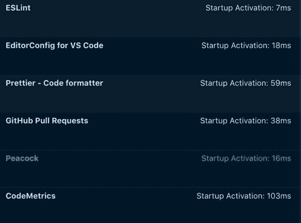

# 你的 VS 代码扩展慢吗？以下是加快速度的方法！

> 原文：<https://dev.to/azure/is-your-vs-code-extension-slow-heres-how-to-speed-it-up-4d66>

# -扩展摇滚-

VS 代码用户(我们中有很多人)非常喜欢我们的扩展。有[成千上万的 VS 代码扩展可供选择](https://marketplace.visualstudio.com/vscode?wt.mc_id=devto-blog-jopapa)，我们中的许多人已经安装了几个。它们做任何事情，从点亮你最喜欢的语言，格式化你的代码，甚至给你的主题着色。

你有没有注意到当你启动 VS 代码时，一些扩展需要一些时间来初始化？是什么导致了这种延迟？

> 你能做些什么呢？实际上很多。请继续关注我，看看如何帮助您最喜爱的扩展加载速度！

一个可能的原因是文件的数量或扩展名的大小。一些扩展包含了太多的功能，以至于随着时间的推移会变慢。

## 等等，那是为什么？

当我们为 web 构建应用程序时，我们用 JavaScript、CSS 和 HTML 编写几十或几百个文件。我们不希望通过网络向浏览器发送 1000 个文件，因为这可能是一种等待和等待的糟糕体验。当我们编写代码时，它也没有尽可能地针对浏览器进行优化。现代工具通过将文件压缩成单个(或一小组)文件来帮助我们解决这个问题。一个流行的工具是 WebPack。

如果您使用命令“Developer:Show Running Extensions ”,您将在 VS 代码实例中看到一个激活的扩展列表。您还可以在右侧看到，每个扩展在毫秒内激活需要多长时间。

[](https://res.cloudinary.com/practicaldev/image/fetch/s--0aI_rnKb--/c_limit%2Cf_auto%2Cfl_progressive%2Cq_auto%2Cw_880/https://thepracticaldev.s3.amazonaws.com/i/rlw2qutmcmcjf3b4nrv8.png)

这是一个伟大的方式来找出哪些可能是较慢的激活。请注意，下面的列表来自我的 VS 代码实例，显示了我安装的几个扩展及其激活时间。显然，有些比其他的要花更长的时间来加载，因为它们做得更多。

[](https://res.cloudinary.com/practicaldev/image/fetch/s--X7Wr82s3--/c_limit%2Cf_auto%2Cfl_progressive%2Cq_auto%2Cw_880/https://thepracticaldev.s3.amazonaws.com/i/muapn5ojr6tuevo1gsvv.png)

如果你觉得时间太长了，你该怎么办？(可能 1000ms？)

## 使扩展更快

最近，VS 代码团队发布了使用 WebPack 将文件捆绑到扩展中的能力。

这篇文章涵盖了所有的内容，并且在打包扩展时会有所帮助。

我发现我的[孔雀扩展](https://marketplace.visualstudio.com/items?itemName=johnpapa.vscode-peacock&wt.mc_id=devto-blog-jopapa)在包里放了 48 个文件。我做了一些调整，把它减少了很多。

首先，我在`.vscodeignore`文件
中添加了一些文件

```
# Files I excluded
azure-pipelines.yml
ISSUE_TEMPLATE.md
PULL_REQUEST_TEMPLATE.md
vsc-extension-quickstart.md
node_modules/**/test/**

# After webpack, we have more to ignore
node_modules
out/
src/
tsconfig.json
webpack.config.json 
```

然后我为我的扩展创建了一个新的分支。我通过 [VS 代码文档](https://code.visualstudio.com/updates/v1_32#_bundling-extensions-with-webpack?wt.mc_id=devto-blog-jopapa)中的步骤来更新我的项目以使用 WebPack。

我的目标是让所有这些仍然有效:

*   用`npm run package`包装
*   使用`npm run publish`发布
*   使用`npm run test`进行本地和 CI 测试
*   F5 用`launch.json`调试
*   F5 用`launch.json`调试测试

**该方法让我用 webpack 和`tsc`进行编译，以便进行测试和调试。**

这是我的项目[https://github.com/johnpapa/vscode-peacock](https://github.com/johnpapa/vscode-peacock)

在`package.json`中修改了我的主文件

```
 "main": "./dist/extension", 
```

我的 npm 脚本在`package.json`

```
 "scripts":  {  "package":  "npx vsce package",  "publish":  "npx vsce publish",  "vscode:prepublish":  "webpack --mode production",  "compile":  "webpack --mode none",  "watch":  "webpack --mode none --watch",  "postinstall":  "node node_modules/vscode/bin/install",  "just-test":  "node node_modules/vscode/bin/test",  "test-compile":  "tsc -p ./ && npm run compile",  "test":  "npm run test-compile && node node_modules/vscode/bin/test"  }, 
```

我的`launch.json`调试运行时和测试的配置:

```
 "configurations":  [  {  "name":  "Run Extension",  "type":  "extensionHost",  "request":  "launch",  "runtimeExecutable":  "${execPath}",  "args":  ["--extensionDevelopmentPath=${workspaceFolder}"],  "outFiles":  ["${workspaceFolder}/dist/**/*.js"],  "preLaunchTask":  "npm: test-compile"  },  {  "name":  "Extension Tests",  "type":  "extensionHost",  "request":  "launch",  "runtimeExecutable":  "${execPath}",  "args":  [  "${workspaceFolder}/testworkspace",  "--disable-extensions",  "--extensionDevelopmentPath=${workspaceFolder}",  "--extensionTestsPath=${workspaceFolder}/out/test"  ],  "outFiles":  ["${workspaceFolder}/out/test/**/*.js"],  "preLaunchTask":  "npm: test-compile"  }  ] 
```

这是整个回购，在这里你可以看到上下文中的一切👇

##  [约翰爸爸](https://github.com/johnpapa)/[vs code-孔雀](https://github.com/johnpapa/vscode-peacock)

### 微妙地改变 Visual Studio 代码工作区的颜色。当您有多个 VS 代码实例，使用 VS Live Share，或者使用 VS Code 的远程特性，并且希望快速识别您的编辑器时，这是理想的选择。

<article class="markdown-body entry-content container-lg" itemprop="text">

# 孔雀 for Visual Studio 代码

[](https://raw.githubusercontent.com/johnpapa/vscode-peacock/master/./resources/peacock-icon-small.png)

微妙地改变 Visual Studio 代码工作区的颜色。当您有多个 VS 代码实例，使用 VS Live Share，或者使用 VS Code 的远程特性，并且希望快速识别您的编辑器时，这是理想的选择。

在这里阅读大量的[文档，其中包括如何使用 Peacock 的指南和一个](https://www.peacockcode.dev)[变更日志](https://papapeacockstorage.z13.web.core.windows.net/changelog/)

[](https://marketplace.visualstudio.com/items?itemName=johnpapa.vscode-peacock&wt.mc_id=vscodepeacock-github-jopapa)[](https://marketplace.visualstudio.com/items?itemName=johnpapa.vscode-peacock&wt.mc_id=vscodepeacock-github-jopapa)[](https://marketplace.visualstudio.com/items?itemName=johnpapa.vscode-peacock&wt.mc_id=vscodepeacock-github-jopapa)[](https://marketplace.visualstudio.com/items?itemName=johnpapa.vscode-peacock&wt.mc_id=vscodepeacock-github-jopapa)[](https://visualstudio.microsoft.com/services/live-share/?wt.mc_id=vscodepeacock-github-jopapa)

[ ](http://opensource.org/licenses/MIT) [ ](https://raw.githubusercontent.com/johnpapa/vscode-peacock/master/#contributors)

[ ](https://johnpapa.visualstudio.com/vscode-peacock/_build/latest?definitionId=3&branchName=master) [ ](https://greenkeeper.io/)

## 安装

1.  在 Visual Studio 代码中打开**扩展**侧边栏面板，选择**视图→扩展**的菜单选项
2.  搜索`Peacock`
3.  点击**安装**
4.  如果需要，点击**重新加载**

## 证明文件

在这里阅读大量的[文档，其中包括如何使用 Peacock 的指南和一个](https://www.peacockcode.dev)[变更日志](https://papapeacockstorage.z13.web.core.windows.net/changelog/)

## 快速使用

让我们看看孔雀行动吧！

1.  创建/打开一个 VSCode 工作空间( [Peacock 只在工作空间](https://papapeacockstorage.z13.web.core.windows.net/guide/#peacock-commands-are-not-appearing)中工作)
2.  按`F1`打开命令面板
3.  类型`Peacock`
4.  选择`Peacock: Change to a favorite color`
5.  选择一种预定义的颜色，看看它是如何变化的…

</article>

[View on GitHub](https://github.com/johnpapa/vscode-peacock)

## 能有什么样的影响？

这是一个很好的问题，也是一个我们绝对应该问的问题。我的意思是，毕竟，要进行任何代码更改，必须有一些值。我能够得到许可(感谢 VS 代码团队和 Erich Gamma)来分享一些你可能用过的两个扩展的性能统计(非官方测试)。

这两个扩展都有相当多的逻辑，并且做了一些令人印象深刻的有用的事情。

### Azure 账号

Azure 账户扩展的大小和文件数量都大幅减少...就像从“神圣的莫利”到“不错”！

热激活是一个术语，指的是当该扩展以前已经安装(不是第一次)时，该扩展需要多长时间才能激活。为了这次扩建，它被砍成了两半。一点都不差！

*   下载大小。vsix): 6.2M 到 840K。

*   打包文件:4300 到 11

*   热激活时间:676 毫秒至 338 毫秒

### 码头工人

Docker 扩展版的热激活时间明显缩短到了 2 秒以下。但关键方面是冷激活时间。冷激活是指扩展刚安装时可能需要多长时间才能激活。

*   热激活时间:3.5 秒至< 2 秒

*   冷激活时间(第一次安装后):20 秒至 2 秒

## 提示

使用 webpack 捆绑一个扩展会影响很多事情。这就是为什么测试所有这些是非常重要的。

*   在调试器中本地运行该扩展(并测试您是否能命中断点)
*   打包扩展并从菜单中加载它(从 VSIX 加载)
*   用调试器运行您的测试(并测试您是否能命中断点)
*   从`npm test`开始运行您的测试脚本

完成后，您可以再次检查激活时间。

## 但是我没有写扩展

没关系，但是如果您喜欢这个扩展，可以考虑在其存储库上创建一个 pull request (PR)来启用 webpack 捆绑！

OSS 的伟大之处在于每个人都有发言权。这是帮助你喜欢的项目和你的同行的好方法！

> 感谢 [Erich Gamma](https://twitter.com/ErichGamma) 为我指出这一点！

*[横贴于 johnpapa.net](https://johnpapa.net/is-your-vs-code-extension-slow-heres-how-to-speed-it-up/)*