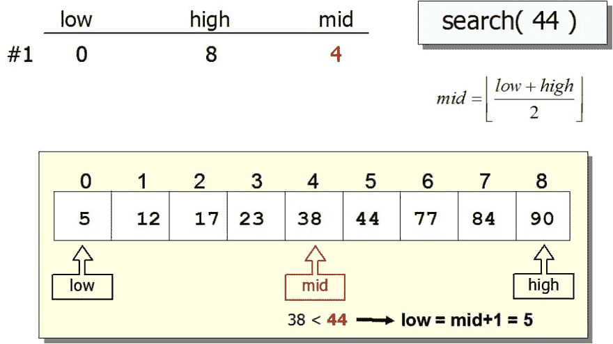
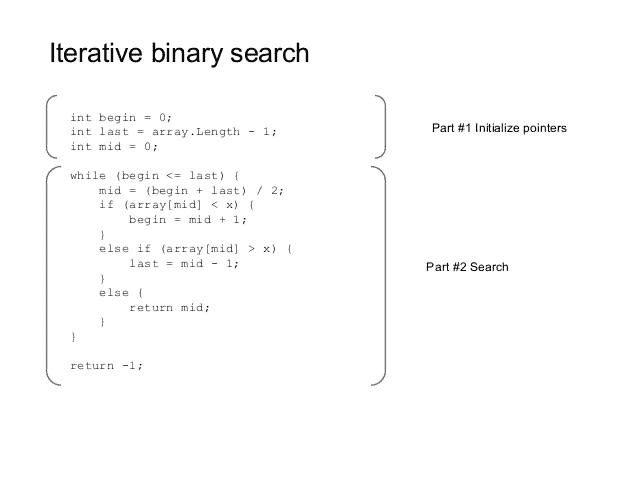

# 编码面试的迭代二分搜索法算法

> 原文：<https://dev.to/javinpaul/iterative-binary-search-algorithm-for-coding-interviews-1p20>

*披露:这篇文章包括附属链接；如果您从本文提供的不同链接购买产品或服务，我可能会收到报酬。*

[](https://www.java67.com/2019/07/top-10-online-courses-to-learn-data-structure-and-algorithms-in-java.html)

大家好！我在[我的博客](http://javarevisited.blogspot.com/)上发表了很多来自编码访谈的算法和数据结构文章，但这是这里的第一篇。在这篇文章中，我们将研究流行的面试的[基本算法。](http://www.java67.com/2018/06/data-structure-and-algorithm-interview-questions-programmers.html)

是的，你猜对了:我说的是**二分搜索法**算法，一种既不太容易也不太难的基本搜索算法。这个算法很容易用[递归](https://www.educative.io/collection/page/10370001/760001/1000001?affiliate_id=5073518643380224)实现，这就是为什么大多数面试官会强迫你实现一个没有递归的二分搜索法算法，也称为迭代二分搜索法，这就是你将在本教程中学到的。

在计算机科学中，二分搜索法或半区间搜索是一种**分治算法**，它定位一个项目在[排序数组](http://www.java67.com/2014/12/how-to-find-missing-number-in-sorted.html)中的位置。二进制搜索的工作原理是将输入值与数组的中间元素进行比较。

该比较确定元素是等于输入、小于输入还是大于输入。

当被比较的元素等于输入时，搜索停止，通常返回元素的位置。

如果元素不等于输入，则进行比较以确定输入是小于还是大于元素。

根据结果，[算法](https://javarevisited.blogspot.com/2018/11/top-5-data-structures-and-algorithm-online-courses.html#axzz5YFaOvjsh)再次开始，但是只搜索数组元素的顶部或底部子集。

如果输入不在[数组](https://javarevisited.blogspot.com/2015/06/3-ways-to-find-duplicate-elements-in-array-java.html)中，算法通常会输出一个唯一的值来指示这一点，比如-1，或者只是抛出一个 Java 中的 [RuntimeException](http://www.java67.com/2012/12/difference-between-runtimeexception-and-checked-exception.html) ，比如 NoValueFoundException。

二分搜索法算法通常在每次连续迭代中将检查的项目数量减半，从而在对数时间内定位给定项目(或确定其不存在)。

顺便说一句，如果你不熟悉基本的搜索和排序算法，那么你也可以加入一个类似于 [**数据结构和算法的课程:使用 Java**](https://click.linksynergy.com/fs-bin/click?id=JVFxdTr9V80&subid=0&offerid=323058.1&type=10&tmpid=14538&RD_PARM1=https%3A%2F%2Fwww.udemy.com%2Fdata-structures-and-algorithms-deep-dive-using-java%2F) 深入学习基本算法。

[](https://click.linksynergy.com/fs-bin/click?id=JVFxdTr9V80&subid=0&offerid=323058.1&type=10&tmpid=14538&RD_PARM1=https%3A%2F%2Fwww.udemy.com%2Fdata-structures-and-algorithms-deep-dive-using-java%2F)

如果 Java 不是你选择的语言，你可以在这个[算法课程列表](https://javarevisited.blogspot.com/2018/11/top-5-data-structures-and-algorithm-online-courses.html#axzz5YFaOvjsh)中找到更多关于 JavaScript 和 Python 的推荐。

顺便说一句，如果你更喜欢书，我建议你看一本像托马斯·h·科尔曼的**算法导论这样的综合性算法书。**

 **下面是一些示例代码，展示了 Java 中**迭代二分搜索法的逻辑:**

[](https://pluralsight.pxf.io/c/1193463/424552/7490?u=https%3A%2F%2Fwww.pluralsight.com%2Fcourses%2Fads-part1)

### Java 中的二分搜索法无递归

下面是一个用 Java 实现二分搜索法的示例程序。该算法是递归实现的。此外，关于 Java 中的二分搜索法实现，一个有趣的事实是著名的 [Effective Java](https://www.amazon.com/Effective-Java-3rd-Joshua-Bloch/dp/0134685997/?tag=javamysqlanta-20) 一书的作者 Joshua Bloch 在“java.util.Arrays”中写了二分搜索法。

```
import java.util.Arrays;
import java.util.Scanner;

/**
 * Java program to implement Binary Search. We have implemented Iterative
 * version of Binary Search Algorithm in Java
 *
 * @author Javin Paul
 */

public class IterativeBinarySearch {

  public static void main(String args[]) {
    int[] list = new int[] { 23, 43, 31, 12 };
    int number = 12;
    Arrays.sort(list);
    System.out.printf("Binary Search %d in integer array %s %n", number,
        Arrays.toString(list));

    binarySearch(list, 12);
    System.out.printf("Binary Search %d in integer array %s %n", 43,
        Arrays.toString(list));

    binarySearch(list, 43);
    list = new int[] { 123, 243, 331, 1298 };
    number = 331;
    Arrays.sort(list);
    System.out.printf("Binary Search %d in integer array %s %n", number,
        Arrays.toString(list));

    binarySearch(list, 331);
    System.out.printf("Binary Search %d in integer array %s %n", 331,
        Arrays.toString(list));
    binarySearch(list, 1333);

    // Using Core Java API and Collection framework
    // Precondition to the Arrays.binarySearch
    Arrays.sort(list);

    // Search an element
    int index = Arrays.binarySearch(list, 3);

  }

  /**
   * Perform a binary Search in Sorted Array in Java
   * 
   * @param input
   * @param number
   * @return location of element in array
   */

  public static void binarySearch(int[] input, int number) {
    int first = 0;
    int last = input.length - 1;
    int middle = (first + last) / 2;

    while (first <= last) {
      if (input[middle] < number) {
        first = middle + 1;
      } else if (input[middle] == number) {

        System.out.printf(number + " found at location %d %n", middle);
        break;
      } else {
        last = middle - 1;
      }

      middle = (first + last) / 2;

    }

    if (first > last) {
      System.out.println(number + " is not present in the list.\n");
    }

  }
}

**Output**
Binary Search 12 in integer array [12, 23, 31, 43]
12 found at location 0
Binary Search 43 in integer array [12, 23, 31, 43]
43 found at location 3
Binary Search 331 in integer array [123, 243, 331, 1298]
331 found at location 2
Binary Search 331 in integer array [123, 243, 331, 1298]
1333 is not present in the list. 
```

Enter fullscreen mode Exit fullscreen mode

这就是关于如何在 Java 中不使用递归实现二分搜索法的全部内容。除了线性搜索，这是你应该在计算机科学课上学到的两个基本搜索算法。

这些不仅从编码面试的角度来看很重要，而且对于理解其他基本的数据结构也很重要，比如[二叉查找树或者 BST](https://javarevisited.blogspot.com/2015/10/how-to-implement-binary-search-tree-in-java-example.html) 。

二叉查找树数据结构利用了这种算法，并将数据安排在一个层次结构中，这样您可以在 O(logN)时间内搜索任何节点。

不过，你必须记住，为了使用二分搜索法，你需要一个[排序列表](https://www.java67.com/2012/07/sort-list-ascending-descending-order-set-arraylist.html)或[排序数组](https://www.java67.com/2014/08/4-examples-to-sort-array-in-java.html)，所以当你考虑在现实世界中使用二分搜索法算法时，你也需要考虑排序的成本。

**进一步学习**
[数据结构和算法:深度学习使用 Java](https://click.linksynergy.com/fs-bin/click?id=JVFxdTr9V80&subid=0&offerid=323058.1&type=10&tmpid=14538&RD_PARM1=https%3A%2F%2Fwww.udemy.com%2Fdata-structures-and-algorithms-deep-dive-using-java%2F)
[算法和数据结构-第一部分和第二部分](https://pluralsight.pxf.io/c/1193463/424552/7490?u=https%3A%2F%2Fwww.pluralsight.com%2Fcourses%2Fads-part1)
[Java 中的数据结构 9 由亨氏 Kabutz](https://learning.javaspecialists.eu/courses/data-structures?affcode=92815_johrd7r8)
[10 本算法书籍进行面试](http://www.java67.com/2015/09/top-10-algorithm-books-every-programmer-read-learn.html)
[10 门数据结构和算法课程进行面试](https://hackernoon.com/10-data-structure-algorithms-and-programming-courses-to-crack-any-coding-interview-e1c50b30b927)
[5 门免费课程学习数据结构和算法](https://javarevisited.blogspot.com/2018/01/top-5-free-data-structure-and-algorithm-courses-java--c-programmers.html)
[Java 中的数据结构:安](https://www.educative.io/collection/5642554087309312/5724822843686912?affiliate_id=5073518643380224)

其他**数据结构和算法问题**来自编程工作面试

*   如何在 Java 中就地实现快速排序算法？([教程](http://javarevisited.blogspot.sg/2014/08/quicksort-sorting-algorithm-in-java-in-place-example.html))
*   如何用 Java 实现二叉查找树？([解](http://javarevisited.blogspot.sg/2015/10/how-to-implement-binary-search-tree-in-java-example.html)
*   如何实现无递归的快速排序算法？([教程](http://javarevisited.blogspot.sg/2016/09/iterative-quicksort-example-in-java-without-recursion.html))
*   如何用 Java 实现插入排序算法？([教程](http://javarevisited.blogspot.sg/2014/12/insertion-sort-algorithm-in-java-to-array-example.html))
*   如何用 Java 实现冒泡排序算法？([教程](http://www.java67.com/2012/12/bubble-sort-in-java-program-to-sort-integer-array-example.html))
*   基于比较的排序算法和基于非比较的排序算法有什么区别？([回答](http://javarevisited.blogspot.sg/2017/02/difference-between-comparison-quicksort-and-non-comparison-counting-sort-algorithms.html))
*   如何用 Java 实现桶排序？([教程](http://javarevisited.blogspot.sg/2017/01/bucket-sort-in-java-with-example.html))
*   如何用 Java 实现一个没有递归的二分搜索法算法？([教程](http://www.java67.com/2016/05/java-program-to-perform-binary-search-without-recursion.html))
*   50 多门面向程序员的数据结构和算法课程([题](https://dev.to/javinpaul/50-data-structure-and-algorithms-problems-from-coding-interviews-4lh2))

感谢阅读这篇文章。如果你喜欢这篇文章，请与你的朋友和同事分享。如果您有任何建议或反馈，请留言。

> 如果你真的想提高你的算法技能，我认为[数据结构和算法:使用 Java](https://click.linksynergy.com/fs-bin/click?id=JVFxdTr9V80&subid=0&offerid=323058.1&type=10&tmpid=14538&RD_PARM1=https%3A%2F%2Fwww.udemy.com%2Fdata-structures-and-algorithms-deep-dive-using-java%2F) 的深度学习是最好的开始。**