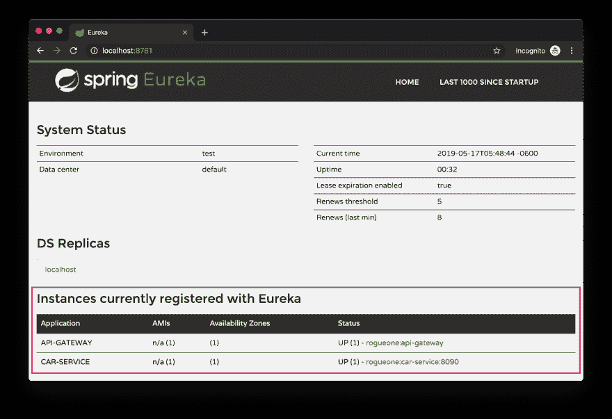
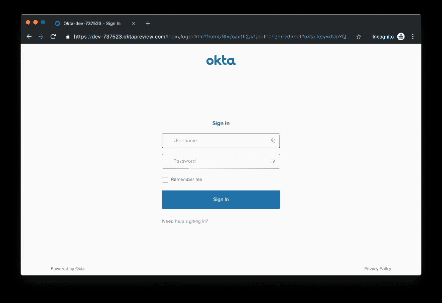
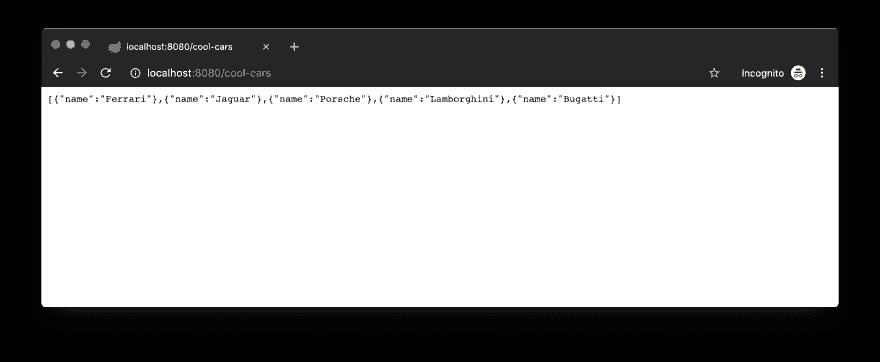
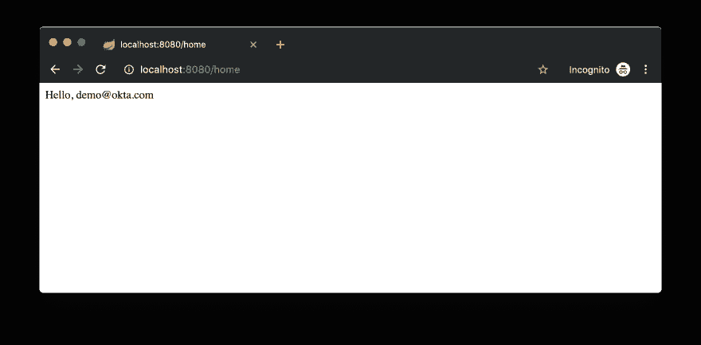

# 采用 Spring Boot 和 Spring Cloud 的 Java 微服务

> 原文：<https://dev.to/oktadev/java-microservices-with-spring-boot-and-spring-cloud-ijd>

在开发微服务架构时，Java 是一种很好的语言。事实上，我们行业中的一些大牌都在用它。你听说过网飞、亚马逊或谷歌吗？易贝、推特和领英呢？是的，处理难以置信的流量的主要公司正在用 Java 做这件事。

用 Java 实现微服务架构并不适合所有人。就此而言，通常不需要实施微服务。大多数公司这样做是为了扩展他们的人员，而不是他们的系统。如果你想扩大你的人员规模，雇佣 Java 开发人员是最好的方法之一。毕竟，精通 Java 的开发人员比大多数其他语言都多——尽管 JavaScript 似乎正在迅速赶上来！

Java 生态系统有一些开发微服务架构的成熟模式。如果你熟悉 Spring，你会觉得用 Spring Boot 和 Spring Cloud 开发就像在家里一样。因为这是最快的入门方式之一，所以我想我应该带你看一个快速教程。

## 用春云和 Spring Boot 打造 Java 微服务

在我的大部分教程中，我向你展示了如何从头开始构建一切。今天，我想采用一种不同的方法，通过一个预先构建的示例与您交流。希望，这将是一个有点短，更容易理解。

可以从克隆[@ oktadeveloper/Java-micro services-examples](https://github.com/oktadeveloper/java-microservices-examples)资源库开始。

```
git clone https://github.com/oktadeveloper/java-microservices-examples.git
cd java-microservices-examples/spring-boot+cloud 
```

在`spring-boot+cloud`目录中，有三个项目:

*   **发现服务**:网飞尤里卡服务器，用于服务发现。

*   **car-service** :一个简单的汽车服务，使用 Spring Data REST 来提供汽车的 REST API。

*   **api-gateway** :一个 api 网关，有一个`/cool-cars`端点，与`car-service`对话，过滤掉不酷的汽车(当然是在我看来)。

我使用 start.spring.io 的 REST API 和 T2 的 HTTPie 创建了所有这些应用程序。

```
http https://start.spring.io/starter.zip javaVersion==11 \
  artifactId==discovery-service name==eureka-service \
  dependencies==cloud-eureka-server baseDir==discovery-service | tar -xzvf -

http https://start.spring.io/starter.zip \
  artifactId==car-service name==car-service baseDir==car-service \
  dependencies==actuator,cloud-eureka,data-jpa,h2,data-rest,web,devtools,lombok | tar -xzvf -

http https://start.spring.io/starter.zip \
  artifactId==api-gateway name==api-gateway baseDir==api-gateway \
  dependencies==cloud-eureka,cloud-feign,data-rest,web,cloud-hystrix,lombok | tar -xzvf - 
```

### 用 Java 11+的 Spring 微服务

为了让`discovery-service`在 Java 11 上运行，我必须添加对 JAXB 的依赖。

```
<dependency>
    <groupId>org.glassfish.jaxb</groupId>
    <artifactId>jaxb-runtime</artifactId>
</dependency> 
```

其他两个应用程序在 Java 11 上开箱即用，运行良好，不需要改变依赖关系。

## Java 服务发现与网飞尤里卡

`discovery-service`的配置与大多数 Eureka 服务器相同。它作为其主类和属性上的一个`@EnableEurekaServer`注释，设置其端口并关闭发现。

```
server.port=8761
eureka.client.register-with-eureka=false 
```

`car-service`和`api-gateway`项目的配置方式类似。两者都定义了唯一的名称，并且`car-service`被配置为在端口`8090`上运行，因此它不会与`8080`冲突。

*汽车服务/src/main/resources/application . properties*T2】

```
server.port=8090
spring.application.name=car-service 
```

*API-gateway/src/main/resources/application . properties*

```
spring.application.name=api-gateway 
```

两个项目中的主类都用`@EnableDiscoveryClient`进行了注释。

## 用 Spring Data REST 搭建 Java 微服务

`car-service`提供了一个 REST API，允许您 CRUD(创建、读取、更新和删除)cars。当应用程序使用一个`ApplicationRunner` bean 加载时，它会创建一组默认的 cars。

*car-service/src/main/Java/com/example/car service/carserviceapplication . Java*

```
package com.example.carservice;

import lombok.Data;
import lombok.NoArgsConstructor;
import lombok.NonNull;
import org.springframework.boot.ApplicationRunner;
import org.springframework.boot.SpringApplication;
import org.springframework.boot.autoconfigure.SpringBootApplication;
import org.springframework.cloud.client.discovery.EnableDiscoveryClient;
import org.springframework.context.annotation.Bean;
import org.springframework.data.jpa.repository.JpaRepository;
import org.springframework.data.rest.core.annotation.RepositoryRestResource;

import javax.persistence.Entity;
import javax.persistence.GeneratedValue;
import javax.persistence.Id;
import java.util.stream.Stream;

@EnableDiscoveryClient
@SpringBootApplication
public class CarServiceApplication {

    public static void main(String[] args) {
        SpringApplication.run(CarServiceApplication.class, args);
    }

    @Bean
    ApplicationRunner init(CarRepository repository) {
        return args -> {
            Stream.of("Ferrari", "Jaguar", "Porsche", "Lamborghini", "Bugatti",
                    "AMC Gremlin", "Triumph Stag", "Ford Pinto", "Yugo GV").forEach(name -> {
                repository.save(new Car(name));
            });
            repository.findAll().forEach(System.out::println);
        };
    }
}

@Data
@NoArgsConstructor
@Entity
class Car {

    public Car(String name) {
        this.name = name;
    }

    @Id
    @GeneratedValue
    private Long id;

    @NonNull
    private String name;
}

@RepositoryRestResource
interface CarRepository extends JpaRepository<Car, Long> {
} 
```

### 一个 API 网关中的 Spring Cloud + Feign 和 Hystrix

[Feign](https://github.com/OpenFeign/feign) 让编写 Java HTTP 客户端更容易。Spring Cloud 使得用几行代码创建一个虚拟客户端成为可能。 [Hystrix](https://github.com/Netflix/Hystrix) 可以为你的虚拟客户端添加故障转移功能，让它们更有弹性。

`api-gateway`使用 Feign 和 Hystrix 与下游的`car-service`对话，如果不可用，则故障转移到一个`fallback()`方法。它还公开了一个`/cool-cars`端点，过滤掉您可能不想拥有的汽车。

*API-gateway/src/main/Java/com/example/API gateway/API gateway application . Java*

```
package com.example.apigateway;

import com.netflix.hystrix.contrib.javanica.annotation.HystrixCommand;
import lombok.Data;
import org.springframework.boot.SpringApplication;
import org.springframework.boot.autoconfigure.SpringBootApplication;
import org.springframework.cloud.client.circuitbreaker.EnableCircuitBreaker;
import org.springframework.cloud.client.discovery.EnableDiscoveryClient;
import org.springframework.cloud.netflix.zuul.EnableZuulProxy;
import org.springframework.cloud.openfeign.EnableFeignClients;
import org.springframework.cloud.openfeign.FeignClient;
import org.springframework.hateoas.Resources;
import org.springframework.web.bind.annotation.CrossOrigin;
import org.springframework.web.bind.annotation.GetMapping;
import org.springframework.web.bind.annotation.RestController;

import java.util.ArrayList;
import java.util.Collection;
import java.util.stream.Collectors;

@EnableFeignClients
@EnableCircuitBreaker
@EnableDiscoveryClient
@EnableZuulProxy
@SpringBootApplication
public class ApiGatewayApplication {

    public static void main(String[] args) {
        SpringApplication.run(ApiGatewayApplication.class, args);
    }
}

@Data
class Car {
    private String name;
}

@FeignClient("car-service")
interface CarClient {

    @GetMapping("/cars")
    @CrossOrigin
    Resources<Car> readCars();
}

@RestController
class CoolCarController {

    private final CarClient carClient;

    public CoolCarController(CarClient carClient) {
        this.carClient = carClient;
    }

    private Collection<Car> fallback() {
        return new ArrayList<>();
    }

    @GetMapping("/cool-cars")
    @CrossOrigin
    @HystrixCommand(fallbackMethod = "fallback")
    public Collection<Car> goodCars() {
        return carClient.readCars()
                .getContent()
                .stream()
                .filter(this::isCool)
                .collect(Collectors.toList());
    }

    private boolean isCool(Car car) {
        return !car.getName().equals("AMC Gremlin") &&
                !car.getName().equals("Triumph Stag") &&
                !car.getName().equals("Ford Pinto") &&
                !car.getName().equals("Yugo GV");
    }
} 
```

## 运行一个 Java 微服务架构

如果你在单独的终端窗口中用`./mvnw`运行所有这些服务，你可以导航到`http://localhost:8761`并看到它们已经在 Eureka 注册了。

[](https://res.cloudinary.com/practicaldev/image/fetch/s--21p6ttxH--/c_limit%2Cf_auto%2Cfl_progressive%2Cq_auto%2Cw_880/https://developer.okta.com/assets-jekyll/blog/java-microservices/eureka-server-d63b0113f94b54a7191de98b2989862f6b8bf1be9bbdb12124a6f59c279d432e.png)

如果你在浏览器中导航到`http://localhost:8080/cool-bars`，你将被重定向到 Okta。搞什么？

## 用 OAuth 2.0 和 OIDC 保护 Java 微服务

我已经使用 OAuth 2.0 和 OIDC 在这个微服务架构中配置了安全性。两者有什么区别？OIDC 是 OAuth 2.0 的扩展，它提供了身份。它还提供了发现功能，因此所有不同的 OAuth 2.0 端点都可以从一个 URL(称为`issuer`)中被发现。

我是如何为所有这些微服务配置安全性的？很高兴你问了！

我把 Okta 的 Spring Boot 首发加到了`api-gateway`和`car-service` :
中的`pom.xml`

```
<dependency>
    <groupId>com.okta.spring</groupId>
    <artifactId>okta-spring-boot-starter</artifactId>
    <version>1.2.0</version>
</dependency> 
```

然后我在 Okta 中创建了一个新的 OIDC 应用程序，配置了授权代码流。如果您想看到一切都在运行，您需要完成以下步骤。

### 在 Okta 中创建一个 Web 应用

登录你的 Okta 开发者账号(或者[注册](https://developer.okta.com/signup/)如果你没有账号的话)。

1.  从**应用**页面，选择**添加应用**。

2.  在创建新应用程序页面上，选择 **Web** 。

3.  给你的 app 起个好记的名字，添加`http://localhost:8080/login/oauth2/code/okta`作为登录重定向 URI，选择**刷新令牌**(除了**授权码**，点击**完成**。

将发行者(在 **API** > **授权服务器**下找到)、客户端 ID 和客户端秘密复制到两个项目的`application.properties`中。

```
okta.oauth2.issuer=$issuer
okta.oauth2.client-id=$clientId
okta.oauth2.client-secret=$clientSecret 
```

下一节中的 Java 代码已经存在，但是我想我应该解释一下，这样你就知道发生了什么。

### 为 OAuth 2.0 登录和资源服务器配置 Spring 安全

在`ApiGatewayApplication.java`中，我添加了 Spring 安全配置来启用 OAuth 2.0 登录，并启用网关作为资源服务器。

```
@Configuration
static class OktaOAuth2WebSecurityConfigurerAdapter extends WebSecurityConfigurerAdapter {

    @Override
    protected void configure(HttpSecurity http) throws Exception {
        // @formatter:off
        http
            .authorizeRequests().anyRequest().authenticated()
                .and()
            .oauth2Login()
                .and()
            .oauth2ResourceServer().jwt();
        // @formatter:on
    }
} 
```

本例中没有使用资源服务器配置，但我添加了它，以防您想要将移动应用程序或 SPA 连接到该网关。如果您使用的是 SPA，您还需要添加一个 bean 来配置 CORS。

```
@Bean
public FilterRegistrationBean<CorsFilter> simpleCorsFilter() {
    UrlBasedCorsConfigurationSource source = new UrlBasedCorsConfigurationSource();
    CorsConfiguration config = new CorsConfiguration();
    config.setAllowCredentials(true);
    config.setAllowedOrigins(Collections.singletonList("*"));
    config.setAllowedMethods(Collections.singletonList("*"));
    config.setAllowedHeaders(Collections.singletonList("*"));
    source.registerCorsConfiguration("/**", config);
    FilterRegistrationBean<CorsFilter> bean = new FilterRegistrationBean<>(new CorsFilter(source));
    bean.setOrder(Ordered.HIGHEST_PRECEDENCE);
    return bean;
} 
```

**注意**:如果你确实使用了像这样的 CORS 过滤器，我建议你把来源、方法和头修改得更具体些，以增加安全性。

`CarServiceApplication.java`只被配置为资源服务器，因为它不会被直接访问。

```
@Configuration
static class OktaOAuth2WebSecurityConfigurerAdapter extends WebSecurityConfigurerAdapter {

    @Override
    protected void configure(HttpSecurity http) throws Exception {
        // @formatter:off
        http
            .authorizeRequests().anyRequest().authenticated()
                .and()
            .oauth2ResourceServer().jwt();
        // @formatter:on
    }
} 
```

为了使 API 网关能够访问汽车服务，我在 API 网关项目中创建了一个`UserFeignClientInterceptor.java`。

*API-gateway/src/main/Java/com/example/API gateway/userfeignclientinterceptor . Java*

```
package com.example.apigateway;

import feign.RequestInterceptor;
import feign.RequestTemplate;
import org.springframework.security.core.Authentication;
import org.springframework.security.core.context.SecurityContextHolder;
import org.springframework.security.oauth2.client.OAuth2AuthorizedClient;
import org.springframework.security.oauth2.client.OAuth2AuthorizedClientService;
import org.springframework.security.oauth2.client.authentication.OAuth2AuthenticationToken;
import org.springframework.security.oauth2.core.OAuth2AccessToken;
import org.springframework.stereotype.Component;

@Component
public class UserFeignClientInterceptor implements RequestInterceptor {
    private static final String AUTHORIZATION_HEADER = "Authorization";
    private static final String BEARER_TOKEN_TYPE = "Bearer";
    private final OAuth2AuthorizedClientService clientService;

    public UserFeignClientInterceptor(OAuth2AuthorizedClientService clientService) {
        this.clientService = clientService;
    }

    @Override
    public void apply(RequestTemplate template) {
        Authentication authentication = SecurityContextHolder.getContext().getAuthentication();
        OAuth2AuthenticationToken oauthToken = (OAuth2AuthenticationToken) authentication;
        OAuth2AuthorizedClient client = clientService.loadAuthorizedClient(
                oauthToken.getAuthorizedClientRegistrationId(),
                oauthToken.getName());

        OAuth2AccessToken accessToken = client.getAccessToken();
        template.header(AUTHORIZATION_HEADER, String.format("%s %s", BEARER_TOKEN_TYPE, accessToken.getTokenValue()));
    }
} 
```

我在`ApiGatewayApplication.java` :
中将其配置为`RequestInterceptor`

```
@Bean
public RequestInterceptor getUserFeignClientInterceptor(OAuth2AuthorizedClientService clientService) {
    return new UserFeignClientInterceptor(clientService);
} 
```

并且，我在`api-gateway/src/main/resources/application.properties`中添加了两个属性，因此 Feign 是 Spring 安全感知的。

```
feign.hystrix.enabled=true
hystrix.shareSecurityContext=true 
```

## 查看启用安全的 Java 微服务运行

使用`./mvnw`在单独的终端窗口中运行所有的应用程序，或者在您的 IDE 中运行，如果您愿意的话。

**提示**:为了简化在 IDE 中的运行，在根目录中有一个聚合器`pom.xml`。如果你已经安装了 [IntelliJ IDEA 的命令行启动器](https://emmanuelbernard.com/blog/2017/02/27/start-intellij-idea-command-line/)，你只需要运行`idea pom.xml`。

导航到`http://localhost:8080/cool-cars`，你将被重定向到 Okta 进行登录。

[](https://res.cloudinary.com/practicaldev/image/fetch/s--CMF5Ov1E--/c_limit%2Cf_auto%2Cfl_progressive%2Cq_auto%2Cw_880/https://developer.okta.com/assets-jekyll/blog/java-microservices/okta-login-843a59bf22b807807090cf5b897a75b7a58cf56e8c03f7247a8f52358f6db447.png)

输入你的 Okta 开发者账户的用户名和密码，你会看到一个酷车列表。

[](https://res.cloudinary.com/practicaldev/image/fetch/s--TGgujzOF--/c_limit%2Cf_auto%2Cfl_progressive%2Cq_auto%2Cw_880/https://developer.okta.com/assets-jekyll/blog/java-microservices/cool-cars-9bfa3deaddca250e8de5b0f022b4ab00968c1204f71e3e1671095466f0e06af8.png)

如果您已经做到了这一步，并且运行了示例应用程序，那么恭喜您！你超级酷！😎

## 使用网飞祖尔和春云来代理航线

微服务架构中另一个你可能喜欢的便利特性是[网飞·祖尔](https://github.com/Netflix/zuul)。Zuul 是一种网关服务，提供动态路由、监控、弹性等功能。

为了添加 Zuul，我将其作为依赖项添加到`api-gateway/pom.xml` :

```
<dependency>
    <groupId>org.springframework.cloud</groupId>
    <artifactId>spring-cloud-starter-netflix-zuul</artifactId>
</dependency> 
```

然后我把`@EnableZuulProxy`加到了`ApiGatewayApplication`类中。

```
import org.springframework.cloud.netflix.zuul.EnableZuulProxy;

@EnableZuulProxy
@SpringBootApplication
public class ApiGatewayApplication {
    ...
} 
```

为了将访问令牌传递给代理路由，我创建了一个扩展了`ZuulFilter`的`AuthorizationHeaderFilter`类。

```
package com.example.apigateway;

import com.netflix.zuul.ZuulFilter;
import com.netflix.zuul.context.RequestContext;
import org.springframework.core.Ordered;
import org.springframework.security.core.Authentication;
import org.springframework.security.core.context.SecurityContextHolder;
import org.springframework.security.oauth2.client.OAuth2AuthorizedClient;
import org.springframework.security.oauth2.client.OAuth2AuthorizedClientService;
import org.springframework.security.oauth2.client.authentication.OAuth2AuthenticationToken;
import org.springframework.security.oauth2.core.OAuth2AccessToken;
import org.springframework.security.oauth2.core.oidc.OidcUserInfo;

import java.util.Optional;

import static org.springframework.cloud.netflix.zuul.filters.support.FilterConstants.PRE_TYPE;

public class AuthorizationHeaderFilter extends ZuulFilter {

    private final OAuth2AuthorizedClientService clientService;

    public AuthorizationHeaderFilter(OAuth2AuthorizedClientService clientService) {
        this.clientService = clientService;
    }

    @Override
    public String filterType() {
        return PRE_TYPE;
    }

    @Override
    public int filterOrder() {
        return Ordered.LOWEST_PRECEDENCE;
    }

    @Override
    public boolean shouldFilter() {
        return true;
    }

    @Override
    public Object run() {
        RequestContext ctx = RequestContext.getCurrentContext();
        Optional<String> authorizationHeader = getAuthorizationHeader();
        authorizationHeader.ifPresent(s -> ctx.addZuulRequestHeader("Authorization", s));
        return null;
    }

    private Optional<String> getAuthorizationHeader() {
        Authentication authentication = SecurityContextHolder.getContext().getAuthentication();
        OAuth2AuthenticationToken oauthToken = (OAuth2AuthenticationToken) authentication;
        OAuth2AuthorizedClient client = clientService.loadAuthorizedClient(
                oauthToken.getAuthorizedClientRegistrationId(),
                oauthToken.getName());

        OAuth2AccessToken accessToken = client.getAccessToken();

        if (accessToken == null) {
            return Optional.empty();
        } else {
            String tokenType = accessToken.getTokenType().getValue();
            String authorizationHeaderValue = String.format("%s %s", tokenType, accessToken.getTokenValue());
            return Optional.of(authorizationHeaderValue);
        }
    }
} 
```

**注意**:你可能会注意到`getAuthorizationHeader()`方法中的代码与`UserFeignClientInterceptor`中的代码非常相似。因为只有几行代码，所以我选择不将它们移到实用程序类中。Feign 拦截器用于`@FeignClient`，而 Zuul 过滤器用于 Zuul 代理的请求。

为了让 Spring Boot 和祖尔知道这个过滤器，我在主应用程序类中将它注册为一个 bean。

```
public AuthorizationHeaderFilter authHeaderFilter(OAuth2AuthorizedClientService clientService) {
    return new AuthorizationHeaderFilter(clientService);
} 
```

为了代理从 API 网关到汽车服务的请求，我向`api-gateway/src/main/resources/application.properties`添加了路由。

```
zuul.routes.car-service.path=/cars
zuul.routes.car-service.url=http://localhost:8090

zuul.routes.home.path=/home
zuul.routes.home.url=http://localhost:8090

zuul.sensitive-headers=Cookie,Set-Cookie 
```

我在`/home`路线的`car-service`项目中添加了一个`HomeController`。

```
package com.example.carservice;

import org.slf4j.Logger;
import org.slf4j.LoggerFactory;
import org.springframework.security.oauth2.server.resource.authentication.JwtAuthenticationToken;
import org.springframework.web.bind.annotation.GetMapping;
import org.springframework.web.bind.annotation.RestController;

import java.security.Principal;

@RestController
public class HomeController {

    private final static Logger log = LoggerFactory.getLogger(HomeController.class);

    @GetMapping("/home")
    public String howdy(Principal principal) {
        String username = principal.getName();
        JwtAuthenticationToken token = (JwtAuthenticationToken) principal;
        log.info("claims: " + token.getTokenAttributes());
        return "Hello, " + username;
    }
} 
```

### 确认您的 Zuul 路线工作

由于这些更改已经存在于您克隆的项目中，您应该能够在浏览器中查看`https://localhost:8080/cars`和`http://localhost:8080/home`。

[](https://res.cloudinary.com/practicaldev/image/fetch/s--XELXir9X--/c_limit%2Cf_auto%2Cfl_progressive%2Cq_auto%2Cw_880/https://developer.okta.com/assets-jekyll/blog/java-microservices/zuul-home-3f3e8ce8ceb1789cddb5d4386cca1de64f080e4f3220370d98790cf1bb0c041b.png)

## 春云配置怎么样？

在本例中，您可能已经注意到，您必须在每个应用程序中配置 OIDC 属性。如果您有 500 个微服务，这可能是一个真正的难题。是的，你可以把它们定义为环境变量，这就解决了问题。然而，如果您有使用不同 OIDC 客户端 id 的不同微服务堆栈，这种方法将会很困难。

[Spring Cloud Config](https://spring.io/projects/spring-cloud-config) 是一个为分布式系统提供外部化配置的项目。我将在以后的教程中介绍它，而不是把它添加到这个例子中。

## 科特林呢？

我用 Java 写了这篇文章，因为它是 Java 生态系统中最流行的语言。然而，根据 RedMonk 从 2019 年 1 月开始的编程语言排名， [Kotlin 正在上升](https://redmonk.com/sogrady/2019/03/20/language-rankings-1-19/)。

> 至少在本季度，Kotlin 实现了大幅增长，而其他三家基于 JVM 的同行都出现了下滑。事实上，Kotlin 的进步如此之大，以至于它最终进入了前 20 名，排在第 20 位，同时还超越了 Clojure (#24)和 Groovy (#24)。它仍然远远落后于 Scala(第 13 位)，但 Kotlin 的增长在这些排名的历史上仅次于 Swift，因此看看接下来的一两次运行会是有趣的。

Spring 对 Kotlin 有极好的支持，你可以在 start.spring.io 上选择它作为一种语言。如果你想看到我们使用 Kotlin 写更多的帖子，请在评论中告诉我们！

## 刷新令牌的已知问题

默认情况下，Okta 的访问令牌会在一小时后过期。这是意料之中的，在使用 OAuth 2.0 时，建议使用短期访问令牌。刷新令牌的寿命通常要长得多，比如几天或几个月，并且可用于获取新的访问令牌。当使用 Okta 的 Spring Boot 启动器时，这应该会自动发生，但它没有。

我配置了我的 Okta org，使其访问令牌在五分钟后过期。您可以转到 **API** > **授权服务器** > **访问策略**，点击**默认策略**，并编辑其规则。然后将访问令牌生命周期从 1 小时更改为 5 分钟。

在你的浏览器中点击`http://localhost:8080/cool-cars`，你将被重定向到 Okta 进行登录。登录，你应该会看到一个 JSON 字符串的汽车。

去做别的事情超过 5 分钟。

回来，刷新你的浏览器，你会看到`[]`而不是所有的车。

**更新** : Spring Security 5.1 还没有自动刷新 OAuth 访问令牌。应该会在 Spring Security 5.2 中提供。

## Spring Boot、春云、微服务带给您更多乐趣

我希望你喜欢这篇关于如何用 Spring Boot 和 Spring Cloud 构建 Java 微服务架构的文章。您学习了如何用最少的代码构建一切，然后用 Spring Security、OAuth 2.0 和 Okta 对其进行安全配置。

你可以在 GitHub 上找到本教程[中显示的所有代码。](https://github.com/oktadeveloper/java-microservices-examples)

在这个博客上，我们是 Spring Boot、春天云和微服务的忠实粉丝。这里有几个你可能会感兴趣的帖子:

*   [Angular 8 + Spring Boot 2.2:今天就建立一个 CRUD 应用程序！](https://developer.okta.com/blog/2019/05/13/angular-8-spring-boot-2)

*   [Spring Boot 登录选项快速指南](https://developer.okta.com/blog/2019/05/15/spring-boot-login-options)

*   [与 Spring Boot 和 Kubernetes 一起构建微服务架构](https://developer.okta.com/blog/2019/04/01/spring-boot-microservices-with-kubernetes)

*   [使用 HTTPS 和 OAuth 2.0 保护服务对服务的 Spring 微服务](https://developer.okta.com/blog/2019/03/07/spring-microservices-https-oauth2)

*   [构建 Spring 微服务并将其用于生产](https://developer.okta.com/blog/2019/02/28/spring-microservices-docker)

请在 Twitter @oktadev 上关注我们[并订阅](https://twitter.com/oktadev)[我们的 YouTube 频道](https://www.youtube.com/c/oktadev)了解更多 Spring Boot 和微服务知识。