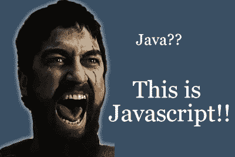

# Java 和 JavaScript 是否相同？

> 原文：<https://dev.to/campusmvp/java-y-javascript-son-lo-mismo-do6>

这个问题对许多人来说也许很明显，但还是有很多人不清楚-我...。

因为他们名字开头共用一个词，所以很多人认为 [Java](https://www.campusmvp.es/catalogo/Product-Desarrollo-de-aplicaciones-con-la-plataforma-Java_231.aspx) 和 [JavaScript](https://www.campusmvp.es/catalogo/Product-Programaci%C3%B3n-avanzada-con-JavaScript-y-ECMAScript_206.aspx) 是相关的，或者 JavaScript 是 Java 的子集等等-我...。离现实只有一步之遥。

Java 于 1991 年出生于 Sun Microsystems 公司，由 [James Gosling](https://en.wikipedia.org/wiki/James_Gosling) 所拥有。最初的目标是为电视接收器和嵌入式设备开发应用程序，但最终几乎在所有地方都能使用。本来打算叫*，后来叫*，但最后选择的名字是大家都知道的。Wikipedia 有非常有趣的信息[关于它的历史和名字](https://es.wikipedia.org/wiki/Java_(lenguaje_de_programaci%C3%B3n))，我推荐你阅读。**

 **JavaScript 是一种后期编程语言，于 1990 年代中期由 Netscape 公司的[Brendan zone](https://en.wikipedia.org/wiki/Brendan_Eich)创建。其目的是为使用当时市场领先的 Internet 浏览器 Netscape Navigator 查看的网页提供交互性。他们在语言开发过程中的代码名称是 *Mocha* ，他们计划最终将其发布为*【live script】*，尽管最终由于 Java 语言对其语法影响很大而被称为 JavaScript，但相似之处只是美学上的。目前，JavaScript 除了几乎是新增互动至网页的唯一语言之外，还与浏览器之外的许多应用程式整合:伺服器、特殊用途程式设计语言(例如 Node.js)或作业系统(例如 Windows)。

诚然，Netscape 的人试图利用 Java 当时提供的营销杠杆，而在新语言名称中使用“Java”一词，意在给它一个严肃的光环。我想，由于他们造成的混乱，他们很快就后悔了他们的决定，并且没有给他留下 LiveScript 的名字。

除了名称中的这个共同根外，Java 和 JavaScript 是完全不同的语言。以下是他们许多不同之处的一些重要例子:

*   JavaScript 是一种解释语言，Java 是编译的。基本上，JavaScript 程序是计算机和个人都可以读取的文本文件，而 Java 程序则编译为一个特殊的优化文件，供计算机读取和运行。我们可以详细介绍 Java 是用一种叫做[【字节码】](https://en.wikipedia.org/wiki/Bytecode) 的中间语言编译的，这种语言是通过运行 JIT 来解释的，它便于跨平台运行，但不是本文的主题，我想故意保持简单。
*   Java 调试分为两个阶段，JavaScript 调试分为一个阶段。与所有解释的语言一样，在 JavaScript 中，您只知道在运行程序时是否无意中犯了语法错误(除非您使用特殊工具，如 Visual Studio 或 webstorm，它们在后台解释代码)。但是，在 Java 中，编译阶段会先执行，编译器会在编译阶段指出可能存在的语法错误。然后，执行时可能会出现逻辑错误或其他错误。在 JavaScript 中，会同时清除所有这些文件，使其更为复杂。
*   Java 是纯面向对象的语言，但 JavaScript 是基于原型的。JavaScript 实际上必须模拟大多数语言中提供的许多对象定向特性。作为回报，它提供了各种编程范例(功能性、强制性、动态和面向对象)，使其成为一种高度通用的语言。事实上，在 JavaScript 中，您可以随时更改类继承的“基础”，这会影响所有类，而大多数面向对象的语言都无法做到这一点。
*   Java 类型强烈，JavaScript 类型弱。在 Java 中，所有变量都具有特定类型，一旦定义，就不能更改。在 JavaScript 中，同一变量可以包含文本、数字、日期或对象等-我...。这是一把双刃剑，因为如果我们不小心，它允许很大的灵活性来交换许多潜在的错误。
*   Java 有块范围，JavaScript 有函数:变量的访问取决于定义变量的位置。JavaScript 有一些规则可以相当分散其他语言程序员的注意力。
*   JavaScript 有关闭，Java 刚刚嵌入了它们。JavaScript(和其它语言)编程中最重要的概念之一是闭包。Java 直到最近才出现版本 8，它还添加了“lambda 函数”，以支持“[功能编程”的范式。](https://es.wikipedia.org/wiki/Programaci%C3%B3n_funcional)
*   JavaScript 中的函数始终是多参数的。必须在 Java 中指定。
*   JavaScript 是标准的，Java 不是。JavaScript 语言的控制由非营利组织*欧洲计算机制造商协会* (ECMA)进行。事实上，它的正式名称是 ECMAScript，[是标准化的](https://www.ecma-international.org/publications/standards/Ecma-262.htm)。相反，Java 的控制权掌握在 Oracle 手中，Oracle 是一家私营公司，它自行决定如何处理 Java。

简而言之，为了清楚地说明没有技术用语的区别，我下面驳斥一些虚假的神话:

1.  JavaScript 与 Java 不同。
2.  JavaScript 不是 Java 的子集。
3.  JavaScript 不是用于编程网页的 Java 版本。
4.  JavaScript 与 Java 几乎不共享任何内容。如果我与其他语言(如 c、C++或 C#)共用相同的语法，并有一些更详细的内容，如一些类别名称(例如， *Math* 或 *Date* ，但仅此而已。
5.  JavaScript 并不比 Java 容易。事实上，在某些具体领域更难掌握。
6.  如果你会用 Java 编程，你就不会用 JavaScript 编程。反之亦然。
7.  JavaScript 不仅是网页的语言，Java 也不是服务器专用的语言。

我希望这将有助于一劳永逸地澄清这一点:-

> Post 原件:https://www . campus MVP . es/resources/post/compare-values-and-references-in-various language-de-programming . aspx**