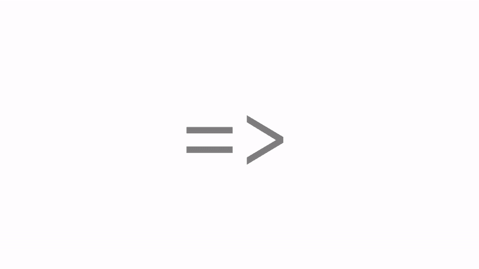

# 通过下一张幻灯片解释 JavaScript 的箭头功能

> 原文：<https://dev.to/kbk0125/javascript-s-arrow-functions-explained-by-going-down-a-slide-1ebm>

如果您使用 JavaScript 已经有几年了，您可能对这个语法很熟悉:

```
function addTen(num){
  return num + 10;
});

console.log(addTen(10));
//20 
```

这种函数语法在 ES5 或 ECMAScript 5 中很流行。

这种语法有一个主要的优点:它包括单词 function，所以很明显您正在编写一个函数！

一个函数显然可以接受从 0 到多个参数，并且每次被调用时都运行一组特定的语句。

但是 2015 年，随着 ES6 的出现，JavaScript 的世界有了一个飞跃。

现在，与上面相同的函数可以写成这样:

```
let addTen = (num) => num + 10;

console.log(addTen(10));
//20 
```

现在，没有*函数*关键字，也没有 return 语句！ES6 中的功能更加**简洁**，或者说简洁。

所以，既然那些明显的线索已经被删除了，你可能在理解箭头函数的不同部分时会有一点困难。

幸运的是，正如您将很快在一些动画中看到的，一旦您学会以一种新的方式可视化箭头“= >”，箭头函数就很容易理解了。

这就是箭头函数就像水滑道一样。为了充分理解本教程，了解一下[地图功能](https://blog.codeanalogies.com/2018/02/20/javascript-map-method-explained-by-going-on-a-hike/)和[范围](https://blog.codeanalogies.com/2017/11/22/how-javascript-variable-scoping-is-just-like-multiple-levels-of-government/)可能会有所帮助。

### 箭头功能可视化

让我们更深入地研究一下 addTen 函数。

```
let addTen = (num) => num + 10;

console.log(addTen(10));
//20 
```

该函数将转换一个参数并输出该参数加上 10。

转换发生在那个微妙的“= >”箭头上。

也可以写一个返回语句:

```
let addTen = (num) => {return num + 10};

console.log(addTen(10));
//20 
```

我喜欢在脑海中把箭头转换成管状幻灯片来展示实际发生的事情。我的意思是:

[](https://res.cloudinary.com/practicaldev/image/fetch/s--WV3ph2x3--/c_limit%2Cf_auto%2Cfl_progressive%2Cq_66%2Cw_880/https://i1.wp.com/blog.codeanalogies.com/wp-content/uploads/2019/04/arrowGif1.gif)

等号就像滑管，箭头就像着陆垫。

箭头函数遵循以下模式:

(参数)= > {语句}

让我们以 addTen 函数为例，将它们添加到图表中。

[](https://res.cloudinary.com/practicaldev/image/fetch/s--CpPojCb6--/c_limit%2Cf_auto%2Cfl_progressive%2Cq_66%2Cw_880/https://i2.wp.com/blog.codeanalogies.com/wp-content/uploads/2019/04/arrowgif2.gif%3Ffit%3D730%252C411%26ssl%3D1)

我们需要展示的最后一件事是参数，在本例中是 10，是如何在幻灯片中出现并在函数语句中可用的。这是它的样子。

[](https://res.cloudinary.com/practicaldev/image/fetch/s--ZpnAAiMx--/c_limit%2Cf_auto%2Cfl_progressive%2Cq_66%2Cw_880/https://i2.wp.com/blog.codeanalogies.com/wp-content/uploads/2019/04/arrowgif3.gif)

仅此而已！非常简单。

现在，让我们看一个例子，其中有两个不同的参数。这是我们的新功能:

```
let multiply = (num1, num2) => {return num1 * num2};

console.log(multiply(2, 10));
//20 
```

在这种情况下，我们只是将两个参数相乘。两人将一起滑下滑梯。像这样:

[](https://res.cloudinary.com/practicaldev/image/fetch/s--ugeYXhQY--/c_limit%2Cf_auto%2Cfl_progressive%2Cq_66%2Cw_880/https://i1.wp.com/blog.codeanalogies.com/wp-content/uploads/2019/04/arrowgif4.gif%3Ffit%3D730%252C411%26ssl%3D1)

还有一个例子您应该知道——将 map()方法与箭头函数结合起来。

map()方法将把数组中的每个元素按顺序发送到 arrow 函数中。

让我们来看一个例子——假设你有一个数字数组，你想得到每个数字的平方根。

这是代码。

```
let nums = [1, 4, 9];

let squares = nums.map((num) => {
  return Math.sqrt(num);
});

console.log (squares)
// [1, 2, 3] 
```

你需要了解一点地图方法来理解这个。但是，您可能会再次注意到简洁的语法 map()方法比编写 for()循环要短得多。

下面是这段代码中发生的情况:

[](https://res.cloudinary.com/practicaldev/image/fetch/s--CgqLQbsD--/c_limit%2Cf_auto%2Cfl_progressive%2Cq_66%2Cw_880/https://i2.wp.com/blog.codeanalogies.com/wp-content/uploads/2019/04/arrowgif5.gif)

1.  在 *nums* 数组中有三个元素，所以 *num* 参数在幻灯片中向下移动 3 次。
2.  Math.sqrt()方法每次都取数字的平方根。
3.  每次结果都存储在*方块*数组中。

### 箭头功能与传统功能的区别

你可能想知道…这仅仅是语法上的不同吗？

实际上，传统的 ES5 函数和 ES6 函数有一个重要的不同之处。

最大的变化是箭头函数没有自己的作用域。所以，如果你尝试使用*这个*关键字，你会惊讶于它并没有引用 arrow 函数的作用域。

回到我们的幻灯片类比，这意味着*这个*在幻灯片的顶部和底部是相同的。如果我们使用 ES5 函数，那么*这个*在幻灯片的顶部和底部会有所不同。

要在代码中快速识别这一点，只需查找*函数*关键字。如果您看到它，这意味着正在创建一个新的作用域。如果不是，假设您正在使用封闭函数的作用域。

### 对更多可视化教程感兴趣？

如果你想阅读更多关于 HTML、CSS 和 JavaScript 的可视化教程，请查看[主要代码类比网站](http://codeanalogies.com)的 50 多个教程。