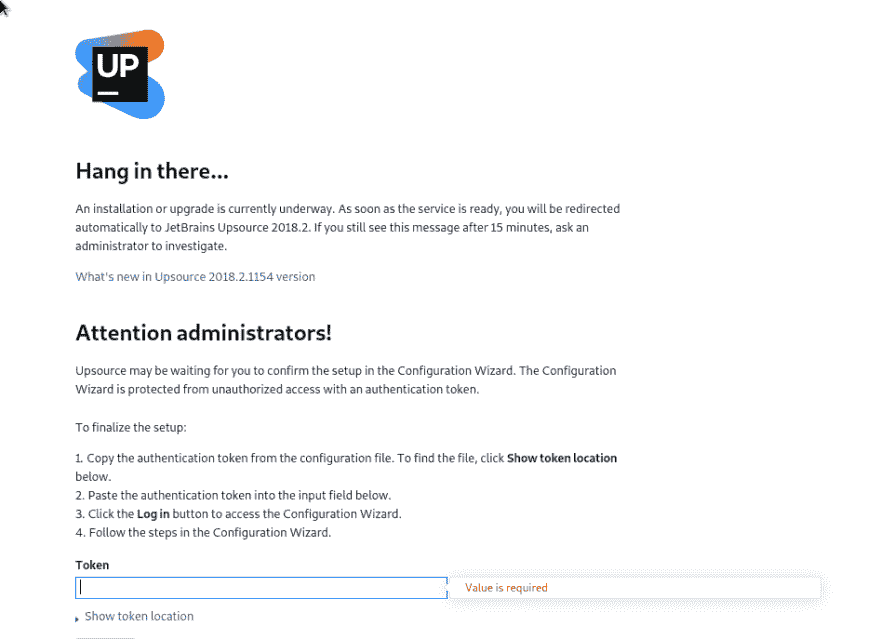
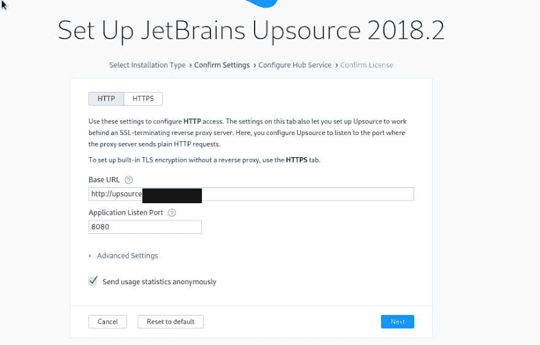
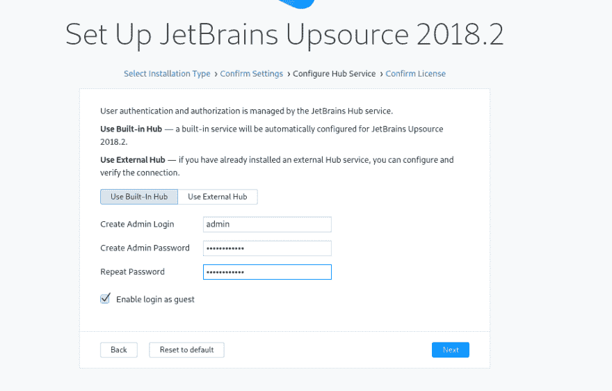
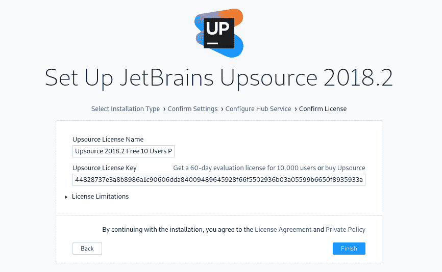
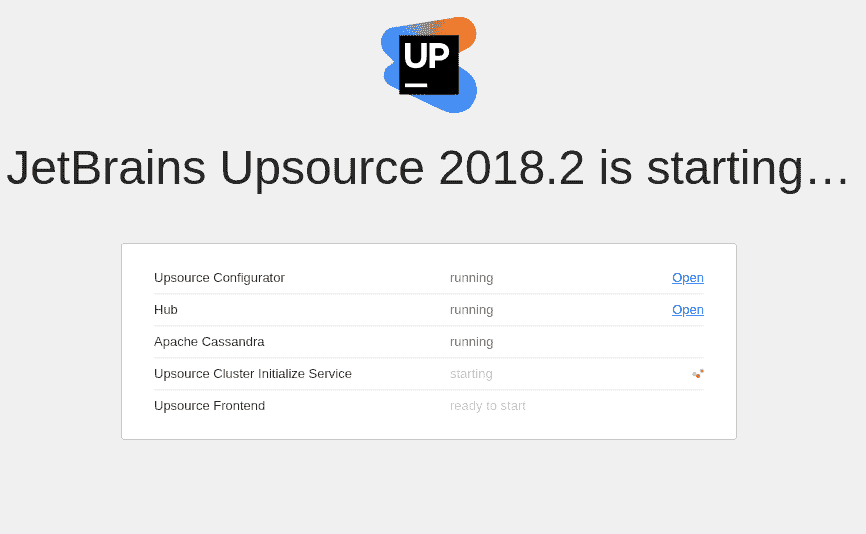
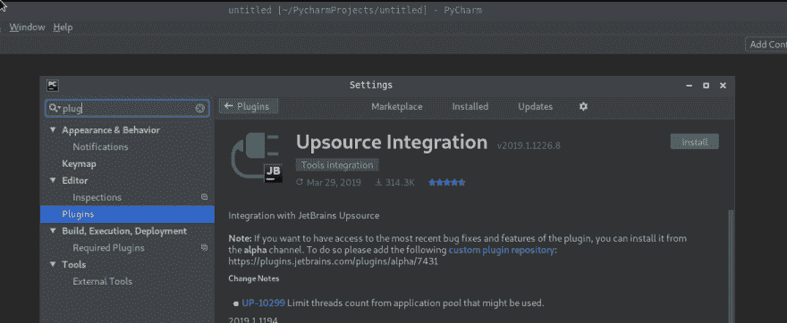
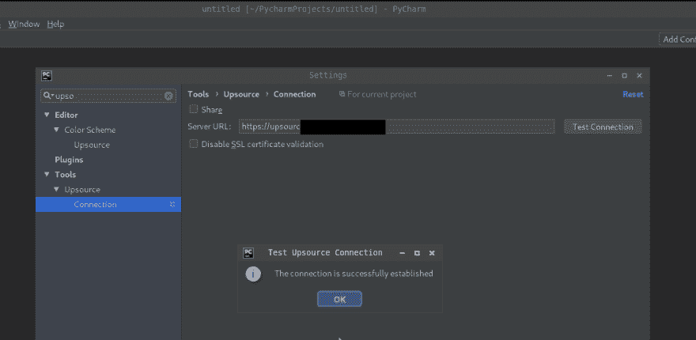

# JetBrains Upsource:在具有 NGINX 和 SSL 以及 PyCharm 集成的 Linux 上进行安装和配置

> 原文：<https://dev.to/setevoy/jetbrains-upsource-installation-configuration-on-linux-with-nginx-and-ssl-and-pycharm-integration-1jc6>

[ ](https://res.cloudinary.com/practicaldev/image/fetch/s--rjqvQu1O--/c_limit%2Cf_auto%2Cfl_progressive%2Cq_auto%2Cw_880/https://rtfm.co.ua/wp-content/uploads/2019/04/upsource-logo.png) Upsource 是 JetBrains 的一项自托管服务，用于开发团队的代码审查，可以与 JetBrains 的任何 IDE 集成。

是一个基于 Java 的应用程序，使用 Apache Cassandra 作为存储数据和索引的后端。

最低要求—主机上 8 GiB 内存—一点也不奇怪。

最多 10 个用户免费使用。

在这篇文章中——一个来自 PyCharm 的 AWS EC2 实例和连接的安装和配置示例。

在 Upsource 的后面将会有 NGINX 和来自 Let's Encrypt 的 SSL。

NGINX 和 Let's Encrypt 客户端已经安装好了——查看 [TestRail: QA 测试用例管理在 Linux 上的安装](https://dev.to/setevoy/testrail-qa-test-case-management-installation-on-linux-5caa)帖子了解详情。

这里的文献资料是[>>>](https://www.jetbrains.com/upsource/documentation/)。

### 安装电源

创建新用户:

```
root@bttrm-testrail:/home/admin# useradd -r upsource 
```

创建工作目录:

```
root@bttrm-testrail:/var/www# mkdir upsource.example.com 
```

从[下载页面](https://www.jetbrains.com/upsource/download/download-thanks.html?platform=zip)下载一个档案，解压:

```
root@bttrm-testrail:/var/www# wget https://download.jetbrains.com/upsource/upsource-2018.2.1154.zip
root@bttrm-testrail:/var/www# unzip upsource-2018.2.1154.zip 
```

将内容移动到工作目录:

```
root@bttrm-testrail:/var/www# mv upsource-2018.2.1154/\* upsource.example.com/
root@bttrm-testrail:/var/www# cd upsource.example.com/ 
```

位于`bin/`目录的启动脚本:

```
root@bttrm-testrail:/var/www/upsource.example.com# ll bin/
total 8
-rw-r--r-- 1 root root 3458 Dec 31 16:06 upsource.bat
-rwxr-xr-x 1 root root 2981 Dec 31 16:06 upsource.sh 
```

安装 Java:

```
root@bttrm-testrail:/var/www/upsource.example.com# apt install default-jdk
root@bttrm-testrail:/var/www/upsource.example.com# java -version
openjdk version "1.8.0\_212" 
```

启动资源。

使用`run`命令进行测试调试，使用`start`命令在后台运行应用程序。其他命令可以通过`help` :
找到

```
root@bttrm-testrail:/var/www/upsource.example.com# ./bin/upsource.sh help
Usage:

/bin/sh /var/www/upsource.example.com/bin/upsource.sh <command>

<command> can be one of the following:

configure

configures Upsource, call "help configure" for details

start

starts Upsource in background, call "help start" for details

... 
```

现在–使用`run` :
运行

```
root@bttrm-testrail:/var/www/upsource.example.com# ./bin/upsource.sh run
Starting Upsource...
* Configuring JetBrains Upsource 2018.2
command [hostname]: hostname: Name or service not known
* Made default base-url 'http://127.0.0.1:8080/' from hostname '127.0.0.1' and listen port '8080'
* JetBrains Upsource 2018.2 runtime environment is successfully configured
* Loading logging configuration from /var/www/upsource.example.com/lib/ext/log4j.xml
* Redirecting JetBrains Upsource 2018.2 logging to /var/www/upsource.example.com/logs/internal/services/bundleProcess
* Configuring Service-Container[bundleProcess]
* Configuring Bundle Backend Service
* Configuring Configuration Wizard
command [hostname]: hostname: Name or service not known
* Starting Service-Container[bundleProcess]
* Starting Bundle Backend Service
* Starting Configuration Wizard
* JetBrains Upsource 2018.2 Configuration Wizard will be available on [http://127.0.0.1:8080?wizard_token=pikhg8iuYJ7OdssGkXbF] after start 
```

看起来可行–转到 SSL。

### 让我们加密

通过独立验证器获取新证书，因为新虚拟主机还没有 NGINX 配置:

```
root@bttrm-testrail:/var/www/upsource.example.com# systemctl stop nginx
root@bttrm-testrail:/var/www/upsource.example.com# /opt/letsencrypt/letsencrypt-auto certonly -d upsource.example.com
Saving debug log to /var/log/letsencrypt/letsencrypt.log
How would you like to authenticate with the ACME CA?
- - - - - - - - - - - - - - - - - - - - - - - - - - - - - - - - - - - - - - - -
1: Nginx Web Server plugin (nginx)
2: Spin up a temporary webserver (standalone)
3: Place files in webroot directory (webroot)
- - - - - - - - - - - - - - - - - - - - - - - - - - - - - - - - - - - - - - - -
Select the appropriate number [1-3] then [enter] (press 'c' to cancel): 2
Plugins selected: Authenticator standalone, Installer None
...
IMPORTANT NOTES:
- Congratulations! Your certificate and chain have been saved at:
/etc/letsencrypt/live/upsource.example.com/fullchain.pem
Your key file has been saved at:
/etc/letsencrypt/live/upsource.example.com/privkey.pem
... 
```

### NGINX

创建虚拟主机 config，这里的文档是[>>>](https://www.jetbrains.com/help/upsource/proxy-configuration.html#NginxConfiguration):

```
server {
    listen 80;
    server_name  upsource.example.com;
    # Lets Encrypt Webroot
    location ~ /.well-known {
    root /var/www/html;
        allow all;
    }
    location / {
        # office1
        allow 194.***.***.24/29;
        # office2
        allow 91.***.***.78/32;
        # arseny home
        allow 188.***.***.48/32;
        # unknown
        #allow 93.***.***.125/32;
        deny  all;
        return 301 https://upsource.example.com;
    }
}
server {
    listen       443 ssl;
    server_name  upsource.example.com;
    root /var/www/upsource.example.com;
    access_log  /var/log/nginx/upsource.example.com-access.log;
    error_log /var/log/nginx/upsource.example.com-error.log warn;
    # office1
    allow 194.***.***.24/29;
    # office2
    allow 91.***.***.78/32;
    # arseny home
    allow 188.***.***.48/32;
    deny  all;
    ssl_certificate /etc/letsencrypt/live/upsource.example.com/fullchain.pem;
    ssl_certificate_key /etc/letsencrypt/live/upsource.example.com/privkey.pem;
    ssl_protocols TLSv1 TLSv1.1 TLSv1.2;
    ssl_prefer_server_ciphers on;
    ssl_dhparam /etc/nginx/dhparams.pem;
    ssl_ciphers "EECDH+AESGCM:EDH+AESGCM:ECDHE-RSA-AES128-GCM-SHA256:AES256+EECDH:DHE-RSA-AES128-GCM-SHA256:AES256+EDH:ECDHE-RSA-AES256-GCM-SHA384:DHE-RSA-AES256-GCM-SHA384:ECDHE-RSA-AES256-SHA384:ECDHE-RSA-AES128-SHA256:ECDHE-RSA-AES256-SHA:ECDHE-RSA-AES128-SHA:DHE-RSA-AES256-SHA256:DHE-RSA-AES128-SHA256:DHE-RSA-AES256-SHA:DHE-RSA-AES128-SHA:ECDHE-RSA-DES-CBC3-SHA:EDH-RSA-DES-CBC3-SHA:AES256-GCM-SHA384:AES128-GCM-SHA256:AES256-SHA256:AES128-SHA256:AES256-SHA:AES128-SHA:DES-CBC3-SHA:HIGH:!aNULL:!eNULL:!EXPORT:!DES:!MD5:!PSK:!RC4";
    ssl_session_timeout 1d;
    ssl_stapling on;
    ssl_stapling_verify on;
    location / {
        proxy_set_header X-Forwarded-Host $http_host;
        proxy_set_header X-Forwarded-For $proxy_add_x_forwarded_for;
        proxy_set_header X-Forwarded-Proto $scheme;
        proxy_http_version 1.1;
        proxy_set_header Upgrade $http_upgrade;
        proxy_set_header Connection "upgrade";
        proxy_pass http://localhost:8080;
        proxy_pass_header Sec-Websocket-Extensions;
    }
} 
```

检查并重新加载 NGINX 的配置:

```
root@bttrm-testrail:/var/www/upsource.example.com# nginx -t
nginx: the configuration file /etc/nginx/nginx.conf syntax is ok
nginx: configuration file /etc/nginx/nginx.conf test is successful
root@bttrm-testrail:/var/www/upsource.example.com# service nginx reload 
```

### 启动电源

更新`/etc/security/limits.conf`。

文档说要为所有用户设置限制——但我认为这不是最好的主意，所以只为我们的用户设置限制:

```
upsource        -       memlock         unlimited
upsource        -       nofile          100000
upsource        -       nproc           32768
upsource        -       as              unlimited 
```

更新`/etc/hosts`文件——必须添加`$HOSTNAME`名称——否则，Apache Cassandra 将无法运行。

查看名称:

```
root@bttrm-testrail:/var/www/upsource.example.com# hostnamectl
Static hostname: bttrm-testrail
... 
```

添加:

```
...
127.0.0.1 localhost bttrm-testrail
... 
```

更改目录和文件所有者:

```
root@bttrm-testrail:/var/www/upsource.example.com# chown -R upsource:upsource /var/www/upsource.example.com/ 
```

切换到`upsource`用户并使用`start`命令运行:

```
root@bttrm-testrail:/var/www/upsource.example.com# su -l upsource
bash
upsource@bttrm-testrail:~$ cd /var/www/upsource.example.com/
upsource@bttrm-testrail:/var/www/upsource.example.com$ ./bin/upsource.sh start
Starting Upsource...
* Configuring JetBrains Upsource 2018.2
* JetBrains Upsource 2018.2 runtime environment is successfully configured
* Loading logging configuration from /var/www/upsource.example.com/lib/ext/log4j.xml
* Redirecting JetBrains Upsource 2018.2 logging to /var/www/upsource.example.com/logs/internal/services/bundleProcess
* Configuring Service-Container[bundleProcess]
* Configuring Bundle Backend Service
* Configuring Starting Page Service
* Configuring Upsource Configurator
* Configuring Hub
* Configuring Bundle Hub Configurator
* Configuring Apache Cassandra
* Configuring Upsource Cluster Initialize Service
* Configuring Upsource Frontend
* Starting Service-Container[bundleProcess]
* Starting Bundle Backend Service
* Starting Starting Page Service
* JetBrains Upsource 2018.2 will be available on [https://upsource.example.com/bundle/starting] after start
* Starting Upsource Configurator
Upsource is running 
```

在第一次启动时，Upsource 将生成一个授权令牌，并将其保存到`/var/www/upsource.example.com/conf/internal/services/configurationWizard/wizard_token.txt`文件中。

#### `systemd`单位

要将 Upsource 作为系统服务进行管理，请创建一个`/etc/systemd/system/upsource.service`文件:

```
[Unit]
Description=JetBrains Upsource
Requires=network.target
After=network.target
[Service]
User=upsource
Group=upsource
TimeoutStartSec=10min
WorkingDirectory=/var/www/upsource.example.com/
PIDFile=/var/www/upsource.example.com/logs/upsource.pid
ExecStart=/var/www/upsource.example.com/bin/upsource.sh start
ExecStop=/var/www/upsource.example.com/bin/upsource.sh stop
ExecReload=/var/www/upsource.example.com/bin/upsource.sh restart
[Install]
WantedBy=multi-user.target 
```

停止手动启动的电源:

```
upsource@bttrm-testrail:/var/www/upsource.example.com$ ./bin/upsource.sh stop 
```

并通过`systemd` :
运行

```
root@bttrm-testrail:/etc/nginx/conf.d# systemctl start upsource.service
root@bttrm-testrail:/etc/nginx/conf.d# systemctl status upsource.service
● upsource.service - Upsource Code Review service
Loaded: loaded (/etc/systemd/system/upsource.service; disabled; vendor preset: enabled)
Active: active (running) since Tue 2019-04-02 10:23:43 UTC; 2s ago
Main PID: 5356 (bash)
Tasks: 53 (limit: 4915)
CGroup: /system.slice/upsource.service
├─5356 /bin/bash upsource.sh start
...
Apr 02 10:23:43 bttrm-testrail systemd[1]: Started Upsource Code Review service.
Apr 02 10:23:44 bttrm-testrail bash[5356]: Starting Upsource... 
```

添加到自动启动:

```
root@bttrm-testrail:/etc/nginx/conf.d# systemctl enable upsource.service
Created symlink /etc/systemd/system/multi-user.target.wants/upsource.service → /etc/systemd/system/upsource.service. 
```

#### 上行资源配置

进入*[https://upsource.example.com](https://upsource.example.com)*进行初始配置:

[](https://rtfm.co.ua/wp-content/uploads/2019/04/Screenshot_20190401_174518.png)

从`wizard_token.txt`插入令牌，按*登录*，点击*设置*:

[](https://rtfm.co.ua/wp-content/uploads/2019/04/Screenshot_20190401_174553.png)

您可以在这里保留默认值——up source 会在这里自己设置它的 URL。

此外，在 NGINX 和 Upsource 之间保留 HTTP，HTTP 和 SSL 将在 NGINX 上终止:

[](https://rtfm.co.ua/wp-content/uploads/2019/04/Screenshot_20190401_174642.png)

添加管理员用户:

[](https://rtfm.co.ua/wp-content/uploads/2019/04/Screenshot_20190401_174757.png)

让其他人也使用默认值:

[](https://rtfm.co.ua/wp-content/uploads/2019/04/Screenshot_20190401_174936.png)

等待 Upsource 完全启动:

[](https://rtfm.co.ua/wp-content/uploads/2019/04/Screenshot_20190401_175751.png)

如果有–检查`/var/www/upsource.example.com/logs/`中的日志。

等待 1-2 分钟:

[](https://rtfm.co.ua/wp-content/uploads/2019/04/Screenshot_20190401_175856.png)

### PyCharm 集成

在你的 PyCharm 中进入*设置>插件*，找到并安装 *Upsource 集成*:

[](https://rtfm.co.ua/wp-content/uploads/2019/04/Screenshot_20190401_180025.png)

点击*测试连接*–您将被重定向到默认浏览器进行授权:

[](https://rtfm.co.ua/wp-content/uploads/2019/04/Screenshot_20190401_180406.png)

完成了。

### 类似的帖子

*   <small>03/22/2019</small>[TestRail:Linux 上的 QA 测试用例管理安装](https://dev.to/setevoy/testrail-qa-test-case-management-installation-on-linux-5caa) <small>(0)</small>