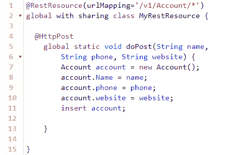
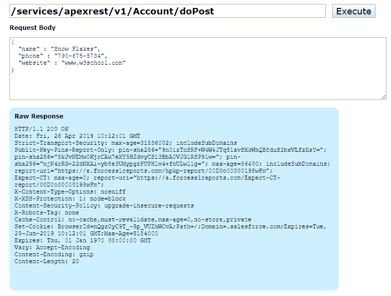

# 使用工作台进行 Json 解析

> 原文：<https://dev.to/girikon/json-parsing-using-workbench-5d20>

**解析来自工作台的 JSON 数据**

为什么我们总是以**【为什么】**开始一个问题？我们想到的第一个问题是**“为什么我们使用 Workbench 进行 JSON 解析？”**

**[作为一名 Salesforce 顾问](https://www.girikon.com.au/salesforce-consultant/)** 我也会类似地跟进一些其他问题，例如**“这是解析 JSON 数据的最简单方法吗？”，以及“我们在 workbench 中解析 JSON 数据还有其他方法吗”。**在过去的 4 年里，我与 Girikon 一起在 **[Salesforce 咨询服务](https://www.girikon.com/salesforce-consulting-services/)** 团队工作，我将通过理解以下给出的方法来尝试回答上述问题:

**方法 1:通过服务器通过工作台进行 JSON 解析**

JSON 文件是作为单独的代码开发的，因此检查动态项目的最有效方法是通过 Workbench JSON 数据解析方法，这将绕过代码的其余部分，意味着没有机会更改现有代码并弄乱它，从而使开发人员受益。使用 Workbench JSON 数据解析方法还提供了额外的好处，例如节省了时间，从而提高了效率，降低了复杂性，减少了编写代码的漏洞。

**通过工作台使用 Rest 方法的步骤如下:**

1.  开始之前，在 Workbench 中设置一个帐户是很重要的。

**[https://workbench.developerforce.com/login.php?startUrl=%2Fquery.php](https://workbench.developerforce.com/login.php?startUrl=%2Fquery.php)** 。此时，使用您的 Salesforce 帐户登录。

1.  进入**工具** - >，选择**休息浏览器**

2.  选择 **Http 方法**作为 **POST** 。

3.  创建 Apex 类，用于映射要发布的数据。

1.  根据映射 URL 和方法设置 URL

1.  在请求体中提供 JSON 数据。

并且，从标题中检查内容类型。

**Rest 方法的输出如下:**

并且将在 Account sObject 中创建新的帐户记录。

**方法二:通过 WORKBENCH 对对象进行 JSON 数据解析**

1.  进入**工作台**->-**休息浏览器** - > HTTP 方法贴

2.  现在，设置您想要的 sObject 的路径，因为我们已经使用了 sObject Account 来解析 JSON 数据

。

1.  在请求体中提供 JSON 数据。

例如:

这将在您的组织中创建一个帐户对象。

**输出:**

并且将在 Account sObject 中创建新的帐户记录。

使用工作台解析 Json 的帖子[首先出现在](https://www.girikon.com/blog/json-parsing-using-workbench/) [Salesforce 咨询公司|美国|亚利桑那州凤凰城](https://www.girikon.com/)上。