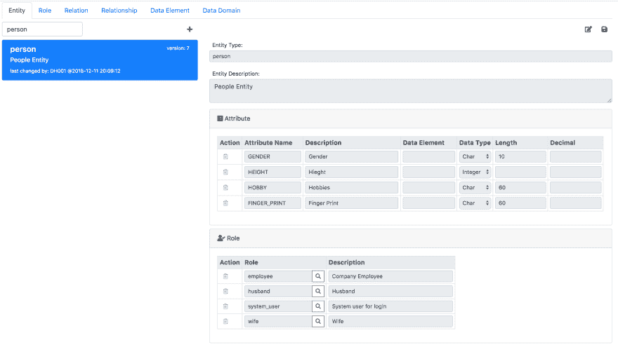
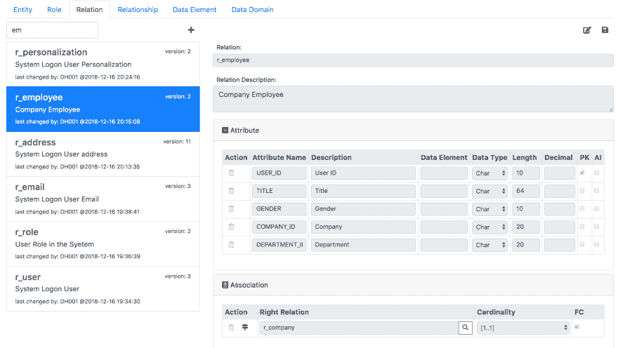
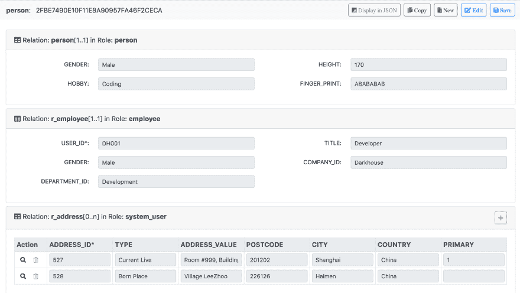
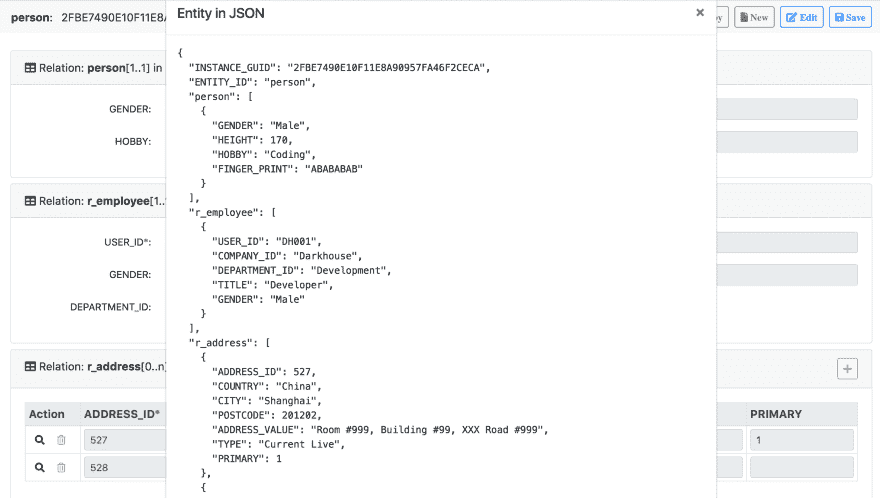
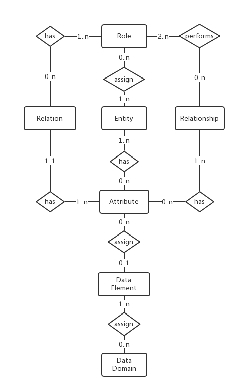

# JSON 不相关

> 原文：<https://dev.to/vincezk/jsononrelations-439h>

# JSON 无关系

JSON-On-Relations 将 JSON 消息转换成 SQL。因此，许多关系数据操作可以通过编写 JSON 格式的消息来实现。JSON 现在是 RESTful 通信事实上的消息格式。另一方面，带有 SQL 的关系数据库仍然是存储和使用结构化数据的唯一可信系统。将 JSON 放在关系上可以简化企业级应用程序(如 ERP 和 CRM)的开发。同时，它还可以通过标准化业务实体建模来帮助降低软件维护工作量。

现有的 ORM 解决方案过于关注“对象”概念。忽视数据的关系本质限制了他们构建复杂企业应用程序的能力。SQL 仍然被证明是数据操作的最佳抽象。任何试图重建车轮，或覆盖另一个水平外壳，总是像在蛇上画腿一样结束。

与其他协议(例如:OData 或 JSON API)不同，JSON-On-Relations 并不试图用 JSON 来外壳化 SQL。它更像是一座桥梁，将 JSON 和 SQL DBs 连接到一个利基领域。该领域总是与其他基于 web 的应用程序混合在一起，应该被视为一个独立的领域，即企业业务线应用程序。

## 第一眼

### 定义你的实体

实体“人”由 4 个属性和 4 个角色定义。

[T4】](https://res.cloudinary.com/practicaldev/image/fetch/s--jz9hweE2--/c_limit%2Cf_auto%2Cfl_progressive%2Cq_auto%2Cw_880/https://thepracticaldev.s3.amazonaws.com/i/9v6q0wy7n6b58ta6jqq8.png)

一个人可以是雇员，因此它具有“雇员”的角色。角色“雇员”有一个关系“r _ 雇员”。
[T3】](https://res.cloudinary.com/practicaldev/image/fetch/s--QudFKWnu--/c_limit%2Cf_auto%2Cfl_progressive%2Cq_auto%2Cw_880/https://thepracticaldev.s3.amazonaws.com/i/w3ot7tvq9hoxd9kx3is3.png)

关系对应于表示属性集合的 DB 表。此外，您还可以定义关系之间的关联。
[](https://res.cloudinary.com/practicaldev/image/fetch/s--0T_bjWQ_--/c_limit%2Cf_auto%2Cfl_progressive%2Cq_auto%2Cw_880/https://thepracticaldev.s3.amazonaws.com/i/vvqmjqbuwi499hwh0jhm.png)

实体之间可以有关系。每种关系都由特定的角色来执行。例如，关系“婚姻”由两个角色完成:“丈夫”和“妻子”。
一旦这两个角色被分别分配给两个人，他们就有可能建立婚姻关系。
T3[T5](https://res.cloudinary.com/practicaldev/image/fetch/s--faidYAET--/c_limit%2Cf_auto%2Cfl_progressive%2Cq_auto%2Cw_880/https://thepracticaldev.s3.amazonaws.com/i/a1bh9v164ii6pc5wbkp1.png)

### 浏览和维护您的实体实例

一旦完成了数据建模，您就可以立即创建一个 person 实例。

[T4】](https://res.cloudinary.com/practicaldev/image/fetch/s--2lxUdKzO--/c_limit%2Cf_auto%2Cfl_progressive%2Cq_auto%2Cw_880/https://thepracticaldev.s3.amazonaws.com/i/rrcooiiqshee8iscou60.png)

您还可以根据关系和关系中所有可用的属性来搜索不同实体类型的实例。
[T3】](https://res.cloudinary.com/practicaldev/image/fetch/s--BlKbMgqg--/c_limit%2Cf_auto%2Cfl_progressive%2Cq_auto%2Cw_880/https://thepracticaldev.s3.amazonaws.com/i/h65ugprl62wjscrv9gss.png)

### 撰写您的消息

每个实体实例可以表示为一个 JSON 文件。JSON 不仅仅是一种简单的格式，也是一种可以与服务器端交流的消息。
[](https://res.cloudinary.com/practicaldev/image/fetch/s--6-3YW4a1--/c_limit%2Cf_auto%2Cfl_progressive%2Cq_auto%2Cw_880/https://thepracticaldev.s3.amazonaws.com/i/fnrou7r4qcpnk4vrbz5y.png)

如果您想创建一个新的人员实例，只需发布如下消息:

```
POST http://localhost:3001/api/entity
Accept: */*
Cache-Control: no-cache
Content-Type: application/json

{ "ENTITY_ID": "person",
  "person": {"HEIGHT": "170", "GENDER": "male", "FINGER_PRINT": "CA67DE15727C72961EB4B6B59B76743E", "HOBBY":"Reading, Movie, Coding"},
  "r_employee": {"USER_ID": "DH001", "COMPANY_ID":"Darkhouse", "DEPARTMENT_ID": "Development", "TITLE": "Developer", "GENDER":"Male"},
  "r_address": [
     {"COUNTRY": "China", "CITY":"Shanghai", "POSTCODE": "999999",
      "ADDRESS_VALUE":"Room #999, Building #99, XXXX Road #999",
      "TYPE": "Current Live", "PRIMARY":1},
     {"COUNTRY": "China", "CITY":"Seasaw", "POSTCODE": "888888",
      "ADDRESS_VALUE" : "West Valley Lake",
      "TYPE": "Born Place", "PRIMARY":0}],
  "relationships":[ ]
} 
```

如果您想将员工(人)的头衔从“开发人员”更改为“架构师”，那么:

```
PUT http://localhost:3001/api/entity
Accept: */*
Cache-Control: no-cache
Content-Type: application/json

{ "ENTITY_ID": "person",
  "INSTANCE_GUID": "2FBE7490E10F11E8A90957FA46F2CECA",
  "r_employee": {"action": "update", "USER_ID": "DH001", "TITLE": "Architect"},
} 
```

想添加新地址吗？就这样做:

```
PUT http://localhost:3001/api/entity
Accept: */*
Cache-Control: no-cache
Content-Type: application/json

{ "ENTITY_ID": "person",
  "INSTANCE_GUID": "2FBE7490E10F11E8A90957FA46F2CECA",
  "r_address": [
     {"action": "add", "COUNTRY": "China", "CITY":"Shanghai", "POSTCODE": "777777",
      "ADDRESS_VALUE":"Building #909, YYYY Road #101",
      "TYPE": "Office", "PRIMARY":0}
      ]
} 
```

## 如何使用

**您可以直接浏览托管网站:**

*   [建模](https://darkhouse.com.cn/jor/model)
*   [实体浏览器](https://darkhouse.com.cn/jor/entity/list)

**或通过应用以下步骤在您自己的环境中建立**

1.  将其安装到节点/角度项目中:

```
 $ npm install json-on-relations --save 
```

1.  在 MySQL 中创建数据库:

```
 Copy the "node_modules/json-on-relations/db.sql" to your sql console and execute.
   The script will create database named "MDB" which contains all the tables. 
```

1.  在节点中:

```
 copy "node_modules/json-on-relations/dist" to your project root. 
```

在项目根目录下创建“server.js”，如下:

```
 const express = require('express');
   const app = express();

   // We don't want to serve sessions for static resources
   const path = require('path');
   app.use(express.static(path.join(__dirname, 'dist')));

   const cors = require('cors'); // Allow cross site requests
   app.use(cors());

   app.use(require('body-parser').json());
   const compress = require('compression');
   app.use(compress());

   // Routing
   const routes = require('json-on-relations').Routes;
   app.use('/', routes);

   process.on('SIGINT',function(){
     console.log("Closing.....");
     process.exit()
   });

   const entityDB = require('json-on-relations').EntityDB;
   entityDB.executeSQL("select ENTITY_ID from ENTITY", function (err, rows) {
     if(err) debug("bootstrap: get entities==> %s", err);
     else {
       const entities = [];
       rows.forEach( row => entities.push(row.ENTITY_ID));
       entityDB.loadEntities(entities, function (err) {
         if(err) debug("bootstrap: load entities==> %s", err);
         else app.listen(3001, () => console.log('Example app listening on port 3001!'));
       })
     }
   }); 
```

您还应该安装以下软件包:express、path、cors、body-parse 和 compression。

1.  启动服务器:

```
 $ node server.js 
```

1.  打开链接:
    *   [建模](http://localhost:3001/model)
    *   [实体浏览器](http://localhost:3001/entity/list)

## Restful API

以下 API 在默认路由表中打开。

### 创建一个人实例

```
POST http://localhost:3001/api/entity
Accept: */*
Cache-Control: no-cache
Content-Type: application/json

{ "ENTITY_ID": "person",
  "person": {"HEIGHT": "180", "GENDER": "male", "HOBBY":"Reading, Movie, Coding"},
  "r_user": {"USER_ID": "DH999", "USER_NAME":"John", "DISPLAY_NAME": "John Wu"},
  "r_email": [{"EMAIL": "dh999@hotmail.com", "TYPE": "private", "PRIMARY":1}],
  "r_employee": {"USER_ID": "DH999", "COMPANY_ID":"Darkhouse", "DEPARTMENT_ID":"Development","TITLE":"Developer"},
  "relationships":[
    { "RELATIONSHIP_ID": "rs_user_role",
      "values":[
        { "SYNCED":0,
          "PARTNER_INSTANCES":[
            {"ENTITY_ID":"system_role", "ROLE_ID":"system_role", "INSTANCE_GUID":"5F50DE92743683E1ED7F964E5B9F6167"}]}
      ]
    }]
} 
```

### 改变一个人的实例

为每个关系引入了保留字段“action”。它的值可以是“更新”、“添加”和“删除”。

示例会做如下改动:
1)更新“人”关系的身高和爱好；
2)更新“r_user”关系的用户名；
3)添加新的邮箱地址；
4)向“系统 _ 角色”添加新的关系。

```
PUT http://localhost:3001/api/entity
Accept: */*
Cache-Control: no-cache
Content-Type: application/json

{ "ENTITY_ID": "person",
  "INSTANCE_GUID": "2FBE7490E10F11E8A90957FA46F2CECA",
  "person": {"action": "update", "HEIGHT": 180, "HOBBY":"Reading, Movie"},
  "r_user": {"action": "update", "USER_ID": "DH999", "USER_NAME":"JohnWu"},
  "r_email": [{"action": "add", "EMAIL": "dh999@darkhouse.com", "TYPE": "work", "PRIMARY":0}],
  "relationships":[
    {
      "RELATIONSHIP_ID": "rs_user_role",
      "values": [
        {
          "action": "add",
          "VALID_FROM": "2020-12-31 00:00:00",
          "VALID_TO": "2030-12-31 00:00:00",
          "SYNCED": 1,
          "PARTNER_INSTANCES": [
            {
              "ENTITY_ID": "system_role",
              "ROLE_ID": "system_role",
              "INSTANCE_GUID": "F914BC7E2BD65D42A0B17FBEAD8E1AF2"
            }
          ]
        }
      ]
    }]
} 
```

### 覆盖一个人实例

API 用给定的 JSON 对象覆盖整个实例。那些出现的关系用新值更新。没有出现的将被删除。
这个 API 在一些总是将实体视为一个整体的 UI 技术中很有用。
这样你就不必跟踪每一个修改过的部分，只需将它作为一个原子对象发布到后端存储中。

除了可能引入一些性能开销之外，另一个限制是“覆盖”模式不支持关系。
这是因为一个关系总是处理两个以上的实体，
因此不能从一方覆盖。

```
PUT http://localhost:3001/api/entity/overwrite
Accept: */*
Cache-Control: no-cache
Content-Type: application/json

{ "ENTITY_ID": "person",
  "INSTANCE_GUID": "2FBE7490E10F11E8A90957FA46F2CECA", 
  "person": {"HEIGHT": "180", "GENDER": "male", "HOBBY":"Reading, Movie, Coding, Singing"},
  "r_user": {"USER_ID": "DH999", "USER_NAME":"JohnWu", "DISPLAY_NAME": "John Wu"},
  "r_email": [{"EMAIL": "dh999@hotmail.com", "TYPE": "private", "PRIMARY":1}],
  "r_employee": {"USER_ID": "DH999", "COMPANY_ID":"Darkhouse", "DEPARTMENT_ID":"Development","TITLE":"Developer"}
} 
```

### 通过实体的 UUID 获取实体实例

返回的是 JSON 格式的实体实例。这些关系也包括在内

```
GET http://localhost:3001/api/entity/instance/2FBE7490E10F11E8A90957FA46F2CECA
Accept: */*
Cache-Control: no-cache 
```

### 通过实体实例的 UUID 获取实体实例的片段

使用这个 API 来决定您需要从一个实体实例中获得哪些关系。
给定的例子从一个人实体
请求两个关系:“r_user”和“r_email”以及一个关系“rs_user_role”。
返回的是实体实例的投影。

如果您只需要来自一个大实体的一些信息，API 可以节省性能。

```
POST http://localhost:3001/api/entity/instance/piece/2FBE7490E10F11E8A90957FA46F2CECA
Accept: */*
Cache-Control: no-cache
Content-Type: application/json

{
  "RELATIONS": ["r_user", "r_email"],
  "RELATIONSHIPS": ["rs_user_role"]
 } 
```

### 通过一个实体的业务 ID 获取一个实体实例

业务 ID 总是属于实体的一个关系。
例如，属性 USER_ID 是 person 实体的业务 ID 之一，
属于关系“r_employee”。
您需要确保业务 ID 可以唯一地标识实体，
否则它会给您匹配这个 ID 的第一个匹配结果。

返回的是 JSON 格式的完整实体实例。

```
POST http://localhost:3001/api/entity/instance
Accept: */*
Cache-Control: no-cache
Content-Type: application/json

{
  "RELATION_ID": "r_employee",
  "USER_ID": "DH001"
} 
```

### 通用查询请求

查询被定义为具有 3 个属性的 JSON 对象:“关系”、“投影”和“过滤器”。
“关系”定义了主导关系(表)。您不仅可以从一个主关系
中投影字段，还可以从所有相关的关系中投影字段。该系统帮助你做 sql 连接。

过滤器由运算符限定:EQ(等于)、NE(不等于)、GT(大于)、GE(大于等于)、
LT(小于)、LE(小于等于)和 BT(介于)。
您还可以使用关联关系中的字段进行过滤。

返回的是满足查询的条目列表。

```
POST http://localhost:3001/api/query
Accept: */*
Cache-Control: no-cache
Content-Type: application/json

{
  "relation": "r_user",
  "projection": [
    "USER_ID",
    "USER_NAME",
    "GIVEN_NAME",
    {"fieldName": "COMPANY_ID", "alias": "Company", "relation": "r_employee"}
  ],
  "filter": [
    {
      "fieldName": "USER_ID",
      "operator": "BT",
      "low": "DH001",
      "high": "DH999"
    },
    {
      "fieldName": "LANGUAGE",
      "operator": "EQ",
      "relation": "r_personalization",
      "low": "ZH"
    }
  ]
} 
```

## 概念背后

一个实体是一个可以被清楚识别的“东西”。特定的人、公司或事件是实体的一个例子。关系是实体之间的关联。例如，“婚姻”是两个“人”实体之间的关系。

细节如下图所示:

[](https://res.cloudinary.com/practicaldev/image/fetch/s--eAy4sUWs--/c_limit%2Cf_auto%2Cfl_progressive%2Cq_auto%2Cw_880/https://thepracticaldev.s3.amazonaws.com/i/ej9izuqo5ar3u92cie5n.png)

一个实体可以有多个直接属性，以及来自分配给它的角色的间接属性。
角色没有直接的属性，而是从分配给它们的关系中继承而来。

一个关系对应一个 DB 表，它的属性是表的字段。
关系可以相互关联。
例如，关系“r_employee”基于字段“COMPANY_ID”与关系“r_company”具有一对一的关联。
即使两个关系分别属于两个不同的实体也可以关联。

角色执行关系。一旦一个角色被分配给一个实体，它的关系就可以应用到这个实体。
关系实例实际上是实体之间的关联。

实体和关系都可以看作是两种特殊的关系。

为了实现可重用性和上下文一致性，属性的元可以定义为数据元素和数据域。
数据域用于界定属性的值类型和范围。
例如，data domain“Country”包含了迄今为止世界上所有的国家代码。
一个数据元素可以分配一个数据域，并添加更多的业务语义，如标签、文档等。

## 计划好的功能

*   数据域和数据元素。
*   消息处理期间的可插入验证、替换和丰富。
*   实体编排:将多个实体上的操作组合在一起。
*   数据建模的版本管理。
*   介绍数据库视图概念和报表绘制工具。
*   集成到[门户](https://github.com/VinceZK/Portal)中，支持用户登录和会话。

## 执照

[麻省理工学院许可证](http://opensource.org/licenses/MIT)