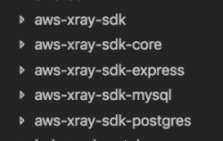
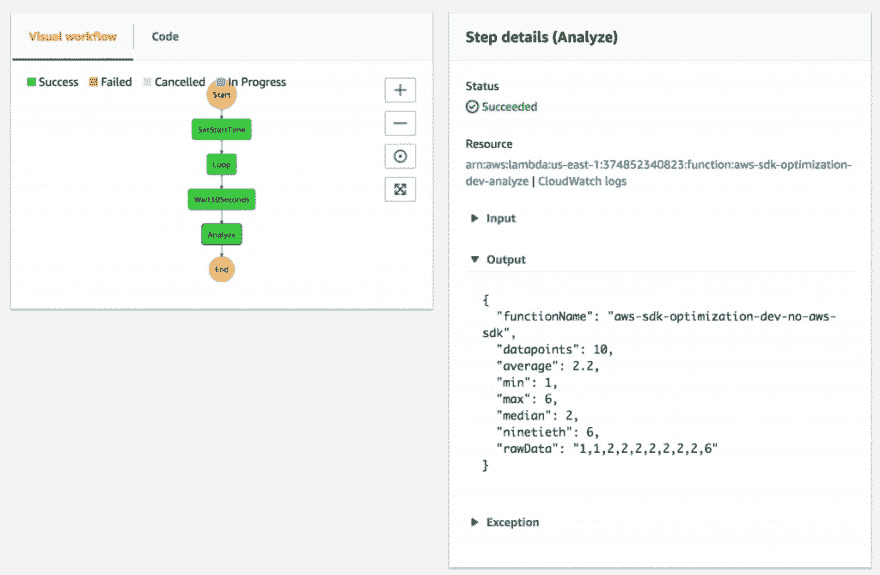
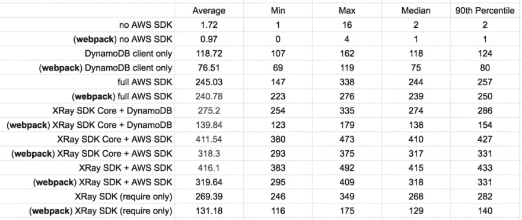
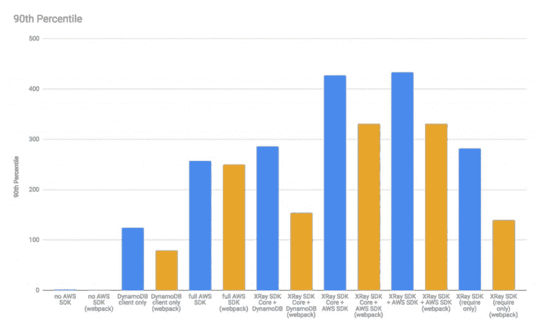

# 完整的 AWS SDK 到底有多贵？

> 原文：<https://dev.to/theburningmonk/just-how-expensive-is-the-full-aws-sdk-46g4>

如果你不熟悉冷启动在 AWS Lambda 环境中的工作方式，那么请先阅读[这篇文章](https://theburningmonk.com/2018/01/im-afraid-youre-thinking-about-aws-lambda-cold-starts-all-wrong/)。

* * *

当 Node.js Lambda 函数冷启动时，会发生很多事情:

*   Lambda 服务必须找到一个有足够容量来托管新容器的服务器

*   新容器被初始化

*   Node.js 运行时已初始化

*   您的处理程序模块已初始化，这包括初始化您在处理程序函数之外声明的任何全局变量和函数

如果您为 Lambda 函数启用主动跟踪，您将能够看到在 X 射线中这些步骤上花费了多少时间。不幸的是，初始化容器和 Node.js 运行时所花费的时间没有被记录为片段。但是你可以从持续时间的不同来计算。

这里，`Initialization`是指初始化处理程序模块所需的时间。

[](https://res.cloudinary.com/practicaldev/image/fetch/s--fPq4neEA--/c_limit%2Cf_auto%2Cfl_progressive%2Cq_auto%2Cw_880/https://theburningmonk.com/wp-content/uploads/2019/03/img_5c964abe4bf42-1024x325.png)

上面的跟踪是针对下面的函数的，它只需要 AWS SDK。正如你所看到的，这个简单的要求增加了 147 毫秒的冷启动。

```
const AWS = require('aws-sdk')

module.exports.handler = async () => {
} 
```

当您的功能需要与 AWS 资源交互时，请考虑这种业务成本。但是，如果您只需要与一个服务(例如 DynamoDB)进行交互，您可以使用这个一行程序节省一些初始化时间。

```
const DynamoDB = require('aws-sdk/clients/dynamodb')
const documentClient = new DynamoDB.DocumentClient() 
```

它直接需要 DynamoDB 客户端，无需初始化整个 AWS SDK。我做了一个实验，看看这个简单的改变可以节省多少冷启动时间。

除了 AWS SDK 之外，我们还经常需要 XRay SDK，并使用它来自动检测 AWS SDK。不幸的是，`aws-xray-sdk`包也有一些我们不需要的额外负担。默认情况下，它支持 Express.js 应用程序、MySQL 和 Postgres。如果您只对检测 AWS SDK 和`http` / `https`模块感兴趣，那么您只需要`aws-xray-sdk-core`。

[](https://res.cloudinary.com/practicaldev/image/fetch/s--7MRnBOWp--/c_limit%2Cf_auto%2Cfl_progressive%2Cq_auto%2Cw_880/https://theburningmonk.com/wp-content/uploads/2019/03/img_5c964b0bde622-e1553353537965.png)

## 方法论

我测试了许多配置:

*   [没有 AWS SDK](https://github.com/theburningmonk/aws-sdk-coldstart-overhead/blob/master/functions/no-aws-sdk.js)

*   [只需要 DynamoDB 客户端](https://github.com/theburningmonk/aws-sdk-coldstart-overhead/blob/master/functions/dynamodb-only.js)

*   [需要完整的 AWS SDK](https://github.com/theburningmonk/aws-sdk-coldstart-overhead/blob/master/functions/aws-sdk.js)

*   [仅需要 x 射线 SDK(无 AWS SDK)](https://github.com/theburningmonk/aws-sdk-coldstart-overhead/blob/master/functions/aws-xray-sdk-require-only.js)

*   [需要 x 射线软件开发工具包并安装 AWS 软件开发工具包](https://github.com/theburningmonk/aws-sdk-coldstart-overhead/blob/master/functions/aws-xray-sdk.js)

*   [需要 x 射线 SDK 内核并安装 AWS SDK](https://github.com/theburningmonk/aws-sdk-coldstart-overhead/blob/master/functions/aws-xray-sdk-core.js)

*   [需要 XRay SDK 内核，并且仅使用 DynamoDB 客户端](https://github.com/theburningmonk/aws-sdk-coldstart-overhead/blob/master/functions/trace-dynamodb-only.js)

这些功能都可以用 x 光追踪。采样率设置为 100%，这样我们就不会错过任何东西。我们只对初始化段的持续时间感兴趣，因为它对应于初始化这些依赖项的时间。

[](https://res.cloudinary.com/practicaldev/image/fetch/s--4-Yo5In5--/c_limit%2Cf_auto%2Cfl_progressive%2Cq_auto%2Cw_880/https://theburningmonk.com/wp-content/uploads/2019/03/img_5c964b69140eb-1024x285.png)

`no AWS SDK`案例是我们的对照组。我们可以看到每个额外的依赖项给我们的初始化持续时间增加了多少时间。

为了收集具有统计意义的样本数据集，我决定使用阶跃函数来自动化这个过程。

[](https://res.cloudinary.com/practicaldev/image/fetch/s--HYE1I_-D--/c_limit%2Cf_auto%2Cfl_progressive%2Cq_auto%2Cw_880/https://theburningmonk.com/wp-content/uploads/2019/03/img_5c964ba43891e-1024x669.png)

*   状态机接受一个输入`{ functionName, count }`。

*   `SetStartTime`步骤将当前的 UTC 时间戳添加到执行状态中。这是必要的，因为我们需要实验的开始时间来从 X 射线中提取相关的痕迹。

*   `Loop`步骤触发指定功能所需的冷启动次数。为了触发冷启动，我在调用函数之前以编程方式更新了一个环境变量。这样，我保证每次调用都是冷启动。

[](https://res.cloudinary.com/practicaldev/image/fetch/s--glhWtDxt--/c_limit%2Cf_auto%2Cfl_progressive%2Cq_auto%2Cw_880/https://theburningmonk.com/wp-content/uploads/2019/03/img_5c964c2c836d5-1024x199.png)

*   `Wait30Seconds`步骤确保在我们试图分析它们之前，所有的轨迹都被发布到 x 射线。

*   `Analyze`步骤获取 XRay 中所有相关的轨迹，并在初始化期间输出一些统计数据。

每种配置都经过 1000 多次冷启动测试。偶尔 x 射线痕迹是不完整的(见下文)。这些不完整的轨迹被排除在`Analyze`步骤之外。

[](https://res.cloudinary.com/practicaldev/image/fetch/s--c875MLAP--/c_limit%2Cf_auto%2Cfl_progressive%2Cq_auto%2Cw_880/https://theburningmonk.com/wp-content/uploads/2019/03/img_5c964c4e90568-1024x212.png)

每个配置也用`WebPack`测试(使用[无服务器网络包](https://github.com/serverless-heaven/serverless-webpack)插件)。

## 结果

这些是所有测试用例的`Initialization`时间。

[](https://res.cloudinary.com/practicaldev/image/fetch/s--ZMxOkvxA--/c_limit%2Cf_auto%2Cfl_progressive%2Cq_auto%2Cw_880/https://theburningmonk.com/wp-content/uploads/2019/03/img_5c97ab80261a6-1024x433.png)

[](https://res.cloudinary.com/practicaldev/image/fetch/s--EpfO0TnA--/c_limit%2Cf_auto%2Cfl_progressive%2Cq_auto%2Cw_880/https://theburningmonk.com/wp-content/uploads/2019/03/img_5c97ab9946bd1-1024x631.png)

主要观察结果:

*   WebPack 全面提高了`Initialization`时间。

*   在没有任何依赖的情况下，`Initialization`在没有 WebPack 的情况下，平均时间仅为 1.72 毫秒，在有 WebPack 的情况下，平均时间为 0.97 毫秒。

*   添加 AWS SDK 作为唯一的依赖项，在没有 WebPack 的情况下平均会增加 245 毫秒。这是相当重要的。添加 WebPack 也没有明显的改善。

*   只需要 DynamoDB 客户机(前面讨论过的一行代码变化)就可以节省 176 毫秒！在 90%的情况下，节省时间超过 130 毫秒。有了 WebPack，节省的成本更是惊人。

*   需要 XRay SDK 的成本大约与 AWS SDK 相同。
    使用完整的 x 射线 SDK 和 x 射线 SDK 内核在统计上没有显著差异。有或没有 WebPack。