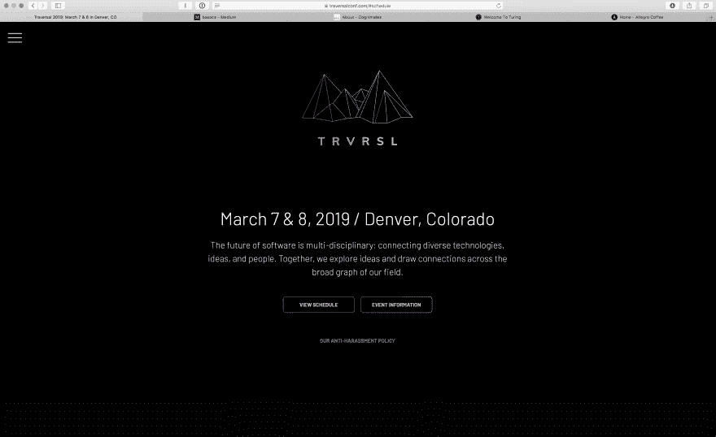
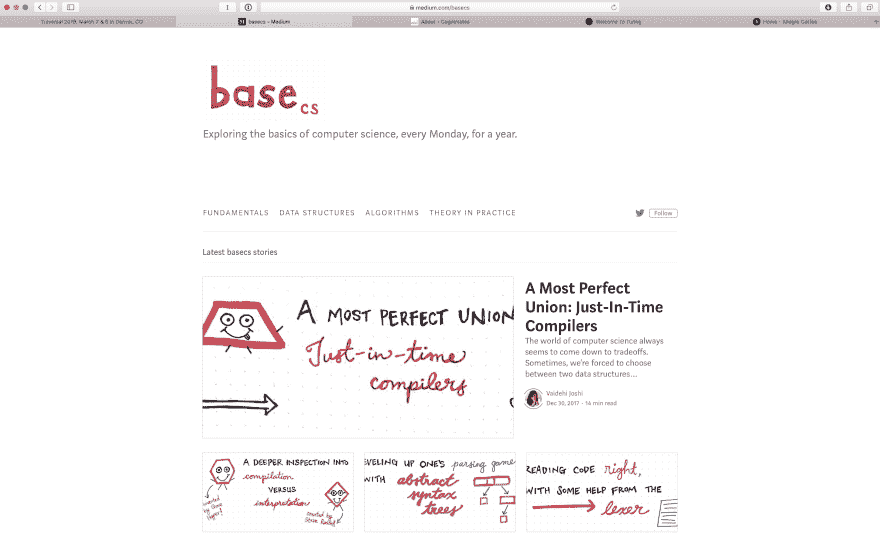
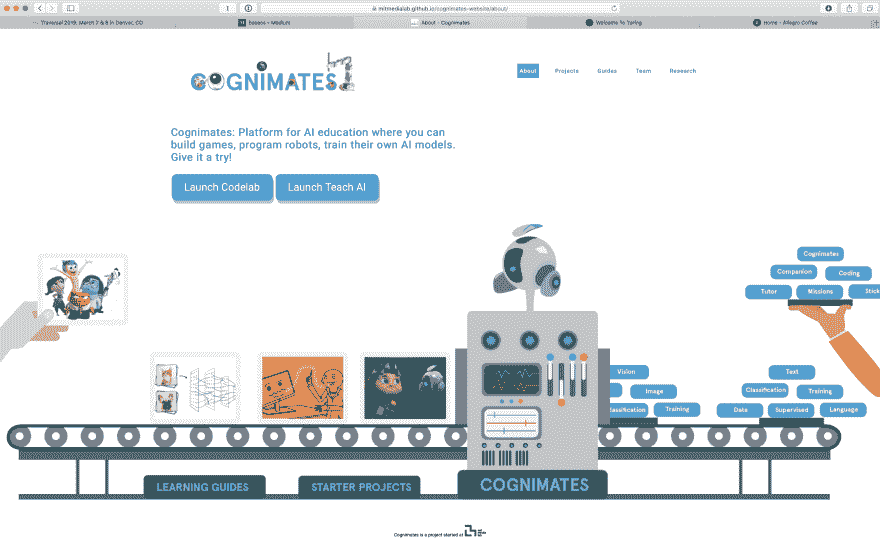
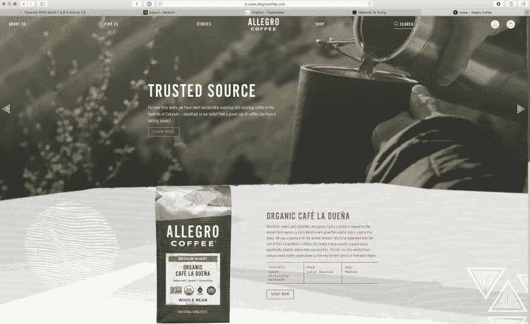

# 保持标签#2 -遍历会议版

> 原文：<https://dev.to/andrewvida/keepin-tabs-2---traversalconf-edition-3hge>

上周，我有机会参观了美丽的科罗拉多州丹佛市，并参加了一个令人惊叹的会议，旅行大会。它位于 Larimer Social，聚集了 200 名专业技术人员组成的多元化、包容性观众。我们一起花了两天时间参加演讲者主导的单主题会议，并有机会进行讨论和互动。

以下是我在会议上喜欢的几个话题:

作为一个从非计算机科学背景进入软件开发的人，我总是想知道我在大学没有学习它是否错过了什么。事实证明，有很多来自非传统背景的人，对学习更多的计算机科学很好奇。在“学习如何学习”的演讲中， [Vaidehi Joshi](https://twitter.com/vaidehijoshi) 描述了她如何使用费曼技巧每周自学一个新的 CS 主题，然后在博客上发表。从那以后，她把这些博客文章变成了播客和视频系列。如果你和我一样，想了解更多关于 CS 的知识，请访问她的网站:

接下来的演讲，Stefania Druga 的“阅读、写作和修补人工智能”让我大吃一惊。作为一个有三个孩子的父亲，我对屏幕时间(以及一般的设备)非常谨慎，我很纠结如何最好地让他们接触电脑和互联网。你可能会认为对一个以网络编程为生的人来说这很容易，但是说实话，网络让我害怕。

在她的演讲中，Stefania 描述了如何通过玩耍来帮助我们的孩子学习人工智能和机器学习。她是人工智能教育平台 [Cognimates](https://mitmedialab.github.io/cognimates-website/about/) 的创建者，也领导着[hack idemia](http://www.hackidemia.com)——一个设计研讨会和工具包的组织，帮助孩子们利用好奇心、同理心和玩耍来发明未来。

我很兴奋地观看了 Nickolas 的意思是“艾菲尔铁塔”的现场直播，因为我之前在 [RubyConf](https://www.youtube.com/watch?v=RslVT-L2A40) 看过它的录制。尼古拉斯是一个很棒的讲故事的人，这个演讲既有趣又有启发性。看看你能从古斯塔夫·埃菲尔如何建造他的破纪录之塔来进一步推动你的组织中学到什么。

如果你喜欢这个视频，可以看看尼古拉斯的播客《向上管理》。在那里，他和其他主持人讨论管理技巧、故事和采访，以帮助应对管理创意和技术团队的挑战。

如果这些演讲引起了你的兴趣，请留意[会议](http://confreaks.tv)的记录。

最后，为我最喜欢的位于伯克利的咖啡馆 [Allegro Coffee](https://www.allegrocoffee.com) 大声喊出来，这里有美味的 cortados 和拿铁。如果你在那里，试试鳄梨吐司。是最好的！

