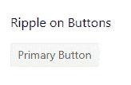

# kendorseact:它能为你做什么？

> 原文：<https://dev.to/progresstelerik/kendoreact-what-can-it-do-for-you-3if4>

在[KendoReact](https://www.telerik.com/blogs/kendo-react-getting-started-blog-series)系列的第一篇文章中，您将了解 KendoReact 能为 React 开发人员做些什么。

Kendo UI 团队已经建立组件库超过 15 年了，他们在用户界面组件方面积累了丰富的经验。他们已经为 [jQuery](https://www.telerik.com/kendo-ui) 、 [Angular](https://www.telerik.com/kendo-angular-ui/) 、 [Vue](https://www.telerik.com/kendo-vue-ui) 构建了它们，现在他们推出了一个专门为 [React](https://www.telerik.com/kendo-react-ui) 构建的真正的本地组件库。

> React 库的许可持有者也可以访问 jQuery、Vue 和 Angular 库。并不是说任何人都会偏离 React 或者在不同的项目中使用不同的库。但是，为了以防万一，您可以使用我们所有的 JavaScript 库。

## 为什么会有反应？

我们决定专门为 React 建一个库，因为 React 很酷。好吧，但更重要的是，很多开发人员都在使用它，包括我自己，可能还有你。Kendo UI 团队希望构建一个库，使 React 应用程序更高效、更快速、更易于构建。这就是为什么我们有一个专门用本地 React 组件构建的库。包装器之类的东西在幕后并不好笑，尽管如果你喜欢的话，我们确实有 React 的 jQuery 包装器。但是我们建议那些新手使用我们的[本地组件库](https://www.telerik.com/kendo-react-ui/)来代替 React。

这对您的 React 应用程序意味着什么？这些 React 组件是可组合的，并且可以精确配置，这样您就可以像处理任何其他 React 组件一样处理它们。它们支持受控和非受控状态——在这两种情况下，我们都会保护您！

### 还有哪些成分？

要查看所有组件的列表(到目前为止)，只需[前往 KendoReact 页面并探索](https://www.telerik.com/kendo-react-ui/components/)。这是一个很长的列表，所以在回到文章之前，请花点时间。我还应该提到，我们有一个[路线图](https://www.telerik.com/kendo-react-ui/roadmap/)来看看未来会发生什么。

要使用这些组件，您需要做的就是使用 npm 安装它们，将它们导入到您现有的 React 项目中，将它们添加到您的 JSX 模板中，就这样！

如果你已经启动了一个基本的 [Create React App](https://dev.to/progresstelerik/hello-create-react-app-20-316-temp-slug-3014493) ，我们可以用下面的 npm 安装命令来试试:

```
npm install @progress/kendo-react-ripple @progress/kendo-react-buttons @progress/kendo-theme-default 
```

然后，在`App.js`文件中，我们将导入以下内容:

```
import { Ripple } from '@progress/kendo-react-ripple';
import { Button } from '@progress/kendo-react-buttons';
import '@progress/kendo-theme-default/dist/all.css'; 
```

具有以下组件定义:

```
class App extends React.Component {
  render() {
    return (
      <div className="example-wrapper">
        <Ripple>
          <p>Ripple on Buttons</p>
          <Button>Primary Button</Button>
        </Ripple>
      </div>
    );
  }
} 
```

下面是我们将得到的输出:

[](https://res.cloudinary.com/practicaldev/image/fetch/s--VDVMZvCD--/c_limit%2Cf_auto%2Cfl_progressive%2Cq_66%2Cw_880/https://d585tldpucybw.cloudfront.net/sfimages/default-source/default-album/ripplebuttons_anim.gif%3Fsfvrsn%3D1a58337b_1)

这非常简单，我最喜欢使用 KendoReact 的一点是，当使用我们的 Sass 主题时，已经为您设计好了样式。我们知道 CSS 对每个人来说都不容易，即使对你来说很容易，有一个主题也很好。为此，我们创建了其中的几个，包括我们的[剑道默认主题](https://www.telerik.com/kendo-react-ui/components/styling/theme-default/)、[物质主题](https://www.telerik.com/kendo-react-ui/components/styling/theme-material/)，以及一个[引导主题](https://www.telerik.com/kendo-react-ui/components/styling/theme-bootstrap/)。有了这些，你需要做的就是用 npm 安装主题，然后把它导入到你的项目中。正如我们在上面的例子中所做的，主题是一个 npm 安装和一个导入:

```
npm install @progress/kendo-theme-default

import '@progress/kendo-theme-default/dist/all.css'; 
```

用最少的努力，主题给你可爱的风格组件，在你的应用程序、组件和项目中是一致的。除非您想提供覆盖或额外的定制，否则您不必接触 CSS 文件。您还可以通过这些样式库获得不同的交互和动画。

### 可达性

对可访问性的支持对我们来说非常重要，我们希望每个使用你的应用程序的人都感到舒适。满足标准的可访问性指导方针可能需要花费时间和精力，但是对于我们的组件，我们再次为您提供了保障。当你使用剑道 UI 组件时，我们会给你很多现成的[可访问性](https://www.telerik.com/kendo-react-ui/components/accessibility/)。这包括第 508 节合规性、W3C web 内容可访问性指南、WCAG 2.1、WAI-ARIA 和关键字导航。这使您不必将主要的开发时间放在自己定制的组件上。相反，只需使用 KendoReact，因为可访问性是组件自带的。

### 国际化

如果使用日期(或类似日期输入的数字)以及网格、数字文本框等，我们还提供标准的国际化支持。

## 需要时支持

在某些时候，每个人都需要一点帮助！如果你在路上遇到一些困难，或者你可能不明白一些事情，对于我们的许可证持有者，我们提供不同的帮助和支持。这包括[三个支持选项](https://www.telerik.com/kendo-react-ui/#pricing)用于从开发产品的开发人员那里获得快速帮助，以及一个选项 [24-7 人工支持定制项目](https://www.progress.com/services)。你也可以访问[社区论坛](https://www.telerik.com/forums/kendo-ui-react)，在那里其他使用剑道 UI 库的人和真正的剑道 UI 团队成员会帮助你回答问题，进行讨论，谈论他们使用我们组件的不同策略。

## 演示、教程和示例

您可以探索更多资源，如[互动演示](https://www.telerik.com/support/demos)。我们也有[示例项目](https://github.com/telerik/react-dashboard)、[网络研讨会](https://www.youtube.com/watch?v=GsQ_yATS7OY)、[博客帖子和教程](https://www.telerik.com/blogs/kendo-ui)，它们会给你更多的资源来帮助你。除了我们已经拥有的每个组件的文档之外，还有一点额外的帮助来指导您。

* * *

敬请关注即将到来的系列第二贴！