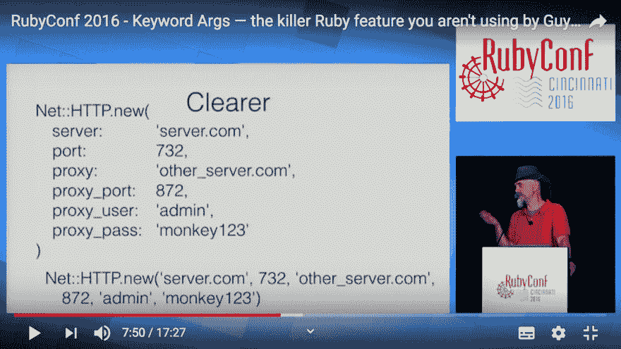

# Ruby 的关键字参数使代码更加清晰

> 原文：<https://dev.to/chenge/keyword-arguments-of-ruby-makes-code-more-clear-304a>

在这个视频中，演讲者演示了夸尔格斯的优点。

[](https://res.cloudinary.com/practicaldev/image/fetch/s--pU1WGmWw--/c_limit%2Cf_auto%2Cfl_progressive%2Cq_auto%2Cw_880/https://thepracticaldev.s3.amazonaws.com/i/t1ljqs7nhpfzky0e1t7p.png)

在图片中，上层代码显然更加清晰。

那么你应该什么时候使用它呢？我认为，当很难识别参数时，你应该使用 KWArgs。

用法很简单:

```
def foo(bar:, baz:)
end

foo(bar: 1, baz: 2) 
```

你这样认为吗？