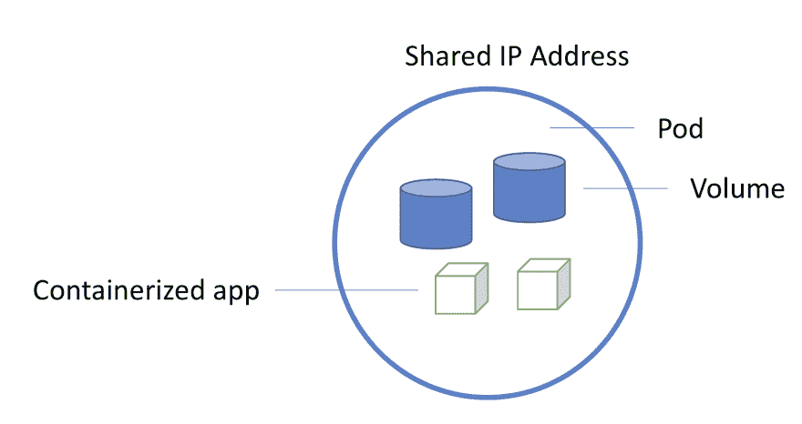
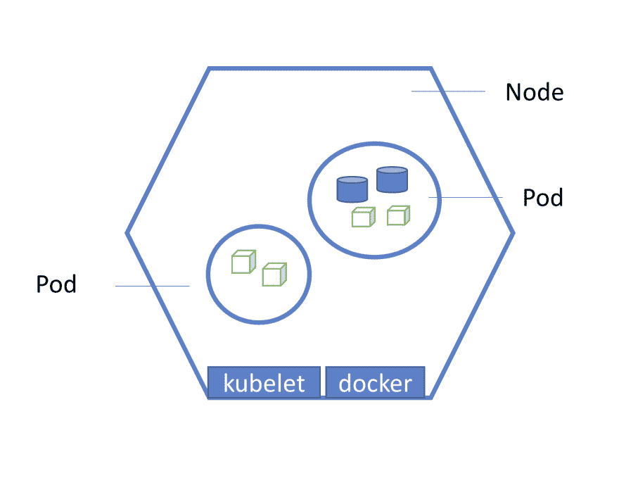
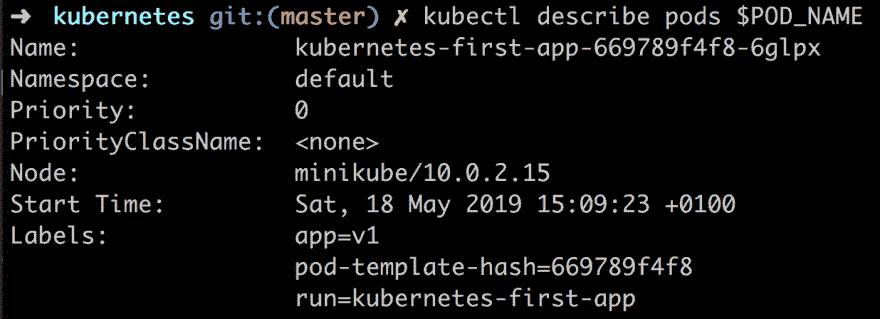

# 学习 Kubernetes，第二部分，pod、节点和服务

> 原文：<https://dev.to/azure/kubernetes-part-ii-revisiting-pods-and-nodes-and-introducing-services-and-labeling-5fi7>

在 [Twitter](https://twitter.com/chris_noring) 上关注我，很乐意接受您对主题或改进的建议/Chris

> 第二部分旨在为节点、pod 提供额外的上下文，并介绍概念服务。Kubectl 有一些理论和实践。

欢迎回到第二部分。到目前为止，`kubectl`、`nodes`和`pods`这些概念对你来说应该不算是全新的，但是我们会再多提一点它们是什么，当然，我们会继续使用我们的工具`kubectl`了解 Kubernetes。我们还将介绍服务的新概念，以及它们为什么是比代理更好的选择来公开您的应用程序。

这是 Kubernetes 系列文章的一部分:

*   [第一部分——从第一部分开始，基础知识、部署和 Minikube](https://dev.to/azure/kubernetes-from-the-beginning-part-i-4ifd) 在这一部分中，我们将介绍 Kubernetes 的原因、一些历史和一些基本概念，如部署、节点、单元。
*   第二部分介绍服务和标签- **我们到了**
*   [第三部分-缩放](https://dev.to/azure/kubernetes-part-iii-scaling-1mmi)这里我们将介绍如何缩放，并进一步展示*期望状态*如何成为 Kubernetes 的高级指令。我们还解释了自我修复，并简要介绍了自动伸缩。
*   [第四部分-自动缩放](https://dev.to/azure/kubernetes-from-the-beginning-part-iv-autoscaling-54l6)在这一部分中，我们将了解如何设置自动缩放，以便我们能够处理突然大量增加的传入请求

在这一部分中，我们将涵盖以下内容:

*   **加深**我们对 pod 和节点的了解
*   **介绍**服务和标签
*   **执行**一个练习，包括在 pod 上设置标签，并使用标签来查询我们的工件

## 资源

*   如果你想试用 AKS，Azure Kubernetes 服务，你需要一个免费的 Azure 账户
*   了解 Kubernetes 的最佳资源之一是谷歌的这个官方网站。
*   [Kubernetes 概述](https://azure.microsoft.com/en-gb/topic/kubernetes/?wt.mc_id=devto-blog-chnoring)Kubernetes、其所有部件及其工作原理的概述
*   [云中的 Kubernetes](https://azure.microsoft.com/en-gb/services/kubernetes-service/?wt.mc_id=devto-blog-chnoring)你是否觉得自己已经了解了 Kubernetes 的一切，只是想学习如何使用托管服务？那么这个链接是给你的
*   [AK 上的文件，azure kublers 服务](https://docs.microsoft.com/en-gb/azure/aks/?wt.mc_id=devto-blog-chnoring)azure kublers 服务，一种托管 kublers 服务
*   [AKS 最佳实践](https://docs.microsoft.com/en-us/azure/aks/best-practices?wt.mc_id=devto-blog-chnoring)您已经了解 AKS，并想学习如何更好地使用它？

## 概念重温

当我们在 Kubernetes 上创建一个部署时，该部署会创建包含容器的 pod。因此，pod 被绑定到节点，并将继续存在，直到*终止*或*删除*。让我们试着在 pod、节点方面多了解一些，同时也介绍一个新话题*服务*。

### 豆荚

> 吊舱是 Kubernetes 平台上的原子单元，也就是最小的可部署单元

我们之前已经说过了，但还是值得再提一次。

> 还有什么好知道的？

Pod 是一种抽象，表示一组一个或多个容器，例如 Docker 或 rkt，以及这些容器的一些共享资源。这些资源包括:

*   **共享存储**，作为卷
*   **联网**，作为唯一的集群 IP 地址
*   **关于如何运行每个容器的信息**，例如容器镜像版本或要使用的特定端口

一个 Pod 可以有多个容器。如果它包含不止一个容器，那么其他容器可以支持主应用程序。助手应用程序的典型例子是数据拉取器、数据推送器和代理。您可以在这里阅读关于用例[的更多信息](https://www.mirantis.com/blog/multi-container-pods-and-container-communication-in-kubernetes/)

1.  Pod 中的容器共享一个 IP 地址和端口空间，它们是:
2.  **始终**共处一地
3.  **共同预定**

让我给你看一张图片，让你更容易想象:

[](https://res.cloudinary.com/practicaldev/image/fetch/s--KCX1Gmem--/c_limit%2Cf_auto%2Cfl_progressive%2Cq_auto%2Cw_880/https://thepracticaldev.s3.amazonaws.com/i/rf5si3jtu812j9yfw3sa.png)

正如我们在上面看到的，Pod 中可以有许多不同的工件，它们能够以某种方式通信并支持应用程序。

### 节点

Pod 始终在一个节点上运行

> 那么 Node 是 Pods 的父节点？

是的。

节点是一台工作机，可以是虚拟机，也可以是物理机，具体取决于集群

每个节点由主节点管理。一个节点可以有多个单元。

> 所以这是一对多的关系

Kubernetes 主服务器自动处理集群中节点之间的 pod 调度

每个 Kubernetes 节点至少运行一个:

*   Kubelet ，负责 pod 规范并与 cri 接口对话
*   **Kube proxy** ，是节点间通信的主要接口

*   **容器运行时**，(像 Docker，rkt)负责从注册表中取出容器映像，打开容器，并运行应用程序。

> 好了，一个节点包含一个 Kubelet 和容器运行时以及一个到多个 pod。我想我明白了。

让我们展示一张图片来说明这一信息，因为我们知道发生了什么非常重要，至少在高层次上是如此:

[](https://res.cloudinary.com/practicaldev/image/fetch/s--nQpwLKb5--/c_limit%2Cf_auto%2Cfl_progressive%2Cq_auto%2Cw_880/https://thepracticaldev.s3.amazonaws.com/i/rfvpt1fawgau4h35qju6.png)

### 服务

豆荚是凡人，他们会死。事实上，豆荚有一个 T2 生命周期 T3。

当一个工作节点死亡时，在该节点上运行的 pod 也会丢失。

> 我们的应用程序会怎么样？:(

你可能认为他们和他们的数据丢失了，但事实并非如此。Kubernetes 的重点是不让这种情况发生。我们通常部署类似`ReplicaSet`的东西。

> 复制体，你什么意思？

一个`ReplicaSet`是一个高级工件，它可以通过创建新的 Pods 来保持您的应用程序运行，从而将集群驱动回*期望的状态*。

> 好的，那么如果一个 Pod 倒下了，复制集就在它的位置上创建一个新的 Pod？

是的，正是如此。如果你专注于定义一个*期望的状态*,那么剩下的就交给 Kubernetes 了。

> 那听起来真的很棒。

这个*期望状态*的概念非常重要。您需要随时指定每种容器的数量。

> 哦，那么 4 个数据库容器，3 个服务等等？

没错。

所以你不必关心细节，只需告诉 Kubernetes 你想要什么状态，剩下的就交给它了。如果有东西上升，Kubernetes 会确保它再次回到期望的状态。

Kubernetes 集群中的每个 Pod 都有一个唯一的 IP 地址，即使是在同一个节点上的 Pod 也是如此，因此需要有一种方法来自动协调 Pod 之间的变化，以便您的应用程序继续运行。

> 好吗？

是的，这样想。如果包含您的应用程序的单元关闭，并在其位置创建了另一个单元，则运行您的应用程序。之后用户应该还能使用你的应用。

> 好的，我知道了。让我思考...

#### 服务的动机

您永远不应该通过一个 Pod 的 IP 地址来引用它，请想一想当一个 Pod 停止运行并再次启动时会发生什么，但这次使用的是不同的 IP 地址。这就是服务存在的原因。

Kubernetes 中的服务是一种抽象，它定义了一组逻辑单元和访问它们的策略。

> 让我想到了路由器和子网

是的，我想你可以说有相似之处。

服务支持相关 Pods 之间的松散耦合，并使用 YAML 或 JSON 文件定义，就像所有 Kubernetes 对象一样。

> 那就方便了，就 JSON 和 YAML:)

#### 服务和标签

服务所针对的 pod 集通常由一个`LabelSelector`决定。

尽管每个 Pod 都有一个唯一的 IP 地址，但如果没有服务，这些 IP 不会暴露在群集之外。我们可以通过代理公开它们，正如我们在第一部分中所展示的。

> 等等，回到这里，你说`LabelSelector`。我不太明白？

还记得我们如何不能通过 IP 来引用 Pod 吗，因为 Pod 可能会关闭，而新的 Pod 可能会回到它的位置。

> 是

嗯，标签是服务和 pod 如何进行通信的答案。这就是我们所说的松散耦合。通过将标签如*前端*、*后端*、*发布*等应用到 pod，我们能够通过它们的逻辑名称而不是它们的细节，即 IP 号来引用 pod。

> 哦，我明白了，所以它是一种高级领域语言

嗯，算是吧。

#### 服务和流量

服务允许您的应用程序接收流量。

通过在`ServiceSpec`，服务规范中指定一个`type`，可以以不同的方式公开服务。

*   **ClusterIP(默认)** -在集群中的内部 IP 上公开服务。这种类型使服务只能从群集内部访问。
*   **节点端口** -使用 NAT 在集群中每个选定节点的相同端口上公开服务。使用:使服务可以从群集外部访问。ClusterIP 的超集。
*   **负载平衡器** -在当前云中创建一个外部负载平衡器(如果支持的话)，并为服务分配一个固定的外部 IP。节点端口的超集。
*   **external name**——使用任意名称(由规范中的`externalName`指定)公开服务，通过返回具有该名称的 CNAME 记录。不使用代理。这种类型需要 1.7 版或更高版本的 kube-dns。

> 好的，我想我明白了。确保我是在对一个服务而不是特定的 pod 进行外部对话。根据我将服务公开为什么，这会导致不同的行为？

是的，那是正确的。

> 你说了一些关于标签的事情，但是，我们如何创建标签并将其应用于 pod 呢？

是的，我们接下来再谈这个。

## 标签

正如我们刚刚提到的，服务是允许 pods 在 Kubernetes 中死亡和复制而不影响您的应用程序的抽象。

现在，服务*匹配*一组使用*标签*和*选择器*的 pod，它允许我们像一个组一样在 pod 上操作。

标签是附加到对象上的键/值对，可以以多种方式使用:

*   **指定**用于开发、测试和生产的对象
*   **嵌入**版本标签
*   **使用标签对对象进行分类**

标签可以在创建时或以后附着到对象上。它们可以随时修改。

## Lab -标签和 kubectl 带来的乐趣

阅读本系列的第一部分是个不错的主意，在第一部分中我们创建了一个部署。如果还没有，您需要首先创建一个部署，如下所示:

```
kubectl run kubernetes-first-app --image=gcr.io/google-samples/kubernetes-bootcamp:v1 --port=8080 
```

Enter fullscreen mode Exit fullscreen mode

现在我们应该可以走了。

好的。我知道你们现在可能已经厌倦了所有的理论。

[](https://res.cloudinary.com/practicaldev/image/fetch/s--VMCjIfso--/c_limit%2Cf_auto%2Cfl_progressive%2Cq_66%2Cw_880/https://thepracticaldev.s3.amazonaws.com/i/pvol1jg1836scxpca7ne.gif)

我打赌你只是渴望通过`kubectl`学习更多关于 Kubernetes 的知识。

好吧，是时候了:)。我们将做两件事:

1.  **创建服务**并了解我们如何使用该服务公开我们的应用
2.  **了解标签**以及我们如何通过在工件上贴上适当的标签来改进我们的查询游戏。

让我们创建一个新的服务。

我们将熟悉`expose`命令。

让我们检查现有的 pod，

```
kubectl get pods 
```

Enter fullscreen mode Exit fullscreen mode

[](https://res.cloudinary.com/practicaldev/image/fetch/s--u8lIijHo--/c_limit%2Cf_auto%2Cfl_progressive%2Cq_auto%2Cw_880/https://thepracticaldev.s3.amazonaws.com/i/6v0mk886spo5st1vgs7b.png)

接下来让我们看看我们有什么服务:

```
kubectl get services 
```

Enter fullscreen mode Exit fullscreen mode

[](https://res.cloudinary.com/practicaldev/image/fetch/s--MvJDA0xd--/c_limit%2Cf_auto%2Cfl_progressive%2Cq_auto%2Cw_880/https://thepracticaldev.s3.amazonaws.com/i/6zvg4sn25ot4ujaejp4w.png)

接下来让我们像这样创建一个服务:

```
kubectl expose deployment/kubernetes-first-app --type="NodePort" --port 8080 
```

Enter fullscreen mode Exit fullscreen mode

正如你在上面看到的，我们只是针对我们的一个部署`kubernetes-first-app`，用`[type]/[deployment name]`和类型`deployment`来引用它。

我们将其公开为类型为`NodePort`的服务，最后，我们选择在端口`8080`公开它。
T3T5】

现在再次运行`kubectl get services`并查看结果:

[](https://res.cloudinary.com/practicaldev/image/fetch/s--OP3-EmP4--/c_limit%2Cf_auto%2Cfl_progressive%2Cq_auto%2Cw_880/https://thepracticaldev.s3.amazonaws.com/i/ydyvfwcg5sggzqdvmczc.png)

如您所见，我们现在使用了两个服务，我们的基本`kubernetes`服务和我们新创建的`kubernetes-first-app`。

接下来，我们需要获取服务的端口，并将其分配给一个变量:

```
export NODE_PORT=$(kubectl get services/kubernetes-first-app -o go-template='{{(index .spec.ports 0).nodePort}}')
echo NODE_PORT=$NODE_PORT 
```

Enter fullscreen mode Exit fullscreen mode

我们现在有一个我们的端口存储在环境变量`NODE_PORT`中，我们准备好开始与我们的服务通信，如下所示:

```
curl $(minikube ip):$NODE_PORT 
```

Enter fullscreen mode Exit fullscreen mode

这导致了以下输出:

[](https://res.cloudinary.com/practicaldev/image/fetch/s--s6OAbOnL--/c_limit%2Cf_auto%2Cfl_progressive%2Cq_auto%2Cw_880/https://thepracticaldev.s3.amazonaws.com/i/b0ej25pbre67izc3e3uj.png)

### 创建和应用标签

当我们创建部署和 Pod 时，它会自动分配一个标签。

通过键入

```
kubectl describe deployment 
```

Enter fullscreen mode Exit fullscreen mode

我们可以看到所述标签的名称。

[](https://res.cloudinary.com/practicaldev/image/fetch/s--F6DB1lIs--/c_limit%2Cf_auto%2Cfl_progressive%2Cq_auto%2Cw_880/https://thepracticaldev.s3.amazonaws.com/i/5uw4u9afp6muxzg7h1wr.png)

接下来，我们可以通过相同的标签
查询窗格

```
kubectl get pods -l run=kubernetes-first-app 
```

Enter fullscreen mode Exit fullscreen mode

上面我们使用`-l`来查询一个特定的标签，并使用`kubernetes-bootcamp`作为标签的名称。这给了我们以下结果:

[](https://res.cloudinary.com/practicaldev/image/fetch/s--hPRuezyZ--/c_limit%2Cf_auto%2Cfl_progressive%2Cq_auto%2Cw_880/https://thepracticaldev.s3.amazonaws.com/i/hiq56f5xyflhh3g82mbl.png)

您可以对您的服务进行类似的查询:

```
kubectl get services -l run=kubernetes-first-app 
```

Enter fullscreen mode Exit fullscreen mode

这只是表明您可以在不同的级别上查询特定的 pod 或具有该标签的 pod 的服务。

接下来，我们将看看如何改变标签

首先让我们得到 pod 的名称，就像这样:

```
POD_NAME=kubernetes-first-app-669789f4f8-6glpx 
```

Enter fullscreen mode Exit fullscreen mode

在上面，我只是将我的 Pod 赋值给一个变量`POD_NAME`。用一个`kubectl getpods`检查你的 Pod 叫什么。

然后我们可以像这样添加/应用新标签:

```
kubectl label pod $POD_NAME app=v1 
```

Enter fullscreen mode Exit fullscreen mode

[](https://res.cloudinary.com/practicaldev/image/fetch/s--nzjWW8Gj--/c_limit%2Cf_auto%2Cfl_progressive%2Cq_auto%2Cw_880/https://thepracticaldev.s3.amazonaws.com/i/lmyflbuurr07gg9gzw5f.png)

验证新标签已经设置好，如下:

```
kubectl describe pod 
```

Enter fullscreen mode Exit fullscreen mode

或者

```
kubectl describe pods $POD_NAME 
```

Enter fullscreen mode Exit fullscreen mode

[](https://res.cloudinary.com/practicaldev/image/fetch/s--2Krn5SEu--/c_limit%2Cf_auto%2Cfl_progressive%2Cq_auto%2Cw_880/https://thepracticaldev.s3.amazonaws.com/i/6dv4nbveyzliw820plkm.png)

从结果中可以看出，我们的新标签`app=v1`已经被附加到现有标签上。

现在我们可以这样查询:

```
kubectl get pods -l app=v1 
```

Enter fullscreen mode Exit fullscreen mode

这就是标签的工作方式，如何获取可用的标签，应用它们并在查询中使用它们。确保给他们起一个描述性的名字，比如一个应用版本，某个环境或者一个名字，比如*前端*或者*后端*，一些适合你的情况的名字。

### 清理干净

好了，我们创建了一个服务。我们应该学会如何打扫卫生。运行以下命令删除我们的服务:

```
kubectl delete service -l run=kubernetes-bootcamp 
```

Enter fullscreen mode Exit fullscreen mode

使用
验证该服务不再存在

```
kubectl get services 
```

Enter fullscreen mode Exit fullscreen mode

此外，确保我们暴露的 IP 和端口无法再被访问:

```
curl $(minikube ip):$NODE_PORT 
```

Enter fullscreen mode Exit fullscreen mode

服务没了不代表 app 没了。该应用程序应该仍然可以在:

```
kubectl exec -ti $POD_NAME curl localhost:8080 
```

Enter fullscreen mode Exit fullscreen mode

## 总结

那么我们学到了什么？我们学到了更多关于豆荚和节点的知识。此外，我们了解到我们不应该直接与 pod 对话，而应该使用诸如服务之类的高级抽象。服务使用标签作为定义领域语言的一种方式，并将其应用于不同的 pod。

好了，我们对 Kubernetes 有了更多的了解，以及不同概念之间的关系。我们多次提到所谓的*期望状态*,但是我们没有详细说明如何设置这样的状态。这是本系列的下一部分，我们将介绍如何设置*期望状态*以及 Kubernetes 如何维护它，敬请关注。

点击[此处](https://dev.to/azure/kubernetes-part-iii-scaling-1mmi)进入缩放的下一部分。