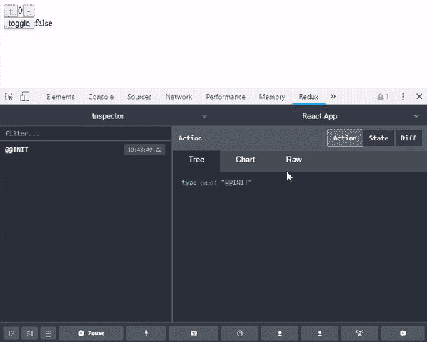

# Redux Devtools 扩展和 Laco

> 原文：<https://dev.to/deam/laco---debugging-actions-and-the-global-state-object-100a>

关于 Laco 的简短介绍，请查看我之前的文章。

了解动作的概况，它们何时被触发，以及全局状态对象发生了什么，确实有助于调试一个复杂的大型项目。

Redux Devtools 是一个扩展，它提供了一个用户界面，在这里你可以获得动作的概述。你甚至可以跳过或跳到通常被称为“时间旅行”的动作。你还可以看到整个应用程序的全局状态，并查看每个商店。当你在动作之间跳转时，全局状态甚至会改变。

Redux Devtools 在开发模式下与 Laco 一起开箱即用。只是缺少了一些使用 Redux 时通常会有的特性。虽然 Laco 使用最重要的功能，如时间旅行和能够查看全局状态对象。

[Laco](https://github.com/deamme/laco) 类似于 Redux，在后台对全局状态进行操作。每个商店都有一个全局状态对象的唯一 id，可以在 Redux Devtools 中查看。你也可以通过做
得到全局状态

```
import { Store, getGlobalState } from 'laco'

const CounterStore = new Store({ count: 0 })
const ToggleStore= new Store({ toggle: false })

getGlobalState()
// Outputs an object:
// {
//   "0": { count: 0 },
//   "1": { toggle: false },
// } 
```

为了查看哪些动作属于哪些存储，我们需要用一个给定的名称初始化一个存储，如下:

```
import { Store } from 'laco'

const CounterStore = new Store({ count: 0 }, "CounterStore") 
```

否则，您将只能在 Devtools 中看到操作名称，而看不到哪个存储了已更改的操作。

为了让给定的动作在 Devtools 中显示出来，你还需要在调用 store 上的`set()`时给它一个名字:

```
import { Store } from 'laco'

const CounterStore = new Store({ count: 0 }, "CounterStore")

// Implementing some actions to update the store
const increment = () => CounterStore.set(state => ({ count: state.count + 1 }), "Increment");
const decrement = () => CounterStore.set(state => ({ count: state.count - 1 }), "Decrement"); 
```

因为它是传递给`set()`方法的第二个参数的字符串，如果需要的话，你甚至可以提供更多的信息——它不必是一个“名称”。

基本就是这样！下面是展示 Redux Devtools 强大功能的 GIF:

[](https://res.cloudinary.com/practicaldev/image/fetch/s--wsRLwbCI--/c_limit%2Cf_auto%2Cfl_progressive%2Cq_66%2Cw_880/https://im5.ezgif.com/tmp/ezgif-5-3d0da270acd1.gif)

查看[代码沙箱](https://codesandbox.io/s/6l7on1m473)亲自尝试一下。:)