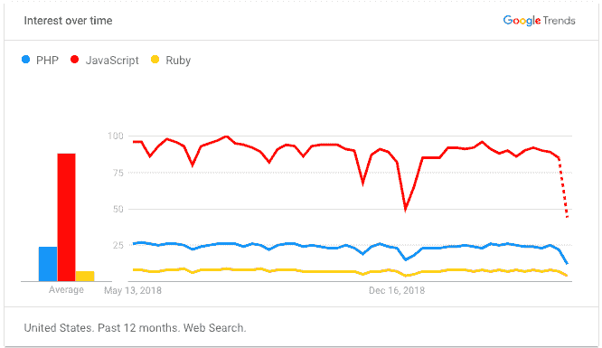

# LAMP vs. MEAN:哪种堆栈适合您？

> 原文：<https://dev.to/atlassian/lamp-vs-mean-which-stack-is-right-for-you-4he2>

web 堆栈是用于构建 web 应用程序的软件或技术的集合。选择很多，但选择一个可能很难。

当与同事、开发人员或客户聊天时，关于使用什么技术和堆栈的建议有天壤之别。当我开始成为一名 web 开发人员时，我走的是通常的道路:学习 HTML & CSS，探索一些 PHP——当然还有 MySQL。如果你没有使用 Java 或 ASP.NET，这是当时的技术栈。无论你是想主持一个博客、一个公告板还是成为一个图像主持人，你都需要这些东西:Linux、Apache、MySQL 和 PHP (LAMP)。

这里是 LAMP 和相对较新的 MEAN 栈的详细概述，这是目前最流行的开源 web 栈，并简要概述了其他栈。无论您选择哪一个堆栈， [Bitbucket](http://bitbucket.org/product) 都适用于它们。

### 灯

LAMP 为开发和托管大型高性能 web 应用程序提供了一个强大的平台。有了最大最老的社区，无数的库和工具，你可以得到很大的支持，并且很容易找到开发者。

其组成部分包括:

**L**Linux(OS)

一个网络服务器

数据持久性

HP(编程语言)

该堆栈还有一些衍生产品:

*   LAMP(用 Perl 或 Python 代替 PHP)
*   LAMP(用 MongoDB 代替 MySQL)
*   WAMP(视窗操作系统)
*   MAMP (Mac OS X as OS)
*   XAMPP(任何 OS + Perl 或 PHP + FTP 服务器)
*   PostgreSQL 作为数据库

#### 优点:

LAMP 是 web 开发的恐龙，被成千上万的公司使用，因此维护和支持得很好。有了无限的模块、库和附件，您可以根据公司的需求进行调整。

基于 Linux，您可以在大型开源社区中找到任何主题的帮助。MySQL 是一个非常可靠和可扩展的解决方案。PHP 在第 7 版，也有一个成熟的大社区支持。PHP 也非常快，并且与栈的其余部分集成得很好。

您可以控制服务器并决定安装哪些版本和软件，因此您不必依赖客户端的浏览器。如果您有许多服务器端任务，这是最佳选择。

#### 缺点:

因为它很容易学习，所以有很多开发人员没有遵循最佳实践，构建垃圾应用程序。从 PHP 开始很容易，但是掌握它很难。这些 PHP 应用的安全性也是如此。有些人还会把它描述成脚本语言，而不是真正的编程语言，因为它不是强类型的，也不是预编译的。我建议深入研究 PHP、Python 或 Perl 的优缺点。

至于 MySQL，其他选择也越来越成熟。像 MongoDB 这样的 NoSQL 数据库由于其可伸缩性而在当今的企业中很受欢迎。此外，像 MEAN 这样的纯 JavaScript 栈每年都会获得更多的关注，新开发人员可能不会对学习 LAMP 的所有技能感兴趣。

### 意思是

与 LAMP 相比，平均堆栈相当新。它最大的区别之一是 MEAN 不依赖于特定的操作系统——node . js 负责服务器端的执行。特别向 JavaScript 爱好者推荐 MEAN Stack 因为它在所有级别都使用 JavaScript。这也让它成为新开发者的首选。

与 MySQL 的关系数据库系统相比，MongoDB 是一个流行且灵活的基于文档的 NoSQL 数据库。Angular 有助于构建先进的现代网络应用。

其组成部分是:

ongoDB(数据持久性)

服务器端应用程序框架

客户端应用程序框架

ode.js(服务器端环境)

这个堆栈也有一些衍生物:

*   MERN(反应而不是角度)
*   MEEN (Ember.js 代替 Angular)

#### 优点:

使用 JavaScript 作为主要编程语言是一个巨大的优势。一切都可以在 JS 中快速设置和完成，这使得寻找开发人员更加容易，LAMP 开发人员通常也知道 JavaScript。MongoDB 因其简单的无模式数据持久性而非常受欢迎，如果有大量读取请求，它比 MySQL 更快。Angular 由谷歌维护也是一大利好。它不断接收新的版本和功能。另一个巨大的优势是能够轻松构建移动或桌面应用程序，例如使用 Ionic。代码和组件可以很容易地重用或添加。

#### 缺点:

像所有新技术一样，MEAN 的魅力正在制造一些炒作。开发人员被这种宣传所迷惑，用 JavaScript 开发他们的应用程序，只是因为它很时髦。这些库和框架中有许多都是非常新的，而且新版本会很快发布，所以维护你的应用会变得非常麻烦。由于许多技术在几年后消失，可持续性可能成为一个问题。随着应用程序的增长，维护干净的代码库和遵循最佳实践也变得更加困难。此外，你必须依赖客户端和客户端的可用技术，例如，如果你的目标是 IE 用户，嵌入式系统或低端电脑，可能会有可用性问题。

### 其他几迭考虑:

**WISA**T2【Windows Server/IIS/微软 SQL Server /

不是开源的，但所有组件都来自微软，所以它应该可以无缝地工作。

**LAMP(带 MongoDB)** *Linux，Apache，MongoDB，PHP*

像 MongoDB 这样的 NoSQL 数据库也可以用在经典的 LAMP 环境中。

**Ruby 栈***Ruby/Ruby on Rails/RVM(Ruby 虚拟机)/ SQLite*

这种堆栈越来越不受欢迎。Ruby on Rails 曾经是一个经常使用的框架，因此是整个堆栈。

**Java+Spring**

Spring 提供了一个用 Java 编写的完整的全栈框架，这是大型企业的首选，也是独立开发者的忌惮。

**Django 栈***Python/Django/Apache/MySQL*

Django 框架深受 Python 开发人员的喜爱，提供了高性能，并且经常被称为易于学习的堆栈。

### 哪个栈用的比较频繁？

很难比较栈的受欢迎程度，但你可以使用 [Google Trends](https://trends.google.com/trends/) 来比较编程语言，感受一下人们在搜索什么。如下图所示，现在 JavaScript 比 PHP 更受欢迎。

我建议不时使用谷歌的趋势工具来查看发展趋势。

我还建议更深入地研究数据库(SQL 和 NoSQL ),以获得对这两个概念的基本理解并做出选择。

### 那么，怎么挑一叠呢？

选择一个堆栈取决于许多因素。如果你是一个开发者或者项目负责人，这里有几个问题要问你自己。

*   我打算创建什么样的 web 应用程序？
*   它的预期寿命是多少？
*   我的客户/客户/卡特彼勒/…的基础设施中有哪些技术可用？
*   找到开发人员来维护应用程序有多容易？

我给你举个例子。假设你有一个二手车上市网站。前阵子用灯栈开发的。但你的网站缺乏二手车经销商的后端，他们可以在你的网站上管理他们的清单。根据你的公司规模、时间和预算，你必须问自己以上所有的问题。如果您有一个小团队，在 LAMP 环境中扩展您现有的应用程序可能是有意义的。因为你的开发者了解这个生态系统，这样会更快。如果您有多余的时间和资源，您可以采用另一种方法，用 API 扩展您现有的 LAMP 应用程序。稍后，您的团队可以专注于开发一个小型的、独立的(M)EAN 应用程序，该应用程序易于维护，可以用新的特性进行改进，并且可以用更快的周期发布。

另一个例子:你想建立一个通讯平台，人们可以注册，上传邮件列表，撰写邮件等等。你当然可以使用平均，但你有大规模和高流量的潜力。使用 LAMP 栈作为基础可能更有意义，因为 Linux、MySQL 和 Apache 提供了一个稳定的、可伸缩的环境，并为任何可想到的问题提供了大量的社区支持。您还会有许多服务器端任务和 cronjobs，并且会遇到像 SMTP 等邮件主题。在这种情况下，我会推荐一个根据您的需求定制的 Linux 环境。

以下是一些需要了解/考虑的事情的总结。

意思是

*   单一代码库(JavaScript)
*   受现代网络应用和混合应用的欢迎
*   由像谷歌这样的大公司支持
*   更适合大量逻辑发生在客户端的应用程序
*   由于 javascript 生态系统的快速发展，更难长期维持
*   最适合渐进式网络应用

灯

*   更适合大型应用
*   更成熟，庞大的社区
*   成熟的应用程序框架，如 Symfony、Zend、Laravel
*   更容易遵循标准，也更容易保持代码干净

如果你是编程和 web 开发的新手，问问自己:

*   对你和你的团队来说，最容易学会的是什么？
*   哪些技术是趋势，哪些技术将会长期胜出？
*   如果开源，你能想象为这个项目做贡献吗？
*   从长远来看，哪些技术将为你个人服务？

寻找 JavaScript 技术答案的一个很好的资源是 StateOfJS 项目[—https://stateofjs.com/](https://stateofjs.com/)—这个项目每年都会进行一次调查，询问数千名开发人员对当前技术和工资的看法。

这是 Christoph Heike 在 Bitbucket 上发表的一篇客座博文——“我从事 web 应用程序开发已经超过 10 年，目前在德国波恩经营着一家 web 开发机构。我还参与了一家基于亚马逊的科技初创公司。我的目标是始终交付干净、可持续和高性能的软件解决方案。在 [*LinkedIn*](https://de.linkedin.com/in/christoph-heike-37ab626a) *上和我联系。”*

喜欢分享你的技术专长吗？了解更多关于[位桶编写程序](https://bitbucket.org/product/write?utm_source=blog&utm_medium=post&utm_campaign=bottom-post)的信息。

*原载于 2019 年 5 月 2 日*[*【https://bitbucket.org】*](https://bitbucket.org/blog/lamp-vs-mean-which-stack-is-right-for-you)*。*