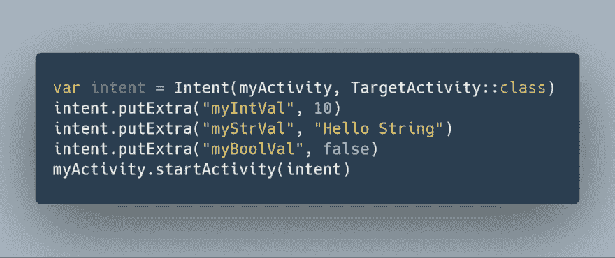
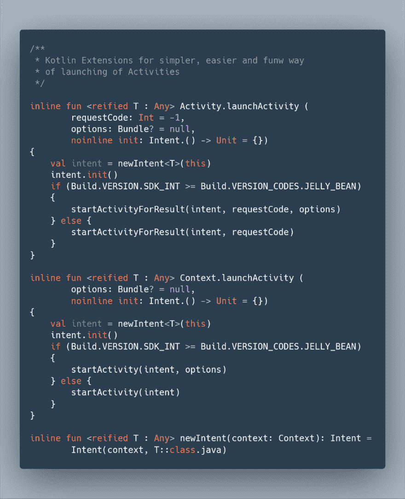
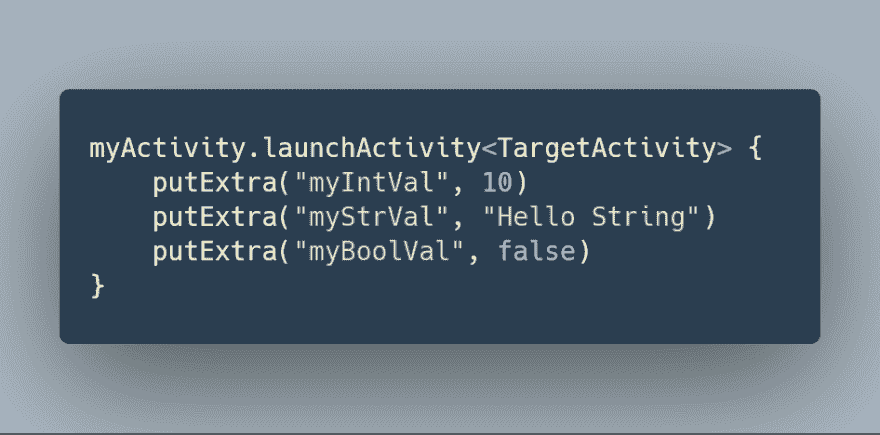
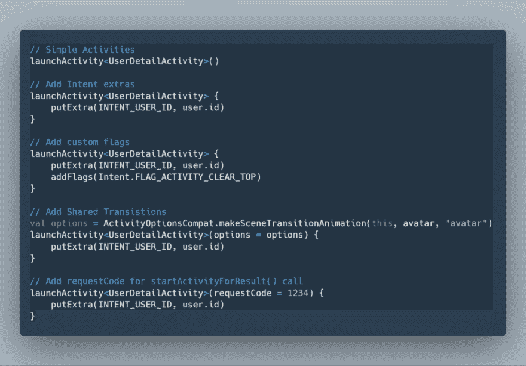

# 使用 Kotlin 扩展以更简单的方式启动活动

> 原文：<https://dev.to/wajahatkarim/launching-activities-in-easier-way-using-kotlin-extensions-121h>

#### Kotlin 扩展，以更简单、更容易和有趣的方式在 Android 中启动活动

> 最初发表于[https://wajahatkarim.com](https://wajahatkarim.com)

几天前，我读了一篇由 [Elye](https://medium.com/u/5742b4fcf89e) 写的关于 Kotlin 关键词具体化的文章。读完这篇文章后不久，我开始探索它，我意识到我们可以使用具体化和 Kotlin 扩展方法来简化许多可重用的 Android 开发任务。比如开展活动。

* * *

### 🔲发布活动—传统方式

在 android 应用中启动活动是一项常见的任务，不同的开发者使用不同的方法。有些人使用传统的方法创建意图包，并在 startActivity()方法中将它们与意图一起传递。

让我们看看开始另一项活动的典型传统方式

现在，如果我们在里面传递一些参数，这就变得更复杂了。

* * *

### 💥开展活动——更简单、更容易、更有趣的方式

但是，使用 reifiedkeyword 创建一些 Kotlin 扩展方法，我们可以使这些变得更加简单和有趣。

<figcaption>【github GIS:t5】[https://gist . github . com/wajaatkarim 3/D3 a 728 dbb 20002 DC 54 AC 44 bad 40 e 4077](https://gist.github.com/wajahatkarim3/d3a728dbb20002dc54ac44bad40e4077)</figcaption>

现在，在此之后，我们可以像这样做相同的启动活动内容(之前的示例):

或者我们可以传递这样的论点:

以下是您可以使用这些扩展的所有情况:

<figcaption>【github GIS:t5】[https://gist . github . com/wajaatkarim 3/D3 a 728 dbb 20002 DC 54 AC 44 bad 40 e 4077](https://gist.github.com/wajahatkarim3/d3a728dbb20002dc54ac44bad40e4077)</figcaption>

* * *

**如果你喜欢这篇文章，你可以阅读我下面的新文章:**

*   ⚡，你的 Android 工作室总是很慢吗？🚀下面介绍一下如何立刻提速。
*   [📆2018 年回顾](https://dev.to/wajahatkarim/reflections-on-2018my-year-in-review-144)

* * *

**Wajahat Karim** 毕业于[NUST](http://nust.edu.pk)，是一名经验丰富的移动开发人员，一名活跃的开源贡献者，也是两本书[学习 Android 意图](https://www.amazon.com/Learning-Android-Intents-Muhammad-Usama/dp/1783289635)和[用 Unity 掌握 Android 游戏开发](https://www.amazon.com/Mastering-Android-Game-Development-Unity/dp/1783550775/)的合著者。在业余时间，他喜欢和家人呆在一起，做编码实验，喜欢写很多东西(主要是在他的博客和媒体上),并且是开源的热情贡献者。2018 年 6 月，他的一个库在 [Github Trending](https://github.com/trending) 上成为第一名。[他的库](http://github.com/wajahatkarim3)在 Github 上有大约 3000 颗星星，并被全球各地的开发者用于各种应用。在 [Twitter](https://twitter.com/wajahatkarim) 和 [Medium](https://medium.com/@wajahatkarim3) 上关注他，以获得更多关于他的写作、Android 和开源工作的更新。

* * *