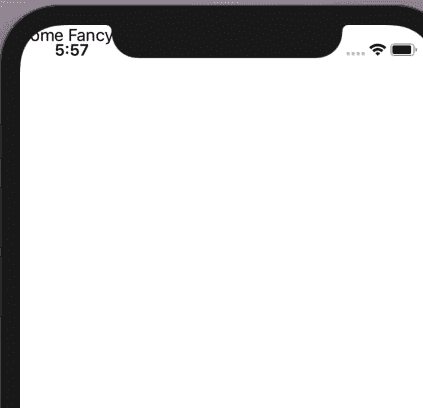
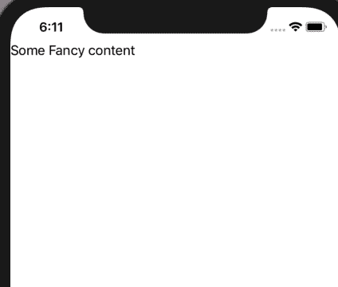
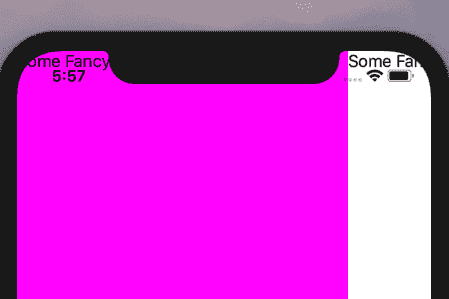
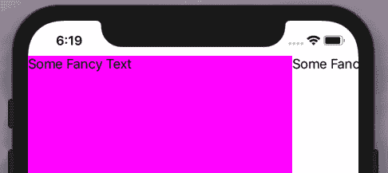

# 在 Xamarin 表单中为 iOS 布局安全区域

> 原文：<https://dev.to/eatskolnikov/layout-safe-areas-for-ios-in-xamarin-forms-bhk>

自 iPhone X 推出以来，iOS 设备的屏幕顶部就有一个缺口，在这个缺口周围工作往往很烦人。您必须添加某种边距，以避免控件被它覆盖。这种方法的问题在于，你必须考虑手机是处于横向模式还是纵向模式。

<figure> 

<figcaption>试图用文本显示一个标签</figcaption>

</figure>

为了避免这些挫折，Xamarin Forms 引入了一个 SafeArea 标志，您可以在页面布局上设置它，以确保它的内容会根据设备的方向自动调整边距。

可以用 C#设置

或者使用 XAML，看看下面声明的 ios 名称空间，然后看看我们是如何设置标志的

你会得到这样的结果:

<figure> 

<figcaption>文字与缺口保持健康距离，可以清晰看到。</figcaption>

</figure>

需要考虑的一件非常重要的事情是，你需要为屏幕上的每个 T2 页面设置这个标志。比方说，您有一个如下所示的 MasterDetailPage:

<figure> 

<figcaption>哦不！主图和详图都被重叠):
</figcaption>

</figure>

要修复它，您必须将主页面和详细页面的安全区域都设置为如下所示:

现在它看起来像这样:

<figure> 

<figcaption>没有文字被重叠！耶！</figcaption>

</figure>

这是另一个简短的，但希望非常有用。如果你喜欢它，请在社交媒体上分享，或者在你当地的教会团体中分享。我将非常感激。祝你过得愉快。

帖子[以 Xamarin 形式为 iOS 布局安全区域](https://blog.torib.io/2019/04/24/layout-safe-areas-for-ios-in-xamarin-forms/)最早出现在 [Enmanuel Toribio](https://blog.torib.io) 上。