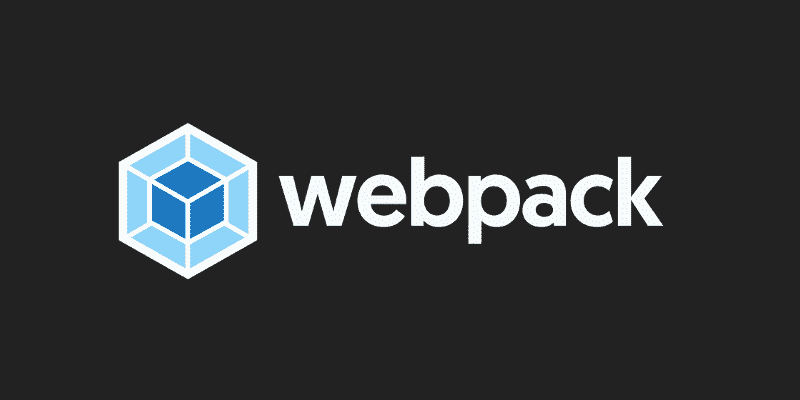

# 用 Webpack 延迟加载模块

> 原文：<https://dev.to/brsjsk/lazy-loading-modules-with-webpack-4emg>

[](https://res.cloudinary.com/practicaldev/image/fetch/s--x2PibNeH--/c_limit%2Cf_auto%2Cfl_progressive%2Cq_auto%2Cw_880/https://thepracticaldev.s3.amazonaws.com/i/b14q99oadv8qik76vqe3.png)

Webpack 是一个很棒的工具，至少了解它的基本知识真的很棒。如果我们正在使用 Angular CLI，或者创建 React 应用程序，我们已经在那里设置了 webpack，但是如果我们正在使用不使用 Javascript 框架的 web 应用程序，我们可能应该使用 bundler。当然，我们可以选择不需要设置的包，但如果我们想要更多的控制，就选择 Webpack。我的个人网站全是 Javascript，只有一个 HTML 文件，没有框架。我使用 webpack 作为捆绑器和延迟加载来提高性能，我真的很喜欢它！

首先，运行 npm init -y 并创建以下结构:

```
src / 
--- notLazyLoaded.js
--- lazyLoaded.js
index.html
main.js
webpack.config.js 
```

运行以下命令来安装 webpack:

```
npm install webpack webpack-cli html-webpack-plugin webpack-dev-server --save-dev 
```

我们已经安装了 webpack，webpack 插件，用于将我们的 index.html 添加到捆绑包和开发服务器中。

让我们添加一些代码到我们的 webpack 配置中

```
const path = require("path");
const HtmlWebpackPlugin = require("html-webpack-plugin");

module.exports = {
  entry: "./main.js",
  output: {
    filename: "[name].[hash].bundle.js",
    path: path.resolve(__dirname, "dist")
  },
  devtool: "inline-source-map",
  devServer: {
    contentBase: "./dist",
    port: 9000
  },
  plugins: [
    new HtmlWebpackPlugin({
      template: "./index.html"
    })
  ]
}; 
```

在我们的 package.json 中，添加一个脚本进行捆绑并运行。

```
 "webpack": "webpack-dev-server --open" 
```

非常简单，但它将捆绑我们的应用程序，并在端口 9000 上打开我们的 web 应用程序。

在 HTML 文件中，我添加了两个按钮，一个调用 notLazyLoaded.js，另一个调用 lazyLoaded.js

```
<body>
    <button id="alert">Alert</button> 
    <button id="lazyAlert">Lazy Alert</button>
  </body> 
```

lazyLoaded.js 和 notLazyLoaded.js 的代码基本相同。

# 已卸载。js

```
const showLazyAlert = () => {
  alert("Hello from lazyLoaded.js");
};

export { showLazyAlert }; 
```

```
const showAlert = () => {
  alert("Hello from notLazyLoaded.js");
};

export { showAlert }; 
```

在我们的 main.js 中，我们将添加代码，根据单击的按钮显示警告。

```
import { showAlert } from "./src/notLazyLoaded";

window.onload = () => {
  const alertBtn = document.querySelector("#alert");
  const lazyAlertBtn = document.querySelector("#lazyAlert");

  alertBtn.addEventListener("click", () => {
      showAlert();
  });
}; 
```

目前，如果我们打开应用程序，我们会在网络选项卡中看到，在初始加载时仅加载了 main.js，我们单击“Alert”按钮，会显示一条已经加载到捆绑包中的警报。现在到了主要部分，做了一些修改，这样当用户点击“懒惰警告”按钮时，lazyLoaded.js 模块就会加载并执行。

在 main.js 中，添加以下代码

```
lazyAlertBtn.addEventListener("click", () => {
    import(/* webpackChunkName: "lazyLoaded" */ './src/lazyLoaded').then(module => {
        module.showLazyAlert();
    }); 
```

保存并打开应用程序。在初始加载时，我们只加载了 main.js 包，当我们单击 Lazy Alert 按钮时，lazyLoaded.js 包加载并执行代码。就是这样。它将只在需要加载时加载，并将改善应用程序的初始加载时间和整体性能。

源代码托管在 Github 上。

```
git clone https://github.com/BrsJsk/webpack-lazy-loading
cd webpack-lazy-loading
npm i
npm run webpack 
```