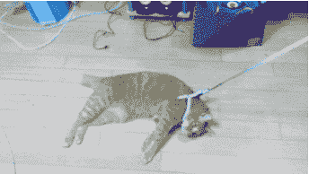
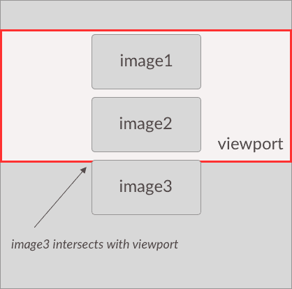

# 使用 IntersectionObserver API 进行延迟加载

> 原文：<https://dev.to/iggredible/lazy-loading-with-intersectionobserver-api-3d6h>

[](https://res.cloudinary.com/practicaldev/image/fetch/s--zYWejii7--/c_limit%2Cf_auto%2Cfl_progressive%2Cq_66%2Cw_880/https://thepracticaldev.s3.amazonaws.com/i/dfhkoiqimufpr5zv0z36.gif)

戴夫，大家好！这是我的第一篇帖子！非常兴奋地分享我最近学到的关于延迟加载的知识。请让我知道我如何能做得更好！

惰性加载图像对于加载有很多内容的页面很有用。我们可以很容易地找到这样做的库，比如 [yall.js](https://github.com/malchata/yall.js) 和 [lozad.js](https://apoorv.pro/lozad.js/) 。这些库的共同点是它们都使用[交叉点观察器 API](https://developer.mozilla.org/en-US/docs/Web/API/Intersection_Observer_API) 。让我们学习如何使用`IntersectionObserver`,这样我们就可以理解这些库是如何工作的——或者甚至编写我们自己的库！

首先，我将简要解释一下`IntersectionObserver`的作用，其次，如何使用它来延迟加载你自己的图像。

# intersect observer 是做什么的？

(外行话)`IntersectionObserver` *异步检测元素何时与祖先元素(通常是 viewport)相交，并调用回调函数。*

[](https://res.cloudinary.com/practicaldev/image/fetch/s--Cgg9Unxp--/c_limit%2Cf_auto%2Cfl_progressive%2Cq_auto%2Cw_880/https://thepracticaldev.s3.amazonaws.com/i/gwvj2lrwfy97ljpj9lv3.png)

想象一个包含图像的视口。当页面加载时，一些图像直接放置在视窗中，而另一些图像则位于视窗下方，等待用户向下滚动以便能够看到。当用户向下滚动时，一些位置较低的图像的顶部最终会与底部视口相交。当第一个顶部图像像素与视口相交时，回调函数加载图像。

# 样本用法

让我们看看文件！Mozilla 善意地给了我们一个起点。

```
var options = {
  root: document.querySelector('#scrollArea'),
  rootMargin: '0px',
  threshold: 1.0
}

var observer = new IntersectionObserver(callback, options);
var target = document.querySelector('#listItem');
observer.observe(target); 
```

Enter fullscreen mode Exit fullscreen mode

以上是惰性加载`#listItem`的最小设置(从技术上讲，options 是可选的，因此`var observer = new IntersectionObserver(callback);`是运行它的一种更简洁的方式)。

好吧，让我们把它用在更现实的场景中。我们将:

1.  有 10 个 HTML 图像，我们将懒惰加载
2.  添加 CSS 渐变动画
3.  添加 IntersectionObserver 以加载图像

# HTML 设置

```
<div></div>
<div></div>
<div></div>
<div></div>
<div></div>
<div></div>
<div></div>
<div></div>
<div></div>
<div></div> 
```

Enter fullscreen mode Exit fullscreen mode

如果您注意到，它没有使用`src`而是使用了`data-src`属性。延迟加载的一个策略是从 HTML 的`data-*`属性开始，因为`data-src`不会加载图像。

# CSS 设置

```
.fade {
 animation-duration: 3s;
 animation-name: fade;
}
@keyframes fade {
 from {
 opacity: 0;
 }
 to {
 opacity: 1;
 }
} 
```

Enter fullscreen mode Exit fullscreen mode

该设置是可选的。我认为让图像缓慢加载淡入淡出动画有助于我们的观察(而且更美观)。

顺便说一句，如果你使用 Chrome DevTool，你可以在网络标签上查看图片下载的时间。

# JS 设置

我希望图像只有在 50%与视口相交时才加载。这是如何设置的:

```
const images = document.querySelectorAll(‘img’)
const observer = new IntersectionObserver(entries => {
 entries.forEach(entry => {
 if(entry.isIntersecting) {
 const target = entry.target
 target.setAttribute(‘src’, target.dataset.src)
 target.classList.add(‘fade’)
 observer.unobserve(target)
 }
 })
}, {
 threshold: 0.5
})
images.forEach(image => observer.observe(image)) 
```

Enter fullscreen mode Exit fullscreen mode

我想强调几件我在学习 IntersectionObserver 时很难理解的事情。

*   参数条目表示`IntersectionObserver`下的所有图像元素(我发现用`images.forEach`和`entries.forEach`重复两次有点奇怪，但这就是它的工作方式)。在初始页面加载时，所有条目都被调用。有些会立即相交(如果页面渲染时它们在视口内),而有些不会。那些直接相交的函数会立即调用它们的回调函数。

*   `entry.isIntersecting`当图像与视口相交时返回 true。另一个常见的交叉检查是`entry.intersectionRatio > 0`。

*   如前所述，延迟加载的一个常见策略是在没有`src`的情况下开始。就在用户将要看到之前，我们将值从`data-src`传送到`src`。

*   在加载对象后不观察它是一种很好的做法。
    我们可以通过`threshold`或`rootMargin`选项改变交叉的数量或位置。祖先元素可以用 root 更改(默认为 viewport)。

# 结论

在撰写本文时，intersectionObserver 可以在除 IE 之外的主要浏览器中使用。查看[can use](https://caniuse.com/#feat=intersectionobserver)网站获取完整列表。

`IntersectionObserver`通过在回调时将值从 data-src 传递到 src，有助于将元素延迟加载到 viewport 中。同样的策略可以应用于其他元素。

以下是我读过的关于`IntersectionObserver`的文章，我发现这些文章很有用(我不隶属于它们中的任何一个，只是感谢它们提供的信息，我希望这些信息也能帮助你！)

*   [火船](https://fireship.io/snippets/intersection-observer-lazy-load-images/)

*   [鳄鱼](https://alligator.io/js/intersection-observer/)

*   [googledev](https://developers.google.com/web/fundamentals/performance/lazy-loading-guidance/images-and-video/)

如果您发现任何错误或我如何改进，请随时告诉我。非常感谢你读到这里。你们太棒了！