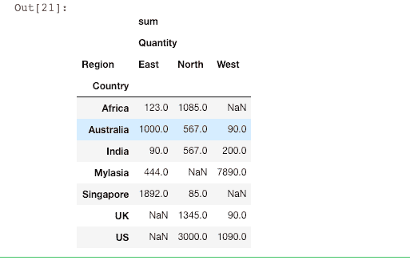
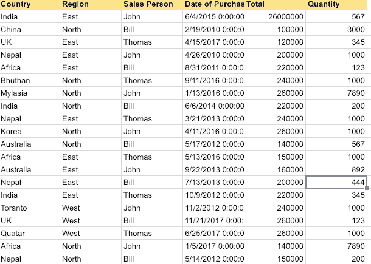
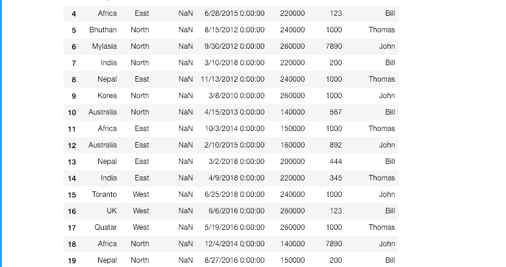
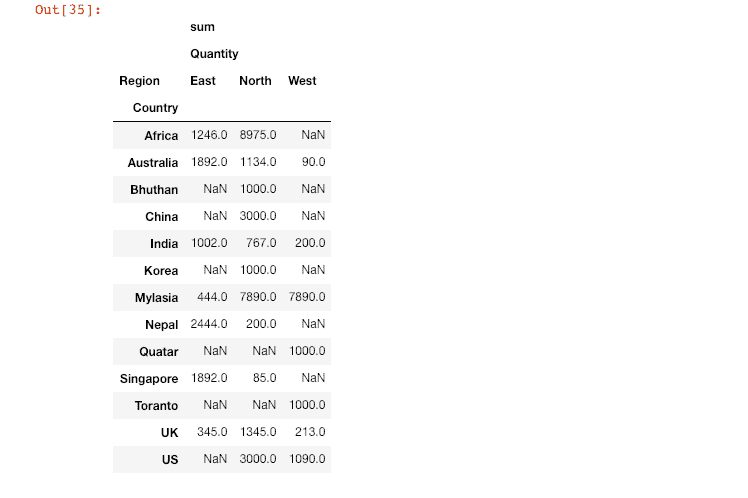
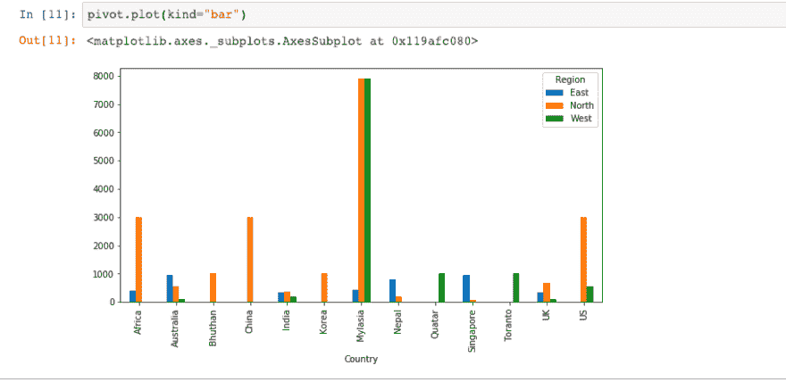
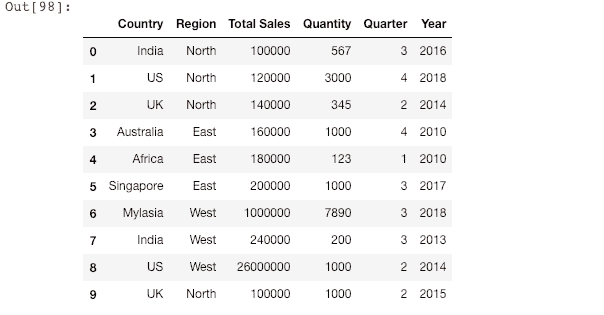

# 通过用例了解熊猫——第二部分

> 原文：<https://dev.to/bhavaniravi/learn-pandas-via-usecasespart-2-c7m>

### 通过用例了解熊猫——第二部分

更多的用例带来更多的功能

<figure>[](https://res.cloudinary.com/practicaldev/image/fetch/s--aHFVzzGb--/c_limit%2Cf_auto%2Cfl_progressive%2Cq_auto%2Cw_880/https://cdn-images-1.medium.com/max/1024/1%2ADORL1J_q5VpQbj1IMxjcJw.png) 

<figcaption>带标题的预览图像</figcaption>

</figure>

在上一篇博客中，我希望我已经告诉你，Pandas 是一个快速简单的数据分析的神奇图书馆，它比你想象的更容易使用。如果你没有看过我的第一篇关于熊猫的博客，请在继续前进之前浏览一下。

### 哎呀！！我们遗漏了一些数据

在上一篇博客中，我们看到了使用示例销售数据的基本 Dataframe 操作。让我们假设你是一个领导销售团队的经理，你对销售轨迹和你从我们的[上一篇博客中学到的数据的枢纽表示都很满意。](https://dev.to/bhavaniravi/get-started-with-python-pandas-in-5-minutes-3d5p)

```
import numpy as np
df.pivot\_table(index=["Country"], 
               columns=["Region"], 
               values=["Quantity"], 
               aggfunc=[np.sum]) 
```

<figure>[](https://res.cloudinary.com/practicaldev/image/fetch/s--C-P-OBAr--/c_limit%2Cf_auto%2Cfl_progressive%2Cq_auto%2Cw_880/https://cdn-images-1.medium.com/max/513/1%2A2Yzqv84C2dQ1H7ei46p4xw.png) 

<figcaption>一个简单的透视表</figcaption>

</figure>

这时你意识到你错过了某个季度的销售数据，因为它在一个电子表格中丢失了。现在，你做什么？您已经准备好了一份报告。如何在不进行重大更改的情况下将新数据合并到当前的透视表示中？

[](https://res.cloudinary.com/practicaldev/image/fetch/s--RJq3hV92--/c_limit%2Cf_auto%2Cfl_progressive%2Cq_auto%2Cw_880/https://cdn-images-1.medium.com/max/610/1%2A2wosYjyZukkLzRam_0hV-g.png)

如果你看到，数据透视表是由一个单一的数据框架 df 构建的，不知何故，如果我们能找到一种方法把我们的新数据输入到 df 中，那么我们只需重新运行数据透视表代码，瞧！！我们会再拿到报告的。

这是我们将要遵循的步骤，

#### 1。将新的电子表格数据加载到新的数据框架中

```
df2 = pd.read\_csv("data/Pandas - Q4 Sales.csv")
df2.head() 
```

#### 2。将两个数据帧组合成单个 df 对象，

**使用** **串联**

Pandas *Concat* 方法连接多个数据帧的内容并创建一个新的数据帧。

该方法的轴参数使您能够沿行或列连接数据

```
result\_df = pd.concat([df, df2], axis=0, sort=False)
# axis = 0, append along rows, 
# axis = 1, append along cols

result\_df.tail() # tail is similar to head returns last 10 entries 
```

**使用** **追加**

与 concat 不同，append 方法将数据添加到现有的数据帧中，而不是创建新的数据帧。另外，您可以注意到，我们在这里没有提供任何轴参数，因为 append 方法只允许添加新的条目作为行。

```
result\_df = df.append([df2],sort=False)
result\_df.tail() 
```

如果仔细观察，在这两种情况下，需要组合的数据框都以 python 列表[df1，df2]的形式提供。这意味着我们可以组合任意多的数据帧

[](https://res.cloudinary.com/practicaldev/image/fetch/s--cCuJLFvM--/c_limit%2Cf_auto%2Cfl_progressive%2Cq_auto%2Cw_880/https://cdn-images-1.medium.com/max/829/1%2AsZBser6lydrrLqOU3QlqKw.png)

#### 3。重新运行透视代码

```
pivot = result\_df.pivot\_table(index=["Country"], 
                              columns=["Region"], 
                              values="Quantity") 
```

[](https://res.cloudinary.com/practicaldev/image/fetch/s--a7_Q0bzz--/c_limit%2Cf_auto%2Cfl_progressive%2Cq_auto%2Cw_880/https://cdn-images-1.medium.com/max/748/1%2AT73GGsx5cakFKR7ubxKk8g.png)

### 图表比表格好

你有几个小时的时间开最后一次会。你的陈述很具体，你的销售很好，但是仍然缺少了一些东西。**图表。对于一个习惯了电子表格图表的管理人员来说，把它们留在身后不是一个好主意。但是，我们有很短的时间回到电子表格，不是吗？不要担心，Pandas 带有一个内置的图表框架，可以让您绘制我们的枢轴表示图**

[](https://res.cloudinary.com/practicaldev/image/fetch/s--kbxmuGYz--/c_limit%2Cf_auto%2Cfl_progressive%2Cq_auto%2Cw_880/https://cdn-images-1.medium.com/max/910/1%2Au1U5Gh_Hfa6UOnvEtqfavg.png)

### 圆满

作为一个以完美著称的人，你有些地方不太好。您创建的一个表格表示包含您的管理层不感兴趣的不必要的信息，并且有几列的名称在您的公司内部使用，不会对管理层产生任何影响。

别担心，我们可以一次完成*并且相当快。在熊猫术语中，我们称这种方法为链接。*

*方法链接使您能够对同一数据执行各种转换，而无需存储中间结果。*

1.  显性的总比隐性的好于是让我们把 ***的“总销售额”改名为***
2.  我们不需要购买日期，只需要 ***年*** 和 ***季度***
3.  我们不需要购买请求者、销售人员和购买日期。所以还是 ***算了吧。*T3】**

```
result\_df.rename({"Total": "Total Sales"}, axis=1)\
         .assign(Quarter=result\_df['Date of Purchase'].dt.quarter, \
                 Year=result\_df['Date of Purchase'].dt.year) \
         .drop(["Requester", "Sales Person", "Date of Purchase"], axis=1).head() 
```

[](https://res.cloudinary.com/practicaldev/image/fetch/s--PkEJ0_zd--/c_limit%2Cf_auto%2Cfl_progressive%2Cq_auto%2Cw_880/https://cdn-images-1.medium.com/max/604/1%2ANhFN6F7W5LOShm-SnIL0RQ.png)

### 最后一件事

这样，我们的最终报告看起来不错，你猜怎么着？您的管理层不仅对您今年的销售额感到高兴，而且对您对熊猫的新发现感到兴奋，但还有最后一件事，您需要将最终数据以 CSV 格式发送回您的管理层。但是别担心，我们有熊猫来帮你。

```
result\_df.to\_csv(path\_or\_buf="Export\_Data.csv") 
```

一个 *"Export_Data.csv"* 文件将在您当前的路径中创建，您可以很高兴地将其作为电子邮件附件发送给您的管理层。

当您靠在座位上休息时，您想要自动执行刚刚为将来的销售报告所做的熊猫实验。谢天谢地，过几天你会有一个实习生加入你的工作。对他来说，这将是一个伟大的工程。我的直觉告诉我事情不会像你想象的那么简单。我们将在下一篇博客 ***“熊猫怎么了？”*T3】**

[](https://res.cloudinary.com/practicaldev/image/fetch/s--HVj3NSg2--/c_limit%2Cf_auto%2Cfl_progressive%2Cq_auto%2Cw_880/https://cdn-images-1.medium.com/proxy/0%2Ao8QzTSReld8b16s1)

这篇博客是否促使你深入研究熊猫？

***按住*** *的“拍手”图标，在*[_ Twitter*([https://twitter.com/@bhavaniravi](https://twitter.com/@bhavaniravi))*上大喊一声。_

***关注*** *敬请关注未来博客。*