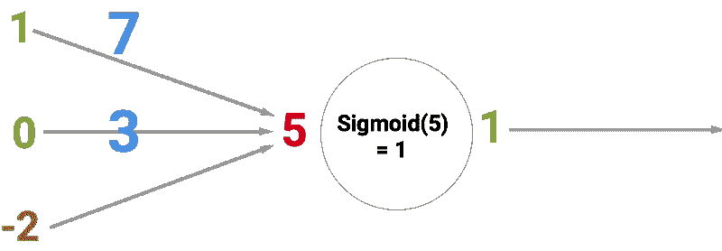
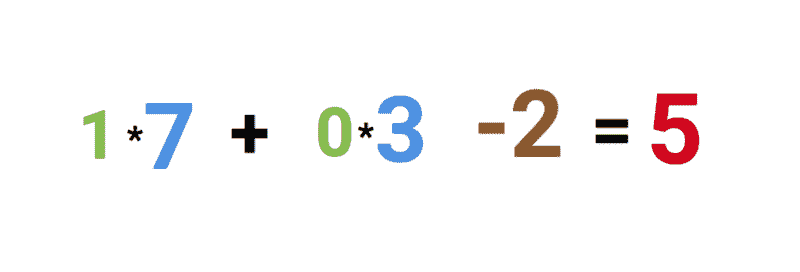
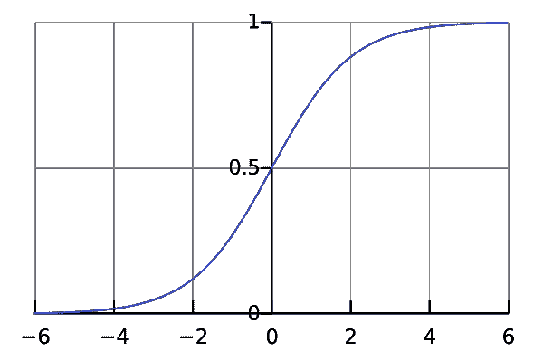

# 学习如何编码神经网络

> 原文：<https://dev.to/scrimba/learning-how-to-code-neural-networks-1mek>

这是我试图在短时间内学习新东西的系列文章中的第二篇。第一次是在一周内学会如何进行[机器学习。](https://blog.skcript.com/machine-learning-in-a-week-a0da25d59850#.p5e1j11ry)

这次我尝试学习神经网络。虽然我没有在一周内做到，但由于各种原因，我确实在 2015 年的夏天和秋天对它有了基本的了解。

通过*基本理解*，我的意思是我终于知道如何自己从头开始编写[简单神经网络](https://github.com/perborgen?tab=repositories)。

在这篇文章中，我会给出一些解释，并引导你找到我用过的资源，如果你有兴趣自己做这件事的话。

#### 第一步:神经元和正向传播

那么什么是神经网络呢？让我们从网络部分开始，从单个神经元开始。

> 一个神经元就像一个函数；它接受一些输入并计算一个输出。

下面的圆圈说明了一个人工神经元。它的输入是 5，输出是 1。输入是连接到神经元的三个突触的总和(左边的三个箭头)。

在最左边，我们看到两个输入值加上一个偏差值。输入值为 1 和 0(绿色数字)，而偏差值为-2(棕色数字)。

> 这里的输入可能是两个不同特征的数字表示。如果我们建立一个垃圾邮件过滤器，它可能是电子邮件是否包含一个以上的大写单词，以及是否包含单词“伟哥”。

然后，这两个输入乘以它们所谓的权重，即 7 和 3(蓝色数字)。

最后，我们加上偏差，最后得到一个数字，在这个例子中是:5(红色数字)。这是我们人工神经元的输入。

然后，神经元对这个数字进行某种计算——在我们的例子中是 Sigmoid 函数，然后输出结果。如果我们将数字向上舍入，这恰好是 1，因为 5 的 Sigmoid 等于 1(后面会有关于 Sigmoid 函数的更多信息)。

> 如果这是一个垃圾邮件过滤器，我们输出 1(而不是 0)的事实可能意味着神经元已经将文本标记为“垃圾邮件”。

](https://res.cloudinary.com/practicaldev/image/fetch/s--1l7eUx5g--/c_limit%2Cf_auto%2Cfl_progressive%2Cq_auto%2Cw_880/https://cdn-images-1.medium.com/max/600/1%2A5GSpUs2hWFx4Lq2_KCyulg.png) 
一个来自[维基百科的神经网络图解。](https://en.wikipedia.org/wiki/Artificial_neural_network)

如果你将这些神经元的网络连接在一起，你就有了一个神经网络，它向前传播——从输入输出，通过神经元通过突触相互连接，就像左边的图像。

我强烈推荐 YouTube 上的[韦尔奇实验室视频，以便更直观地了解这一过程。](https://www.youtube.com/watch?v=bxe2T-V8XRs)

#### 第二步:了解 Sigmoid 函数

在你看过韦尔奇实验室的视频后，花点时间看看 Coursera 的机器学习课程第四周是个好主意，它涵盖了神经网络，因为它会让你对它们如何工作有更多的直觉。

这个课程相当数学化，基于 Octave，而我更喜欢 Python。因此，我没有做编程练习。相反，我用视频来帮助我理解我需要学习的东西。

我意识到我需要进一步研究的第一件事是 Sigmoid 函数，因为这似乎是许多神经网络的关键部分。我对这个功能有一点了解，因为它也在同一门课的第 3 周[中讲述过。于是我又回去看了一遍这些视频。](https://www.coursera.org/learn/machine-learning/)

Sigmoid 函数只是将您的值(沿水平轴)映射到 0 到 1 之间的值。

但是看视频不会让你一路过关斩将。为了真正理解它，我觉得我需要从头开始编码。

于是我开始从头开始编写一个逻辑回归算法(刚好用到了 Sigmoid 函数)。

花了一整天的时间，这可能不是一个很好的逻辑回归实现。但这没关系，因为我终于明白了它是如何工作的。在这里检查代码[。](https://github.com/perborgen/LogisticRegression)

你不需要自己完成整个练习，因为它需要一些关于成本函数和梯度下降的知识，而你在这一点上可能没有。

但是一定要理解 Sigmoid 函数是如何工作的。

#### **第三步:理解反向传播**

理解一个神经网络如何从输入到输出并不难理解，至少在概念上是如此。

然而，更困难的是理解神经网络实际上是如何从一组数据样本中学习的。

这个概念被称为反向传播。

> 这实质上意味着你观察网络猜测的错误程度，然后相应地调整网络的权重。

在文章的开头，权重是我们神经元上的蓝色数字。

这个过程是反向进行的，因为您从网络的末端开始(观察网络的“猜测”有多错误)，然后在网络中反向移动，同时在途中调整权重，直到您最终到达输入。

手动计算需要一些微积分，因为它涉及到获得网络权重的一些导数。卡恩学院的微积分课程似乎是一个很好的开始，尽管我自己没有用过，因为我在大学里学过微积分。

> 注意:有很多为你计算导数的库，所以如果你想在完全理解数学之前开始编码神经网络，你也完全可以这样做。

](https://res.cloudinary.com/practicaldev/image/fetch/s--KEggBOBg--/c_limit%2Cf_auto%2Cfl_progressive%2Cq_auto%2Cw_880/https://cdn-images-1.medium.com/max/800/1%2Acywgo_I0fAPw4QqGh8gwRg.png) 
马特迷宫[关于反向传播的教程。](http://mattmazur.com/2015/03/17/a-step-by-step-backpropagation-example/)

我发现理解反向传播的三个最佳来源是:

*   [一个逐步反向传播的例子](http://mattmazur.com/2015/03/17/a-step-by-step-backpropagation-example/)—[马特·马祖尔](https://medium.com/u/f481b80ce964)
*   [神经网络黑客指南](http://karpathy.github.io/neuralnets/)—[安德烈·卡帕西](https://medium.com/u/ac9d9a35533e)
*   [神经网络和深度学习](http://neuralnetworksanddeeplearning.com/chap1.html)—[迈克尔·尼尔森](https://twitter.com/michael_nielsen)

当你阅读文章时，你一定要编码，尤其是前两篇。它会给你一些样本代码，当你将来困惑的时候可以回头看看。

另外，我必须强调这一点:

> 通过阅读有关神经网络的知识，你不会学到很多东西，你需要实践它来使知识变得牢固。

第三篇文章也很棒，但我更多地把它当作维基而不是普通的教程，因为它实际上是一整本书。它包含了神经网络中所有重要概念的详尽解释。

这些文章还将帮助您理解成本函数和梯度下降等重要概念，它们在神经网络中扮演着同样重要的角色。

#### 第四步:编写你自己的神经网络

在一些文章和教程中，你实际上会以编写小型神经网络而告终。一旦你适应了这一点，我建议你全押在这个策略上。这既有趣又是一种非常有效的学习方式。

其中一篇让我受益匪浅的文章是由 [IAmTrask](https://twitter.com/iamtrask) 撰写的[11 行 Python 代码中的神经网络](http://iamtrask.github.io/2015/07/12/basic-python-network/)。它包含了大量压缩的知识和概念，只有 11 行。

](https://res.cloudinary.com/practicaldev/image/fetch/s--2_OtwRMK--/c_limit%2Cf_auto%2Cfl_progressive%2Cq_auto%2Cw_880/https://cdn-images-1.medium.com/max/800/1%2AuB6IqIHSm8NKFUtQvS1-CQ.png) 
截图来自 [IAmTrask 教程](https://iamtrask.github.io/2015/07/12/basic-python-network/)

在你按照这个例子编码之后，你应该按照文章底部所说的去做，也就是不看教程，再一次实现它。这迫使你真正理解概念，并可能揭示你知识中的漏洞，这可不好玩。然而，当你最终成功时，你会觉得你刚刚获得了一种新的超能力。

> 一个小的旁注:当做练习时，我经常被一些教程使用的矢量化实现所迷惑，因为它需要一点线性代数来理解。我又一次回到了 Coursera ML 课程，因为第一周包含了一整节的线性代数复习。这有助于你理解矩阵和向量在网络中是如何相乘的。

当你做到这一点，你可以继续这个[野生 ML 教程，](http://www.wildml.com/2015/09/implementing-a-neural-network-from-scratch/)[丹尼布里兹](https://medium.com/u/85005d8f5c2d)的，它会引导你通过一个更强大的神经网络。

[.](img/193f75d0861978a8f19c5d6151d2fe96.png)](https://res.cloudinary.com/practicaldev/image/fetch/s--u1Gwn14v--/c_limit%2Cf_auto%2Cfl_progressive%2Cq_auto%2Cw_880/https://cdn-images-1.medium.com/max/800/1%2APTYdYBCNkpK_3imVPmHPKQ.png) 
截图来自 [WildML 教程](http://www.wildml.com/2015/09/implementing-a-neural-network-from-scratch/)。

在这一点上，你可以尝试从头开始编写你自己的神经网络，或者开始摆弄一些你已经编写好的网络。找到一个让你感兴趣的数据集，并尝试用你的神经网络进行一些预测，这非常有趣。

关键是，你现在最好尝试你感兴趣的东西，而不是听从我的建议。

就个人而言，我目前正在学习如何使用 Python 库，这使得编写神经网络代码变得更容易，如 Theano、Lasagne 和 nolearn。我正在用这个在 [Kaggle](http://www.kaggle.com) 上做挑战，这既是很大的乐趣也是很好的学习。

祝你好运！

如果你喜欢这篇文章，别忘了按下心形按钮:)

感谢阅读！我叫 Per，我是 Scrimba 的联合创始人，我喜欢帮助人们学习新技能。如果你想保持联系，请在 [Twitter](https://twitter.com/perborgen) 和 [Instagram](https://www.instagram.com/perborgen/) 上关注我。