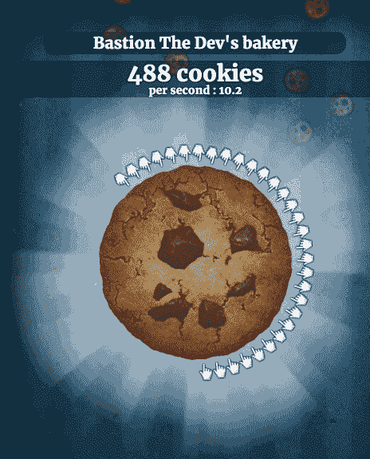

# 用点击游戏学习第 1 部分:HTML

> 原文：<https://dev.to/bastionthedev/learning-with-clicker-games-part-1-html-1i4b>

这是三部分系列的第一部分:
**第一部分，用 HTML 布局**
[第二部分，用 CSS 样式](https://dev.to/bastionthedev/learning-with-clicker-games-part-2-css-196i)
第三部分，与 JS 交互

在这一部分，我们将学习 HTML！我们的目标是构建应用程序的基本布局。你可以说现在我们正在为这个系列的第二和第三部分准备画布。

* * *

当你学习前端开发时，每个人对什么是“完美的第一个 Webapp”都有不同的想法。有些人认为你应该建立一个类似于 [TodoMVC](http://todomvc.com/) 的网站，一个虚假的投资组合网站，或者甚至尝试复制 facebook。所有这些都很好，但我想引入一个新的想法:

**增量游戏**

当我第一次开始学习如何编程并对软件开发感兴趣时，我肯定没有想到我会成为一名 web 开发人员。我想制作电子游戏！虽然我没有涉足这个行业，但我仍然时不时地渴望开发游戏。增量游戏是结合网页开发和游戏世界的完美方式。所以，让我们开始吧！

### 什么是增量游戏？

与其告诉你什么是增量游戏，不如演示给你看。最初让我着迷的游戏是 [Cookie Clicker](http://orteil.dashnet.org/cookieclicker/) ，你现在就可以在浏览器中免费试用！

基本上，增量游戏(也称为点击器游戏或闲置游戏)都是关于收集特定资源的。首先，你必须点击并与游戏互动。随着游戏的进行，你开始使用该资源购买物品，这些物品将每秒自动收获该资源。最终，这些商品超过了你的点击量，所以你要做的就是管理下一步买什么，并不时地查看一下！

[](https://res.cloudinary.com/practicaldev/image/fetch/s--lXQyMGtD--/c_limit%2Cf_auto%2Cfl_progressive%2Cq_66%2Cw_880/https://thepracticaldev.s3.amazonaws.com/i/bbs9wiuf5bkidnn9otqk.gif)

我们将构建我们的 Cookie Clicker 版本，名为`Code Clicker`。原创，我知道。我们将不再收集 cookies，而是“编写”代码行！在我们最初的应用程序中，我们将有两个项目可以购买:额外的手和代码猴子。额外的手会让我们的点击每点击写更多的代码，而代码猴子会每秒自动写一行代码。

现在我们已经有了我们要建造的东西的想法，让我们开始吧！

### 什么是 HTML？

对于我们想要构建的任何类型的 web 应用程序，我们都必须从一些 HTML 或超文本标记语言开始。把 HTML 想象成一种通过文本来传达我们想要的页面外观的方式。

> 有趣的事实
> 
> HTML 基于 SGML，但已经成为事实上的网络标准。

HTML 的主要组成部分是标签。HTML 有一组定义好的标签，它们对我们在页面上显示的内容有不同的影响。有很多标签，但这里有一些我们将在这个项目中使用:

`<html>`包装整个文档并将其定义为 html 的标签
`<head>`这一部分没有任何显示的内容，它只包含供浏览器使用的元数据
`<body>`这一部分包含页面的布局以及我们将向用户实际显示的内容

`<div>`为分部的简称，这个标签只是用来标记一个分部或者一段页面的
`<p>`为段落的简称，用来定义一段文字的
`<h1>`为页眉的简称，可以用 h1 - h5 为不同级别的页眉的简称
`<a>`为锚点，用来创建链接
`<button>`一个可点击的按钮

使用这些标签，我们将创建我们的应用程序的总体布局。这看起来会很难看。下一步，我们将在下一篇文章中讨论，是使用 CSS 样式化它，并使它看起来漂亮。HTML 只是构建布局。

到这一部分结束时，希望我们会有这样的东西！

[https://codepen.io/BastionTheDev/embed/BbLKyj?height=600&default-tab=result&embed-version=2](https://codepen.io/BastionTheDev/embed/BbLKyj?height=600&default-tab=result&embed-version=2)

这里的想法是我们通过点击`write code`按钮来写`lines of code`。我们也可以在它下面买一些东西来开始自动增加代码行。它还不是交互式的，我们将在本系列的第三部分讨论这个问题。

那么，我们怎么到这里？我们来分解一下。创建一个名为`index.html`的文件，让我们开始构建我们的布局！首先，让我们制作包装 HTML 标签。

```
<html>
</html> 
```

让计算机知道这是一个 HTML 文档。注意，我们有开始标签:`<html>`和结束标签:`</html>`这两个标签之间的任何东西都将被认为是它的一部分，或者是它的一个子标签。

接下来，我们把我们的两个主要部分。

```
<html>
  <head>
  </head>
  <body>
  </body>
</html> 
```

头部是我们的元数据，身体是我们的显示数据。那么，什么是元数据呢？这是浏览器可以使用的数据，但并不严格用于页面布局。让我们放入一些示例元数据！

```
<html>
  <head>
     Code Clicker 
  </head>
  <body>
  </body>
</html> 
```

``标签是当你在页面上时显示在标签中的内容。如果你现在在浏览器中打开你的`index.html`文件，你应该看到标签上写着`Code Clicker`！接下来，让我们添加我们的顶部部分，它将显示已经编写了多少行代码，并给我们一个按钮来编写更多代码。

```
<html>
  <head>
     Code Clicker 
  </head>
  <body>
    <div>
      Lines of Code: 0
      <div>
        <button> Write Code </button>
      </div>
    </div>
  </body>
</html> 
```

现在我们使用 div 标签！这些 div 标签有两个用途:将按钮和文本放在不同的行上，并在 HTML 中定义这个顶部。

> 如果你更熟悉 HTML，你可能会认为我们在这个应用程序中有点 div happy。由于这是一个 web 应用程序的起点，我们想现在就开始熟悉 div。在接下来的几篇文章中，我们将把它们用于样式和 Javascript。

我们还推出了我们的第一个按钮！你可以在这里使用一个 div，但是使用按钮和输入标签使你的交互元素尽可能清晰是很重要的。这样，屏幕阅读器和通过键盘导航的人仍然可以使用你的应用。如果你想更深入地研究这种类型的东西，或者学习如何让你的 web 应用程序更容易访问，请查看 [A11y 项目](https://a11yproject.com/)。

既然我们现在已经知道了如何使用每个标签，那么让我们继续将这两个“可购买”的项目添加到我们的页面中。

```
<html>
  <head>
     Code Clicker 
  </head>
  <body>
    <div>
      Lines of Code: 0
      <div>
        <button> Write Code </button>
      </div>
    </div>
    <div>
      Number of Extra Hands: 0
      Price: 10
      <div>
        <button> Buy Hands </button>
      </div>
    </div>
    <div>
      Number of Code Monkeys: 0
      Price: 100
      <div>
        <button> Buy Hands </button>
      </div>
    </div>
  </body>
</html> 
```

瞧啊。我们有我们的应用程序的基本布局只使用 HTML！在我们的下一篇文章中，我们将探索 CSS，看看我们如何让它看起来更好。

你的增量应用结果如何？请在下面的评论中告诉我！