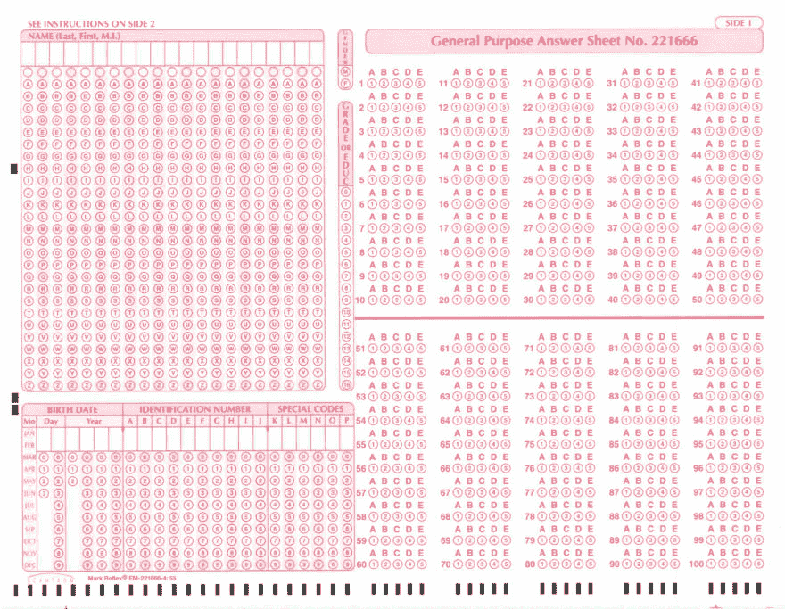

# 让我们一起结束定时编码挑战

> 原文：<https://dev.to/silvestricodes/let-s-end-timed-coding-challenges-together-1n80>

## 简介

你有没有开始一个公司的面试过程，并让他们给你一个定时编码挑战作为第一轮过程？这些问题感觉起来像是公司的开发人员不会每天面对的挑战吗？如果这已经发生在你身上，你感到沮丧，你有权利这样想！

*还记得这些吗？*

定时编码挑战在很大程度上没有得到正确实施。这里有许多因素在起作用，包括:

*   涉及没有任何背景的问题，例如它如何与公司开发团队面临的日常挑战相关联。
*   在一个时间框架内塞进很多问题，这使得在一个没有压力的环境下很难提供好的答案。
*   编写极其冗长的用户场景，耗费大量时间。
*   除了让候选人进入下一步之外，没有利用定时挑战的结果(稍后将详细介绍)。

## 好吧，乔恩，你想说什么？

我写这篇文章是希望改变一些人对正确使用这个工具的想法。就我个人而言，我不认为应该使用定时挑战(或任何类型的长时间带回家的挑战)，但这不会成为一篇非常有趣的文章。相反，我将提供一些更好地实施这一过程的想法，以及公司如何将它变成一个更强大的筛选工具。

## 让我们来看看该做什么和不该做什么！

**不要**:发送你的开发团队在日常工作中不会遇到的任意挑战。

**Do** :选择一个你的团队已经找到解决方案的挑战，并在此时将其作为一个挑战(或类似的挑战)提出来。

你可以开始了

检查您的开发团队解决的一个挑战，它已经处于稳定状态很长时间了。也许你有一些过滤 API 响应的逻辑。也许您有一些有趣的条件和方法，用于以不同的形式呈现数据。要求某人这样做是一个挑战，这将是一个很好的方式，从他们的角度来看他们是如何处理事情的。这也将使审查代码的人对候选人的质量提出意见变得有趣和容易！

相比之下，询问更多算法上的问题，比如对数组中的匹配对进行有效计数。这个问题符合你的工程师的日常思维和工作吗？如果是这样的话，那就想尽一切办法去做吧。否则，可能很难让审查代码的人参与到这个过程中，并可能导致他们因为筛选过程不充分而拒绝合格的候选人。考虑硬币的两面！

* * *

**不要**:因为时间有限，给候选人过多的问题。

**做**:关注询问质量，提出有时间可以完成的问题！

*滴答滴答*

我和我的许多同龄人都感受到了 5 个问题，90 分钟的限时练习的痛苦，其中 1 或 2 个问题需要很大一部分时间来阅读和思考，然后再尝试回答。事实是，给你的候选人一大堆问题没有任何价值。例如，从流行的编码实践网站上复制和粘贴问题，然后就到此为止，这是非常不真诚的，这也是这些情况产生的原因。

相反，如果你走的是定时面试的路线，为什么不把问题池缩减到一到两个问题，给应聘者和你给他们五个问题一样多的时间来完成它们呢？你这样做有什么损失呢？更好的是——你现在的工程师在这样严格计时的环境中工作吗？如果答案是否定的，为什么你要把候选人暴露在一个不切实际的环境中，并通过这个环境来评估他们呢？这让人们面临失败，而不是给他们每一个成功的机会。

考虑一个更简单的热身问题(这个问题可以是通用和直接的)，然后是我们之前讨论过的定制问题。你给他们五个问题的 90 分钟？如果你在计时的话，给他们同样的时间。这样，你就大大减轻了候选人的压力，你将得到他们有时间思考、回顾和优化的工作！

* * *

**不要**:定义你的问题的每一个细节，直到最后一个字符。

**做**:赶紧说重点！

*故事上的故事上的故事...*

我不会在这个问题上停留太久。不管你的要求是什么，你的编码挑战都不需要完整的叙述。一两句话的上下文就可以了，然后清晰定义的期望输出和样本输入就能捕捉到你需要的一切。

* * *

**不要**:一旦你让候选人进入下一步，就把这个编码挑战忘得一干二净。

做:设计一个可以重复的挑战，这样你就可以在面试过程中的任何进一步的技术评估中继续使用它。

协作太棒了！

我可以肯定地说，一旦我进入下一个阶段，我已经完成的大多数定时编码挑战都已经被放弃了。除了直接提到挑战，它根本不会以任何方式，形状或形式出现。

我经常会问自己，为什么会有公司让应聘者在一项挑战上投入那么多时间，结果却被忽略了，因为应聘者在整个过程中都在进步。提出一个候选人可以一直坚持的挑战不是更容易吗？想想好处吧！

*   你可以围绕一个候选人如何用一些指导方针和资产从零开始构建一个东西来构建你对他的整个技术评估。低成本的简化。
*   通过一个重点突出、定义明确的挑战，你可以真正深入地了解候选人解决问题的过程。
*   你的候选人受益于学习与现有工程师合作的感觉，反之亦然。
*   通过帮助候选人在不同的环境中练习和完善他们解决问题的过程，你将会帮他们一个大忙！

## 结论

如果你能影响公司的面试过程，希望这篇文章能给你一些启发。想一想你有什么资源，你能向你的候选人提出什么现实的挑战，你想了解某人的一切(以及你想让某人了解你的一切！)在发送定时挑战之前。通过改进你的流程，你只会获得更好的声誉、积极的反馈和更高质量的候选人！