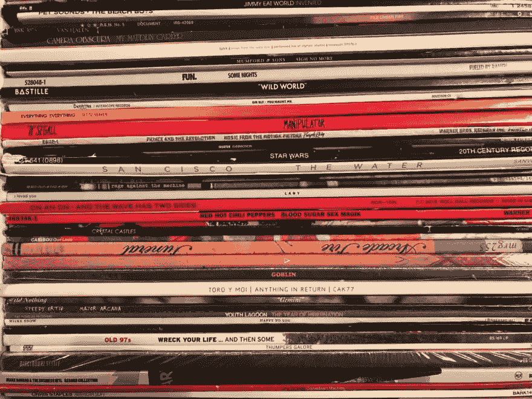

# 让我们建立:一个记录目录(简介)

> 原文：<https://dev.to/ianknighton/lets-build-a-record-catalog-introduction-347j>

我一直很喜欢自己动手做。帖子/视频/无论什么，在那里有人走过的过程，他们经历了建立一些东西。我不仅发现跟随它非常有趣，而且当我开始自己的项目时，我也发现它非常有帮助。

这是我一直想建造的东西，所以我要在公众的视野中建造它，看看它会有什么样的变化。

值得注意的是，我的写作方法是一种“意识流”式的写作。我会犯错误，除非他们是不安全的或绝对可怕的，我会把他们留在里面。我的希望是，在未来的某个时候，这将有助于那些想了解和阅读我的想法和成果的人。

## 目录

1.  [第一部分](https://dev.to/ianknighton/lets-build-a-record-catalog---part-one-1af2) -构建空项目和文件夹结构。

## 概述

我是一名唱片收藏家。在过去的许多年里，我已经收集了相当多的东西，我想保存下来。有其他服务可以做到这一点，我也使用它们，但我一直认为构建自己的服务会很有趣。理论上，这是一个非常简单的东西，可以用作一种设备来帮助解释和遍历更大的思想和想法。

我计划在[建造这个项目。网芯](https://docs.microsoft.com/en-us/dotnet/core/)自上而下。我可能会用 [DbUp](https://dbup.readthedocs.io/en/latest/) 来管理我的数据库，用 [Bootstrap](https://getbootstrap.com/) 来让它看起来更好。我的意图是从最基本的开始构建一切，并且(如果可能的话)使用一切的最新版本。我也想尝试本地化之类的东西，但我们会看到其他事情是如何解决的。

源代码很可能会托管在 [GitHub](https://github.com/IanKnighton) 中。通过那里更容易分享。

我可能会通过 Azure 处理托管，也可能会通过 Azure DevOps 处理 CI/CD。这些只是我熟悉的工具集，所以我觉得我可以更好地使用它们，而不是试图找出如何使用它们。

在可能的情况下，我会尽量把每件事都记录下来。这(应该)使得有人可以复制和运行这个项目，而不需要托管任何东西。

根据日期/时间的不同，我将在无数的机器和设备上工作，但几乎总是使用 VS Code 或 Visual Studio 作为我的编辑器。如果可能，我尽量避免使用完整的 Visual Studio。当我不总是需要它的时候，它是非常复杂的。然而，在某些情况下，它是这项工作的最佳工具。我也喜欢你可以用它做的所有格式化的东西。我基本上有一个保存在 Dropbox 中的 markdown 文件，我只是在整个过程中更新它作为记录的来源。

现在的计划是从 3 月 15 日开始，每周五发布这些帖子。它们将会被发布在我的[博客](https://ianknighton.com/)和[开发者论坛](https://dev.to/ianknighton)上。我也会尽量保持这篇文章的更新，作为导航的“目录”。

我希望你能和我一起踏上这趟旅程。