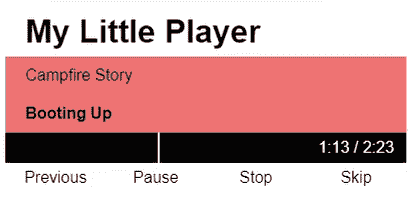

# 让我们在 React 中升级我们的小音频播放器

> 原文：<https://dev.to/ma5ly/lets-upgrade-our-little-audio-player-in-react-pfa>

这有点像第二部分。所以如果你错过了第一部分，看看吧！

[](/ma5ly) [## 让我们在 React 中制作一个小的音频播放器

### 托马斯皮考利 1 月 12 日 197 分钟阅读

#react #audio #javascript #html](/ma5ly/lets-make-a-little-audio-player-in-react-p4p)

在本节中，我们将为我们的小播放器添加一个“跳过”和“返回”按钮。此外，我们还将制作一个可视化的时间指示器，以及一个跳转到轨道中某个位置的方法。这将需要一点造型。我试图保持它最小化，这样我们可以专注于 Javascript，但是的，我们会做一些 CSS。

我选择只使用常规样式表，而不使用特定的样式库。就个人而言，我喜欢 CSS-in-JS 解决方案——它们感觉很好——但是它们的竞争很激烈。由于我们将仅仅使用勉强够用的样式，我们不要进入这些讨论，只使用 Create React 应用程序给我们的。

在第一部分，我们做了大部分的布线。在这个续集中，我们将做更多的逻辑。让我们从跳过和后退按钮开始。首先，我们将按钮添加到我们的 JSX，并清理一点逻辑。

```
{this.state.player !== "stopped" && (
    <div className="buttons">
      <button onClick={() => this.handleSkip("previous")}>Previous</button>
      {this.state.player === "paused" && (
        <button onClick={() => this.setState({ player: "playing" })}>
          Play
        </button>
      )}
      {this.state.player === "playing" && (
        <button onClick={() => this.setState({ player: "paused" })}>
          Pause
        </button>
      )}
      <button onClick={() => this.setState({ player: "stopped" })}>Stop</button>
      <button onClick={() => this.handleSkip("next")}>Skip</button>
    </div>
  );
} 
```

Enter fullscreen mode Exit fullscreen mode

我还为新按钮添加了一个`onClick`处理程序。您可以看到它调用了`handleSkip`函数并期望一个参数。在这种情况下，方向是:“向前”或“向后”。接下来我们将添加`handleSkip`函数本身。在我们写之前，我已经把数组和我们的轨迹移动到了文件顶部的一个常量。这只是不变的静态数据。

```
const TRACKS = [
  { id: 1, title: "Campfire Story" },
  { id: 2, title: "Booting Up" }
]; 
```

Enter fullscreen mode Exit fullscreen mode

对于函数本身，我们必须弄清楚几件事:

*   当前正在播放的轨道的索引
*   基于我们收到的参数的下一首或上一首曲目
*   没有上一首或下一首曲目时我们要做什么！

让我们从最简单的事情开始。我们有一个数组，里面有可能正在播放的所有曲目，我们还有一个 state，它应该包含当前正在播放的曲目的标题。这就足够利用`findIndex`方法了。

当使用这个方法时，你得到一个数字作为回报。要么它将是我们需要的歌曲的索引，要么它将是-1 aka“我们没有找到我们正在寻找的你，抱歉”。在我们“计算”下一首或上一首曲目之前，我们应该检查有多少首曲目。

我们可以通过获取我们的`TRACKS`数组的长度并减去 1 来实现。为什么要减 1？因为长度数字是数组中项目的确切数量，而索引实际上从零开始。所以 2 是 1，1 是 0。希望这有意义。

我们现在有两个值:T0 和 T1。这就足以写出下面的逻辑了。

```
handleSkip = direction => {
   const currentTrackIndex = TRACKS.findIndex(
     track => track.title === this.state.selectedTrack
   );
   const tracksAmount = TRACKS.length - 1;
   if (direction === "previous") {
     const previousTrack =
       currentTrackIndex === 0 ? tracksAmount : currentTrackIndex - 1;
     const trackToPlay = TRACKS[previousTrack];
     this.setState({ selectedTrack: trackToPlay.title });
   } else if (direction === "next") {
     const nextTrack =
       currentTrackIndex === tracksAmount ? 0 : currentTrackIndex + 1;
     const trackToPlay = TRACKS[nextTrack];
     this.setState({ selectedTrack: trackToPlay.title, duration: null });
   }
}; 
```

Enter fullscreen mode Exit fullscreen mode

如果你读过或试过这段代码，你可能已经推断出我们如何处理我们必须弄清楚的第三件事:当没有上一首或下一首曲目时我们要做什么。我们实际上只是在没有下一首曲目时播放第一首曲目，在没有上一首曲目时播放最后一首曲目。这是我个人的选择。我们也可以禁用跳过按钮。或者藏起来。但是我没有那种感觉。

总之。随着按钮的工作，我们现在可以专注于创建一个时间指示器。我们将为此建立一个新的组件，我们称之为`TimeBar`。

```
<TimeBar
  setTime={this.setTime}
  currentTime={this.state.currentTime}
  duration={this.state.duration}
/> 
```

Enter fullscreen mode Exit fullscreen mode

正如你可能看到的，它需要三个道具:一个设置音轨时间的函数，音轨的当前时间和音轨的完整持续时间。当前的时间和持续时间我们已经在上一篇文章中设置好了，所以我们只需要创建一个函数来设置一个特定点的时间。这个其实并不太难。

```
 setTime = time => {
    this.player.currentTime = time;
  }; 
```

Enter fullscreen mode Exit fullscreen mode

该函数接收一个我称为`time`的值。然后，我们使用我们在之前的会话中放置的`ref`来访问我们的播放器。玩家有一个名为`currentTime`的值，我们可以将它转化为函数中的值。这是真的。

现在是组件本身。让我们想一想它应该做什么。它需要直观地显示轨道有多长。然后，它需要直观地显示轨道的位置。最后，你应该能够点击工具条上的任何地方，跳到歌曲中的那个位置。

我们将在 pure React 中完成这一切，我们将使用我最喜欢的 Javascript 方法`.map`和一个可爱的 oldskool `while`循环。让我给你看第一部分，这样我们就可以讨论了。

```
function TimeBar({ currentTime, duration, setTime }) {
  const sBits = [];
  let count = 0;
  while (count < duration) {
    sBits.push(count);
    count++;
  }

  return <div className="timebar" />;
} 
```

Enter fullscreen mode Exit fullscreen mode

在 React 中，你可以把一个函数当作一个组件来使用。你传递给它的道具作为你可以破坏的参数进入场景。挺整齐的。现在是第一点逻辑。它为什么在那里，它有什么作用？

好吧，让我们再次戴上思考的帽子，试着在脑海中想象我们如何将持续时间(只是一个数字)显示为一个由时间组成的图形条。只有先把数字转换成比特，我们才能做到。幸运的是有人提出了秒的概念，更幸运的是:持续时间也是以秒为单位的。

这意味着我们可以创建一个空数组，然后开始将我们的位放入其中。我们通过启动一个循环来实现，只要我们的计数小于持续时间，这个循环就会一直循环下去。每循环一次，我们就在计数上加一个数，这样我们就可以确定在某个时刻计数会高于持续时间，有效地停止我们的循环。

如果一切正常，循环应该执行代码，时间正好是持续时间中的整秒。所以我们可以在每次循环中用一位来填充数组。

那很好。但是我们如何将这些位显示成一个条呢？让我们变得雄心勃勃。我们怎样才能让我们在那个条上看到音轨的实际时间呢？

```
const seconds = sBits.map(second => {
  return (
    <div
      key={second}
      style={{
        float: "left",
        cursor: "pointer",
        height: "30px",
        width: `${300 / Math.round(duration)}px`,
        background:
          currentTime && Math.round(currentTime) === second ? "white" : "black",
        transition: "all 0.5s ease-in-out"
      }}
    />
  );
}); 
```

Enter fullscreen mode Exit fullscreen mode

这里发生了很多事。让我们消化一下。方法允许我们用秒来获取数组，并且在每一秒返回我们喜欢的东西。在我们的例子中，我们将返回一个`div`，这样当它们放在一起时，就形成了一个漂亮的水平条。

`div`有一个`key`，让我们反应一下哪个`div`是哪个。因此，它必须是独一无二的。我们所有的秒数都不同，所以可以将其用于`key`。接下来，我们有我们的风格。`float`确保了秒被并排渲染，但是更有趣的是`width`和`background`。

现在你在这里看不到这个，但是在我们的 CSS 文件中，我已经决定我们的时间栏将是 300 像素宽。这是一个任意的选择，但它影响了我们的秒钟宽度；我们希望我们所有的时间都均匀地分布在酒吧里。我们可以通过简单的除法来计算宽度。`Math.round`用于将持续时间四舍五入到整数秒。

因此，我们有一个带有均匀分布在其容器中的`divs`的条，每个代表轨迹持续时间内的一秒。我们还碰巧将曲目的当前时间传递到组件中。这段数据也是以秒为单位的。这是完美的。这意味着如果我们将它四舍五入到整秒，我们就可以将其与时间栏中的秒进行匹配。

使用三元运算符，我们可以比较两个值，并决定是将`div`渲染成白色还是黑色。黑的不是对手，白的是对手。

我们的`.map`的结果被保存到一个我称为 seconds 的变量中。我们只需将该变量放在组件的`return`中，使其呈现在屏幕上。你可能注意到了，我还在我们的`return`中添加了`formattedCurrentTime`和`formattedDuration`。这些是我们在第一篇文章中计算的值。

```
return (
    <div className="timebar">
      <div className="bar">{seconds}</div>
      {currentTime ? (
        <div className="time">
          {formattedCurrentTime} / {formattedDuration}
        </div>
      ) : (
        ""
      )}
    </div>
  ); 
```

Enter fullscreen mode Exit fullscreen mode

这个片段中有一堆`classNames`。完整代码中还有更多。他们引用 CSS。我不会在这里列出它们，相反，你可以查看这个[代码沙箱](https://codesandbox.io/s/j7krz6r4r9)中的`styles.css`。他们帮助把所有东西放在正确的地方。

依靠你的创造力、决心和技巧，你可以做出真正好的东西。或者至少比我创造的更壮观一点。我的借口当然是我想把重点放在 Javascript 上😅。

总之，我们的小玩家升级到此结束。现在让我们播放一些音乐，享受我们的一天。

[](https://res.cloudinary.com/practicaldev/image/fetch/s--ZvmBw9lb--/c_limit%2Cf_auto%2Cfl_progressive%2Cq_66%2Cw_880/https://thepracticaldev.s3.amazonaws.com/i/08odfgxgjg790fx4u0km.gif)

*最终补遗！*如果我们的曲目播放得很好，但却结束了，该怎么办？接下来会发生什么？当然，它应该播放下一首曲目，如果还有一首的话？我也这么认为。所以在我真的让你走之前，让我们快速设置一下。

```
if (
      this.state.duration &&
      !isNaN(this.state.duration) &&
      this.state.duration === this.state.currentTime
    ) {
      const currentTrackIndex = TRACKS.findIndex(
        track => track.title === this.state.selectedTrack
      );
      const tracksAmount = TRACKS.length - 1;
      if (currentTrackIndex === tracksAmount) {
        this.setState({
          selectedTrack: null,
          player: "stopped",
          currentTime: null,
          duration: null
        });
      } else {
        this.handleSkip("next");
      }
    } 
```

Enter fullscreen mode Exit fullscreen mode

上面的代码是`componentDidUpdate`生命周期的一部分。它检查当前是否有持续时间，以及该持续时间是否等于音轨当前时间。

如果是这种情况，这将意味着跟踪已经结束。然后，我们快速检查这是否是我们播放列表的最后一首曲目，或者是否还有另一首曲目要播放。如果真是这样，那么我们将所有状态设置回默认状态。如果还有下一首曲目，那么我们只需简单地调用我们之前创建的`handleSkip`函数。

现在真的到此为止了！