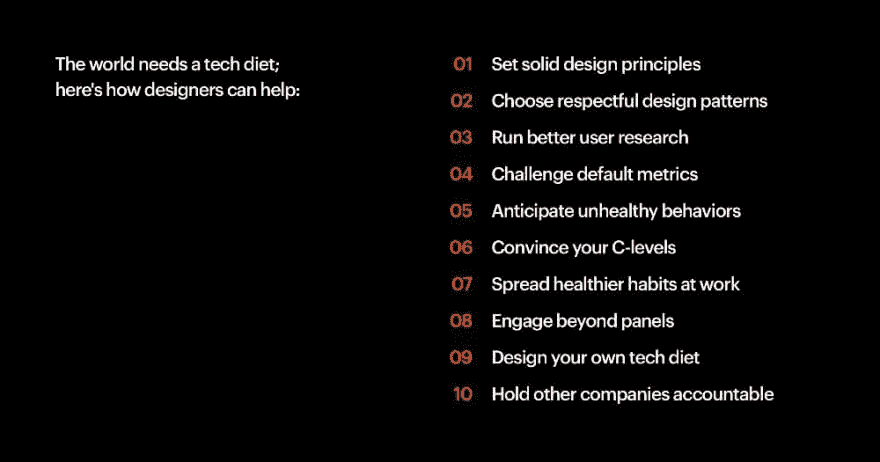
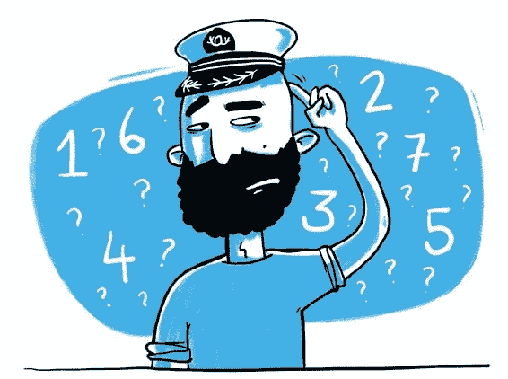
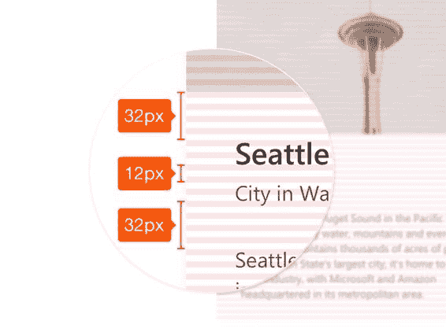
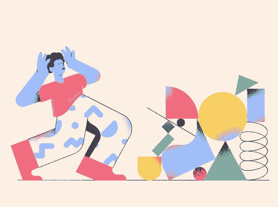
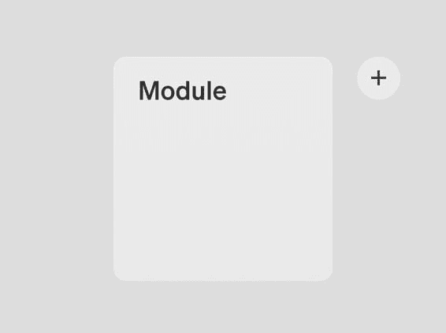
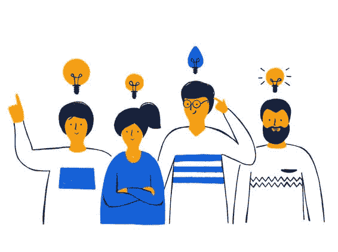

# 利用人类的本能上瘾的参与-和更多的 UX 本周链接

> 原文：<https://dev.to/uxcollective/leveraging-human-instincts-for-addictive-engagement-and-more-ux-links-this-week-32h1>

##### 《UX 集体简讯》是一份自费简讯，每周有超过 105，901 人阅读。你支持它的最好方式是[与你的朋友](https://twitter.com/intent/tweet?text=To%20all%20my%20design%20and%20tech%20friends%3A%20check%20out%20the%20UX%20Collective%20Newsletter%20%E2%80%94%C2%A0a%20self-funded%20weekly%20newsletter%20for%20designers%20who%20want%20to%20stay%20in%20the%20know%2C%20be%20productive%2C%20and%20think%20more%20critically%20about%20their%20work.%20https%3A%2F%2Fnewsletter.uxdesign.cc%2F&source=clicktotweet&related=clicktotweet)分享它。

[**设计师如何帮助打破为上瘾而设计的怪圈？**](https://dev.to/fabriciot/how-can-designers-help-break-the-cycle-of-designing-for-addiction-5djm) →

渴望点击和浏览，科技平台寻找新的方式来利用人类的基本本能，如羞耻、懒惰和恐惧。数字垃圾食品承诺给用户带来短期快感，但随之而来的是压抑的存在性间歇。我们如何打破这种循环？

### 为 UX 书呆子

*   [**日常 UX**](https://thenextweb.com/syndication/2019/05/31/heres-how-you-can-apply-experience-design-to-your-everyday-life/) →以下是你如何将体验设计应用到日常生活中的方法。
*   [**设计师自动化**](https://uxcellence.com/2019/automation-for-designers-intro) →去除平凡的任务，为更深入、更有价值的工作开辟新的机会。
*   [**无障碍案例**](https://medium.com/google-design/making-the-case-for-accessibility-350da9e30c84) →如何说服你的团队投资更无障碍的设计。

### 来自社区的故事

[**设计师如何成为领导者？**](https://uxdesign.cc/how-can-a-designer-become-a-leader-90860a8a9bb?sk=cde9e8a9e15906376c21050d2965714d) →

我当设计师不是为了整天管理设计师，让他们尽情享乐。

[**4px 基线网格**](https://uxdesign.cc/the-4px-baseline-grid-89485012dea6?source=friends_link&sk=fa982632fbbad9fea1ca7ec9ff5fc907) →

解决大多数设计工具中存在的边框填充问题。

[**讲故事:UX 的终极技能**](https://uxdesign.cc/storytelling-the-ultimate-ux-skill-c1c2ae4510ec?source=friends_link&sk=f13fd9e0e36f5cf357096aa2992eee1f) →

我们的工作包括创造和分享小说——通过我们开发的设计概念，创造世界的更好版本。

[**推出 Mercury OS**](https://uxdesign.cc/introducing-mercury-os-f4de45a04289?source=friends_link&sk=057936d0deb9419806c5aceb881f29bd) →

操作系统的投机愿景，由人性化设计原则驱动。

[**利益相关者访谈终极指南**](https://uxdesign.cc/the-ultimate-guide-to-stakeholder-interviews-understand-your-clients-a3bcf87b6e8b?source=friends_link&sk=f7e54e75938a593035212b76e870e9b8) →

如何恰当地计划和执行 UX 最高效的研究工具之一。

更多头条新闻:

*   [**没有沟通能力的设计师只是个像素推手**](https://uxdesign.cc/a-designer-without-communication-skills-is-just-a-pixel-pusher-25ccdf0f1130?source=friends_link&sk=f40150b5ed0da04486292b3631d5d3f2) →
*   [**有人提出颜色启发式**](https://uxdesign.cc/some-proposed-color-heuristics-a323e8fed5f3?source=friends_link&sk=907b1443087510354abf6a0dc0dca00b) →
*   [**应聘设计工作的五大策略**](https://uxdesign.cc/five-unconventional-ways-to-apply-to-design-jobs-7dd897b4d45?source=friends_link&sk=b8e98320e814bc52779ef66c9649fa43) →
*   web 上的 [**按钮:放置和顺序**](https://uxdesign.cc/buttons-placement-and-order-bb1c4abadfcb?source=friends_link&sk=ed5f51ae00c1e70f1fe42696339dbe9e) →
*   [**为更好的设计决策建立高质量的假设**](https://uxdesign.cc/building-high-quality-hypothesis-for-better-design-decision-3a18a8d00038?source=friends_link&sk=b8b4cad0264546141ee980fc83370ec2)

### 新闻&观点

*   [**美国的人口地图**](https://pudding.cool/2019/05/people-map/) →城市名被维基百科上最多的居民所取代的地图。
*   [**流媒体和歌曲长度**](https://www.theverge.com/2019/5/28/18642978/music-streaming-spotify-song-length-distribution-production-switched-on-pop-vergecast-interview) →一首歌会在开始的 5 到 10 秒播放一段副歌的提示，让钩子在你耳边。
*   [**一个让你电池没电的聊天**](http://diewithme.online/) →和我一起死是一个你只有在电池不足 5%的情况下才能使用的聊天 app。
*   [**AI 生成的口袋妖怪**](https://boingboing.net/2019/05/13/ai-generated-pokemon-that-shou.html) →电脑生成的本不应该存在的可恶口袋妖怪——只是为了好玩。

### 工具&资源

*   [**另一个镜头**](https://airbnb.design/anotherlens/)→Airbnb 的设计团队为有良知的创意者设计的研究工具。
*   [**小胜利**](https://www.smallvictori.es/) →小胜利把 Dropbox 文件夹里的文件，变成网站。
*   [**Foo Screen App**](https://itunes.apple.com/us/app/id1465367307&mt=8) →一款为交互原型制作的全屏手机浏览器。
*   [**草图转网页**](https://sketch-to-web.com/) →这个工具号称可以把你的草图文件变成一个网站，可视化，几分钟就搞定。

* * *