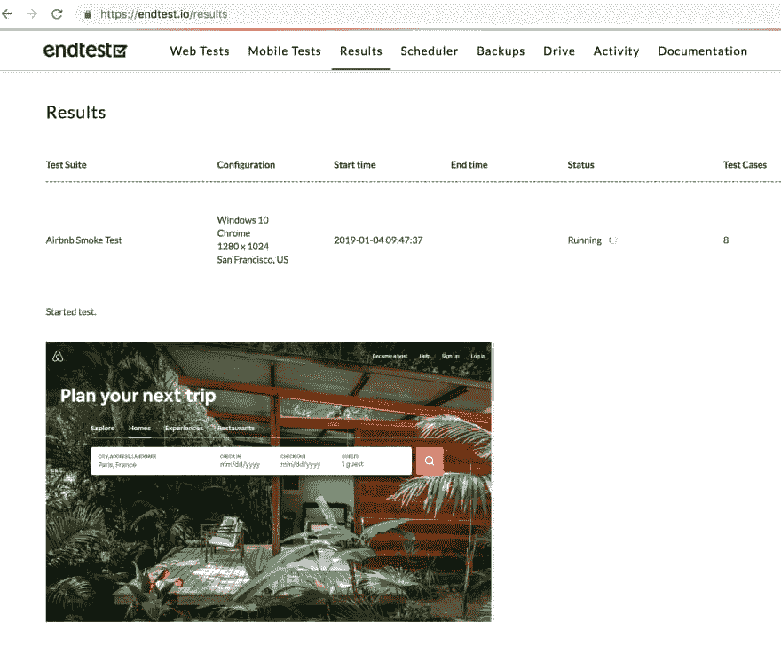

# 硒测试的实时视频

> 原文：<https://dev.to/razgandeanu/live-video-for-selenium-tests-2hif>

正如你们中的许多人所知，我是自动化测试的超级粉丝。

我一直在努力寻找将最新技术应用到我们的测试脚本中的方法。

我需要确保一切都运行良好，不仅仅是在 Chrome 上，而是在一大堆浏览器上。

我们在跨浏览器的云基础设施中运行我们的测试，这意味着调试不像在我的本地机器上那么简单。

有时，详细的日志是不够的，我需要看到哪里出错了，我不得不等待测试结束时收到的视频记录。

像其他公司一样，我们也在使用 [Endtest](https://endtest.io) 。

几天前，他们增加了测试运行的实时视频功能。他们想出了一些我甚至不知道自己想要的东西。

我仍然不明白他们是如何做到的。

他们如何设法只直播浏览器的内容？其他老派的解决方案，如 [BrowserStack](https://browserstack.com) 和 [Sauce Labs](https://saucelabs.com) 只能提供整个桌面屏幕的视频记录。

他们使用的是哪种压缩方式？Endtest 的实时视频非常清晰，加载速度非常快。