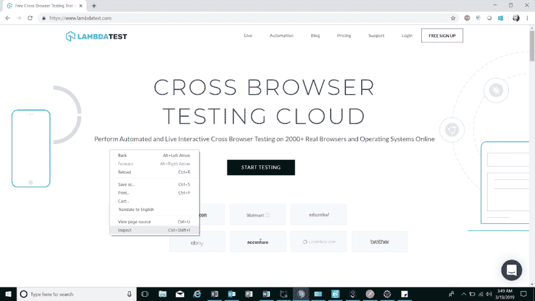
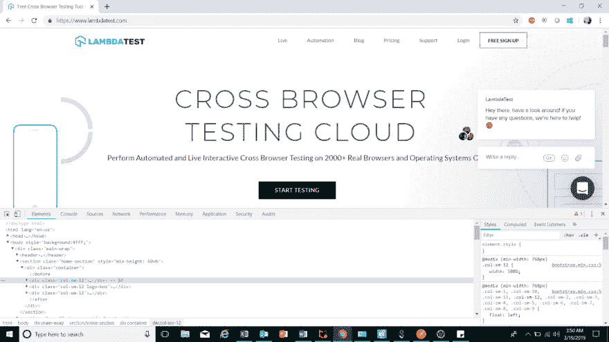
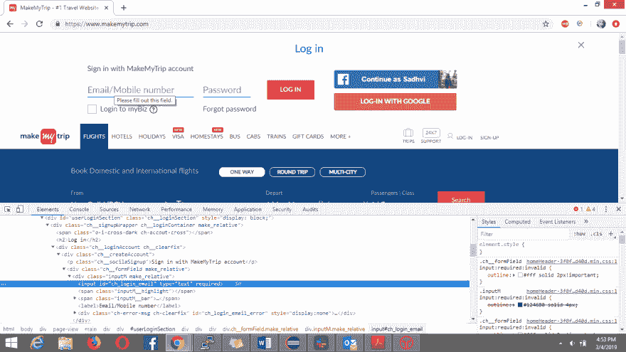
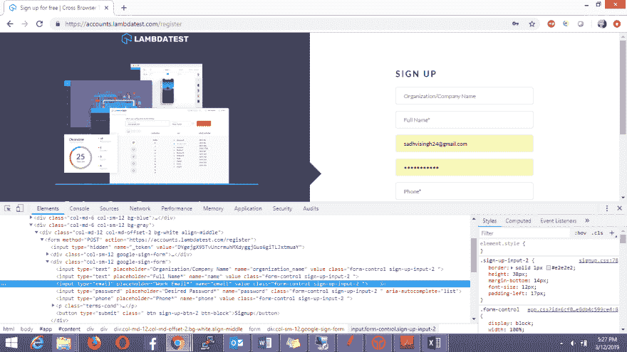
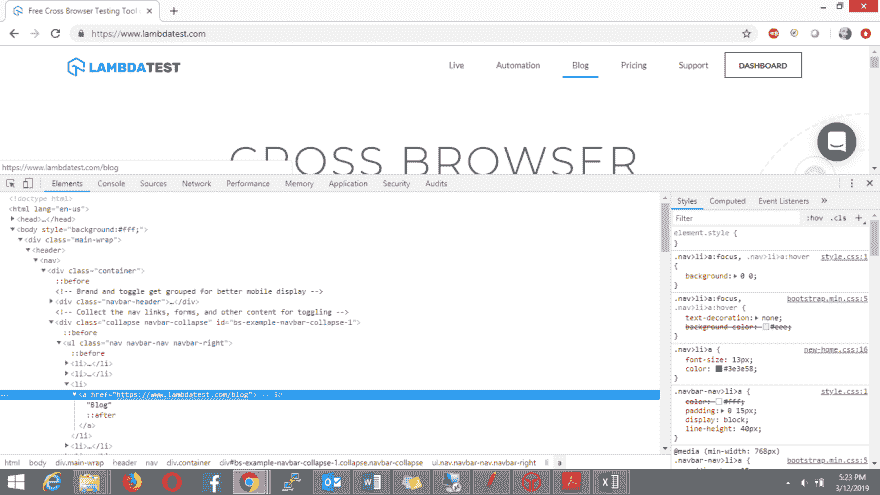
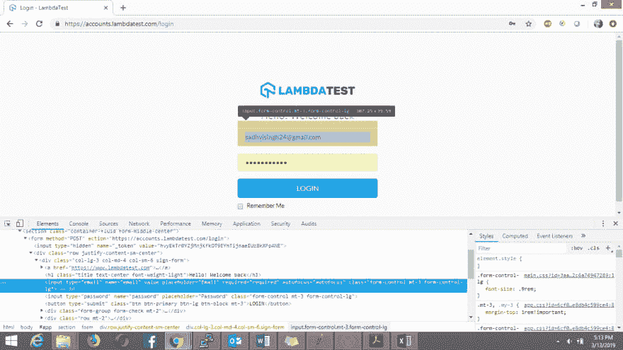
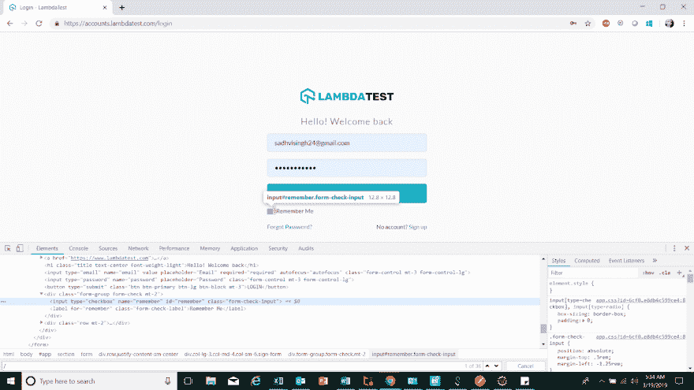
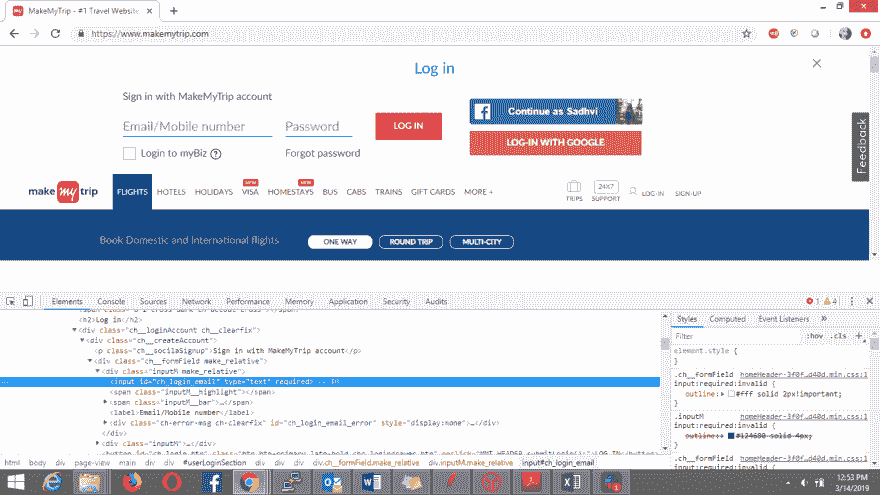
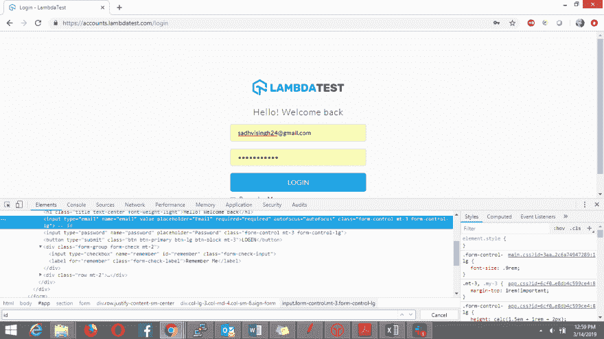
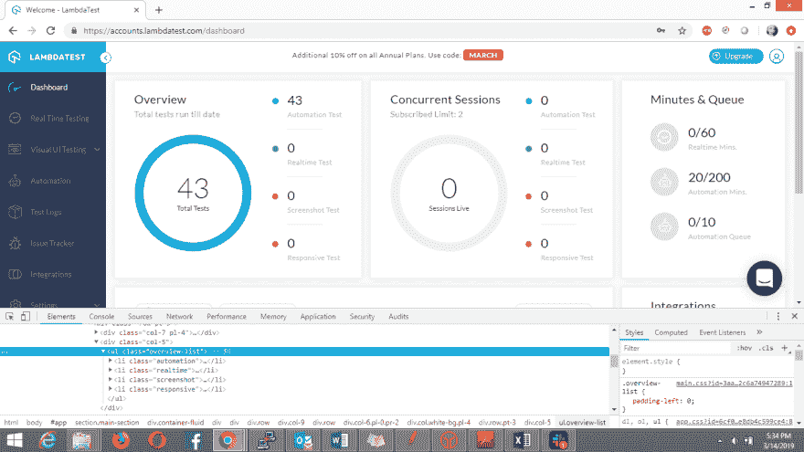

# Selenium WebDriver 中的定位器及示例

> 原文：<https://dev.to/lambdatest/locators-in-selenium-webdriver-with-examples-182i>

Selenium 中的定位器是最强大的命令之一。它是 Selenium 自动化脚本的理想构建块。它有助于定位 GUI 元素，通过这些元素可以执行多个用户操作。这些是脚本的重要参数之一，如果它们不正确或不可靠，可能会导致脚本失败。一个好的脚本基础需要元素被适当地定位。为此，我们在 Selenium WebDriver 中有多个定位器。下面是 Selenium WebDriver 的定位器列表:

*   身份证明
*   名字
*   Linktext
*   部分链接文本
*   标签名称
*   类别名
*   DOM 定位器
*   CSS 选择器
*   Xpath

使用 Selenium WebDriver 中的上述定位器，您可以通过**“find element/find elements”**语法定位元素。我将在下面详细演示硒的每个定位器。然而，在我们深入研究通过上述方式定位这些元素之前，我们先来看看如何在 DOM(文档对象模型)中找到元素。

## 在 DOM 中查找元素的步骤:

1.  打开目标应用程序并单击 F12，或者右键单击并选择 inspect。

[](https://res.cloudinary.com/practicaldev/image/fetch/s--UcsovN-A--/c_limit%2Cf_auto%2Cfl_progressive%2Cq_auto%2Cw_880/https://www.lambdatest.com/blog/wp-content/uploads/2019/03/image8-1.png)

1.  控制台窗口将打开已知的开发者工具。

[](https://res.cloudinary.com/practicaldev/image/fetch/s--l7Zj1lVO--/c_limit%2Cf_auto%2Cfl_progressive%2Cq_auto%2Cw_880/https://www.lambdatest.com/blog/wp-content/uploads/2019/03/image11-1.png)

1.  默认情况下，将打开名为“Element”的节。这是我们定位元素的地方。在最左边，你可以看到一个鼠标图标。当你将鼠标悬停在它上面时，它会显示“选择页面中的一个元素来检查它”。单击它并导航到您想要定位的元素。当您单击想要定位的元素时，该元素的 DOM 会高亮显示，如下所示:

[](https://res.cloudinary.com/practicaldev/image/fetch/s--8R198LO3--/c_limit%2Cf_auto%2Cfl_progressive%2Cq_auto%2Cw_880/https://www.lambdatest.com/blog/wp-content/uploads/2019/03/image12-1.png)

1.  就是它，DOM 中选中的行是您需要从中获取值的上下文，在上面的例子中，突出显示的 DOM 值是:

```
 <a href="https://accounts.lambdatest.com/register" target="_blank">Free Sign Up</a> 
```

Enter fullscreen mode Exit fullscreen mode

现在您可以选择标记名，即“a”和文本，即“免费注册”来定位您的元素。

我将在整篇文章中使用上述技术来演示 Selenium WebDriver 中的 CSS 定位器。现在，我们看看如何在 Selenium WebDriver 中找到定位器。

## ID 定位器中的硒

考虑到元素对于 DOM(文档对象模型)中的每个元素都是唯一的，这是最常见的元素定位方式。基于万维网联盟(W3C ), ID 对于元素应该是唯一的，因此被认为是定位元素的最快和最安全的方法。但不幸的是，开发人员可能会也可能不会遵循这条规则，因为浏览器确实允许绕过这条规则。具体而言，在表格或列表的情况下，ID 可以根据数据递增或动态填充，这导致通过其他方式定位这些元素。

下面是一个 Makemytrip 示例，展示了如何通过 ID 定位“登录”字段:

[](https://res.cloudinary.com/practicaldev/image/fetch/s--iH9JdCMd--/c_limit%2Cf_auto%2Cfl_progressive%2Cq_auto%2Cw_880/https://www.lambdatest.com/blog/wp-content/uploads/2019/03/image3-1.png)

下面是它的 DOM 结构:

```
<div class="inputM make_relative"> <input id="ch_login_email" type="text" required=""> <span class="inputM__highlight"></span> <span class="inputM__bar"></span> <label>Email/Mobile number</label> <div class="ch-error-msg ch-clearfix" id="ch_login_email_error" style="display:none"> <p class="o-i-error-icon"></p> <span class="ch-flL"> <span class="o-i-error-symbol"></span> </span> <span class="ch-flL ch-error-innertxt"></span> </div> </div>The syntax for locating via 
```

Enter fullscreen mode Exit fullscreen mode

定位用户名的语法是= `driver.findElement(By.id("ch_login_email"))`

如果没有与 id 匹配的值，将引发 **NoSuchElementException** 。

## 在硒中命名定位器

一个元素可以通过多个属性来定义，比如 Name。Selenium WebDriver 中的名称定位器也可以用来定位 ID 定位器之类的元素。它们在一个页面上可能是也可能不是唯一的，有多个元素。如果有同名的元素，那么定位器会选择页面上同名的第一个元素。

如果没有与定义的属性值匹配的名称，将引发 NoSuchElementException

下面是 Lambdatest 的 DOM 的一个截屏，其中突出显示了电子邮件字段的注册页面上的 ID 定位器名称。[](https://res.cloudinary.com/practicaldev/image/fetch/s--rLZPU4nZ--/c_limit%2Cf_auto%2Cfl_progressive%2Cq_auto%2Cw_880/https://www.lambdatest.com/blog/wp-content/uploads/2019/03/image2-1.png)

下面是它的 DOM 结构:

```
<input type="email" placeholder="Work Email*" name="email" value="" class="form-control sign-up-input-2 "> 
```

Enter fullscreen mode Exit fullscreen mode

下面是通过名字

定位电子邮件字段的语法。定位电子邮件的语法是= `driver.findElement(By.name("email"));`

## 链接硒中文本定位器

像在超链接中一样，可以通过链接文本定位元素。在同一文本有多个链接的情况下，将选择第一个链接。链接文本以锚文本为前缀，此定位器只能用于锚标签。

下面是一个 lambdatest 主页的例子，展示了标题上的博客链接的选择。下面的 DOM 显示了突出显示的元素:

[](https://res.cloudinary.com/practicaldev/image/fetch/s--S379_AqH--/c_limit%2Cf_auto%2Cfl_progressive%2Cq_auto%2Cw_880/https://www.lambdatest.com/blog/wp-content/uploads/2019/03/image7-1.png)

下面是相同的 DOM 结构:

```
<a href="https://www.lambdatest.com/blog" target="_blank">Blog</a> 
```

Enter fullscreen mode Exit fullscreen mode

选择链接的语法 text =`driver.findElement(By.linkText("Blog"))`；

通常这个定位器是用来检查航行流量的。

## 硒中部分链接文本定位器

通过部分链接文本定位元素的工作方式类似于普通的链接文本定位器。之所以在 Selenium WebDriver 中使用部分链接文本定位器而不是链接文本定位器，是因为当您有一个很长的链接文本，并且您打算只使用部分文本来对它执行进一步的操作。有时，使用这种方法的目的也可以是在一个页面上用一个公共的部分文本定位多个链接。

下面是一张 [LambdaTest](https://www.lambdatest.com/?utm_source=dev&utm_medium=Blog&utm_campaign=sa-06-050419eu&utm_term=OrganicPosting) DOM 的快照，突出显示了链接名为“start testing”的元素，这里我们定位了部分文本为“testing”的链接。
T3[T5](https://res.cloudinary.com/practicaldev/image/fetch/s---t1XQ_ho--/c_limit%2Cf_auto%2Cfl_progressive%2Cq_auto%2Cw_880/https://www.lambdatest.com/blog/wp-content/uploads/2019/03/image5.png)

下面是它的 DOM 结构:

```
<a href="https://accounts.lambdatest.com/register" target="_blank">START TESTING <i class="fa fa-arrow-circle-right" aria-hidden="true"></i></a> 
```

Enter fullscreen mode Exit fullscreen mode

通过部分链接文本定位的语法是:`driver.findElement(By.PartialLinkText("Testing"));`

## 标记硒中名称定位器

顾名思义，Selenium WebDriver 中的 css 定位器用于标识带有标签名的元素，如 div 标签、a 标签等。这种用法的一个常见例子是定位你的主页上的所有链接，并验证它们是正常的还是断开的。

下面的语法用于定位 Lambdatest 主页上的所有链接:

`driver.findElements(By.tagName(a));`

## 硒中的类名定位器

类名定位器帮助定位通过 Class 属性定义的元素。下面是一个 Lambdatest 登录 DOM 快照示例，其中登录字段通过类名定位。

[](https://res.cloudinary.com/practicaldev/image/fetch/s--5iUzRmgI--/c_limit%2Cf_auto%2Cfl_progressive%2Cq_auto%2Cw_880/https://www.lambdatest.com/blog/wp-content/uploads/2019/03/image1-6-1.png)

下面是 DOM 结构:

```
<input type="email" name="email" value="" placeholder="Email" required="required" autofocus="autofocus" class="form-control mt-3 form-control-lg"> 
```

Enter fullscreen mode Exit fullscreen mode

通过类名

`driver.findElement(By.className("form-control mt-3 form-control-lg "));`定位元素的语法

## DOM 定位器中的硒

在文档对象模型(DOM)中，我们根据 DOM 模型来定位元素。如上所述，我们可以通过 ID 和名称来标识元素，通过 DOM 的方法，如**‘getElementById’**和**‘getElementsByName’**。getElementById 方法一次只能定位一个元素，而另一个方法用于提供按该名称定位的元素数组。为了在元素数组的情况下访问任何指定的元素，我们可以使用 index。

通过 DOM 访问 id 和名称的语法是:

`document.getElementById (“id”)`

`document.getElementsByNames (“name”)[index]`

下面是 [LambdaTest 登录页面](https://accounts.lambdatest.com/login?utm_source=dev&utm_medium=Blog&utm_campaign=sa-06-050419eu&utm_term=OrganicPosting)的 DOM 结构，目的是定位‘记住我’复选框: [](https://res.cloudinary.com/practicaldev/image/fetch/s--B4v1rtxb--/c_limit%2Cf_auto%2Cfl_progressive%2Cq_auto%2Cw_880/https://www.lambdatest.com/blog/wp-content/uploads/2019/03/image10-1.png) 

```
<input type="checkbox" name="remember" id="remember" class="form-check-input"> 
```

Enter fullscreen mode Exit fullscreen mode

通过 DOM ID 访问元素的例子有:

`document.getElementById (“remember”)`

`document.getElementsByNames (“remember”)[0]`

## CSS Selector Locator In Selenium

级联样式表用于设计网页的样式，因此成为定位元素的一种方式。如果没有 ID 或名称就无法访问元素，那么与 xpath 相比，CSS 选择器是最明显的选择之一。

由于两者都有很多争论，对我来说它们的使用取决于场景的复杂性，尽管大多数人更喜欢使用 CSS 选择器，因为它们比 xpath 更快。

**CSS 选择器可以通过各种可用的格式定位:**

*   标签和 ID
*   标签和类别
*   标签和属性
*   标签、类别和属性
*   匹配项(以...开头，以...结尾，包含)
*   子元素

### 标签和 ID

为了通过标签和 ID 定位元素，我们使用三个组件

语法:`css=(Html tag )(#) (value of the ID attribute)`

*   **Html 标签:**用来提供我们希望定位的标签，比如输入标签。
*   **# :** 这个哈希符号用来表示 ID 属性。请记住，当您希望通过 CSS 选择器通过 ID 定位一个元素时，它需要有一个散列符号。对于其他属性，我们不需要使用散列符号。
*   **ID 属性的值:**这表示我们用来定位元素的 ID 值。

下面是 DOM 部分，表示 Makemytrip.com[](https://res.cloudinary.com/practicaldev/image/fetch/s--UYCr1mc0--/c_limit%2Cf_auto%2Cfl_progressive%2Cq_auto%2Cw_880/https://www.lambdatest.com/blog/wp-content/uploads/2019/03/image6-1.png)T3】的登录字段

```
 <div class="inputM make_relative">
 <input id="ch_login_email" type="text" required=""> <span class="inputM__highlight"></span> <span class="inputM__bar"></span> <label>Email/Mobile number</label> <div class="ch-error-msg ch-clearfix" id="ch_login_email_error" style="display:none"> <p class="o-i-error-icon"></p> <span class="ch-flL"> <span class="o-i-error-symbol"></span> </span> <span class="ch-flL ch-error-innertxt"></span> </div> </div> 
```

Enter fullscreen mode Exit fullscreen mode

为了通过 CSS 选择器定位元素，下面的命令可以写成:

`driver.findElement(By.cssSelector("input# ch_login_email "))`

### 标记和类别

这个定位器的工作方式类似于 ID，唯一的区别是它的格式。我们在表示类属性值时使用点，而不是在类的情况下使用散列。

语法:

`css=(HTML tag)(.)(Value of Class attribute)`

下面的 DOM 快照和代码突出显示了要访问的类属性: [](https://res.cloudinary.com/practicaldev/image/fetch/s--bgqsvtwi--/c_limit%2Cf_auto%2Cfl_progressive%2Cq_auto%2Cw_880/https://www.lambdatest.com/blog/wp-content/uploads/2019/03/image4.png) 

```
<input type="email" name="email" value="" placeholder="Email" required="required" autofocus="autofocus" class="form-control mt-3 form-control-lg"> 
```

Enter fullscreen mode Exit fullscreen mode

`driver.findElement(By.cssSelector("form-control mt-3 form-control-lg"))`

### 标签和属性

正如名称所指定的，元素可以通过标签名称及其用值定义的相应属性来定位。如果多个元素具有相同的标记和属性，将选择第一个元素。

语法:

`css=(HTML Page)[Attribute=Value]`

使用下面的 DOM 结构，下面的代码将用于定位 web 元素:

```
 <input type="phone" placeholder="Phone*" name="phone" value="" class="form-control sign-up-input-2 "> 
```

Enter fullscreen mode Exit fullscreen mode

`driver.findElement(By.cssSelector("input[name= ‘phone’]"))` 

### 标签、类别和属性

此定位器与类名和其他属性值结合使用。

语法:

`css=(HTML tag>)(. )(Class attribute value)([attribute=Value of attribute])`

使用下面的 DOM 结构来定位元素:

```
<button type="submit" class=" btn sign-up-btn-2 btn-block">Signup</button> 
```

Enter fullscreen mode Exit fullscreen mode

通过类定位元素的语法:

`driver. findElement(By.cssSelector(“button. btn sign-up-btn-2 btn-block [type = submit]”))`

**注:**这种组合也可以隐含在 ID 上。唯一的区别是当使用 ID 属性并定义其 ID 值来代替类值时，使用 hash 而不是 dot。

### 通过匹配定位元素

Selenium CSS 选择器，通过使用多种模式如^、$、*帮助匹配多个字符串。以下是相同的快速细节:

#### **以**开始

当我们试图用以指定值开始的字符串匹配元素时，这有助于定位元素

语法:

`css=(HTML tag)([attribute^=start of the string])`

引用下面的 DOM 结构定位元素:

```
<input type="email" name="email" value="" placeholder="Email" required="required" autofocus="autofocus" class="form-control mt-3 form-control-lg"> 
```

Enter fullscreen mode Exit fullscreen mode

`driver.findElement(By.cssSelector("input[name^='em']"))`

#### **以**结尾

当我们试图将元素与以指定值结尾的字符串进行匹配时，这有助于定位元素。

语法:

`css=(HTML tag)([attribute$=end of the string])`

引用下面的 DOM 结构定位元素:

```
<input type="email" name="email" value="" placeholder="Email" required="required" autofocus="autofocus" class="form-control mt-3 form-control-lg"> 
```

Enter fullscreen mode Exit fullscreen mode

`driver.findElement(By.cssSelector("input[name$=’ail’]"))`

#### **包含**

当我们试图将元素与包含指定值的字符串进行匹配时，这有助于定位元素。

语法:

`css=(HTML tag)([attribute*=partial string])`

使用相同的登录 DOM 结构定位元素:

```
<input type="email" name="email" value="" placeholder="Email" required="required" autofocus="autofocus" class="form-control mt-3 form-control-lg"> 
```

Enter fullscreen mode Exit fullscreen mode

`driver.findElement(By.cssSelector("input[class*=’control’]"))`

### 子元素

通过使用子元素，我们可以在其他元素中定位元素。这在试图访问一个表或一个细节列表等的数据时很有帮助。

下面是我打算访问用“截屏”写的文本的 DOM 结构:

[](https://res.cloudinary.com/practicaldev/image/fetch/s--Sqz0Lx5Z--/c_limit%2Cf_auto%2Cfl_progressive%2Cq_auto%2Cw_880/https://www.lambdatest.com/blog/wp-content/uploads/2019/03/image9-1.png) 

```
<ul class="overview-list">
<li class="automation">
 <span>Automation Test</span></li>
 <li class="realtime">
 <span>Realtime Test</span></li>
 <li class="screenshot">
 <span>Screenshot Test</span></li> 
<li class="responsive">
 <span>Responsive Test</span></li></ul> 
```

Enter fullscreen mode Exit fullscreen mode

为了定位元素，将使用以下语法:

`Css= tagname.class name li:nth-of-child(index of the referenced child which in our case is 3)`

`driver.findElement(By.cssSelector(“ul. overview-list li:nth-of-child(3)”);`

类似地，为了访问响应式，我们可以使用如下的最后一个子引用:

`Css= ul. overview-list li:last-child`

`driver.findElement(By.cssSelector(“ul. overview-list li:last-child”);`

**注意:**请查看我们关于 Selenium 自动化脚本中的 [CSS 选择器的博客](https://www.lambdatest.com/blog/how-pro-testers-use-css-selectors-in-selenium-automation-scripts/?utm_source=dev&utm_medium=Blog&utm_campaign=sa-06-050419eu&utm_term=OrganicPosting)，以帮助您更好地理解 Selenium WebDriver 中的 CSS 定位器。

## 硒中的 XPath 定位器

Xpath 使用 XML 表达式帮助定位网页上的元素。在 Selenium WebDriver 中使用 XPath 作为 CSS 定位器的基本语法是:

`Xpath: //tagname[@attribute=’value’]`

这里 tagname 表示 DOM 结构中的目标标记，例如输入标记或定位标记等。属性是通过前缀“@”及其相应的值来定义的。这里可以使用不同的属性，如名称、id、类别等。有多种方法可以定义 xpath:

*   标准 Xpath
*   使用包含
*   将 Xpath 与 AND & OR 一起使用
*   使用开头为
*   在 Xpath 中使用文本

让我们快速了解一下他们的详细信息:

### 标准 Xpath

这就像上面语法中定义的那样。

一个简单的例子是下面我引用的 LambdaTest 的 DOM 结构:

```
<input type="email" name="email" value="" placeholder="Email" required="required" autofocus="autofocus" class="form-control mt-3 form-control-lg"> 
```

Enter fullscreen mode Exit fullscreen mode

xpath 的语法是:`//input[@name= ’email’]`为了定位元素，可以写成:

`driver.findElement(By.xpath(“//input[@name= ’email’]”))`

### 包含

这类似于 CSS 选择器的“包含”符号。当任何元素值动态地和部分地改变时，可以使用它。例如，如果附加了登录文本的登录值一直不变，那么 contains 将有助于定位元素。下面是它的引用语法:

`Xpath: //tagname[contains(@attribute, ‘partial value of attribute’)]` 

使用下面的 DOM 结构定位类名为
的登录字段

```
 <input type="email" name="email" value="" placeholder="Email" required="required" autofocus="autofocus" class="form-control mt-3 form-control-lg"> 
```

Enter fullscreen mode Exit fullscreen mode

`driver.findElement(By.xpath(“//input[contains(@class, ‘form-control’)]”))`

### Xpath 使用‘AND’&‘OR’

当我们想通过两个条件集来定位一个元素时，就会用到这些。在“和”的情况下，两个条件都应该为真，而“或”的情况下，两个条件中的任何一个都应该为真。

语法使用 OR`Xpath=//input[@id='login_1' OR @name='login’]`语法使用 AND:

`Xpath=//input[@id='login_1' AND @name='login’]`

下面的例子使用上面的‘AND’和‘OR’表达式突出显示了 Lamdatest 的登录字段 DOM 结构:

```
 <input type="email" name="email" value="" placeholder="Email" required="required" autofocus="autofocus" class="form-control mt-3 form-control-lg"> 
```

Enter fullscreen mode Exit fullscreen mode

`driver.findElement(By.xpath(“//input[@type='email' OR @name='email’]))`

T1】

### 以-开头

这也是 CSS 选择器的功能。它有助于定位以指定属性值开始的元素。使用的语法是:

`Xpath=//tagname[starts-with(@attribute,'starting name of the attribute value')]` 

使用下面的 DOM 结构定位 Lambdatest:
的注册表单的密码字段

```
<input type="password" placeholder="Desired Password*" name="password" class="form-control sign-up-input-2 " aria-autocomplete="list"> 
```

Enter fullscreen mode Exit fullscreen mode

`driver.findElement(By.xpath(“//input[starts-with(@name,'pass')]”))`

### 文本

它有助于使用精确文本匹配通过 xpath 定位元素。有时我们有包含文本的标签，我们希望通过它来定位元素。通过文本定位元素可以帮助我们实现这一点。

语法:

`Xpath=//div[text()='Logged In']`

下面是一个注册页面的 Lambdatest DOM 结构的例子，我试图在这个页面上定位注册文本。

```
 <p class="signup-titel">SIGN UP</p> 
```

Enter fullscreen mode Exit fullscreen mode

使用上面的 DOM 结构，下面是文本的用例:

`driver.findElement(By.xpath(“//p[@text()=’ SIGN UP’]”))`

就 Selenium WebDriver 中的 CSS 定位器而言，CSS 选择器和 Xpath 被同等地测量。它们对于复杂的场景都很有用。在两者中选择哪一个完全取决于您和您选择自动化的场景。唯一要记住的关键是你的定位器的易维护性，这使你的工作变得简单了一半。

## 在 Selenium WebDriver 中使用定位器的最佳实践

记住选择哪个定位器与确保了解所有定位器一样重要。已经制定了一些最佳实践和规则，以确保您在 Selenium WebDriver 中有效地使用定位器。下面列出了几个:

*   不要定位那些依赖于可能会改变的信息的元素，因为它们可能会使你的定位器容易损坏和不可维护。

当[使用 Selenium WebDriver 中的定位器编写更好的自动化代码](https://www.lambdatest.com/blog/8-actionable-insights-to-write-better-automation-code/?utm_source=dev&utm_medium=Blog&utm_campaign=sa-06-050419eu&utm_term=OrganicPosting)时，这是需要记住的关键规则之一。如果定位器依赖于单个实体，例如类、名称、id 等，如果改变了，可能需要修复，但是在复杂的定位器如`By.XPath(“//div[@class=”class-form_6180″]/div[5]/h3”)`的情况下，如果 div 或类名等的任何改变，可能会导致频繁的破坏。尽量使 Selenium WebDriver 中的定位器精确，并且依赖于单个实体而不是多个实体。只有在你别无选择的情况下，才移动到复杂定位器，但是要确保从属元素改变的可能性更小。

*   **确保您在 Selenium 中的定位器仅匹配需要选择的信息，而不是与它一起出现的多个其他信息。**

这是上下文相关的，取决于您的场景。如果您希望定位单个元素，请确保它只与一个元素唯一匹配。不应该出现这种情况，通过 locator 可以识别多个元素，而您选择第二个或第三个元素。这可能是脚本崩溃的一个原因，因为如果页面设计发生变化，或者所选元素出现的假设数量发生变化，那么定位器就会崩溃。所以一定要确保，你的定位器找到完全匹配的位置。

其次，如果您试图寻找多个匹配项(使用‘find elements’)，请确保它匹配您正在寻找的所有所需元素。

*   在 Selenium 中使用定位器时，不要定位依赖于自动生成的值的元素。

对于这个行业来说，这是我们刚刚涉足的领域。通常 ID 是自动生成的，在脚本中定位和使用它们可能会有问题。每次运行包含这些 ID 的脚本或页面时，它们往往会改变，使您的脚本失败。确定它们是否是自动生成的最简单的解决方案是通过至少两次运行来观察它们，并通过与之相关联的前缀/后缀固定数来识别它们。如果它们被更改或增加，您可以推断它们是自动生成的，并寻找其他方法来定位这些元素。

*   在选择 Selenium 的定位器时，不要使用开发工具提供的 XPath 或 CSS 选择器。

是的，你没看错！从开发者工具中复制 xpath 或 css 选择器是我们认为最容易完成的任务，但是请相信我，这是长期运行中出现的问题之一，会导致脚本的稳定性和可读性出现问题。您的浏览器为您提供这些值时，并没有寻找有意义的 XPath 或 CSS 定位器，而是给了您复杂的定位器，具有多个相关因素，我在上面提到过，这可能会导致频繁损坏。所以即使这看起来很诱人，也很容易做，试着克制自己。

这些是在 Selenium WebDriver 中编写定位器时应该记住的一些因素。您用来定位元素的技术或策略可以是任意的，但是要确保满足上述规则，这有助于使您的脚本易于维护和阅读。Selenium 中的这些定位器是您的脚本的构建块，确保它们是正确的，并且在您自动化它们时，您的前进之路更加顺畅，更加专注于项目功能的其他方面。

[](https://accounts.lambdatest.com/register/?utm_source=dev&utm_medium=Blog&utm_campaign=sa-06-050419eu&utm_term=OrganicPosting)