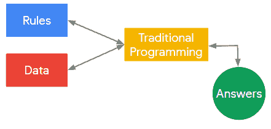
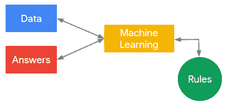
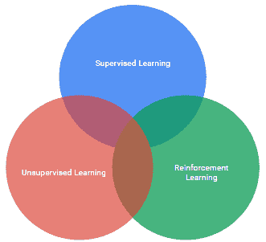

# 机器学习一瞥

> 原文：<https://dev.to/overrideveloper/machine-learning-at-a-glance-1108>

你好。我已经有一段时间没写东西了。我真的很忙，所以很难写。

这篇文章是我不久前起草的，但我还没来得及动笔。这是“机器学习一瞥”，它旨在帮助揭开机器学习的神秘面纱，使其尽可能容易理解，并作为初学者的路线图。

这篇文章概述了我在 2017 年尼日利亚谷歌开发者小组的[中北部发展节](https://ncdevfest.com)上关于同一主题的演讲。我知道，从那以后已经有一段时间了，但这种东西仍然是相关的，因为我偶尔会遇到一些人，他们说他们对机器学习和人工智能感兴趣，但不知道如何着手或它需要什么。我希望这篇文章有助于提供一些见解。

## 人工智能

人工智能(AI)在过去几年已经成为一个家喻户晓的术语，我们看到它在游戏、电影(还记得 J.A.R.V.I.S？)和书本上的，但真正的人工智能是什么？

人工智能就是机器表现出来的智能，这些机器被称为智能机器。智能机器是任何设备(从我们的智能手机这样的小型设备到电视这样的大型设备)，它能够感知环境并采取行动，最大限度地提高实现某个目标的机会。

简单来说，智能机器是一种设备，它研究自己的环境，从中学习，并通过调整自己的动作来适应环境的变化，以便更好地执行特定的任务；它要完成的任务。

## 人工智能的应用

我们都见过电影、游戏和书籍中描述的人工智能，但也有人工智能的现实应用，其中一些是:

*   金融
*   保健/医药
*   客户服务/聊天机器人
*   教育
*   运输
*   技术

过去的人工智能仅限于一些功能，如错误报告和所有基本的东西。不久的将来，人工智能预计将能够做更复杂的事情，我们现在已经看到了一些。
问题是“我们如何把 AI 发展到这样的水平？我们如何建造能够处理复杂事情的智能机器”，答案是机器学习。

## 机器学习

与人工智能相比，“机器学习”这个术语可能不那么常见，或者可能会很常见，但大多数人甚至不知道它是关于什么的最模糊的概念。

机器学习(ML)是实现人工智能的一种方法。也就是说，我们可以说目标是开发智能机器，机器学习是实现这一目标的一种方式。ML 致力于开发无需明确告知就能学习的系统，类似于人类的学习方式。

## 传统编程 vs 机器学习

#### 传统编程

在传统编程中，我们提供规则和数据作为输入，算法提供答案作为输出。让我举一个简单的例子，用简单的利息。

我们都知道数学中的简单兴趣，对吧？当开始编程时，在编写了通常的“hello world”程序后，简单的算术程序通常是接下来要做的事情；所以这个例子应该很简单。

现在，单利的公式是 **(PRT)/100** 。使用上图，我们可以分析一个计算单利的程序，如下所示:

*   数据:作为输入提供的数据将是变量 **P** 、 **R** 和 **T** 。
*   规则:规则是公式 **SI = (PRT)/100**
*   答案:答案是变量 **SI**

这基本上是传统编程的工作方式。

#### 机器学习

 
在机器学习中，它的方式与传统编程不同。这里，我们提供数据和预期答案作为输入，算法生成规则作为输出。
一个例子是区分真钞和假钞的机器学习系统。使用上图，我们可以这样分析这样一个系统:

*   数据:作为输入提供的数据将是伪钞和真钞的数千幅图像。
*   回答:作为输入提供的答案将是这些图像上的标签，其指定特定图像是真钞还是伪钞。
*   规则:规则将由机器学习算法生成，这些规则或多或少是算法对如何区分真钞和伪钞的理解。

## 为什么要关心机器学习？

我经常被问到类似“我为什么要关心机器学习？为什么突然变得重要了？为什么是现在？”，
以下是我们为什么应该关注机器学习以及它为什么“突然”变得重要的原因:

*   数据可用性:现在正在生成大量数据，非常多(大数据听起来很熟悉吧？).这些数据是由我们的智能设备、嵌入式系统和其他来源生成的。现在的数据比以往任何时候都多，可以通过分析这些数据来发现模式、趋势和关联，从而做出明智的决策，那么我们为什么不这样做呢？
*   计算能力:目前的硬件有足够的计算能力来分析数据。我们有配备疯狂硬件的个人电脑，我们有计算能力超过把人类送上月球的电脑的手机。

在大量数据和具有足够计算能力来分析它们的设备之间，我相信没有比现在更好的时间来关心机器学习了。

## 机器学习过程

机器学习过程可以定义为一系列步骤，包括:

*   **数据收集**:这涉及到作为输入的数据来源。数据可以是不同的格式:XML、JSON、CSV、文本文件、图像等，并且可以从各种来源获得。
*   **数据准备**:这涉及到根据待开发的机器学习系统的要求，对数据进行分析和过滤，去除差的、坏的和不必要的数据。这还包括将准备好的数据分成训练集和测试集，训练集将用于训练算法，测试集将用于验证
*   **训练**:这是机器学习过程的一部分，使用训练集训练算法。
*   **评估**:训练后，使用测试集对训练好的模型进行评估。
*   **优化**:根据评估结果，可以对模型进行优化，减少误差，提高效率。优化可能涉及调整算法中的一些东西，引入一个新的变量来提高效率，或者完全改变整个模型/算法。

## 机器学习算法

 
机器学习算法有三大类，它们是:

*   监督学习。
*   无监督学习。
*   强化学习。

#### 监督学习

监督学习是一类用于建立预测模型的机器学习算法。它们是“预测模型”，因为它们的目的是基于历史数据预测未来的结果。
在监督学习中，**期望的输出是已知的**，这样，数据被标记，机器学习模型被给出关于它们要学习什么以及它们如何学习的明确指令。

监督学习有两个主要任务/问题，它们是:

*   **分类**:这是一个机器学习任务/问题，处理将项目分类。比如真假钞，猫狗等。
*   **回归**:这是一个机器学习任务/问题，处理预测真实值，如体重、金钱等。例如，预测 2023 年的燃料价格，预测一个 30 英寸的比萨饼的价格(一个 30 英寸的比萨饼会是这样的景象！)，预测 2020 年的降雨量等。

[点击这里阅读更多关于监督学习的内容](https://dev.to/overrideveloper/an-intro-to-supervised-learning-the-good-the-bad-and-the-ugly-1oo)

#### 无监督学习

无监督学习是一类用于建立描述性模型的机器学习算法。它们是“描述性模型”，因为它们的目的是从非结构化和未标记的数据中确定和定义结构和相似性。
在无监督学习中，**期望的输出是未知的**，因此数据是无标记的，模型不会被告知如何学习，而是必须完全依靠自己来学习。

无监督学习的主要任务是**聚类**；处理确定未标记数据结构的机器学习任务/问题。

#### 强化学习

强化学习是一类机器学习算法，用于建立模型，这些模型使用*试错*来确定哪些行为会产生最大的回报。这些模型和强化学习的目的是最大化回报。
强化学习模型主要用于但不限于机器人、游戏和导航。

其他机器学习算法包括:

*   **半监督学习**:这使用了少量的已标记数据和大量的未标记数据。
*   **主动学习**:在这里，模型交互式地查询用户以获取新知识。

## 机器学习入门资源

这里有一些资源可以帮助你开始学习机器:

*   谷歌的机器学习速成班:作为机器学习领域的巨头之一，谷歌有一门[机器学习速成班](https://developers.google.com/machine-learning/crash-course/)，旨在教授机器学习的基础知识。
*   Udacity 机器学习纳米学位:Udacity 提供深入的[机器学习纳米学位](https://www.udacity.com/course/machine-learning-engineer-nanodegree--nd009t)，通过项目带你了解机器学习的基础和原理。
*   Kaggle: [Kaggle](https://www.kaggle.com) 是数据科学家和机器学习工程师及爱好者的最大社区之一。它为您提供了访问大量数据集的机会，以及探索和构建模型、学习和参与机器学习和数据科学竞赛的机会。
*   sci kit-learn:[sci-kit learn](https://scikit-learn.org/stable/)是 Python 中的一个开源机库。它为数据分析和建立机器学习模型提供了简单易用的工具。它很容易学习，我推荐用它来学习初级水平的东西。
*   Zindi: Zindi 是一个由数据科学家、机器学习工程师和爱好者组成的非洲社区。Zindi 提供了访问来自非洲的数据集以及参与数据科学竞赛的机会。

现在是参与机器学习的时候了，我希望这篇文章对什么是机器学习有一个深刻的概述，并帮助你开始。祝你好运，继续学习！