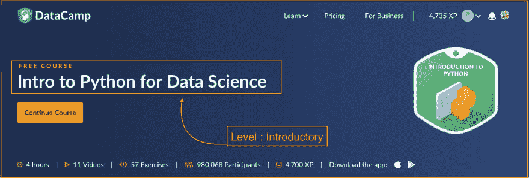
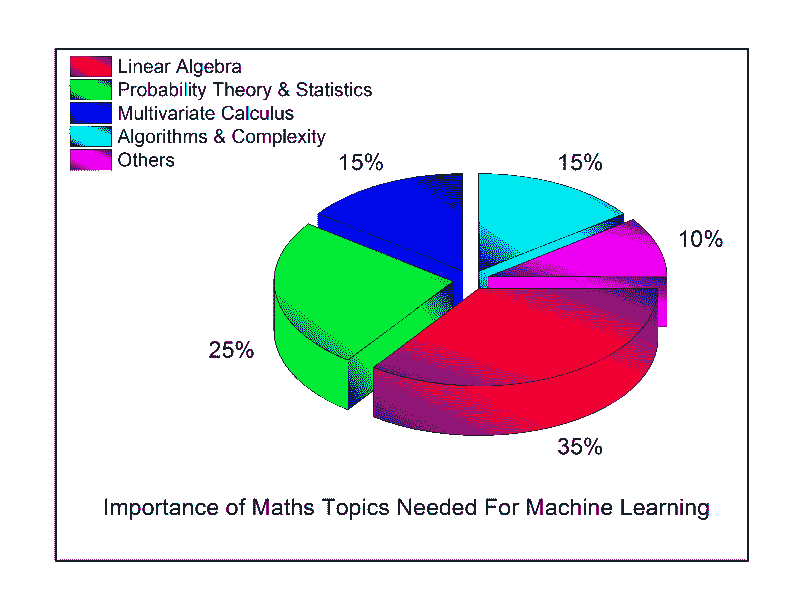

# 用 Python 和数学学习机器学习:DataCamp、斯坦福和帝国理工

> 原文：<https://dev.to/sinxloud/machine-learning-python-mathematics-1aa>

机器学习是一套统计技术和算法，旨在发现和使用数据中的结构和模式，以做出有趣的预测或提供酷的见解。

作为一名初学者，你可能正在寻找一种方法来牢固地理解机器学习，这种方法不仅严谨实用，而且简洁快速。所以事不宜迟，就从你需要学习的内容开始吧。

机器学习都是关于算法的，所以如果你需要学习基础或高级概念，我会在这篇关于[学习数据科学和机器学习的算法](https://sinxloud.com/data-science-algorithms-machine-learning/)的文章中为你提供帮助。

*本帖原载[此处](https://sinxloud.com/best-machine-learning-python-course-beginner-learn/)T3】*

## 用 Python 学习机器学习

首先，你需要学习 Python。Python 广泛应用于数据科学、IOT、机器学习、Web 应用或游戏开发。

与其他编程语言不同，Python 的语法简单易懂。所以作为一个初学者，这将让你快速掌握基础知识，减少精神紧张，你可以更快地升级到高级机器学习主题。

有许多精彩的免费在线资源可以帮助你开始学习机器学习，但如果你在开始学习时遇到困难，我会建议你参加任何 Python 课程，在我看来，侧重于数据科学的入门课程要好得多。

DataCamp 的这两个课程是为初级和中级学习者设计的，它们提供了巨大的支持，帮助你在信息科学领域的职业生涯中获得智力上的提升。

* * *

### [1。面向数据科学的 Python 入门…–初学者](https://www.datacamp.com/courses/intro-to-python-for-data-science?tap_a=5644-dce66f&tap_s=384177-0102f2)

面向数据科学的 Python 介绍课程将概述面向数据科学的 Python 生态系统，并让您用 Python 编写第一个代码。

最重要的是，你将获得对 Pandas 和 Numpy 的深入介绍，它们是用于机器学习和数据科学的强大而高效的库。

#### 适合你吗？

DataCamp 有几门很棒的入门课程，都是通过互动练习教授的。本课程适合任何有激情和永不满足的渴望学习数据科学或机器学习的人。

##### [前往航线](https://www.datacamp.com/courses/intro-to-python-for-data-science?tap_a=5644-dce66f&tap_s=384177-0102f2)

一旦你能够理解别人的 Python 代码，我强烈建议你参加任何中级 Python 课程。DataCamp 还为数据科学提供了[中级 Python，它将向您介绍高级主题，有助于获得机器学习的功能知识。](https://www.datacamp.com/courses/intermediate-python-for-data-science?tap_a=5644-dce66f&tap_s=384177-0102f2)

* * *

### [2。用 Python 进行机器学习…–中级](https://www.datacamp.com/tracks/machine-learning-with-python?tap_a=5644-dce66f&tap_s=384177-0102f2)

在此技能路线中，您将了解机器学习的世界，并学习使用 Python 进行机器学习的基本概念。这个学习轨道分为 5 门课程；

1.  使用 scikit-learn 进行监督学习
2.  使用 scikit-learn 进行无监督学习
3.  Python 中的线性分类器
4.  专家的机器学习:学校预算
5.  Python 中的深度学习

不要被这个机器学习技能课程中出现的新概念吓倒。这很难完成，但并非不可能。有些概念会是外来的或者直截了当的怪异，如果有必要就再来一遍。

#### 适合你吗？

在这个机器学习技能跟踪中，您可以使用机器学习的真实例子进行练习，并通过使用 Keras(Python 中用于深度学习的最新版本的尖端库)了解机器人、自然语言处理、图像识别和人工智能等不同领域中最令人兴奋的功能。

##### [前往技能追踪](https://www.datacamp.com/tracks/machine-learning-with-python?tap_a=5644-dce66f&tap_s=384177-0102f2)

如果你对寻找快速机器学习课程特别感兴趣，我已经在网上为你准备了这篇关于机器学习[最佳课程](https://sinxloud.com/machine-learning-tutorial-courses-specialization-beginner/)的文章。

* * *

## 永远停留在学习之上！！！

机器学习对初学者来说很难，python 中用于机器学习的库也很难理解。

在过去的几个月里，我从不同的来源收集了数据科学和机器学习的最新 Python 备忘单。

*   面向初学者和专家的 7+ [Python 备忘单](https://sinxloud.com/python-cheat-sheet-beginner-advanced/)
*   使用 Python(和数学)进行机器学习的简明备忘单

学习的时候可能会失去动力，所以你可以听一下这些 [Python 播客](https://sinxloud.com/best-python-podcasts/)来跟上时代。

如果你感到困难，不要犹豫，联系一下 Reddit 和 T2 上的学习伙伴，他们会帮助你，支持你。

此外，一定要参加 [Kaggle 学习/机器学习挑战](https://www.kaggle.com/learn/machine-learning)，你将能够站在学习的顶端，成长得更快。

* * *

## 刷刷你的数学技能！！！

数学是任何当代科学学科的基础。然而，你不需要数学学位就能在机器学习方面取得成功。然而，如果你有数学背景，你肯定会出人头地。

你将需要一个有可实现目标的结构化学习方法来提升你机器学习所需的技能。我强烈建议从学习 Python 的第一天起就开始复习数学技能，不管你的数学背景如何。

以我个人的经验，每天至少花 30-45 分钟将会有很大的收获，你将会更快地理解和学习数学和统计学的高级 Python 主题。

在接下来的几天里，我会发表另一篇关于机器学习所需的数学水平的文章。同时，让我们简单地进入最后一部分，并使用下面的信息图来了解成为机器学习科学家/工程师所需的最低数学水平。

* * *

这里有两个来自世界一流教师的最佳在线课程，可以帮助你掌握所有有志于机器学习的科学家/工程师在学习更高级的材料之前必须知道的词汇、符号、概念和代数规则。

### [1。机器学习专业化的数学](https://sinxloud.com/fly/mathematics-for-machine-learning-specialization-imperial-college-london-coursera-2/) -强烈推荐

该专业由伦敦帝国理工学院提供，由 3 门课程组成，旨在让您对数学有直观的理解，并帮助您将关键概念应用到机器学习中。

1.  机器学习的数学:线性代数
2.  机器学习的数学:多元微积分
3.  机器学习的数学:PCA

#### 适合你吗？

完成这一专业后，您将获得继续您的旅程和学习机器学习中更高级课程的必备数学知识。

##### [前往航线](https://sinxloud.com/fly/mathematics-for-machine-learning-specialization-imperial-college-london-coursera-2/)

* * *

### [2。数学思维入门](https://sinxloud.com/fly/introduction-to-mathematical-thinking-stanford-coursera/) -高价值

这门课程将帮助你像职业数学家一样思考，解决日常世界、科学或数学本身中出现的实际问题。

这门课不是关于做数学，而是关于如何用数学家的方式思考。

#### 适合你吗？

您将从本课程中受益匪浅，并为机器学习或数据科学灌输一个强大的认知过程。

##### [前往航线](https://sinxloud.com/fly/introduction-to-mathematical-thinking-stanford-coursera/)

* * *

感谢坚持到最后:-)

机器学习是令人生畏的，不努力学习是不可能的。所以，如果你按照这个顺序，每天坚持练习 Python，那么过一段时间你就会很容易掌握它。

如果你喜欢这篇文章，我为你准备了实用读物。一个关于[学习数据科学的概率统计](https://sinxloud.com/probability-statistics-for-data-science-courses/)一个关于最好的[机器学习课程/专业](https://sinxloud.com/machine-learning-tutorial-courses-specialization-beginner/)。

###### 干杯！！！