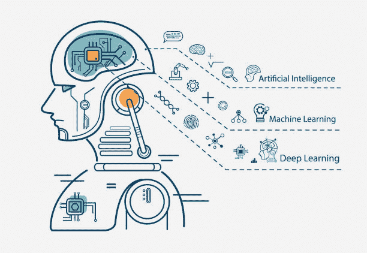

# 用 Python 进行机器学习

> 原文：<https://dev.to/devamoghs/machine-learning-with-python-4dj6>

# 

## 理解核心概念的小规模机器学习项目(顺序:从最老到最新)

*   使用带有 newsgroups20 数据集的**潜在狄利克雷分配**的主题建模，使用 Python 和 Scikit-Learn 实现
*   在 MNIST 数据集上实现了一个简单的用 Keras 构建的神经网络
*   使用**线性回归**在谷歌上预测股价
*   实现了一个简单的社交网络来学习 Python 的基础知识
*   实现了**朴素贝叶斯分类器**来过滤公共语料库中的垃圾邮件
*   **使用 Keras 和 Scikit-Learn 的银行数据集的流失预测模型**
*   从零开始实现了**随机森林**,并在来自 UCI 知识库的声纳数据集上构建了一个分类器
*   Python 中对样本数据集的简单线性回归
*   **样本数据集上 Python 中的多元回归**
*   **PCA 和缩放**Python 中的样本股票数据[working_with_data]
*   样本数据集上 Python 中的**决策树**
*   **样本数据集上 Python 中的逻辑回归**
*   用 Python 建立了一个神经网络来破解验证码系统
*   助手方法包括在**统计、概率、线性代数和数据分析**中使用的常见操作
*   **K-means 聚类**用实例数据；**用 k-means 聚类颜色**；**自底向上的层次聚类**
*   生成单词云
*   使用 n 元文法生成句子
*   使用**文法和自动机理论生成句子；吉布斯采样**
*   使用潜在狄利克雷分析(LDA)的主题建模
*   将 Scikit-Learn 的 **GridSearchCV** 用于 **Keras 神经网络**的包装器