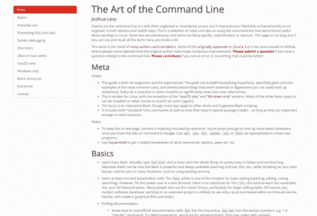
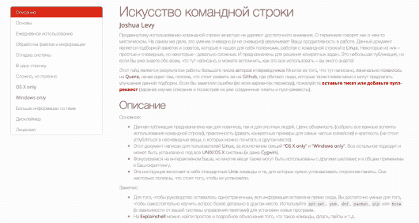

# 为“命令行的艺术”制作一个命令行 HTML 呈现脚本

> 原文：<https://dev.to/hrbrmstr/making-a-command-line-html-rendering-script-for-the-art-of-the-command-line-in-r-21ec>

我为 git-stagging 设置的 Feedly 类别表明了对约书亚·利维的[命令行的艺术](https://github.com/jlevy/the-art-of-command-line)相当大的兴趣。什么是“命令行的艺术”？引用作者的话:

> 命令行的流畅性是一项经常被忽视或被认为神秘的技能，但它以明显和微妙的方式提高了您作为工程师的灵活性和生产力。这是我们发现在 Linux 上工作时有用的关于使用命令行的注释和提示的选集。有些技巧是基本的，有些相当具体、复杂或晦涩难懂。这一页不长，但如果你能使用并回忆起这里的所有条目，你就知道很多了。

它本身就是一个很好的资源(用 GitUgh 呈现的简单明了的降价)。但是，我们可以在`rmarkdown::render()`的帮助下和一些内容切片&下做得更好。

我最初的想法是抓取英语版本，把一个 R Markdown YAML 标题放在上面，删除一些 intro cruft 并将其渲染为独立的 HTML。虽然这将是快速，容易和有用的，但它也非常手动和脆弱，因为更新它需要复制和粘贴；另外，它省略了翻译版本。

所以，目标号 uno 变成了“做一个函数来做这个”。然后，我意识到*“嘿！这是一个命令行资源，为什么不把这个功能变成一个命令行工具呢！”*。所以这成了第二个目标。(我有一个内部假设，如果 R 中内置更多易于安装的命令行实用程序，R 的采用率会高得多，因为这是 Python 拥有更大安装基础的一个原因，许多人最终只使用他们安装的模块的命令行版本。CRAN 关于在软件包安装过程中你能做什么的严格规则使得这有点没有意义。有人可能会说 CRAN 做得对，Python/PyPI 在默认情况下非常不安全，这也是事实。)

### 目标 Uno

既然我们要创建一个函数，那么参数化语言、文档主题和高亮主题的选项也是有意义的。

这是奋进号的安装计划非常简单:

*   获取当前可用的翻译集
*   检查以确保所需的翻译是在^^设置
*   获取指定文档的副本
*   获取标题(因为这是为每个人翻译的)
*   去掉一些不必要的前置内容
*   将`AUTHORS.md`链接变成合适的链接(相对于相对)
*   添加带有所需定制的 YAML 标题
*   将文档呈现为独立的 HTML
*   渲染后打开它

看起来是这样的:

```
taotcl <- function(language = "", theme = "simplex", highlight = "espresso", output_dir = getwd(), open = TRUE) {

  language <- language[1]

  # find translations

  httr::GET(
    url = "https://api.github.com/repos/jlevy/the-art-of-command-line/contents/",
    httr::add_headers(
      `Accept` = "application/vnd.github.v3+json"
    ),
    httr::user_agent("taotcl R script; @hrbrmstr")
  ) -> res

  httr::stop_for_status(res)

  ls <- httr::content(res, as = "parsed")

  readmes <- Filter(function(.x) grepl("^README", .x), vapply(ls, `[[`, character(1), "name"))
  langs <- regmatches(readmes, regexpr("-[-[:alpha:]]+", readmes))

  # check to make sure a valid one was specified

  if (language != "") { # "" => English
    language <- sprintf("-%s", language)
    if (!(language %in% langs)) {
      stop(
        "Language '", sub("^-", "", language), 
        "' not found in repo. Current translations include: ",
        paste0(sprintf("'%s'", sub("^-", "", langs)), collapse = ", "),
        ".", call.=FALSE
      )
    }
  }

  # get the desired doc

  src <- "https://raw.githubusercontent.com/jlevy/the-art-of-command-line/master/README{language}.md"
  src <- glue::glue(src)

  l <- readLines(src)

  # find the title
  title <- sub("^#[[:space:]]*", "", l[which(grepl("^#[[:space:]]*", l))[1]])

  # figure out the cut line
  cowsay <- which(grepl("cowsay", l))[1]

  l <- l[-(1:(cowsay+1))] # cut

  # make the AUTHORS.md a useful link
  l <- gsub("(AUTHORS.md)", "(https://github.com/jlevy/the-art-of-command-line/blob/master/AUTHORS.md)", l, fixed = TRUE)

  theme <- theme[1]
  highlight <- highlight[1]

'---
title: "{title}"
author: "Joshua Levy"
email: "joshua@cal.berkeley.edu"
output: 
  html_document:
    theme: {theme}
    highlight: {highlight}
    toc: true
    toc_float: true
    toc_depth: 2
---

' -> yaml

  # fill in the YAML
  yaml <- glue::glue(yaml)

  tf <- tempfile(fileext = ".Rmd")
  on.exit(unlink(tf), add = TRUE)
  writeLines(c(yaml, l), tf)

  # render the doc
  rmarkdown::render(
    input = tf,
    output_file = sprintf("%s.html", tolower(gsub(" ", "-", title))),
    output_dir = output_dir[1],
    quiet = TRUE
  ) -> loc

  # open in browser
  if (open[1]) browseURL(loc)

  message("Rendered version is at '", loc, "'")

} 
```

Enter fullscreen mode Exit fullscreen mode

使用默认设置运行它，结果如下所示:

[](https://i2.wp.com/rud.is/b/wp-content/uploads/2019/05/render.png?ssl=1)

你不必全部输入，因为这个函数在[我的 gitea](https://git.rud.is/hrbrmstr/taotcl) / [sourcehut](https://git.sr.ht/~hrbrmstr/taotcl) 的`taotcl.R`脚本中。

### 目标二

现在我们有了一个可以从 R 调用的函数，我们只需要一个包装器来包装它。我有点喜欢 David Shih 把他的 [`{argparser}`包](https://bitbucket.org/djhshih/argparser/src)(在 CRAN 上)放在一起的方式，所以我们将用它为我们的渲染函数做一个包装。

我们有非常相同的目标列表，因为我们希望让用户指定自定义功能。还有一些额外的(这不是一个详尽的列表，但对这次行动来说“足够了”):

1.  让人们在真正的操作系统上轻松使用它，而不需要使用`Rscript`
2.  让人们知道他们需要安装哪些必需的包，如果有的话
3.  装载包裹时请保持安静
4.  假设友好/有用的默认值
5.  提供长参数和短参数(有些人喜欢短参数，有些人喜欢长参数)

完成的脚本的前几行将完成#1-3:

```
#!/usr/bin/env Rscript

needed <- c("magrittr", "argparser", "httr", "glue", "rmarkdown")
installed <- rownames(installed.packages())
missing <- needed[!(needed %in% installed)]

if (length(missing)) stop("Please install the following packages: ", paste0(sprintf("'%s'", missing), collapse = ", "), call.=FALSE)

suppressPackageStartupMessages({
  for (pkg in needed) {
    require(package = pkg, quietly = TRUE, warn.conflicts = FALSE, character.only = TRUE)
  }
}) 
```

Enter fullscreen mode Exit fullscreen mode

第 1 行是一个[“hash bang”/“she bang”](https://www.in-ulm.de/~mascheck/various/shebang/)，并且——假设文件设置了执行位——将允许*nix/macOS 上的人们运行文件，而无需特意调用`Rscript`。其余的只是做包检查和加载。

我们需要一种方法来获得命令行参数，因此使用了`{argparser}`。我们将创建一个`arg_parser`对象，然后使用`{magrittr}`管道(`%>%`)添加参数。您可以添加长/短参数名以及帮助和默认值(还要注意参数是否是标志/开关)。一旦我们有了这些设置，我们告诉`{argparser}`处理用户提供的任何参数:

```
arg_parser(
  description = "Render 'The Art of the Command Line' to HTML"
) %>% 
  add_argument(
    arg = "--language",
    help = 'Language to render. Leave unspecified for English. Current known: "cs", "de", "el", "es", "fr", "id", "it", "ja", "ko", "pt", "ro", "ru", "sl", "uk", "zh-Hant", "zh"',
    type = "character",
    short = "-l",
    default = ""
  ) %>% 
  add_argument(
    arg = "--theme",
    help = "Which R Markdown document theme to use. Ref: https://l.rud.is/2JOibrZ",
    type = "character",
    short = "-t",
    default = "simplex"
  ) %>% 
  add_argument(
    arg = "--highlight",
    help = "Which R Markdown code higlight theme to use. Ref: https://l.rud.is/2JOibrZ",
    type = "character",
    short = "-c",
    default = "espresso"
  ) %>% 
  add_argument(
    arg = "--output-dir",
    help = "Where to store the rendered file. Defaults to current working directory.",
    type = "character",
    short = "-o",
    default = getwd()
  ) %>% 
  add_argument(
    arg = "--just-render",
    help = "Only render the document. Do not open in the system default browser. (Default is to render and open.)",
    short = "-j",
    flag = TRUE
  ) -> parser

opts <- argparser::parse_args(parser) 
```

Enter fullscreen mode Exit fullscreen mode

一旦我们有了这些(源代码中的下一个函数是`taotcl()`),那么调用函数
就是问题了

```
taotcl(
  language = opts$language,
  theme = opts$theme,
  highlight = opts$highlight,
  output_dir = opts$output_dir,
  open = is.na(opts$just_render) | (!opts$just_render)
) 
```

Enter fullscreen mode Exit fullscreen mode

如果用`-h`或`--help`调用我们刚刚制作的命令行程序，用户将得到:

```
usage: ./taotcl.R [--help] [--just-render] [--opts OPTS] [--language LANGUAGE] [--theme THEME] [--highlight HIGHLIGHT] [--output-dir OUTPUT-DIR]

or (on Windows): Rscript taotcl.R [--help] [--just-render] [--opts OPTS] [--language LANGUAGE] [--theme THEME] [--highlight HIGHLIGHT] [--output-dir OUTPUT-DIR]

Render 'The Art of the Command Line' to HTML

flags:
  -h, --help show this help message and exit
  -j, --just-render Only render the document. Do not open in the system default browser. 
                                (Default is to render and open.)

optional arguments:
  -x, --opts OPTS RDS file containing argument values
  -l, --language LANGUAGE Language to render. Leave unspecified for English. 
                                Current known: "cs", "de", "el", "es", "fr", "id", "it", "ja", 
                                "ko", "pt", "ro", "ru", "sl", "uk", "zh-Hant", "zh" [default:]
  -t, --theme THEME Which R Markdown document theme to use. Ref: https://l.rud.is/2JOibrZ [default: simplex]
  -c, --highlight HIGHLIGHT Which R Markdown code higlight theme to use. Ref: https://l.rud.is/2JOibrZ [default: espresso]
  -o, --output-dir OUTPUT-DIR Where to store the rendered file. Defaults to current working directory. 
                                [default: /your/current/directory/here] 
```

Enter fullscreen mode Exit fullscreen mode

如果我们用`./taotcl.R --language ru -o /tmp`运行它，脚本将处理正确的语言版本，并将其呈现给`/tmp/искусство-командной-строки.html`并自动打开它。它应该看起来像:

[](https://i2.wp.com/rud.is/b/wp-content/uploads/2019/05/render-ru.png?ssl=1)

### 鳍

如上所述，你可以在[my gitea](https://git.rud.is/hrbrmstr/taotcl)/[source hut](https://git.sr.ht/~hrbrmstr/taotcl)找到整个脚本。它最终也会传到 GitLab & GitUgh(以及其他几个，因为我正在扩展我用来支持社会编码多样性 vs 霸权的脚本)。

请注意，您可以去掉`.R`，hashbang 仍然可以正常工作，因此使用起来会更加简单。

如果你不想经历这一切，只是想要资源的独立渲染版本，只需在评论中留下一个注释，我会抛出一个小的闪亮的应用程序，让你指定参数并获得渲染版本。

最后，`r-lib`有一些方便的[包，让 R-build 命令行实用程序变得更酷](https://github.com/r-lib?utf8=%E2%9C%93&q=cli&type=&language=)(这是一个小小的建议，如果你想给这个相当普通的实用程序添加一些味道，欢迎使用 PRs)。