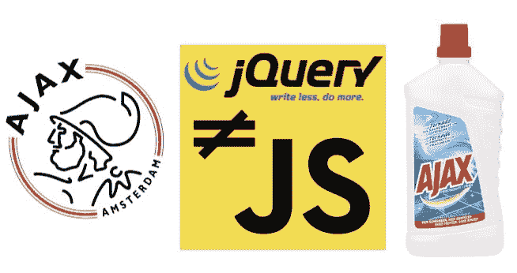
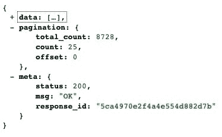
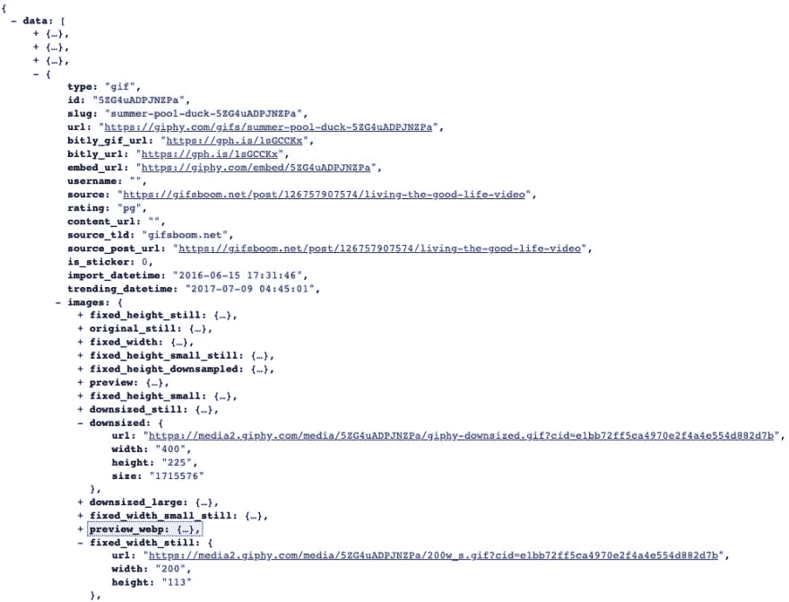
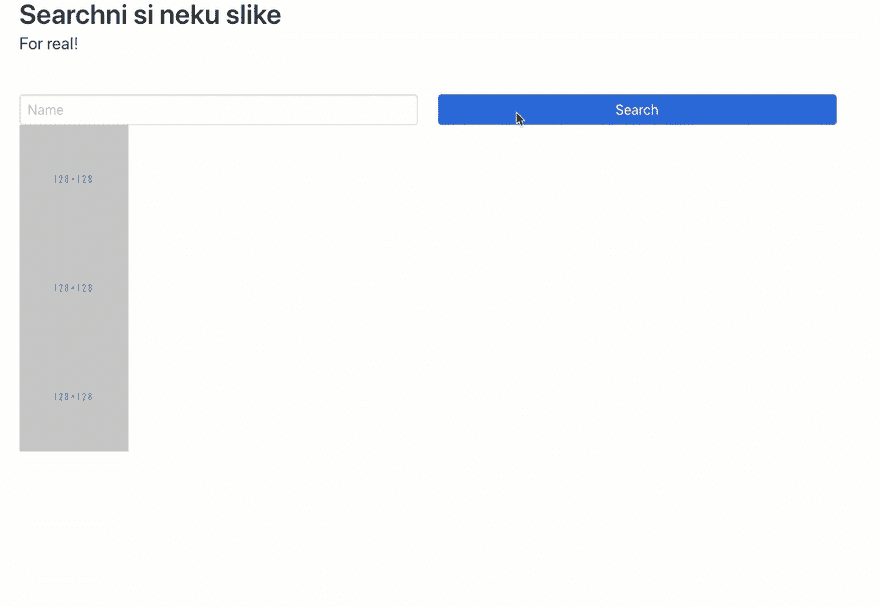

# 使用 jQuery 进行 AJAX 调用

> 原文：<https://dev.to/nikola/making-ajax-calls-using-jquery-3bp7>

[](https://res.cloudinary.com/practicaldev/image/fetch/s--XbjOVKE6--/c_limit%2Cf_auto%2Cfl_progressive%2Cq_auto%2Cw_880/https://thepracticaldev.s3.amazonaws.com/i/5bhw48ka5ozwyianiecr.jpg)

*最初发布于[我的博客](http://www.nikola-breznjak.com/blog/javascript/making-ajax-calls-using-jquery/)T3】*

## TL；速度三角形定位法(dead reckoning)

在这篇文章中，我们将做所有的事情(甚至更多😎)我们在[第一篇](https://dev.to/hitman666/making-ajax-calls-in-pure-javascript-the-old-way-ed5)中做了，但是用的是 [jQuery](https://jquery.com/) 。

## jQuery 为什么更好？

我准备了[这个演示页面](http://nikola-breznjak.com/_testings/ajax/test3.html)以便你可以测试。

您应该还记得上一篇文章，为了用纯 JavaScript 进行 AJAX 调用，您必须这样做:

```
var xhr = new XMLHttpRequest();
xhr.onreadystatechange = function() {
    if (xhr.readyState === 4){
        document.getElementById('result').innerHTML = xhr.responseText;
    }
};
xhr.open('GET', 'http://nikola-breznjak.com/_testings/ajax/test1.php?ime=Nikola');
xhr.send(); 
```

Enter fullscreen mode Exit fullscreen mode

继续运行浏览器开发工具控制台中的[演示页面](http://nikola-breznjak.com/_testings/ajax/test3.html)上的代码(如果遇到困难，请参考[上一篇文章](https://dev.to/hitman666/making-ajax-calls-in-pure-javascript-the-old-way-ed5))。

现在，要用 jQuery 做同样的事情，您需要做的就是:

`$('#result').load('http://nikola-breznjak.com/_testings/ajax/test1.php?ime=Nikola');`

继续在控制台中尝试。更改`ime`参数，您会看到页面上的文本将更改为`Hello [name]`，其中【name】将是您输入的参数。

> ⚠️:我不会深入介绍使用 jQuery 的基础知识，因为它已经存在很长时间了，并且有大量关于它的教程。如果你想了解更多，从官方文件开始。

这里需要注意的重要一点是，`.load`必须链接到一个所谓的 jQuery 选择，正如在[中提到的。load()文档](https://api.jquery.com/load/)。我们从服务器加载数据，并将返回的文本放入 id 为`result`的元素中。

## 速记方法

通过查看文档，您可以看到有更多的这些所谓的[速记方法](https://api.jquery.com/category/ajax/shorthand-methods/)用于进行 AJAX 调用，所有这些都可以用最通用的 [ajax](https://api.jquery.com/jQuery.ajax/) 函数来完成。

之前的例子可以使用 [get](https://api.jquery.com/jQuery.get/) 速记方法:
来完成

```
 var link = 'http://nikola-breznjak.com/_testings/ajax/test1.php';
    var data = {ime:"Nikola"};
    var callback = function(result) {
        $('#result').html(result);
    }
    $.get(link, data, callback); 
```

Enter fullscreen mode Exit fullscreen mode

如果你不想传递任何参数，那就更简单了:

```
 var link = 'http://nikola-breznjak.com/_testings/ajax/test1.php';
    var callback = function(result) {
        $('#result').html(result);
    }
    $.get(link, callback); 
```

Enter fullscreen mode Exit fullscreen mode

## 重写迷你项目

我准备了与上一篇文章相同的演示页面，但是已经包含了 jQuery，所以你可以通过在控制台中粘贴下面的代码来测试它。我鼓励你先自己尝试一下，然后将你的解决方案与下面我的进行比较。

```
var link = 'http://nikola-breznjak.com/_testings/ajax/test2.php';
$.getJSON(link, function(result){
    var oglasiHTML = '';
    $.each(result, function(index, oglas){
        var klasaCijene = '';
        if (oglas.cijena < 100){
            klasaCijene = 'is-success';
        }
        else if (oglas.cijena >= 100 && oglas.cijena < 300){
            klasaCijene = 'is-info';
        }
        else if (oglas.cijena >= 300){
            klasaCijene = 'is-danger';
        }

        oglasiHTML += `
            <div class="columns">
                <div class="column is-one-quarter">
                    <span class="tag ${klasaCijene}">${oglas.cijena}</span>
                </div>
                <div class="column">${oglas.tekst}</div>
            </div>
        `;
    });

    $('#oglasi').html(oglasiHTML);
}); 
```

Enter fullscreen mode Exit fullscreen mode

这里我想指出几件事:

*   我使用了 [getJSON](https://api.jquery.com/jQuery.getJSON/) 函数来调用保存在`link`变量中的 URL 上的 API。这是因为我知道这个 API 返回一个 JSON 响应(您可以通过在浏览器中打开那个链接来检查)。
*   我使用 jQuery [each](https://api.jquery.com/each/) 函数来迭代`result`。
*   我使用了[模板文字](https://developer.mozilla.org/en-US/docs/Web/JavaScript/Reference/Template_literals)来构造最终的`oglasiHTML`，这比我们在上一篇文章中使用连接的方式要简洁得多。
*   核心逻辑与第一篇文章中的相同，除了不必使用`for`循环和`indexes`来访问数组的每个元素。

## 我想要更多例子

[](https://res.cloudinary.com/practicaldev/image/fetch/s--WVlPBIyO--/c_limit%2Cf_auto%2Cfl_progressive%2Cq_auto%2Cw_880/https://i.imgur.com/jYSxnG9.jpg)

假设您有[这个演示页面](http://nikola-breznjak.com/_testings/ajax/test5-email.html)，并且您需要使用 AJAX 来制作时事通讯注册表单，而不是在单击`Subscribe`按钮时转到一个新页面。现在 API(位于 http://nikola-breznjak.com/_testings/ajax/email.php 的[)实际上并不处理你发送给它的数据，但是为了练习，也试着根据请求发送数据。](http://nikola-breznjak.com/_testings/ajax/email.php)

你会怎么做？你会从哪里开始？

好吧，这里有一些你可以谷歌一下的搜索词:

*   `form submit jquery`
*   `post data`

同样，这是我的解决方案，但我鼓励你先自己尝试一下。

```
$('form').submit(function(ev){
    ev.preventDefault();
    var url = $(this).attr('action');
    var formData = $(this).serialize();
    $.post(url, formData, function(response){
        $('#newsletter').html('Thank you for subscribing, please check your email.');
    });
}); 
```

Enter fullscreen mode Exit fullscreen mode

这里我想指出几件事:

*   我可以在没有任何 id 的情况下使用`form`选择器，因为它是页面上唯一的表单。如果页面上有更多的表单，我必须使用 id 来区分它们(这总是一个好习惯，即使只有一个表单)
*   我使用 jQuery 的 [submit](https://api.jquery.com/submit/) 函数来设置一个事件处理程序，这个事件处理程序将在表单提交时执行(单击`Subscribe`按钮，或者在其中一个字段中按 ENTER 键)
*   我使用了`ev.preventDefault()`来阻止表单“做它该做的事情”和加载“email.php”页面，这是它的默认行为
*   我使用`$(this).attr('action')`从 HTML 的表单定义中提取 API URL(可以在元素检查器中随意检查)
*   我使用`$(this).serialize()`将一组表单元素编码成一个字符串，然后传递给 jQuery [post](https://api.jquery.com/jQuery.post/) 速记函数。这个函数使用 POST 方法向服务器发送一个请求，这是发送一些需要在服务器上处理的敏感数据的首选方式(正如我们在上一篇文章中了解到的)
*   我在 id 为`newsletter`的`div`上使用了 [html](https://api.jquery.com/html/) 函数来设置它的新内容

## 请再给我一个好吗？

当然，但是答应我你会先自己做！

> 我愿意🤞

好吧，那我们开始吧💪

这里有一个新的[演示页面](http://nikola-breznjak.com/_testings/ajax/test6-slike.html)，您将在本例中使用。

> ⚠️:我在用布尔玛让网站看起来更漂亮。正如他们的网站所说:
> ‘布尔玛是一个基于 Flexbox 的免费开源 CSS 框架，被超过 15 万开发者使用。’
> 我只想说它真的很棒，很容易学，所以一定要去看看。

在这个挑战中，你必须使用 [Giphy 搜索 API](https://developers.giphy.com/) 创建一个 gif 搜索应用程序。正如文档所说，你需要通过[创建一个应用](https://developers.giphy.com/dashboard/?create=true)来获得 API 密匙。一旦你这样做了，你将能够搜索他们的 API，例如:`http://api.giphy.com/v1/gifs/search?q=funny+cat&api_key=dc6zaTOxFJmzC`。您可以使用这个 API 键，但是如果这个键因为太多的请求而被禁止，一定要创建自己的键🤦‍

一旦获取了 gif(或者静态图像，如果您愿意的话)，就用一个类`result`(是的，class，而不是 id)在 div 中显示它们👍).

这是你卷起袖子，创造它，为自己感到骄傲的部分💪，然后来这里检查我是怎么做到的。

```
$('form').submit(function(ev){
    ev.preventDefault();
    var searchTerm = $('input').val();

    var apiLink = "http://api.giphy.com/v1/gifs/search?api_key=dc6zaTOxFJmzC&q=" + searchTerm;

    var output = '';
    $.getJSON(apiLink, function(images){
        $.each(images.data, function(i, im){
            output += ``;
        });

        $('.result').html(output);
    });
}); 
```

Enter fullscreen mode Exit fullscreen mode

这里唯一新的、可能比较棘手的部分是对从 API 返回的 JSON 对象的遍历，但是只需一点训练，您就会很擅长。

如果你在浏览器中打开这个网址，你会看到

[](https://res.cloudinary.com/practicaldev/image/fetch/s--asXhiWVT--/c_limit%2Cf_auto%2Cfl_progressive%2Cq_auto%2Cw_880/https://i.imgur.com/Dbu9ge8.jpg)

返回的 JSON 对象由三个属性组成:

*   `data`
*   `pagination`
*   `meta`

`data`是一个对象数组，在它的一个属性中有一个`images`数组。在我的例子中，我选择通过访问`url`属性来显示`downsized` gif。

[](https://res.cloudinary.com/practicaldev/image/fetch/s--Y3FPbAec--/c_limit%2Cf_auto%2Cfl_progressive%2Cq_auto%2Cw_880/https://i.imgur.com/ZEuMHuw.jpg)

这是一个简短的 gif 图片:

[](https://res.cloudinary.com/practicaldev/image/fetch/s--1_y9yrmp--/c_limit%2Cf_auto%2Cfl_progressive%2Cq_66%2Cw_880/https://i.imgur.com/dZeGeZT.gif)

## 结论

这篇博文到此为止。我希望它是有用的，并且您已经看到使用 jQuery 与普通 JavaScript 相比，使用 AJAX 请求要容易得多。我也希望你喜欢演示练习👍在下一篇博文中，我们将会看到如何使用现代的[获取 API](https://developer.mozilla.org/en-US/docs/Web/API/Fetch_API) 来实现这一点。