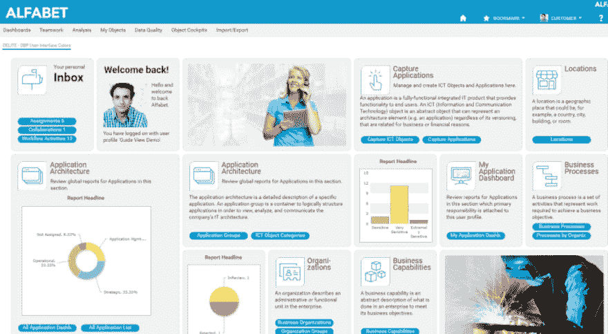
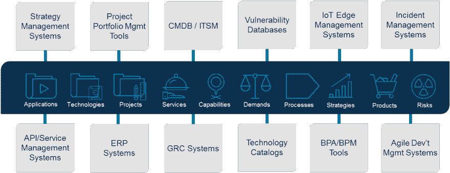
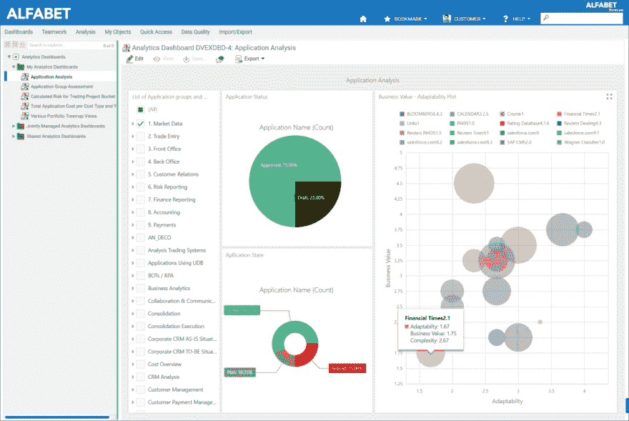

# 打造属于自己的 Alfabet 第 9 部分

> 原文：<https://dev.to/techcommunity/making-alfabet-your-own-part-9-4h17>

# 为特定用例配置

在本系列中，我们已经了解了如何配置 Alfabet 以实现业务和 it 转型的最佳契合和最佳实践。每章都集中在为特定功能配置 Alfabet，例如工作流、报告或数据捕获。本章着眼于针对特定使用情形或目标的配置。组织在配置产品时通常会遵循几个目标。本章讨论了七个最常见的目标，并概述了支持每个目标的配置功能。

## 目标 1:增强用户体验

为了吸引有效业务和 IT 转型所需的广泛利益相关者中的每一个用户，配置 Alfabet 以获得最佳用户体验是极其重要的。在设置 Alfabet 的过程中，组织希望全力以赴支持用户:

**熟悉度**——通过使用元模型中的标准界面标题和本地语言。Alfabet 的自动化数据翻译功能使用机器翻译引擎，以最小的成本和工作量为用户提供他们语言的界面。最终用户可以用他们喜欢的语言捕获和维护 IT 产品组合信息，以提高多语言组织的工作效率并确保高数据质量。将用户说明和帮助自动翻译成本地首选语言进一步提高了最终用户的效率。

**定制交互** -通过使用用户资料、导航页面、工作流、向导、驾驶舱、视图方案、搜索过滤器和调查来提供指导，并限制在履行职责时的干扰。创建可转换为 Excel 电子表格的数据捕获模板，该电子表格可为用户提供输入类型、选项列表以及关于预期输入类型的有用注释。

**背景** -通过提供相关报告和合作机会。使用包含任何类型信息内容的弹出窗口，为临时用户手头的任务提供上下文和指导。通过飞入式视图和滑入式工具栏，可以访问更多信息。

## 目标 2:企业规划治理

一个组织将在其规划和治理框架中定义想要实现的结果，包括确保这些结果所必需的人员、流程和信息。以治理为基本原则，以人员、流程和信息为核心规划元素，Alfabet 提供了许多配置可能性，能够使产品适应组织自己的治理规则和原则。Alfabet 配置功能使您能够:

*   通过使用原型和属性对交付的元模型进行微调，定义并维持组织想要的计划方式
*   使用用户配置文件、用户权限和数据捕获功能，为用户在 Alfabet 中可以看到什么和做什么提供保护
*   使用工作流、监视器和通知保持流程运行，安装正确的阶段入口，并让正确的人在正确的时间参与进来

## 目标 3:数据质量和完整性

在业务和 IT 转型中做出正确决策的关键是完整、可靠和最新的信息。Alfabet 中的许多配置功能都以此为目标，以确保信息:

*   通过使用监视器和工作流及时提示用户在规定的时间表内履行义务
*   通过使用用户配置文件、验证规则和用户权限，将数据捕获限制在经过授权和知识丰富的用户以及数据质量监控人员范围内，从而进行纠正
*   通过调用调查来补充 Alfabet 中没有的信息，并使用数据捕获功能来鼓励用户保留他们在信息拼图中的部分

利用 Alfabet 提供的与第三方系统的许多集成，从其“黄金”来源检索信息。Alfabet 还提供了许多不同的集成方法:ETL-以及 REST-和基于 SOAP，以确保质量和完整性。

## 目标 4:安全

业务和 IT 转型的最终目标是确保业务战略得到有效实施。在竞争激烈的市场中，企业规划信息非常敏感，需要得到充分保护。使用 Alfabet，您可以:

*   通过配置适当的用户权限和配置文件并设置有效的联合结构，即使在高度分散的组织中也能控制对信息的访问
*   考虑每种形式的信息呈现以及谁在观看它
*   根据特定用户群的需求，适当配置视图方案、报告和搜索方法
*   通过明确定义的信息捕获控制来避免操纵数据
*   采用威胁管理来识别、规划和降低企业 IT 环境的风险——可以系统地捕获、分类威胁并将其与体系结构相关联，从而提高发现和减少漏洞的能力

## 目标 5:可审核性

日益增长的法规遵从性负担和对更好的风险管理的需求使得审计员成为关于企业规划和管理的信息的主要利益相关者。Alfabet 存储库是审计员任务的信息金矿。配置有助于审计人员快速找到答案。您可以:

*   通过使用多种报告类型和配置可能性来展示信息片段之间的关系
*   使用调查，用其他所需信息快速扩充 Alfabet 中的现有信息
*   通过构建适当的工作流来简化审核流程，使审核人员能够更轻松地获得对某些信息的确认

## 目标 6:使用投资组合分析

Alfabet 存储库中信息的价值在于它所支持的决策的质量。为了得到正确的答案，你需要问正确的问题。这就是配置以各种方式进行“数据挖掘”的地方

使用 Alfabet，您可以利用各种模板和配置助手来设计显示数据集、矩阵、生命周期图表、条形图、饼图、地理图、树形图等的报告。这些可以用提供手头问题答案所需的任何信息组合来填充。交互式过滤标准还允许用户更改视图，以满足他/她的精确信息需求。您还可以:

*   使最终用户能够创建信息丰富的即席数据可视化，并与用户社区共享
*   指定信息源作为数据提供者，让最终用户自行决定所需的内容和形式
*   使用现代人工智能技术进行发现和分析，探索并了解 IT 投资组合的哪些方面可能需要您的关注

## 目标 7:保持企业敏捷

敏捷性是数字业务成功的核心，Scrum、看板和 DevOps 等方法彻底改变了软件开发，使 IT 能够在更短的发布周期内交付产品。然而，这种敏捷性需要在组织的总体方向、计划和战略中进行构建。Alfabet 通过包含敏捷企业的重要功能将这两种观点结合在一起:双峰组合分析、运营项目管理、API 规划和管理、云规划和管理、与吉拉的集成、特性积压管理和看板板。配置在所有这些功能中发挥着重要作用，以确保它们符合公司的战略意图、政策和执行目标。

## 采取下一步行动

我们的“让 Alfabet 成为您自己的:配置 Alfabet 以实现 it 转型中的最佳契合和最佳实践”系列到此结束。总之，配置有助于提高产品的效率、软件实现的有效性、产品工作人员的生产力、企业从产品中获得的价值以及最终 IT 转型计划的成功。

虽然 Alfabet 拥有丰富的元模型、大量的标准报告、标准化的工作流程以及开箱即用的模板和角色，但 Software AG 认识到让产品符合公司需求的重要性。Alfabet Enterprise 是一个通过配置为客户增加价值的解决方案。充分利用其“扩展”配置的可能性，向我们经验丰富的顾问寻求指导，并满怀信心地推动贵公司的企业转型。