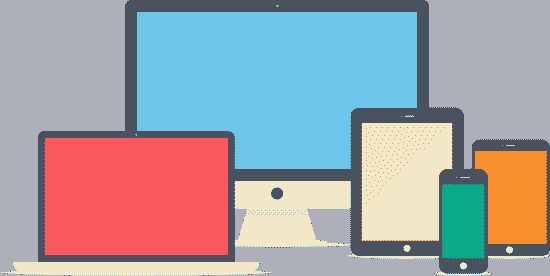
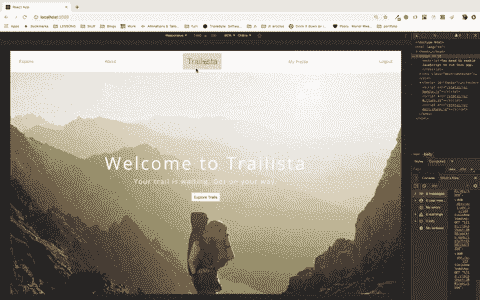

# 针对响应式应用的媒体查询

> 原文：<https://dev.to/kritirai/media-queries-for-responsive-apps-539p>

[](https://res.cloudinary.com/practicaldev/image/fetch/s--SbaxLI6y--/c_limit%2Cf_auto%2Cfl_progressive%2Cq_auto%2Cw_880/https://i.imgur.com/MCsEzZB.png%3F1)

对于我们的学校项目，我们不太关心如何使我们的应用程序看起来漂亮，而是满足要求并触及核心概念。不过，最终，您会并且应该想要部署一个或所有应用程序来展示您的工作。这时，你可能想改变你的应用程序的外观，因为这可能是外观很重要的一个例子。因此，我决定着手部署我为熨斗学校的最终项目开发的应用程序，第一站是它的响应能力。

随着我们现在使用越来越多的设备来访问网络上的内容，架构我们的应用程序的设计以适应不同的媒体类型、屏幕/视口大小等，提供我们作为开发人员努力追求的良好用户体验是有意义的。我使用 Chrome 的 [Responsive Web Design Tester 工具](https://developers.google.com/web/tools/chrome-devtools/device-mode/)来模拟 iPhone 5/SE、iPad 和笔记本电脑等设备的不同视口尺寸，以了解我的应用程序在不同屏幕尺寸下的外观。然而，每当我在不同于笔记本电脑的视窗之间切换时，我都会对我的应用程序的外观感到畏缩。例如，在 iPhone 5 的视窗中，我的*搜索表单*原本可以很好地在页面上展开，现在却分成了两行，输入框毫无吸引力地叠放在一起。*导航条*中的字母相对于视窗尺寸来说是巨大的，我的应用看起来不再整洁和完美了。所以，我决定求助于媒体询问。

> 媒体查询是 CSS3 借出的强大工具，可以改变应用程序内容的方式，以适应设备类型、视口/屏幕大小和方向。

这些工具允许我们告诉我们的程序，如果满足特定的条件，就应用特定的 CSS 规则。

媒体查询的基本语法由关键字`@media`后跟*媒体类型*和表达式组成。

```
@media < media-type > and (expression) {
     /* CSS rule for styling ...*/ 
} 
```

## 媒体类型

可用的媒体类型有:

*   `all` -包括所有设备
*   `print` -用于在打印预览模式下显示内容
*   `screen` -包括移动设备、平板电脑和桌面设备
*   `speech` -针对语音合成器，我们通常关心的是`screen`。因此，针对`screen`的媒体类型，我们可以这样写:

```
@media screen and (expression) {
/* CSS rule */
} 
```

## 逻辑运算符

逻辑运算符可用于分离或组合多个条件。

*   `and` -使用`and`要求关键字两边的媒体特征表达式返回 true，以便媒体查询返回 true。它还用于将媒体类型与媒体功能相结合。
*   `or` -同样，写成*逗号(，*)只需要逗号分隔的条件之一返回 true，整个媒体声明就返回 true，从而触发媒体查询应用。
*   `only` -要求整个条件匹配才能应用 CSS。当你想隐藏来自老版本浏览器的媒体查询时，它就派上了用场，就像`not`一样，媒体查询必须出现在声明的开头，后跟媒体类型。
*   `not` -否定媒体查询，如果查询返回 false，则返回 true。

## 表情

我们用这部分代码针对[媒体特征](https://developer.mozilla.org/en-US/docs/Web/CSS/@media#Media_features)，比如*宽度*、*高度*、*分辨率*等。
例如，下面的查询将针对`width`媒体功能，对于视窗宽度为 425px 的任何设备，`p`标签内的内容将为红色。

```
@media and screen and (width: 425px) {
    p {
     color: red;
    }
} 
```

我们还可以使用`min-width`和`max-width`变量分别查询最小值和最大值。例如，下面的查询将适用于视窗`width`在 0 到 1024px 之间的任何设备。

```
@media screen and (max-width: 1024px) {
    p {
     color: blue;
    }
} 
```

瞧，瞧！！这是一款响应式应用。当然，您可以根据应用程序的复杂性来构建复杂的媒体查询，但是希望这些媒体查询的基本知识能够帮助您开始构建响应性 web 应用程序的旅程。

最后，下面是我的应用程序在不同视窗尺寸下的片段:
[](https://i.giphy.com/media/Ke9BSTFF7JsJj6DNZQ/giphy.gif)