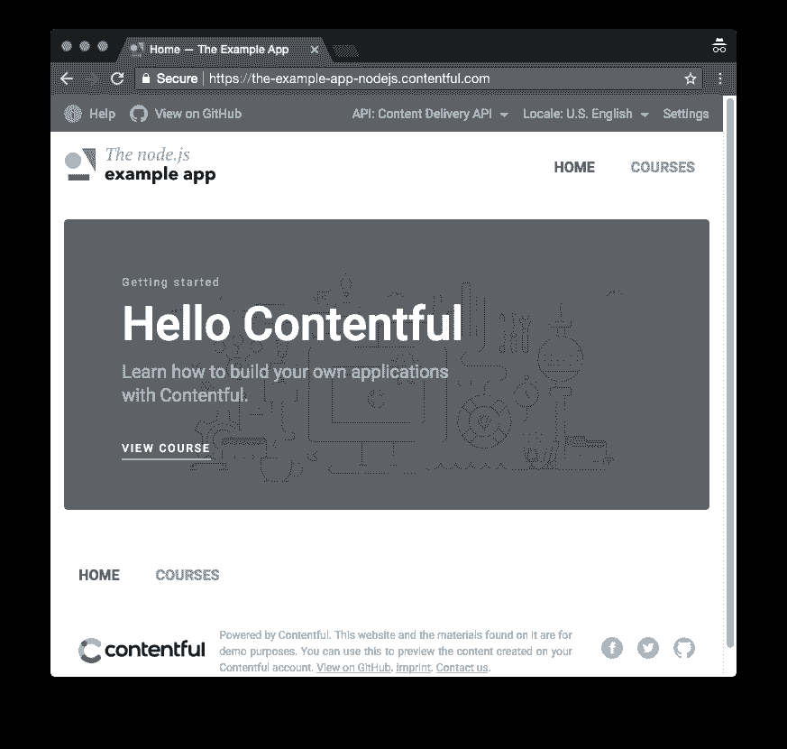
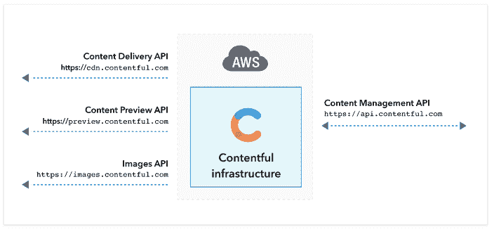

# 了解示例应用程序——使用 Contentful 进行开发的起点

> 原文：<https://dev.to/contentful/meet-the-example-app---your-kick-off-point-for-developing-with-contentful-5dmn>

作为开发人员，我们知道为工作选择最好的堆栈从来都不容易。这就是为什么我们 Contentful 一直在努力为您提供示例应用程序——一系列指导您了解 Contentful 基础知识的参考应用程序。

## 示例应用——满意地实现您的项目

我们构建了示例应用程序来帮助您回答两个问题:

*   我怎样才能心满意足地实现我的项目？
*   我如何开始使用我最喜欢的语言？

通过试用示例应用程序，您将了解 Contentful 的内容基础架构如何适合您的下一个项目，以及如何编写一个应用程序来从 Contentful 中的空间检索内容。

### 使用你最喜欢的语言来学习内容

示例应用程序提供了一些介绍性的例子，说明如何使用[构建一个内容丰富的应用程序。NET](https://the-example-app-csharp.contentful.com/) ， [Java](https://the-example-app-java.contentful.com/) ， [Node.js](https://the-example-app-nodejs.contentful.com/) ， [Ruby](https://the-example-app-rb.contentful.com/) ， [Python](https://the-example-app-py.contentful.com/) ， [PHP](https://the-example-app-php.contentful.com/) ， [Kotlin](https://github.com/contentful/the-example-app.kotlin) ，以及 [Swift](https://github.com/contentful/the-example-app.swift) 。

### 加快内容建模的速度

内容建模是组织内容的实践。在 Contentful，您可以通过创建内容类型来做到这一点。示例应用程序提供了关于如何构建适合您项目的内容模型的完整课程。你甚至可以在你的 Android 设备上获得一个[示例应用程序的工作示例，以及在应用商店](https://play.google.com/store/apps/details?id=com.contentful.tea.kotlin)上获得用于 iOS 的[。](https://itunes.apple.com/us/app/contentful-reference/id1333721890?mt=8)

### 高亮显示

**了解我们的 API**

Contentful 遵循 API 优先的方法，这意味着它的所有功能都由 API 提供。

这使您能够:

*   通过[内容管理 API](https://www.contentful.com/developers/docs/references/content-management-api/) 修改数据模式或配置 webhook
*   通过[内容交付 API](https://www.contentful.com/developers/docs/references/content-delivery-api/) 交付跨渠道内容
*   通过[内容预览 API](https://www.contentful.com/developers/docs/references/content-preview-api/) 预览未发布的内容
*   通过[图像 API](https://www.contentful.com/developers/docs/references/images-api/) 调整图像大小、裁剪或重新压缩图像

**开发一款手机应用**

我们的示例应用程序有如此多的语言版本，您可以选择开发一个移动优先的解决方案来检索和提供您的内容。假设您想为 Android 开发— [我们的 GitHub repo](https://github.com/contentful/the-example-app.java) 为您提供加载到 Java SDK 所需的一切。

然而，在这一点上，Java 是构建 Android 应用的遗产，Kotlin 是未来。Kotlin 被 Google 推荐用于编写 Android 应用程序，因为它是一种不像 Java 那样冗长、简洁的语言。你现在做什么？你很幸运，我们一直在努力支持各种各样的(现代)工作方式，我们为你提供了 Kotlin 中的示例应用程序的回购服务[！](https://github.com/contentful/the-example-app.kotlin)

示例应用程序的 [Android 版本是用 Kotlin 编写的，将是 GitHub repo 中开箱即用的应用程序的样子；使用 GraphQL 的示例应用程序的变体的开发也在](https://play.google.com/store/apps/details?id=com.contentful.tea.kotlin)[进行中](https://github.com/contentful/the-example-app.graphql.kotlin)。

通过商店上的应用程序和 GitHub 上的源代码，您可以非常容易地了解如何使用 Contentful 将 Kotlin、架构组件等新技术集成到您的应用程序中。

## 克隆示例 App

虽然理论很棒，但是没有什么比从代码示例中学习更好的了。前往 [Contentful 的 GitHub 页面](https://github.com/contentful/)找到你选择的语言的示例应用的 GitHub repo，并开始根据你的喜好修改我们的示例。

如果你正在寻找一个更高层次的概述来找到你的方向，我们也有[这个关于如何开始使用 Contentful](https://www.contentful.com/blog/2018/04/09/foolproof-guide-getting-started-contentful/?utm_campaign=example-app-introduction&utm_medium=referral&utm_source=devto&utm_content=example-app-introduction&utm_term=) 的简单指南，你可以在进入示例应用程序之前查看。