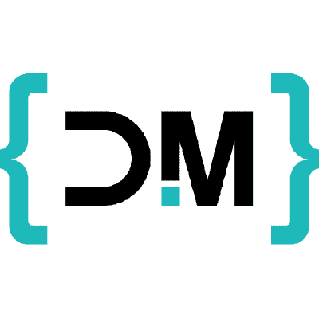

# 使用 DevMentors 的示例微服务

> 原文：<https://dev.to/rafalpienkowski/microservices-by-example-with-devmentors-505m>

## 简介

我想，几乎每个人都听说过微服务架构。我无意赞美或指责这种建筑方式。正如任何解决方案一样，微服务有其优点和缺点。我们先熟悉一下微服务架构再下决心。所以我来到了问题的核心。我想告诉你一个叫做“分布式”的项目。Net Core - DShop”简称 DShop。这是一个由两位热衷于微服务解决方案和微软技术的人推动的项目:Dariusz Pawlukiewicz 和 T2 Piotr Gankiewicz。他们是[发展导师](https://devmentors.io/)的创始人。为什么我认为值得提及这个特别的项目？有几个原因让对微服务感兴趣的人，CQRS，C#，DDD 应该看看这个项目(即使你不熟悉 C#，但你知道另一种 C 族编程语言 ex。C++，Objective-C，Java 等。，你会发现你感兴趣的东西)。

* * *

你应该对这个项目感兴趣的五个原因:

### 1)微服务架构是热门话题

这是我的主观看法，我认为你也是这样，否则你不会看我的文章。我认为微服务作为一种架构模式很有趣。我并不是说它们是银弹，可以解决任何问题，但在我看来，了解微服务架构的优势和问题是很好的。最好的方法是尝试一下，而 DShop 是一个绝佳的机会。

### 2) DShop 开源

你可以在公共的 [Github 库](https://github.com/devmentors)中找到所有参与解决方案的微服务。任何人都可以查看源代码并获取他或她认为有吸引力的部分。当然，了解这个项目最有效的方式就是贡献自己的力量。请随意提出拉取请求。

##  [开发者导师](https://github.com/devmentors) / [ DNC-DShop](https://github.com/devmentors/DNC-DShop)

<article class="markdown-body entry-content container-lg" itemprop="text">

# 分布式。网络核心

## **什么是分配。网芯？**

这是一个开源项目(不久将在 [devmentors.io](https://devmentors.io) 提供课程)，提供关于使用[构建微服务的深入知识。NET Core](https://www.microsoft.com/net/learn/get-started-with-dotnet-tutorial) 框架和各种工具。目标之一是创建一个云不可知的解决方案，您将能够在任何地方运行。

我们鼓励您加入我们在 [forum.devmentors.io](https://forum.devmentors.io) 上的[话语](https://www.discourse.org)论坛。

对于这门特殊的课程，请查看在此[类别](https://forum.devmentors.io/c/courses/distributed-dotnet-core)下讨论的主题。

## 将讨论哪些话题？

很多，涵盖了构建分布式服务的不同方面，无论是实现代码、管理服务发现和负载平衡、配置日志记录或监控，还是最终使用 Docker 部署到 VM。

仅举几个例子:

*   [RESTful API](https://www.restapitutorial.com) 实现与[ASP.NET 核心](https://docs.microsoft.com/en-us/aspnet/core/?view=aspnetcore-2.1)
*   [领域驱动设计](http://dddcommunity.org)基础知识
*   SQL 和 NoSQL 数据库( [SQL Server](https://www.microsoft.com/en-us/sql-server/sql-server-2017) 、 [MongoDB](https://www.mongodb.com) 、[influx db](https://www.influxdata.com)……

</article>

[View on GitHub](https://github.com/devmentors/DNC-DShop)

### 3)充满活力的社区

Dariusz 和 Piotr 是该项目的两大支柱，但每个人都被邀请对该项目的贡献。参与项目有几种形式，如[论坛](https://forum.devmentors.io/)、 [Gitter](https://gitter.im/devmentors-io) 或 [Twitter](https://twitter.com/dev_mentors) 。放心走最适合你的沟通渠道。你可以问男生一个问题或者提出一个改变。

### 4)一个 Youtube 频道

老实说，我认为这是 DShop 项目最重要的特点。为什么我会有这种感觉？我认为它带来了教育价值。在每一集里，Dariusz 和 Piotr 都通过一个例子来解释微服务架构的核心概念。他们正在快速介绍这个问题，并在我们眼前解决它。是的，人们同时编码和录音。写这个帖子的时候，录了七集。它们列举如下:

*   第 1 集-简介、HTTP、请求流、Docker 基础设施
*   第 2 集- CQRS -写边，折扣服务，MongoDB 存储库
*   第 3 集-订阅 RabbitMQ 消息，API 网关
*   第 4 集-通过事件实现异步微服务集成
*   第 5 集- CQRS -读取端，内部 HTTP 通信
*   第 6 集-领事和法比奥的服务发现和负载平衡
*   第 7 集-处理异步请求

下面是第一集的链接。

[https://www.youtube.com/embed/s4fd3PRlOcw](https://www.youtube.com/embed/s4fd3PRlOcw)

### 5) DShop 仍在开发中

这个项目并没有停止。Dariusz 和 Piotr 正在加强这个项目。他们增加新功能，重构旧代码，录制新的 youtube 剧集。我祈祷让他们保持热情并继续工作。

* * *

## 关闭

很明显，微服务架构不是一个简单的话题。Dariusz 和 Piotr 假设普通投稿人对 Docker 和 RabbitMq 有基本的了解。他们没有深入研究这些技术的细节。在我看来，熟悉这些工具(尤其是 Docker)是有好处的。有了这些知识，我们可以专注于架构而不是工具本身。请不要担心，没有 Docker 和 Rabbit 的经验，你将能够理解主要的概念，但这可能会有点困难。

我想提到的最后一件事是，我很高兴有像 Dariusz 和 Piotr 这样的开发者愿意与社区分享他们的知识。为此感谢他们。