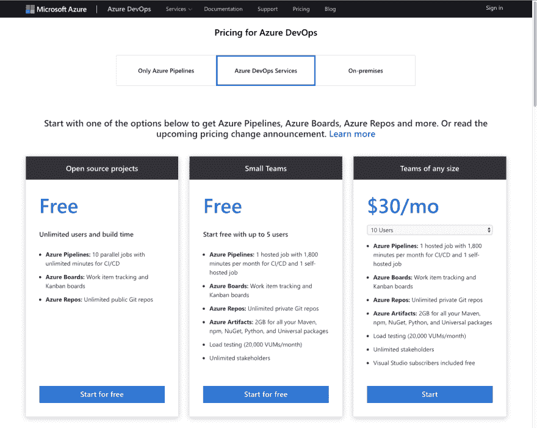
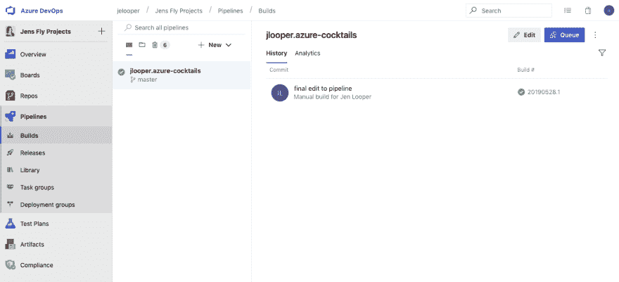
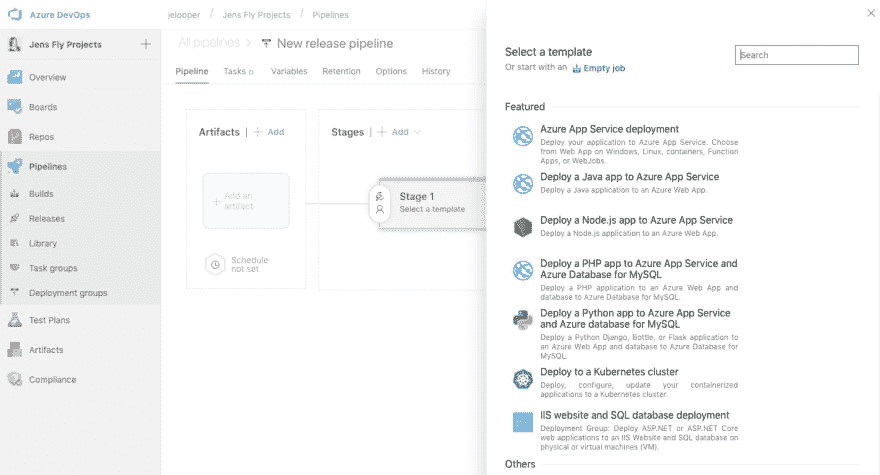
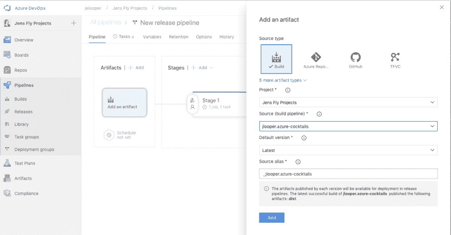
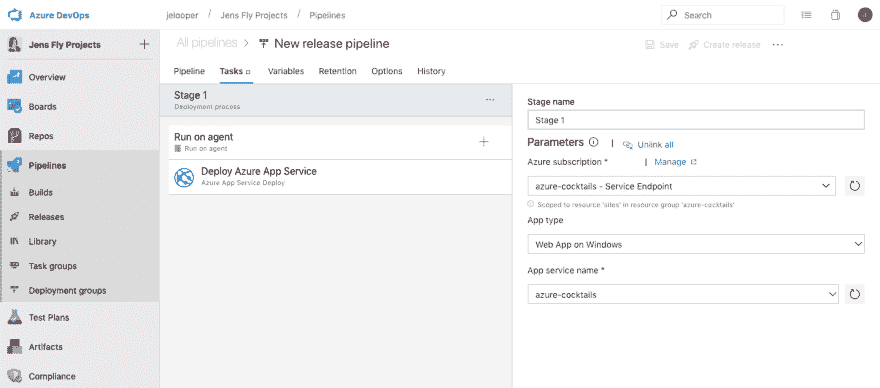
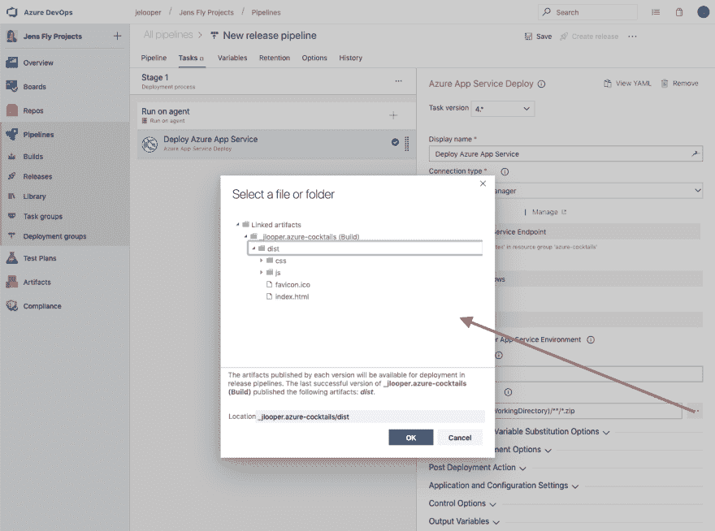
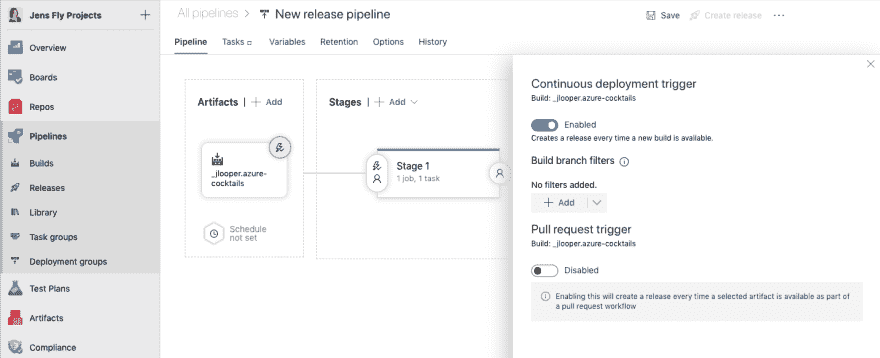

# 微软 Azure 给被宠坏的人 2:使用 Azure 管道部署你的应用

> 原文：<https://dev.to/azure/microsoft-azure-for-spoiled-people-2-deploy-your-app-using-azure-pipelines-27f6>

我在[上一篇文章](https://dev.to/jenlooper/microsoft-azure-for-spoiled-people-5bgh)中的一些内容对我和习惯于将 Vue.js 应用部署到其他服务的人来说都不太合适。这就是你应该把你构建的资产上传到一个服务器上的想法，在那之后它们被提取并转移到 prod。

一个更好的方法是使用内置系统，该系统将从 GitHub 获取对您代码的更改，根据您的`package.json`文件中的脚本构建它们，并无缝地部署它们，以便您的 web 站点被刷新，而不需要弄乱您的`.gitignore`文件。

有了 [Azure Pipelines](https://azure.microsoft.com/services/devops/pipelines/?nav=min&WT.mc_id=devto-blog-jelooper) ，就可以！管道提供了一种通过可定制的步骤来自动化构建和发布过程的方法。

[](https://res.cloudinary.com/practicaldev/image/fetch/s--krc-wg0d--/c_limit%2Cf_auto%2Cfl_progressive%2Cq_auto%2Cw_880/https://thepracticaldev.s3.amazonaws.com/i/vheb8x1uvfsbyhoewdo8.png)

下面是我如何编辑非常基本的 Vue.js 应用程序，我根据我的上一篇帖子成功部署了该应用程序。

## 准备好您的第一条管道

在准备这项工作时，你可以取消我之前让你做的一些奇怪的事情。

首先，从你的`.gitignore`文件中删除`/dist`，这样它就不会被发送到 GitHub。太恶心了。提交这些更改。

[](https://i.giphy.com/media/6h4z4b3v6XWxO/giphy.gif)

接下来，在代码根中创建一个名为`azure-pipelines.yml`的新文件。在该文件中，添加以下代码:

```
trigger:
- master

pool:
  vmImage: 'ubuntu-latest'

steps:
- task: NodeTool@0
  inputs:
    versionSpec: '10.x'
  displayName: 'Install Node.js'

- script: |
    npm install
    npm run build
  displayName: 'npm install and build'

- task: PublishBuildArtifacts@1
  inputs:
    artifactName: dist
    pathtoPublish: 'dist' 
```

Enter fullscreen mode Exit fullscreen mode

你会发现这是一个标准的 YAML 文件，被大多数使用 Azure 管道的节点应用程序所使用。它描述了构建“工件”或一组可发布文件的步骤，然后实际发布它们。把这个提交给你的 GitHub repo。

## 准备好在 Azure DevOps 上构建

没有多少前端开发人员愿意做 DevOps。对我们许多人来说，它比 Oracle 存储过程更可怕！用这种东西乱搞会把事情搞得一团糟。幸运的是，Azure DevOps 提供了一种简单明了的方法，让你的头脑绕过那些疯狂的 DevOps 人一直在做的任务。

因此，继续在 [Azure DevOps](https://azure.microsoft.com/services/devops/?nav=min&WT.mc_id=devto-blog-jelooper) 上为自己创建一个帐户吧。你可以在免费层做很多事情:查看[定价页面](https://azure.microsoft.com/pricing/details/devops/azure-devops-services/?nav=min&WT.mc_id=devto-blog-jelooper)了解更多信息。

[](https://res.cloudinary.com/practicaldev/image/fetch/s--dXyvHlxB--/c_limit%2Cf_auto%2Cfl_progressive%2Cq_auto%2Cw_880/https://thepracticaldev.s3.amazonaws.com/i/c02a3bgjxeq55qg8wexr.png)

登录后，创建一个新项目。在该项目中，您将看到几个选项。Azure DevOps 有一个项目管理区，在它下面，你会发现管道区。

1.  创建一个新管道，并将其连接到您为 Vue 项目设置的 GitHub 代码。

2.  管道向导将找到您项目的。您之前创建的 yml 文件。快速检查一下，确保它看起来没问题。

3.  点击“运行”-看着你的构建开始！您可以实时观察流程的启动。监控的重要步骤是`npm install and build`过程。应该创建并发布一个`dist`文件夹。

如果一切顺利，您将收到一封电子邮件，告知您构建成功，并且它将在构建面板中显示“绿色”:

[](https://res.cloudinary.com/practicaldev/image/fetch/s--QZENxAx7--/c_limit%2Cf_auto%2Cfl_progressive%2Cq_auto%2Cw_880/https://thepracticaldev.s3.amazonaws.com/i/fet1l1ts93m7wqcn9czf.png)

太好了！你的网站已经建在云端了！⛅️你可以通过访问构建日志并点击蓝色的`Artifacts`按钮来验证一切正常:它显示一个`dist`文件夹已经构建好了。

## 最后一步:发布！

你可能认为你已经完成了，但是你错了。还有一件事要做，那就是释放你刚刚构建的资产。以下是方法。

1.  在左侧导航中，单击“发布”并创建一个新的发布管道。

2.  在不同类型的版本上，你有很多选择。选择第一个，从应用服务构建 web 应用。

[](https://res.cloudinary.com/practicaldev/image/fetch/s--cK5_eoax--/c_limit%2Cf_auto%2Cfl_progressive%2Cq_auto%2Cw_880/https://thepracticaldev.s3.amazonaws.com/i/mme7595eiw75mhbc2i1r.png)

然后，单击“添加工件”按钮，添加您之前的过程构建的工件:

[](https://res.cloudinary.com/practicaldev/image/fetch/s--s_SA3irq--/c_limit%2Cf_auto%2Cfl_progressive%2Cq_auto%2Cw_880/https://thepracticaldev.s3.amazonaws.com/i/i8t51kcdu6hccqp2bdum.png)

接下来，转到 Stages 区域并单击 Stage 按钮。你需要在这里做一些重要的编辑。单击此区域中的“任务”选项卡，并更改发布参数以包括您的 Azure 订阅和应用服务名称。**点击保存！**

[](https://res.cloudinary.com/practicaldev/image/fetch/s--iMb_5lkC--/c_limit%2Cf_auto%2Cfl_progressive%2Cq_auto%2Cw_880/https://thepracticaldev.s3.amazonaws.com/i/vf1uplqtyry03o1owfxb.png)

然后，单击该页面上的“部署 Azure 应用服务”按钮。这里有一些重要的调整。转到“包或文件夹”文本框，单击右边的小按钮，指定要释放的文件夹。您需要指定`dist`:

[](https://res.cloudinary.com/practicaldev/image/fetch/s--IBrUudWr--/c_limit%2Cf_auto%2Cfl_progressive%2Cq_auto%2Cw_880/https://thepracticaldev.s3.amazonaws.com/i/mok4bdlp18d1r0dxkb4w.png)

**确保点击保存以保存您的发布首选项。单击“创建发布”来测试您的管道。**

通过返回构建区域并单击“队列”将构建和发布排队来测试您的工作。

> 如果您的 GitHub 变更触发了一个构建，而不是一个发布，请确保在发布时点击“闪电”图标，以确保持续集成:
> 
> [](https://res.cloudinary.com/practicaldev/image/fetch/s--y29kuM1i--/c_limit%2Cf_auto%2Cfl_progressive%2Cq_auto%2Cw_880/https://thepracticaldev.s3.amazonaws.com/i/ddv24zoh1j6yr3n4km25.png)

当对代码进行更改时，也应该触发管道。通过提交对 GitHub 的更改来测试这一点。

天蓝色的管道很累。我需要小睡一下。但是现在我们的构建成功了，我们有了真正的连续部署，没有欺骗，我们可以休息一下，直到本系列的下一篇文章，那时我们将向我们的应用程序添加一个数据库！

[](https://i.giphy.com/media/ViUqU2JgM4eaY/giphy.gif)

> 有用链接:
> 🛠 [蔚蓝管道](https://azure.microsoft.com/services/devops/pipelines/?nav=min&WT.mc_id=devto-blog-jelooper)
> 👛[管道定价明细](https://azure.microsoft.com/pricing/details/devops/azure-devops-services/?nav=min&WT.mc_id=devto-blog-jelooper)
> 📚[管道文件](https://docs.microsoft.com/en-us/azure/devops/pipelines/?view=azure-devops&WT.mc_id=devto-blog-jelooper)