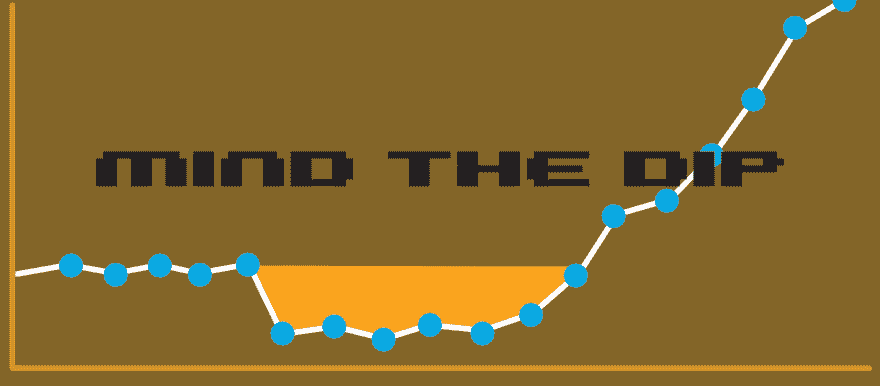

# 注意倾斜:搜索流量被优化伤害了吗？不要惊慌。

> 原文：<https://dev.to/bangkokian/mind-the-dip-search-traffic-hurt-by-optimization-don-t-panic-2jkb>

如今，谷歌和其他搜索引擎越来越关注“内容质量”这一排名信号。

这并不意味着传统的排名信号，如标题标签、内部链接、锚文本和其他 DOM 级别的形式将很快消失。但是，机器实际“理解”内容本身的能力越来越强，这导致内容营销专业人士推动编写更好、更相关的内容。

随着成千上万的公司急于彻底检查他们的数字营销资产，以吸引谷歌的人工智能增强的感知内容质量的能力，一件让他们夜不能寐的事情是搜索排名的可怕下降。

“下降”最好被描述为“内容优化后排名的暂时下降”——这可能是可怕的。

你花了几个小时来改进你的内容，两三天后，结果似乎与你的意图相反。你在 SERPs 中的排名并没有上升，而是突然下降了。有机交通下降，似乎停留在较低的平台。

如果你曾经盯着谷歌分析或搜索控制台，想知道你到底做了什么，请继续阅读。

### 为什么内容优化后排名会暂时下降？

这种下降通常归因于搜索引擎的重新索引阶段。当搜索引擎检测到新的内容时，它们会查看该内容的一些新的排名指标。在这个“观察阶段”，排名下降并不少见。

尽管我们都希望搜索引擎会在我们优化内容后立即重新索引我们的博客文章，并重新提高它们的排名，但搜索引擎优化几乎从来都不会很快。

为什么？因为搜索引擎需要衡量停留时间和用户参与度等因素的变化。跳出率变了吗？新内容的“主题完整性”是否足以匹配搜索查询背后的用户意图？或者用户在你的页面停留 5 秒钟后会返回搜索吗？

这些问题的答案需要行为数据，搜索引擎通过观察用户如何与你的页面交互来获得这些数据。对于低容量的关键字，行为数据有时可能需要数周时间来收集。在那段时间里，你写得精彩、引人注目的内容会有所下降。

### 有什么可以做的吗？

大多数内容营销人员和搜索引擎优化专家会告诉你“下降”是生活的事实。尝试最小化它，你可能也不会优化太多。

但这并不意味着我们不能战略性地进行内容优化——并权衡添加新内容后网络流量下降的可能性。

### 新内容与旧内容:比例很重要

虽然 SEO 从来都不是一门精确的科学，但内容更新后流量的痛苦下降似乎往往与新内容与已有原创内容的比率相关。如果少于 30%的页面内容发生变化，下降通常非常小。另一方面，如果搜索引擎确定一个页面的大部分是新创建的附加内容，那么合乎逻辑的是，他们会要求对该页面的性能进行更长时间的重新评估。

如果你做内容大检查的原因是因为一个页面的流量本来就不足，那么你可能想忽略 30%规则，投入到更密集的内容创作中去。但是，如果你的页面目前在搜索结果的第一页排名靠后，而你希望它能再上升一两个等级，那就要小心了。

请记住，完全重写一篇博文或文章通常是不明智的，因为在这种情况下，你最好从头开始写一篇新的博文。

### 内容优化对 SEO 有危险吗？

因此，如果调整页面的大部分会对搜索性能产生负面影响，并且改变页面标题或标题标签会迫使一个看似无止境的重新索引阶段，那么让页面保持原样不是更好吗？

答案是，看情况。虽然排名暂时下降可能是痛苦的，但“冒险的人会得到回报”。或者用另一句老话来说，“不入虎穴，焉得虎子”。

以调整你的页面标题为例:这通常会导致严重的流量下降。

另一方面，标题标签(和元描述)是搜索列表 CTR 的一些最强大的决定因素。

从根本上说，搜索列表和广告在目标上没有太大区别:你希望人们点击。进入搜索的第一页是一回事，但吸引搜索列表的点击完全是另一回事。有些标题点击量更高。调整你的标题标签使其更“可点击”是行为 SEO 的一个流行策略。

然而，从潜在“下跌”的角度来看，这是高风险的。

这就把我们带到了问题的核心:你如何知道什么时候优化你的内容？

### 优化还是不优化？

如果对你的内容进行大手术被认为是一个高风险的策略，但这也是在搜索结果中占据主导地位的道路，那么该怎么做呢？

内容制作者经常面临优化是否值得冒险的基本问题。

这个问题需要逐案回答。

以下是我在决定何时重写(以及重写什么)时的最佳内容优化技巧:

#### 1。首先优化表现不佳的内容

最容易的优化决定是在排名不太好的帖子上。对于已经表现不佳的内容，风险要低得多(回报也更高)。如果你有一个帖子或一篇文章在竞争一个竞争激烈的关键词，并且目前在搜索的第 5 页上萎靡不振，一般的策略是去争取它。进入那里，用一种无拘无束的方法优化内容。

但是请记住，对于不同的目标关键字，同一页面的内容可能表现得非常好。检查谷歌分析，以确保该页面没有从另一个搜索项获得大量的流量。

#### 2。为已经排名的关键字创建替代内容

如果你已经在搜索结果的第一页排名靠后，还想提高排名，那么内容优化的风险就要高得多。仅仅为了在搜索排名中提高 3 个位置而调整你的网站内容，可能不值得冒得罪上帝的风险，让自己出现在谷歌搜索的第 8 页。

如果你的页面已经表现得相当不错，一个好的策略是创建针对相同(或相似)相关关键词的相关内容

#### 3。使用人工智能支持的内容优化工具来增加您的机会

如果目标是增加页面的搜索量，仅仅写引人注目或权威的内容可能是不够的。你可以考虑使用基于人工智能的 SEO 优化工具，比如 [Wordmetrics](https://wordmetrics.com/) 来进行更好的语义关键词优化。这些工具并不便宜，但是如果你认真对待你的内容优化，我认为它们物有所值。

#### 4。增加你的内容，而不是重写它

如果你的内容少于 2500 字，你可以考虑增加内容，而不是重写。这种方法不仅保留了你的原始内容，而且让你的文章更长。(写较长的文章是一个众所周知的优化技巧，因为较长的内容通常比较短的内容更好)。

#### 5。小心不要吃太多

最重要的是，记住关键字填充的时代已经结束了。简单地在你的文章中写 100 遍同样的关键词是行不通的。谷歌寻找的是上下文，而不仅仅是关键词密度。信息丰富、写得好、易读、与主题相关的内容是有效的内容。

### 不停地写

最后一条建议:每个网络初创公司都需要流量。永远不要把你的帽子挂在一个单一的内容上。搜索引擎算法像风一样变化。内容营销是一个“数字游戏”。

虽然不断调整你的内容来榨取最后一点搜索性能是很诱人的，但请记住，内容营销就是生产新的原创内容。内容优化越来越重要...但是内容创作仍然是首要任务。